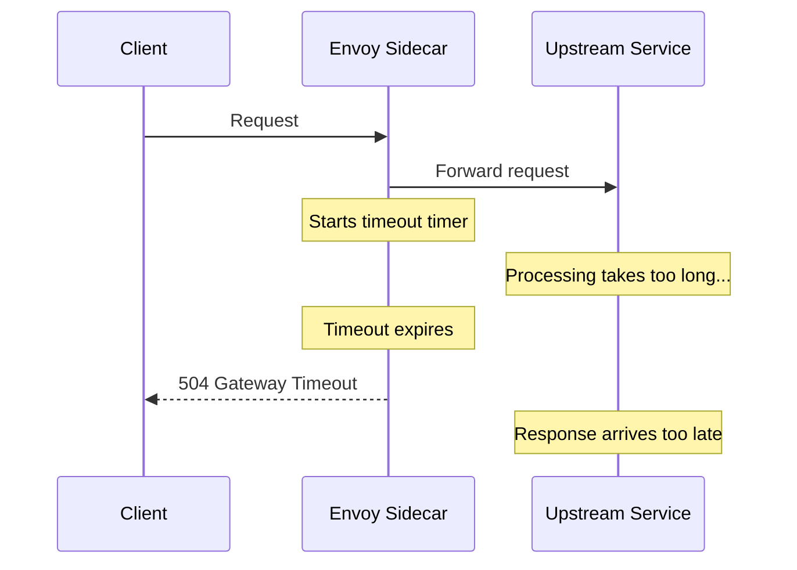
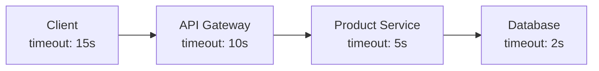

# How to Configure Request Timeouts in Istio

Author: [nawazdhandala](https://github.com/nawazdhandala)

Tags: Istio, Timeout, Traffic Management, VirtualService, Resilience

Description: A practical guide to configuring request timeouts in Istio using VirtualService to prevent slow upstream services from cascading failures.

---

Timeouts are one of the most important resilience mechanisms in a distributed system. Without them, a slow or unresponsive upstream service can tie up connections and threads in the calling service, eventually causing it to become unresponsive too. The failure cascades through the system, and before you know it, one slow database query has brought down your entire application.

Istio lets you configure timeouts at the mesh level without changing any application code. The sidecar proxy enforces the timeout, and if the upstream doesn't respond in time, the proxy returns an error to the caller. This post covers how to set up request timeouts in Istio and how to think about what values to use.

## How Timeouts Work in Istio

When you configure a timeout on a VirtualService route, the sidecar proxy starts a timer when it sends the request to the upstream. If the upstream doesn't send a complete response within the timeout period, the proxy terminates the connection and returns a 504 Gateway Timeout to the caller.



The timeout applies to the entire request lifecycle as seen by the proxy, including any time spent in retries.

## Setting a Basic Timeout

Configure a timeout in a VirtualService:

```yaml
apiVersion: networking.istio.io/v1beta1
kind: VirtualService
metadata:
  name: product-service
  namespace: production
spec:
  hosts:
    - product-service
  http:
    - timeout: 3s
      route:
        - destination:
            host: product-service
```

This sets a 3-second timeout for all requests to product-service. If the response takes longer than 3 seconds, the caller gets a 504.

The timeout field accepts duration strings:
- `1s` - 1 second
- `500ms` - 500 milliseconds
- `1.5s` - 1.5 seconds
- `30s` - 30 seconds

## Default Timeout Behavior

If you don't set a timeout in your VirtualService, Istio does not enforce any request timeout by default. Requests can hang indefinitely if the upstream never responds.

There's a subtle caveat here. If you have retries configured but no explicit timeout, Istio applies a default timeout of 0s (no timeout) for the overall request. But the per-retry timeout defaults to the same as the overall timeout. This means retries can run indefinitely too.

It's a good practice to always set explicit timeouts. Relying on defaults is how you end up with requests hanging for minutes.

## Choosing Timeout Values

Selecting the right timeout value requires understanding your service's behavior:

### Step 1: Measure Current Response Times

Check your p50, p95, and p99 response times:

```bash
# Using Istio metrics
kubectl exec -n istio-system deploy/prometheus -- curl -s 'localhost:9090/api/v1/query?query=histogram_quantile(0.99,sum(rate(istio_request_duration_milliseconds_bucket{destination_service="product-service.production.svc.cluster.local"}[5m]))by(le))' | jq '.data.result[0].value[1]'
```

Or check the proxy stats:

```bash
kubectl exec deploy/product-service -c istio-proxy -n production -- curl -s localhost:15000/stats | grep "upstream_rq_time"
```

### Step 2: Set Timeout Based on Percentiles

A common approach:

- **Timeout = 2-3x your p99 latency**: This gives you room for normal variation while catching genuinely stuck requests
- If your p99 is 500ms, set the timeout to 1-1.5s
- If your p99 is 2s, set the timeout to 5s

Don't set timeouts too tight. A timeout that's too close to your normal response time will trigger during traffic spikes, causing unnecessary errors.

### Step 3: Consider the User Experience

From the user's perspective, how long is acceptable?

- API endpoint serving a web page: 3-5 seconds maximum
- Background processing: could be 30 seconds or more
- Real-time operations (search, autocomplete): 1-2 seconds

## Timeouts per Route

Different routes can have different timeouts:

```yaml
apiVersion: networking.istio.io/v1beta1
kind: VirtualService
metadata:
  name: product-service
  namespace: production
spec:
  hosts:
    - product-service
  http:
    - match:
        - uri:
            prefix: /api/search
      timeout: 2s
      route:
        - destination:
            host: product-service
    - match:
        - uri:
            prefix: /api/export
      timeout: 30s
      route:
        - destination:
            host: product-service
    - timeout: 5s
      route:
        - destination:
            host: product-service
```

The search endpoint has a tight 2-second timeout because users expect fast search results. The export endpoint has a generous 30-second timeout because exports can be slow. Everything else gets a 5-second default.

## Timeouts and Retries Interaction

When you combine timeouts with retries, the timeout applies to the total request duration, including all retry attempts:

```yaml
apiVersion: networking.istio.io/v1beta1
kind: VirtualService
metadata:
  name: product-service
  namespace: production
spec:
  hosts:
    - product-service
  http:
    - timeout: 10s
      retries:
        attempts: 3
        perTryTimeout: 3s
      route:
        - destination:
            host: product-service
```

In this configuration:

- Each individual attempt has a 3-second timeout (perTryTimeout)
- The total timeout for all attempts combined is 10 seconds
- If the first attempt takes 3s (times out), the first retry takes 3s (times out), and the second retry takes 3s (times out), the total is 9 seconds - within the 10-second overall timeout
- If the first attempt takes 3s, the second takes 3s, the third takes 3s, and there's a fourth retry that would push past 10s, it gets cut off

This is why you want `timeout >= attempts * perTryTimeout`.

## Testing Timeouts with Fault Injection

Validate your timeout configuration by injecting delays:

```yaml
apiVersion: networking.istio.io/v1beta1
kind: VirtualService
metadata:
  name: product-service
  namespace: production
spec:
  hosts:
    - product-service
  http:
    - fault:
        delay:
          fixedDelay: 10s
          percentage:
            value: 100.0
      timeout: 3s
      route:
        - destination:
            host: product-service
```

Every request gets a 10-second delay, but the timeout is 3 seconds. The client should get a 504 after 3 seconds:

```bash
time kubectl exec deploy/test-client -n production -- curl -v http://product-service:8080/products
```

Expected: 504 response in approximately 3 seconds.

## Timeout Headers in Responses

When a timeout triggers, the proxy returns a 504 status code and sets the response flag to `UT` (Upstream Timeout) in the access logs:

```bash
kubectl logs deploy/test-client -c istio-proxy -n production | grep "UT"
```

The access log entry looks like:

```
"response_code":"504","response_flags":"UT"
```

## Disabling Timeouts for Specific Routes

If you have a VirtualService with a timeout and want to disable it for a specific route, set the timeout to 0s:

```yaml
http:
  - match:
      - uri:
          prefix: /api/long-running
    timeout: 0s  # No timeout
    route:
      - destination:
          host: product-service
  - timeout: 5s  # 5 second timeout for everything else
    route:
      - destination:
          host: product-service
```

A timeout of 0s means no timeout - requests can take as long as they need.

## Common Timeout Mistakes

**Setting timeouts too low**: If your timeout is close to your normal response time, you'll see timeouts during traffic spikes. Leave headroom.

**Not setting timeouts at all**: Without timeouts, slow upstreams can exhaust connection pools and thread pools in the calling service.

**Mismatched timeouts in the call chain**: If Service A has a 10s timeout calling Service B, and Service B has a 5s timeout calling Service C, that's fine. But if Service A has a 3s timeout and Service B has a 10s timeout, Service A will time out before Service B finishes. Match timeouts to the call chain depth.

**Forgetting about retries**: The overall timeout includes retry time. If you have 3 retries with 5s per-try timeout, your overall timeout needs to be at least 20s (4 attempts * 5s).



Timeouts should decrease as you go deeper in the call chain. The outermost service has the longest timeout, and each level down is shorter. This prevents a deep dependency timeout from causing a cascade.

Configuring timeouts is one of the simplest things you can do in Istio, and one of the most impactful for system resilience. Get it right and you prevent an entire class of cascading failures.
