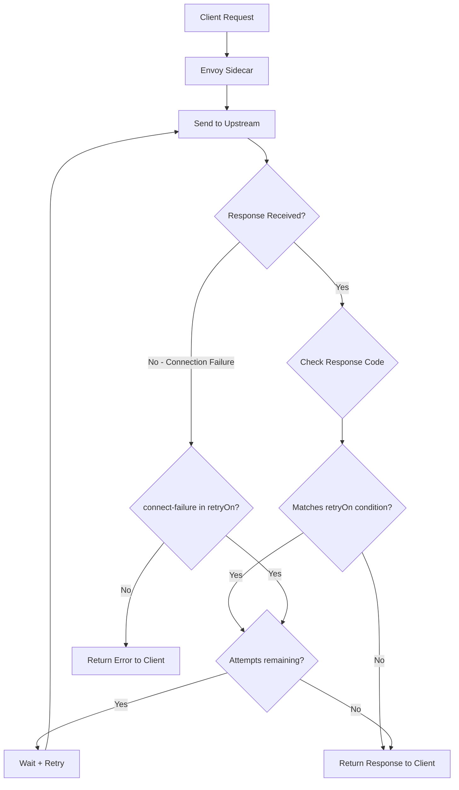

# How to Configure Retry Conditions in Istio (5xx, gateway-error, etc.)

Author: [nawazdhandala](https://github.com/nawazdhandala)

Tags: Istio, Service Mesh, Retries, Kubernetes, Reliability

Description: Learn how to configure specific retry conditions in Istio using retryOn policies for 5xx errors, gateway errors, connection failures, and more.

---

When a service call fails in a microservices architecture, the right retry strategy can mean the difference between a brief hiccup and a full-blown outage. Istio gives you fine-grained control over when retries should happen through the `retryOn` field in VirtualService configurations. This guide walks through the different retry conditions available and how to use them effectively.

## Understanding Retry Conditions in Istio

Istio's retry conditions are based on Envoy proxy's retry policies. When you configure a VirtualService with retry settings, the Envoy sidecar intercepts failed requests and retries them based on the conditions you specify. The key field here is `retryOn`, which accepts a comma-separated list of conditions.

Here are the retry conditions you can use:

- **5xx** - Retry on any 5xx response code
- **gateway-error** - Retry on 502, 503, or 504 responses
- **connect-failure** - Retry when connection to upstream fails
- **retriable-4xx** - Retry on retriable 4xx codes (currently just 409)
- **refused-stream** - Retry when upstream resets the stream with a REFUSED_STREAM error
- **retriable-status-codes** - Retry on specific status codes you define
- **retriable-headers** - Retry based on response headers
- **reset** - Retry on upstream connection reset

## Basic Retry Configuration

The simplest retry configuration retries on 5xx errors:

```yaml
apiVersion: networking.istio.io/v1beta1
kind: VirtualService
metadata:
  name: my-service
  namespace: default
spec:
  hosts:
    - my-service
  http:
    - route:
        - destination:
            host: my-service
            port:
              number: 8080
      retries:
        attempts: 3
        perTryTimeout: 2s
        retryOn: "5xx"
```

This tells Istio to retry up to 3 times whenever a 5xx response comes back, with each attempt timing out after 2 seconds.

## Retrying on Gateway Errors

If you only care about gateway-related errors (which is common when services sit behind load balancers or API gateways), use `gateway-error`:

```yaml
apiVersion: networking.istio.io/v1beta1
kind: VirtualService
metadata:
  name: payment-service
  namespace: default
spec:
  hosts:
    - payment-service
  http:
    - route:
        - destination:
            host: payment-service
            port:
              number: 8080
      retries:
        attempts: 2
        perTryTimeout: 5s
        retryOn: "gateway-error"
```

The `gateway-error` condition covers 502 (Bad Gateway), 503 (Service Unavailable), and 504 (Gateway Timeout). This is a safer option than retrying on all 5xx errors because it avoids retrying on things like 500 Internal Server Error, where the issue is more likely to be a bug in the application code rather than a transient infrastructure problem.

## Combining Multiple Retry Conditions

You can combine multiple conditions using a comma-separated string:

```yaml
apiVersion: networking.istio.io/v1beta1
kind: VirtualService
metadata:
  name: order-service
  namespace: default
spec:
  hosts:
    - order-service
  http:
    - route:
        - destination:
            host: order-service
            port:
              number: 8080
      retries:
        attempts: 3
        perTryTimeout: 3s
        retryOn: "connect-failure,refused-stream,gateway-error"
```

This configuration retries on connection failures, refused streams, and gateway errors. It skips retrying on application-level errors like 500, which is often what you want in production.

## Retrying on Specific Status Codes

Sometimes you need to retry on very specific HTTP status codes. Use `retriable-status-codes` combined with a request header to define which codes trigger retries:

```yaml
apiVersion: networking.istio.io/v1beta1
kind: VirtualService
metadata:
  name: inventory-service
  namespace: default
spec:
  hosts:
    - inventory-service
  http:
    - route:
        - destination:
            host: inventory-service
            port:
              number: 8080
      retries:
        attempts: 3
        perTryTimeout: 2s
        retryOn: "retriable-status-codes"
      headers:
        request:
          set:
            x-envoy-retriable-status-codes: "503,429"
```

This setup retries only on 503 (Service Unavailable) and 429 (Too Many Requests) responses. The 429 retry is particularly useful for rate-limited APIs where backing off and retrying is the expected behavior.

## Retrying on Connection Failures

Connection failures are among the most common transient errors in Kubernetes environments, especially during pod scaling events or rolling deployments:

```yaml
apiVersion: networking.istio.io/v1beta1
kind: VirtualService
metadata:
  name: notification-service
  namespace: default
spec:
  hosts:
    - notification-service
  http:
    - route:
        - destination:
            host: notification-service
            port:
              number: 8080
      retries:
        attempts: 3
        perTryTimeout: 2s
        retryOn: "connect-failure,reset"
```

The `connect-failure` condition triggers when the initial TCP connection to the upstream service fails. The `reset` condition covers cases where the connection was established but then reset by the upstream. Together, these handle most network-level transient failures.

## Retry Flow Visualization

Here is how the retry decision process works inside the Envoy sidecar:



## Production Recommendations

Here are some practical tips for configuring retry conditions:

**Be specific with retryOn conditions.** Using just `5xx` as your retry condition is tempting but can cause problems. A 500 error from a buggy endpoint will keep getting retried, wasting resources. Start with `gateway-error,connect-failure,refused-stream` and add more conditions only when you have a clear reason.

**Keep attempts low.** Three retries is usually enough. More than that and you risk creating cascading failures as load builds up on already-struggling services.

**Always set perTryTimeout.** Without a per-try timeout, each retry attempt uses whatever overall timeout is configured, which can lead to very long request latencies.

**Monitor your retry rates.** Istio exposes retry metrics through Envoy. Keep an eye on `envoy_cluster_upstream_rq_retry` and `envoy_cluster_upstream_rq_retry_success` to see if your retry policies are actually helping.

```bash
# Check retry metrics for a specific service
kubectl exec -it deploy/my-service -c istio-proxy -- \
  curl -s localhost:15000/stats | grep retry
```

## Verifying Your Configuration

After applying a retry policy, verify it took effect:

```bash
# Check the VirtualService configuration
kubectl get virtualservice my-service -o yaml

# Look at the Envoy route configuration
kubectl exec -it deploy/my-service -c istio-proxy -- \
  curl -s localhost:15000/config_dump | \
  python3 -m json.tool | grep -A 10 "retry_policy"
```

Getting retry conditions right is one of those things that pays off hugely in production reliability. Start conservative, monitor the results, and adjust based on what you see in your actual traffic patterns.
