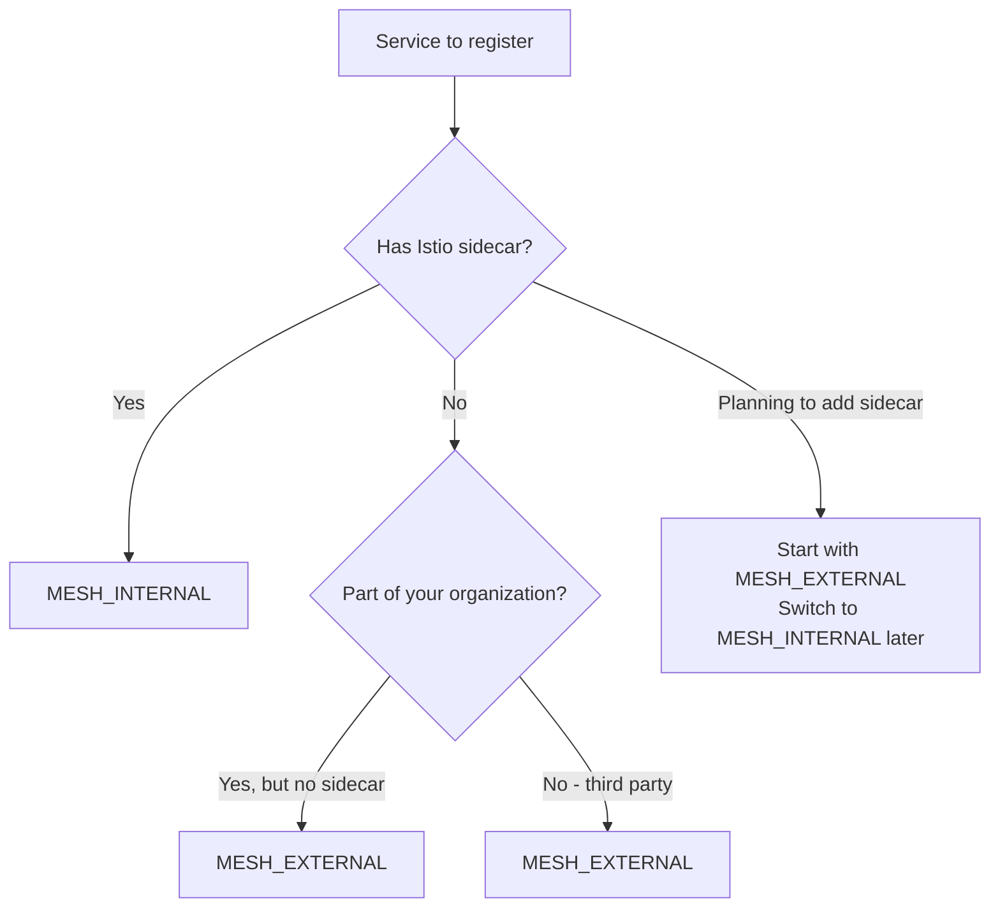

# How to Configure ServiceEntry Location: MESH_EXTERNAL vs MESH_INTERNAL

Author: [nawazdhandala](https://github.com/nawazdhandala)

Tags: Istio, ServiceEntry, Service Mesh, Kubernetes, Networking

Description: Understand the difference between MESH_EXTERNAL and MESH_INTERNAL location settings in Istio ServiceEntry and when to use each one.

---

Every Istio ServiceEntry has a `location` field that can be set to either `MESH_EXTERNAL` or `MESH_INTERNAL`. This setting looks simple, but it changes how Envoy handles traffic to that service in subtle but important ways. Picking the wrong one can lead to unexpected behavior with mTLS, metrics labels, and traffic policies.

Most tutorials just tell you to use `MESH_EXTERNAL` for everything outside the cluster and move on. But there are real scenarios where `MESH_INTERNAL` is the right choice even for services not running in your Kubernetes cluster. Understanding the difference saves you from hard-to-debug issues later.

## What Does Location Actually Do?

The `location` field tells Istio whether the service should be treated as part of the mesh or external to it. This affects:

1. **mTLS behavior** - Mesh-internal services get mTLS applied automatically. External services do not.
2. **Metrics labels** - The `source_workload` and `destination_service` labels differ based on location.
3. **Passthrough vs proxy** - External services get simpler L4 handling by default.
4. **Default traffic policies** - Connection pool and load balancing defaults differ.

## MESH_EXTERNAL

Use `MESH_EXTERNAL` when the service is truly outside your mesh and does not have an Envoy sidecar:

```yaml
apiVersion: networking.istio.io/v1
kind: ServiceEntry
metadata:
  name: external-api
spec:
  hosts:
    - api.stripe.com
  location: MESH_EXTERNAL
  ports:
    - number: 443
      name: https
      protocol: HTTPS
  resolution: DNS
```

With MESH_EXTERNAL:
- Envoy does NOT attempt mTLS to the destination
- Traffic metrics show the destination as an external service
- The proxy treats the connection as egress traffic
- Default connection pool settings are more conservative

This is the right setting for any third-party API, cloud service, SaaS platform, or service that is not part of your Istio mesh.

## MESH_INTERNAL

Use `MESH_INTERNAL` when you are registering a service that should be treated as if it is part of the mesh, even though it is not auto-discovered by Istio:

```yaml
apiVersion: networking.istio.io/v1
kind: ServiceEntry
metadata:
  name: vm-based-service
spec:
  hosts:
    - payment-service.internal
  location: MESH_INTERNAL
  ports:
    - number: 8080
      name: http
      protocol: HTTP
  resolution: STATIC
  endpoints:
    - address: 10.0.5.100
      labels:
        app: payment-service
    - address: 10.0.5.101
      labels:
        app: payment-service
```

With MESH_INTERNAL:
- Envoy applies mTLS if peer authentication policies are set
- The service appears in the mesh topology as an internal service
- Metrics include the service as a mesh-internal destination
- Full L7 traffic management features are available

Common use cases for MESH_INTERNAL:
- VMs running Istio's sidecar proxy outside of Kubernetes
- Services in another Kubernetes cluster that is part of your mesh
- Legacy services that you have added to the mesh using Istio's VM support
- Services in a different namespace that Istio cannot auto-discover

## Practical Comparison

Here is the same service registered with each location to show the differences:

**External location:**

```yaml
apiVersion: networking.istio.io/v1
kind: ServiceEntry
metadata:
  name: payment-external
spec:
  hosts:
    - payments.company.com
  location: MESH_EXTERNAL
  ports:
    - number: 443
      name: https
      protocol: HTTPS
  resolution: DNS
```

Traffic to this service:
- No mTLS attempted
- Shows as "external" in Kiali
- TCP-level metrics only (for HTTPS passthrough)

**Internal location:**

```yaml
apiVersion: networking.istio.io/v1
kind: ServiceEntry
metadata:
  name: payment-internal
spec:
  hosts:
    - payments.company.com
  location: MESH_INTERNAL
  ports:
    - number: 8080
      name: http
      protocol: HTTP
  resolution: STATIC
  endpoints:
    - address: 10.0.5.100
```

Traffic to this service:
- mTLS is applied based on PeerAuthentication policies
- Shows as a mesh-internal service in Kiali
- Full HTTP metrics available
- Full traffic management (retries, fault injection, traffic shifting)

## Impact on mTLS

This is the most impactful difference. When you set `MESH_INTERNAL`, Istio's automatic mTLS negotiation kicks in. If your mesh has `PeerAuthentication` set to STRICT mode, Envoy tries to establish mTLS with the destination.

For services that actually have a sidecar proxy (like VMs enrolled in the mesh), this is exactly what you want:

```yaml
apiVersion: security.istio.io/v1
kind: PeerAuthentication
metadata:
  name: default
  namespace: istio-system
spec:
  mtls:
    mode: STRICT
```

With this policy and a MESH_INTERNAL ServiceEntry, Envoy initiates mTLS to the endpoint. If the endpoint does not have a sidecar proxy, the connection fails because there is nothing to terminate the mTLS connection.

With MESH_EXTERNAL, Envoy skips mTLS entirely, which is correct for services without sidecars.

## Impact on Metrics

The location setting changes how Prometheus metrics are labeled:

For MESH_EXTERNAL:
```
istio_requests_total{
  destination_service_name="api.stripe.com",
  destination_service_namespace="unknown",
  ...
}
```

For MESH_INTERNAL:
```
istio_requests_total{
  destination_service_name="payment-service",
  destination_service_namespace="default",
  ...
}
```

Internal services get proper namespace labels, making them easier to filter and dashboard in Grafana.

## When the Choice Is Not Obvious

Some scenarios make the choice less clear:

**Services on VMs with sidecars:** Use MESH_INTERNAL. The VM has a sidecar, so it is part of the mesh.

**Services in another cluster without Istio:** Use MESH_EXTERNAL. There is no sidecar on the other end.

**Services in another cluster with Istio (multi-cluster):** In a properly configured multi-cluster setup, Istio handles this automatically. But if you are manually registering services, use MESH_INTERNAL.

**On-premises services without sidecars:** Use MESH_EXTERNAL. Even if the service is "internal" to your organization, from Istio's perspective it is external because there is no sidecar.

**Cloud-managed services (RDS, Cloud SQL):** Use MESH_EXTERNAL. These are managed services without sidecars.

## Decision Flow



## Switching Between Locations

You can change the location without disrupting traffic. Just update the ServiceEntry:

```bash
kubectl patch serviceentry payment-service \
  --type merge -p '{"spec":{"location":"MESH_INTERNAL"}}'
```

Or update the YAML and reapply:

```bash
kubectl apply -f updated-serviceentry.yaml
```

Envoy picks up the change within seconds. However, be careful switching to MESH_INTERNAL if mTLS is enforced - make sure the destination can handle mTLS before switching.

## Mixing Locations in One Namespace

You can have both MESH_EXTERNAL and MESH_INTERNAL ServiceEntries in the same namespace. Each one applies its own rules independently:

```yaml
# External third-party API
apiVersion: networking.istio.io/v1
kind: ServiceEntry
metadata:
  name: stripe-api
spec:
  hosts:
    - api.stripe.com
  location: MESH_EXTERNAL
  ports:
    - number: 443
      name: https
      protocol: HTTPS
  resolution: DNS
---
# Internal VM-based service with sidecar
apiVersion: networking.istio.io/v1
kind: ServiceEntry
metadata:
  name: vm-auth-service
spec:
  hosts:
    - auth.vm-cluster.internal
  location: MESH_INTERNAL
  ports:
    - number: 8080
      name: http
      protocol: HTTP
  resolution: STATIC
  endpoints:
    - address: 10.0.10.50
```

The key takeaway: `MESH_EXTERNAL` is for services without Istio sidecars. `MESH_INTERNAL` is for services that participate in the mesh but are not auto-discovered. The mTLS behavior alone makes this distinction critical to get right.
