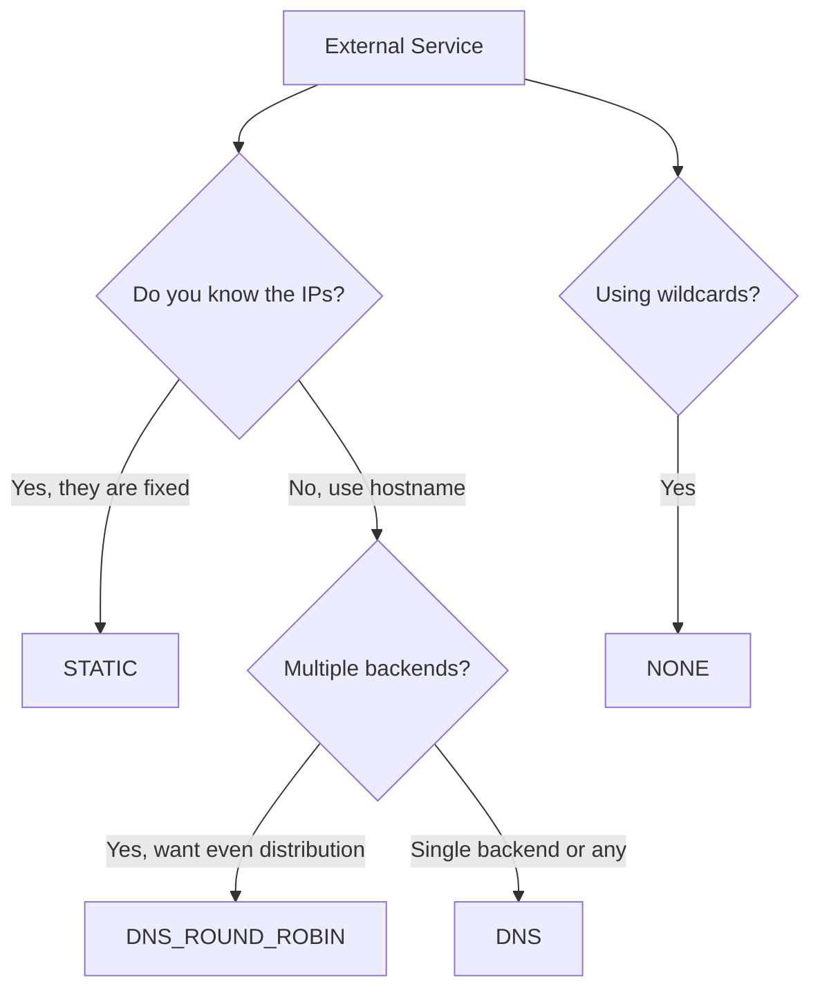

# How to Configure ServiceEntry with DNS Resolution

Author: [nawazdhandala](https://github.com/nawazdhandala)

Tags: Istio, ServiceEntry, DNS, Service Mesh, Kubernetes, Envoy

Description: Understand how DNS resolution works in Istio ServiceEntry and configure it correctly for reliable external service connectivity.

---

DNS resolution is one of the most important settings in an Istio ServiceEntry, and getting it wrong is one of the most common reasons external service connections fail. The `resolution` field tells Envoy how to figure out the IP address of the external service, and each option has different behavior that suits different scenarios.

If you have ever seen a ServiceEntry that looks correct but connections still time out, the resolution type is usually the first thing to check. This post covers each resolution option in detail with practical examples.

## Resolution Options Overview

Istio ServiceEntry supports three resolution types:

- **DNS** - Envoy resolves the hostname using DNS and load balances across returned IPs
- **DNS_ROUND_ROBIN** - Similar to DNS but uses round-robin load balancing across DNS results
- **STATIC** - You provide fixed IP addresses; no DNS lookup happens
- **NONE** - No resolution; the connection is forwarded to the original destination IP

Each one has trade-offs, and the right choice depends on your external service's infrastructure.

## DNS Resolution

This is the most commonly used resolution type for external services. When you set `resolution: DNS`, Envoy performs DNS lookups to resolve the host and caches the results based on the DNS TTL.

```yaml
apiVersion: networking.istio.io/v1
kind: ServiceEntry
metadata:
  name: external-api-dns
spec:
  hosts:
    - api.example.com
  location: MESH_EXTERNAL
  ports:
    - number: 443
      name: https
      protocol: HTTPS
  resolution: DNS
```

How it works under the hood:

1. Your application calls `api.example.com`
2. Envoy intercepts the connection
3. Envoy resolves `api.example.com` via DNS
4. Envoy picks one of the returned IP addresses
5. Envoy establishes a connection to that IP
6. DNS results are cached according to the TTL

This works great for most cloud-hosted APIs. AWS, Google Cloud, and Azure APIs all use DNS-based load balancing, so `resolution: DNS` handles them correctly.

```bash
# Verify DNS resolution is working
istioctl proxy-config endpoints deploy/my-app | grep example.com
```

You should see the resolved IP addresses listed as endpoints.

## DNS_ROUND_ROBIN Resolution

`DNS_ROUND_ROBIN` was introduced to handle a specific scenario: when you want Envoy to cycle through all DNS results evenly instead of picking one and sticking with it.

```yaml
apiVersion: networking.istio.io/v1
kind: ServiceEntry
metadata:
  name: api-round-robin
spec:
  hosts:
    - api.example.com
  location: MESH_EXTERNAL
  ports:
    - number: 443
      name: https
      protocol: HTTPS
  resolution: DNS_ROUND_ROBIN
```

The difference from plain `DNS` is subtle but important. With `DNS`, Envoy uses the first IP returned by DNS and only falls back to others if the first fails. With `DNS_ROUND_ROBIN`, Envoy distributes connections across all returned IPs in a round-robin fashion.

Use `DNS_ROUND_ROBIN` when:
- The external service has multiple backends behind DNS
- You want even distribution across all backend IPs
- The service does not have its own load balancer

## STATIC Resolution

With STATIC resolution, you manually specify the IP addresses. No DNS lookup happens at all.

```yaml
apiVersion: networking.istio.io/v1
kind: ServiceEntry
metadata:
  name: static-endpoints
spec:
  hosts:
    - legacy-service.company.com
  location: MESH_EXTERNAL
  ports:
    - number: 8080
      name: http
      protocol: HTTP
  resolution: STATIC
  endpoints:
    - address: 192.168.1.100
      ports:
        http: 8080
    - address: 192.168.1.101
      ports:
        http: 8080
```

STATIC is useful when:
- The external service has fixed IP addresses
- DNS is unreliable in your environment
- You want explicit control over which IPs receive traffic
- You need to add labels to endpoints for traffic routing

You can also add locality information to endpoints for locality-aware load balancing:

```yaml
spec:
  resolution: STATIC
  endpoints:
    - address: 192.168.1.100
      locality: us-east-1/us-east-1a
      labels:
        version: v1
    - address: 192.168.2.100
      locality: us-west-2/us-west-2a
      labels:
        version: v1
```

## NONE Resolution

NONE means Envoy does not resolve the address at all. The connection goes to whatever IP the application originally targeted.

```yaml
apiVersion: networking.istio.io/v1
kind: ServiceEntry
metadata:
  name: no-resolution
spec:
  hosts:
    - "*.example.com"
  location: MESH_EXTERNAL
  ports:
    - number: 443
      name: https
      protocol: HTTPS
  resolution: NONE
```

NONE resolution is typically used with wildcard hosts where you cannot predict the exact hostname ahead of time. Envoy just passes the connection through based on the original destination.

Use `NONE` when:
- You are using wildcard hosts
- The application resolves DNS itself (not through Envoy)
- You just need to allow traffic through without Envoy managing endpoints

## DNS Refresh Rate

When using DNS resolution, Envoy caches DNS results. By default, Envoy respects the DNS TTL from the DNS response. But you can also control the DNS refresh rate at the mesh level.

In your Istio mesh configuration:

```yaml
apiVersion: install.istio.io/v1alpha1
kind: IstioOperator
spec:
  meshConfig:
    dnsRefreshRate: 300s
```

This sets the global DNS refresh interval. For services with low TTLs that change IPs frequently (like AWS ELBs), you might want a shorter refresh rate:

```yaml
meshConfig:
  dnsRefreshRate: 60s
```

Be careful setting this too low. Aggressive DNS polling generates unnecessary load on your DNS infrastructure.

## Troubleshooting DNS Resolution

**Symptom: Endpoints show as empty or UNHEALTHY**

```bash
istioctl proxy-config endpoints deploy/my-app | grep example.com
```

If no endpoints appear, Envoy could not resolve the hostname. Check:

1. Does the hostname resolve from within the cluster?

```bash
kubectl exec deploy/my-app -c istio-proxy -- nslookup api.example.com
```

2. Is there a DNS policy issue on the pod?

```bash
kubectl get pod -l app=my-app -o jsonpath='{.items[0].spec.dnsPolicy}'
```

3. Check istiod logs for DNS resolution errors:

```bash
kubectl logs deploy/istiod -n istio-system | grep "example.com"
```

**Symptom: Stale DNS entries**

If the external service changed its IP but Envoy still connects to the old one, the DNS cache might be stale. You can trigger a refresh by restarting the sidecar:

```bash
kubectl rollout restart deploy/my-app
```

Or wait for the DNS TTL to expire and Envoy to re-resolve.

**Symptom: Wrong resolution type causes connection failures**

A common mistake is using `STATIC` resolution but not providing endpoints:

```yaml
# This will NOT work - STATIC requires endpoints
spec:
  hosts:
    - api.example.com
  resolution: STATIC
  # Missing endpoints!
```

Always provide endpoints when using STATIC resolution.

## Choosing the Right Resolution Type

Here is a quick decision guide:



For most external APIs and cloud services, `DNS` is the right choice. Use `STATIC` for on-premises services with known IPs. Use `DNS_ROUND_ROBIN` when you need balanced distribution across multiple IPs. Use `NONE` for wildcard patterns.

The resolution type might seem like a minor configuration detail, but it directly affects how reliably your mesh workloads connect to external services. Get it right from the start and you will avoid a lot of debugging later.
