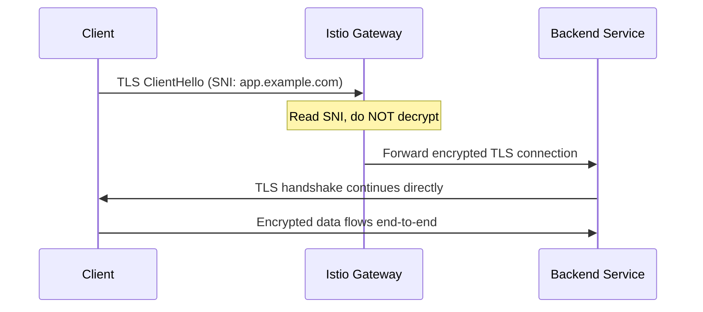

# How to Configure SNI Passthrough at Istio Gateway

Author: [nawazdhandala](https://github.com/nawazdhandala)

Tags: Istio, SNI, TLS, Gateway, Kubernetes, Networking

Description: Learn how to configure SNI passthrough on an Istio Gateway so TLS connections pass through to backend services without termination.

---

Sometimes you do not want the Istio Gateway to terminate TLS. Instead, you want the encrypted TLS connection to pass straight through to the backend service, which handles TLS itself. This is called SNI passthrough, and it is useful when your application needs to manage its own certificates or when you need end-to-end encryption without any intermediary decrypting the traffic.

## What is SNI Passthrough

With SNI (Server Name Indication) passthrough, the Istio Gateway inspects the SNI field in the TLS ClientHello message to determine where to route the connection, but it does not decrypt the traffic. The full TLS connection passes through to the backend service untouched.



Compare this with TLS termination where the gateway decrypts traffic before forwarding it.

## When to Use SNI Passthrough

SNI passthrough makes sense in these scenarios:

- Your application manages its own TLS certificates and needs direct control
- Compliance requirements mandate end-to-end encryption with no intermediary decryption
- You are proxying connections to an external TLS service
- The backend performs client certificate validation (mutual TLS at the application level)
- You are running a database or other non-HTTP service that handles its own TLS

## Configuring the Gateway for SNI Passthrough

The Gateway configuration uses `tls.mode: PASSTHROUGH`:

```yaml
apiVersion: networking.istio.io/v1
kind: Gateway
metadata:
  name: passthrough-gateway
spec:
  selector:
    istio: ingressgateway
  servers:
  - port:
      number: 443
      name: tls
      protocol: TLS
    hosts:
    - "app.example.com"
    tls:
      mode: PASSTHROUGH
```

Notice the differences from a SIMPLE TLS gateway:
- The `protocol` is `TLS`, not `HTTPS`. This tells Istio to handle this as a raw TLS connection, not HTTP over TLS.
- The `tls.mode` is `PASSTHROUGH`
- There is no `credentialName` because the gateway is not presenting any certificate

## Routing with VirtualService

With SNI passthrough, you use `tls` routing rules instead of `http` routing rules in the VirtualService:

```yaml
apiVersion: networking.istio.io/v1
kind: VirtualService
metadata:
  name: app-passthrough
spec:
  hosts:
  - "app.example.com"
  gateways:
  - passthrough-gateway
  tls:
  - match:
    - port: 443
      sniHosts:
      - "app.example.com"
    route:
    - destination:
        host: app-service
        port:
          number: 8443
```

The `tls` section handles TLS routing based on SNI matching. The `sniHosts` field must match the host in the Gateway resource.

## Multiple Services with SNI Passthrough

You can route to different backend services based on the SNI hostname:

```yaml
apiVersion: networking.istio.io/v1
kind: Gateway
metadata:
  name: multi-passthrough-gateway
spec:
  selector:
    istio: ingressgateway
  servers:
  - port:
      number: 443
      name: tls
      protocol: TLS
    hosts:
    - "api.example.com"
    - "web.example.com"
    tls:
      mode: PASSTHROUGH
---
apiVersion: networking.istio.io/v1
kind: VirtualService
metadata:
  name: multi-passthrough-vs
spec:
  hosts:
  - "api.example.com"
  - "web.example.com"
  gateways:
  - multi-passthrough-gateway
  tls:
  - match:
    - port: 443
      sniHosts:
      - "api.example.com"
    route:
    - destination:
        host: api-service
        port:
          number: 8443
  - match:
    - port: 443
      sniHosts:
      - "web.example.com"
    route:
    - destination:
        host: web-service
        port:
          number: 8443
```

The gateway reads the SNI header from each incoming connection and routes to the appropriate backend based on the hostname.

## Setting Up a Backend Service with TLS

Your backend service needs to handle TLS itself. Here is an example using nginx:

```yaml
apiVersion: v1
kind: ConfigMap
metadata:
  name: nginx-tls-config
data:
  default.conf: |
    server {
        listen 8443 ssl;
        server_name app.example.com;
        ssl_certificate /etc/nginx/certs/tls.crt;
        ssl_certificate_key /etc/nginx/certs/tls.key;
        location / {
            return 200 'TLS passthrough working!\n';
            add_header Content-Type text/plain;
        }
    }
---
apiVersion: apps/v1
kind: Deployment
metadata:
  name: app-service
spec:
  replicas: 1
  selector:
    matchLabels:
      app: app-service
  template:
    metadata:
      labels:
        app: app-service
    spec:
      containers:
      - name: nginx
        image: nginx:latest
        ports:
        - containerPort: 8443
        volumeMounts:
        - name: tls-certs
          mountPath: /etc/nginx/certs
        - name: nginx-config
          mountPath: /etc/nginx/conf.d
      volumes:
      - name: tls-certs
        secret:
          secretName: app-tls-cert
      - name: nginx-config
        configMap:
          name: nginx-tls-config
---
apiVersion: v1
kind: Service
metadata:
  name: app-service
spec:
  ports:
  - port: 8443
    targetPort: 8443
    name: tls
  selector:
    app: app-service
```

## Sidecar Considerations

When using SNI passthrough, the Istio sidecar on the backend pod needs to know that the traffic is already TLS-encrypted. You may need a DestinationRule to disable mesh TLS for this service:

```yaml
apiVersion: networking.istio.io/v1
kind: DestinationRule
metadata:
  name: app-service-dr
spec:
  host: app-service
  trafficPolicy:
    tls:
      mode: DISABLE
```

This prevents the sidecar from trying to initiate its own mTLS connection to a service that is already handling TLS. Without this, you can get TLS-in-TLS issues.

Alternatively, you can configure the port as not needing protocol sniffing by excluding it from sidecar interception if needed.

## Testing SNI Passthrough

Test the connection and verify it is reaching your backend directly:

```bash
export GATEWAY_IP=$(kubectl -n istio-system get service istio-ingressgateway \
  -o jsonpath='{.status.loadBalancer.ingress[0].ip}')

# Test with openssl - you should see the backend's certificate, not the gateway's
openssl s_client -connect $GATEWAY_IP:443 -servername app.example.com </dev/null 2>/dev/null | \
  openssl x509 -noout -subject

# Test with curl
curl -k --resolve "app.example.com:443:$GATEWAY_IP" https://app.example.com/
```

The key verification is that the certificate you see is the one from your backend service, not from the Istio gateway. If you see the backend's certificate subject, passthrough is working.

## Limitations of SNI Passthrough

There are trade-offs to be aware of:

- No HTTP-level routing (path-based, header-based routing) since the gateway cannot see the HTTP layer
- No HTTP metrics or tracing at the gateway level
- No request-level load balancing - it is connection-level only
- No retries or timeouts at the HTTP level
- The gateway cannot add or modify headers

Since the gateway never decrypts the traffic, it cannot inspect or manipulate anything at the HTTP layer. Routing decisions are limited to what is available in the TLS handshake, which is basically just the SNI hostname.

## Troubleshooting

**Connection reset errors.** Make sure your backend service actually has TLS configured and is listening for TLS connections on the expected port.

**Routing not working.** Verify the SNI hostname matches exactly between the Gateway hosts, VirtualService sniHosts, and what the client sends.

```bash
istioctl proxy-config listener deploy/istio-ingressgateway -n istio-system --port 443 -o json
```

Check that the filter chain match includes your SNI hostname.

SNI passthrough is a powerful option for cases where the gateway should not touch the encrypted traffic. It works well for services that need their own certificate management or when regulatory requirements mandate no intermediary decryption. Just keep in mind the HTTP-level features you give up in exchange for true end-to-end encryption.
