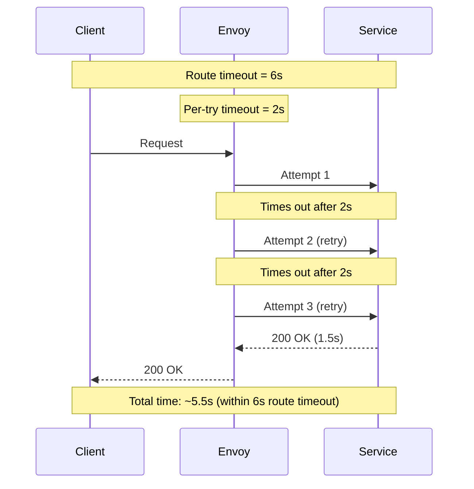

# How to Configure Timeout and Retry Together in Istio

Author: [nawazdhandala](https://github.com/nawazdhandala)

Tags: Istio, Service Mesh, Timeout, Retries, Kubernetes

Description: A practical guide to combining timeout and retry configurations in Istio VirtualService to build resilient microservices without sacrificing latency.

---

Getting timeouts and retries to work well together in Istio is trickier than most people expect. Set the timeout too low and your retries never complete. Set it too high and slow requests drag everything down. The interaction between the overall route timeout and the per-try timeout on retries is something you need to think through carefully.

## How Timeouts and Retries Interact

Istio has two different timeout settings that affect retries:

1. **Route timeout** - The overall timeout for the entire request, including all retry attempts. Set via the `timeout` field on the HTTP route.
2. **Per-try timeout** - The timeout for each individual attempt (original + retries). Set via `perTryTimeout` in the retries configuration.

The route timeout acts as a hard ceiling. Once it expires, no more retries happen, period. The per-try timeout controls how long each individual attempt can take before it is considered failed and triggers the next retry.



## The Math You Need to Get Right

Here is the formula: your route timeout must be greater than or equal to `perTryTimeout * attempts`. If it is not, some of your retry attempts will never happen because the route timeout expires first.

For example:
- Route timeout: 5s
- Per-try timeout: 2s
- Retry attempts: 3

The worst-case scenario needs 2s * 3 = 6 seconds. But the route timeout is only 5 seconds. So the third retry attempt might get cut short or never start at all.

A better configuration:

```yaml
apiVersion: networking.istio.io/v1beta1
kind: VirtualService
metadata:
  name: catalog-service
  namespace: default
spec:
  hosts:
    - catalog-service
  http:
    - route:
        - destination:
            host: catalog-service
            port:
              number: 8080
      timeout: 8s
      retries:
        attempts: 3
        perTryTimeout: 2s
        retryOn: "gateway-error,connect-failure"
```

With an 8-second route timeout, there is room for all three attempts at 2 seconds each (6 seconds worst case), plus some buffer for network overhead and backoff delays between retries.

## Common Mistake: Missing the Route Timeout

If you configure retries but do not set a route timeout, Istio uses its default timeout of 15 seconds. That sounds fine, but it means a request could sit there for 15 seconds doing retries against a broken service before the caller gets an error response.

Always set an explicit route timeout:

```yaml
apiVersion: networking.istio.io/v1beta1
kind: VirtualService
metadata:
  name: user-service
  namespace: default
spec:
  hosts:
    - user-service
  http:
    - route:
        - destination:
            host: user-service
            port:
              number: 8080
      timeout: 5s
      retries:
        attempts: 2
        perTryTimeout: 2s
        retryOn: "connect-failure,gateway-error"
```

## Common Mistake: Per-Try Timeout Longer Than Route Timeout

This one happens more often than you would think:

```yaml
# BAD - per-try timeout exceeds route timeout
timeout: 3s
retries:
  attempts: 3
  perTryTimeout: 5s
  retryOn: "5xx"
```

The per-try timeout is 5 seconds, but the route timeout is 3 seconds. The route timeout will always fire first, making the per-try timeout and retries pointless. The request will just time out after 3 seconds with no retries.

## Practical Examples by Service Type

### Fast API Endpoint (User-Facing)

For endpoints that need quick responses:

```yaml
apiVersion: networking.istio.io/v1beta1
kind: VirtualService
metadata:
  name: search-api
  namespace: default
spec:
  hosts:
    - search-api
  http:
    - route:
        - destination:
            host: search-api
            port:
              number: 8080
      timeout: 3s
      retries:
        attempts: 2
        perTryTimeout: 1s
        retryOn: "connect-failure,refused-stream"
```

Users expect search results fast. This gives two attempts at 1 second each, with a 3-second overall cap. If the service is down, the user sees an error after 3 seconds rather than waiting forever.

### Background Processing Service

For internal services where latency is less critical:

```yaml
apiVersion: networking.istio.io/v1beta1
kind: VirtualService
metadata:
  name: report-generator
  namespace: default
spec:
  hosts:
    - report-generator
  http:
    - route:
        - destination:
            host: report-generator
            port:
              number: 8080
      timeout: 30s
      retries:
        attempts: 3
        perTryTimeout: 8s
        retryOn: "gateway-error,connect-failure,refused-stream"
```

Report generation takes time. Each attempt gets 8 seconds, with a 30-second overall timeout that accommodates all three attempts plus backoff time.

### Database Proxy Service

For services that talk to databases and might see transient connection issues:

```yaml
apiVersion: networking.istio.io/v1beta1
kind: VirtualService
metadata:
  name: db-proxy
  namespace: default
spec:
  hosts:
    - db-proxy
  http:
    - route:
        - destination:
            host: db-proxy
            port:
              number: 5432
      timeout: 10s
      retries:
        attempts: 2
        perTryTimeout: 4s
        retryOn: "connect-failure"
```

Only retry on connection failures since database errors (like constraint violations) will just fail again on retry.

## Debugging Timeout and Retry Issues

When things are not working as expected, check the Envoy stats:

```bash
# See timeout stats
kubectl exec deploy/my-service -c istio-proxy -- \
  curl -s localhost:15000/stats | grep timeout

# See retry stats
kubectl exec deploy/my-service -c istio-proxy -- \
  curl -s localhost:15000/stats | grep retry

# Check the active retry policy
kubectl exec deploy/my-service -c istio-proxy -- \
  curl -s localhost:15000/config_dump | \
  python3 -m json.tool | grep -A 20 "retry_policy"
```

You can also look at response headers for hints. Envoy adds the `x-envoy-upstream-service-time` header which tells you how long the upstream service took to respond. If this value is consistently close to your per-try timeout, your service is probably too slow and retries are just adding latency without helping.

## Quick Reference Table

Here is a quick reference for different scenarios:

| Scenario | Route Timeout | Per-Try Timeout | Attempts | retryOn |
|----------|--------------|-----------------|----------|---------|
| Fast API | 3s | 1s | 2 | connect-failure |
| Standard API | 8s | 2s | 3 | gateway-error,connect-failure |
| Batch Processing | 30s | 8s | 3 | gateway-error,connect-failure,refused-stream |
| Real-time Stream | 2s | 800ms | 2 | connect-failure |

The key takeaway is straightforward: always think about timeouts and retries together. They are two pieces of the same resilience puzzle, and getting one right while ignoring the other will bite you in production.
