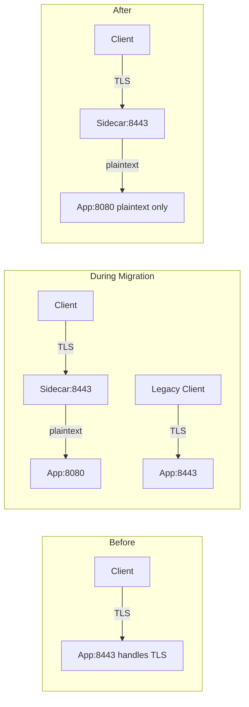

# How to Configure TLS Termination at Sidecar Level in Istio

Author: [nawazdhandala](https://github.com/nawazdhandala)

Tags: Istio, TLS, Sidecar, Security, Envoy

Description: How to configure TLS termination directly at the Envoy sidecar proxy in Istio for applications that receive TLS connections from non-mesh clients.

---

Usually in Istio, TLS termination happens at the ingress gateway for external traffic and through automatic mTLS between sidecars. But there are situations where you need the sidecar itself to terminate TLS - when non-mesh clients connect directly to a service, when you are migrating from an application-level TLS setup, or when specific compliance requirements demand TLS termination at the workload level.

Sidecar-level TLS termination means the Envoy sidecar accepts TLS connections on a specific port, terminates the encryption, and passes plaintext to the application container. The application does not need to handle TLS at all.

## When You Need Sidecar TLS Termination

A few common scenarios:

- External clients (not going through the ingress gateway) connect directly to a service via a NodePort or LoadBalancer
- Kubernetes Jobs or CronJobs without sidecars need to connect to mesh services using TLS
- You are migrating from application-managed TLS to Istio-managed TLS and need a transition period
- A service needs to present a specific certificate (not the Istio-provisioned one) to clients

## Basic Setup with Sidecar Resource

The Sidecar resource in Istio controls the behavior of the Envoy sidecar for a specific workload. To set up TLS termination, you combine a Sidecar resource with the appropriate TLS configuration.

First, create a Kubernetes secret with the TLS certificate:

```bash
kubectl create secret tls my-service-tls \
  --cert=server-cert.pem \
  --key=server-key.pem \
  -n production
```

Then configure the sidecar to use this certificate for inbound TLS:

```yaml
apiVersion: networking.istio.io/v1
kind: Sidecar
metadata:
  name: my-service-sidecar
  namespace: production
spec:
  workloadSelector:
    labels:
      app: my-service
  ingress:
    - port:
        number: 8443
        protocol: HTTPS
        name: https-inbound
      defaultEndpoint: 127.0.0.1:8080
      tls:
        mode: SIMPLE
        credentialName: my-service-tls
```

This tells the sidecar to:
1. Listen on port 8443 for incoming TLS connections
2. Terminate TLS using the certificate from the `my-service-tls` secret
3. Forward decrypted traffic to the application on `127.0.0.1:8080`

## Using EnvoyFilter for Advanced TLS Termination

For more control over TLS termination settings, use an EnvoyFilter:

```yaml
apiVersion: networking.istio.io/v1alpha3
kind: EnvoyFilter
metadata:
  name: sidecar-tls-termination
  namespace: production
spec:
  workloadSelector:
    labels:
      app: my-service
  configPatches:
    - applyTo: LISTENER
      match:
        context: SIDECAR_INBOUND
        listener:
          portNumber: 8443
      patch:
        operation: ADD
        value:
          name: custom-tls-listener
          address:
            socket_address:
              address: 0.0.0.0
              port_value: 8443
          filter_chains:
            - transport_socket:
                name: envoy.transport_sockets.tls
                typed_config:
                  "@type": type.googleapis.com/envoy.extensions.transport_sockets.tls.v3.DownstreamTlsContext
                  common_tls_context:
                    tls_certificate_sds_secret_configs:
                      - name: my-service-tls
                        sds_config:
                          api_config_source:
                            api_type: GRPC
                            grpc_services:
                              - envoy_grpc:
                                  cluster_name: sds-grpc
              filters:
                - name: envoy.filters.network.http_connection_manager
                  typed_config:
                    "@type": type.googleapis.com/envoy.extensions.filters.network.http_connection_manager.v3.HttpConnectionManager
                    stat_prefix: inbound_https_8443
                    route_config:
                      name: local_route
                      virtual_hosts:
                        - name: local_service
                          domains: ["*"]
                          routes:
                            - match:
                                prefix: "/"
                              route:
                                cluster: inbound|8080||
                    http_filters:
                      - name: envoy.filters.http.router
                        typed_config:
                          "@type": type.googleapis.com/envoy.extensions.filters.http.router.v3.Router
```

## Mutual TLS Termination at the Sidecar

If you need the sidecar to verify client certificates (mutual TLS), extend the configuration:

```yaml
apiVersion: networking.istio.io/v1
kind: Sidecar
metadata:
  name: my-service-sidecar
  namespace: production
spec:
  workloadSelector:
    labels:
      app: my-service
  ingress:
    - port:
        number: 8443
        protocol: HTTPS
        name: https-mutual
      defaultEndpoint: 127.0.0.1:8080
      tls:
        mode: MUTUAL
        credentialName: my-service-tls
```

For mutual TLS, the secret needs to include the CA certificate for validating clients:

```bash
kubectl create secret generic my-service-tls -n production \
  --from-file=tls.crt=server-cert.pem \
  --from-file=tls.key=server-key.pem \
  --from-file=ca.crt=client-ca-cert.pem
```

## Combining with Istio mTLS

An important detail: sidecar TLS termination for custom certificates is separate from Istio's automatic mTLS. The sidecar can handle both simultaneously on different ports.

```yaml
apiVersion: security.istio.io/v1
kind: PeerAuthentication
metadata:
  name: my-service-auth
  namespace: production
spec:
  selector:
    matchLabels:
      app: my-service
  mtls:
    mode: STRICT
  portLevelMtls:
    8443:
      mode: DISABLE
```

This configuration:
- Requires Istio mTLS on the default service port (for mesh-internal traffic)
- Disables Istio mTLS on port 8443 (where custom TLS termination handles it)

The application's Kubernetes Service should expose both ports:

```yaml
apiVersion: v1
kind: Service
metadata:
  name: my-service
  namespace: production
spec:
  selector:
    app: my-service
  ports:
    - name: http
      port: 8080
      targetPort: 8080
    - name: https
      port: 8443
      targetPort: 8443
```

## Verifying Sidecar TLS Termination

Check that the sidecar has the right listener configuration:

```bash
istioctl proxy-config listener <pod-name> -n production
```

You should see a listener on port 8443. Check its details:

```bash
istioctl proxy-config listener <pod-name> -n production --port 8443 -o json
```

Look for the `transportSocket` section confirming TLS is configured.

Test the TLS connection:

```bash
# From another pod in the cluster
kubectl exec <test-pod> -- \
  openssl s_client -connect my-service.production:8443 -servername my-service.production
```

Verify the certificate presented is your custom certificate, not the Istio-provisioned one:

```bash
kubectl exec <test-pod> -- \
  openssl s_client -connect my-service.production:8443 2>/dev/null | \
  openssl x509 -text -noout | grep "Subject:"
```

## Migration from Application TLS to Sidecar TLS

If your application currently handles TLS internally and you want to move TLS termination to the sidecar, follow this migration path:

1. Configure the sidecar to terminate TLS on a new port (e.g., 8443) using the same certificate
2. Update the Kubernetes Service to expose the new port
3. Gradually shift traffic to the new port
4. Once all traffic uses the sidecar-terminated port, remove TLS from the application
5. Update the application to listen on plaintext HTTP



## Troubleshooting

**Secret not found**: Verify the secret is in the same namespace as the workload:

```bash
kubectl get secrets -n production | grep my-service-tls
```

**Wrong certificate presented**: Check that the `credentialName` matches the secret name exactly. Also verify the secret has the correct key names (`tls.crt` and `tls.key` for TLS secrets).

**Connection refused on the TLS port**: The sidecar listener might not be configured. Check with `istioctl proxy-config listener` and look at istiod logs for configuration push errors:

```bash
kubectl logs deployment/istiod -n istio-system | grep "my-service"
```

**Application receiving encrypted traffic**: If the application is still getting encrypted data instead of plaintext, the sidecar is not terminating TLS. Double-check that the `defaultEndpoint` points to the application's plaintext port.

Sidecar-level TLS termination is a useful tool for specific scenarios. It is not the default way Istio handles TLS, but when you need it, having the option to configure it directly on the sidecar keeps things clean and avoids the need for application-level TLS code.
