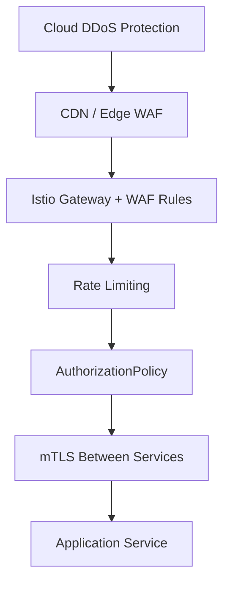

# How to Configure WAF-Like Protection with Istio

Author: [nawazdhandala](https://github.com/nawazdhandala)

Tags: Istio, WAF, Security, EnvoyFilter, Kubernetes

Description: Set up Web Application Firewall style protection in Istio using EnvoyFilter, Lua scripts, and external authorization to block common web attacks.

---

Traditional Web Application Firewalls (WAFs) sit in front of your application and inspect traffic for malicious patterns like SQL injection, cross-site scripting, and other OWASP Top 10 attacks. Istio doesn't ship with a built-in WAF, but you can achieve similar protection using EnvoyFilter resources, external authorization services, and Lua scripting. The result is application-layer security that runs inside your service mesh without needing a separate WAF appliance.

## The Building Blocks

Istio's Envoy proxies already inspect every HTTP request flowing through your mesh. To add WAF-like capabilities, you have several options:

- **EnvoyFilter with Lua scripts** for lightweight pattern matching and header inspection
- **External authorization** with a dedicated service that runs WAF rules
- **Envoy's built-in RBAC filters** for basic request filtering
- **ModSecurity integration** through a custom ext_authz service

Each approach has different trade-offs in terms of complexity, performance, and coverage.

## Basic Request Filtering with AuthorizationPolicy

The simplest form of WAF protection is blocking known bad patterns using Istio's AuthorizationPolicy. While it's not a full WAF, it can handle basic filtering:

```yaml
apiVersion: security.istio.io/v1
kind: AuthorizationPolicy
metadata:
  name: block-suspicious-paths
  namespace: istio-system
spec:
  selector:
    matchLabels:
      istio: ingressgateway
  action: DENY
  rules:
    - to:
        - operation:
            paths:
              - /wp-admin*
              - /wp-login*
              - /xmlrpc.php
              - /.env
              - /phpmyadmin*
              - /admin/config*
              - /.git/*
    - to:
        - operation:
            methods:
              - TRACE
              - TRACK
```

This blocks common scanner paths and dangerous HTTP methods. It won't catch SQL injection in query parameters, but it does stop a lot of automated scanning noise.

## Lua-Based Request Inspection with EnvoyFilter

For more sophisticated inspection, you can use Lua scripts inside an EnvoyFilter. Lua runs directly in the Envoy process, so there's no network hop to an external service:

```yaml
apiVersion: networking.istio.io/v1alpha3
kind: EnvoyFilter
metadata:
  name: waf-lua-filter
  namespace: istio-system
spec:
  workloadSelector:
    labels:
      istio: ingressgateway
  configPatches:
    - applyTo: HTTP_FILTER
      match:
        context: GATEWAY
        listener:
          filterChain:
            filter:
              name: envoy.filters.network.http_connection_manager
              subFilter:
                name: envoy.filters.http.router
      patch:
        operation: INSERT_BEFORE
        value:
          name: envoy.filters.http.lua
          typed_config:
            "@type": type.googleapis.com/envoy.extensions.filters.http.lua.v3.Lua
            default_source_code:
              inline_string: |
                function envoy_on_request(request_handle)
                  local path = request_handle:headers():get(":path")
                  local method = request_handle:headers():get(":method")
                  local user_agent = request_handle:headers():get("user-agent") or ""

                  -- Block requests with SQL injection patterns
                  local sql_patterns = {
                    "union%s+select",
                    "or%s+1%s*=%s*1",
                    "drop%s+table",
                    "insert%s+into",
                    "select%s+from",
                    "delete%s+from",
                    "exec%s*%(",
                    "xp_cmdshell"
                  }

                  if path then
                    local lower_path = string.lower(path)
                    for _, pattern in ipairs(sql_patterns) do
                      if string.find(lower_path, pattern) then
                        request_handle:respond(
                          {[":status"] = "403"},
                          "Forbidden - suspicious request blocked"
                        )
                        return
                      end
                    end
                  end

                  -- Block requests with XSS patterns
                  local xss_patterns = {
                    "<script",
                    "javascript:",
                    "onerror%s*=",
                    "onload%s*=",
                    "eval%s*%("
                  }

                  if path then
                    local lower_path = string.lower(path)
                    for _, pattern in ipairs(xss_patterns) do
                      if string.find(lower_path, pattern) then
                        request_handle:respond(
                          {[":status"] = "403"},
                          "Forbidden - suspicious request blocked"
                        )
                        return
                      end
                    end
                  end

                  -- Block known malicious user agents
                  local bad_agents = {
                    "sqlmap", "nikto", "nmap", "masscan",
                    "dirbuster", "gobuster", "wpscan"
                  }

                  local lower_ua = string.lower(user_agent)
                  for _, agent in ipairs(bad_agents) do
                    if string.find(lower_ua, agent) then
                      request_handle:respond(
                        {[":status"] = "403"},
                        "Forbidden"
                      )
                      return
                    end
                  end
                end
```

This Lua script checks for SQL injection patterns, XSS patterns, and known malicious user agents. It's not as comprehensive as a real WAF rule set, but it catches a lot of common attacks.

## External Authorization for Full WAF Capabilities

For production-grade WAF protection, the best approach is running an external authorization service. You can run a sidecar or standalone service that implements the Envoy ext_authz protocol and applies full WAF rule sets like OWASP Core Rule Set (CRS).

First, deploy a WAF service (using something like Coraza, which is a Go implementation of ModSecurity):

```yaml
apiVersion: apps/v1
kind: Deployment
metadata:
  name: waf-service
  namespace: istio-system
spec:
  replicas: 2
  selector:
    matchLabels:
      app: waf-service
  template:
    metadata:
      labels:
        app: waf-service
    spec:
      containers:
        - name: waf
          image: ghcr.io/corazawaf/coraza-proxy-wasm:latest
          ports:
            - containerPort: 8080
          env:
            - name: PARANOIA_LEVEL
              value: "2"
---
apiVersion: v1
kind: Service
metadata:
  name: waf-service
  namespace: istio-system
spec:
  selector:
    app: waf-service
  ports:
    - port: 8080
      targetPort: 8080
```

Then configure Istio to use it as an external authorizer in the mesh config:

```yaml
apiVersion: v1
kind: ConfigMap
metadata:
  name: istio
  namespace: istio-system
data:
  mesh: |
    extensionProviders:
      - name: waf-ext-authz
        envoyExtAuthzGrpc:
          service: waf-service.istio-system.svc.cluster.local
          port: 8080
          timeout: 0.5s
          failOpen: false
```

Now apply the authorization policy to use this external provider:

```yaml
apiVersion: security.istio.io/v1
kind: AuthorizationPolicy
metadata:
  name: waf-protection
  namespace: istio-system
spec:
  selector:
    matchLabels:
      istio: ingressgateway
  action: CUSTOM
  provider:
    name: waf-ext-authz
  rules:
    - to:
        - operation:
            paths:
              - /*
```

Every request through the ingress gateway now gets inspected by the WAF service before reaching your backends.

## Header Security with EnvoyFilter

Beyond blocking attacks, a WAF also adds security headers to responses. You can do this with an EnvoyFilter:

```yaml
apiVersion: networking.istio.io/v1alpha3
kind: EnvoyFilter
metadata:
  name: security-headers
  namespace: istio-system
spec:
  workloadSelector:
    labels:
      istio: ingressgateway
  configPatches:
    - applyTo: HTTP_FILTER
      match:
        context: GATEWAY
        listener:
          filterChain:
            filter:
              name: envoy.filters.network.http_connection_manager
              subFilter:
                name: envoy.filters.http.router
      patch:
        operation: INSERT_BEFORE
        value:
          name: envoy.filters.http.lua
          typed_config:
            "@type": type.googleapis.com/envoy.extensions.filters.http.lua.v3.Lua
            default_source_code:
              inline_string: |
                function envoy_on_response(response_handle)
                  response_handle:headers():add("X-Content-Type-Options", "nosniff")
                  response_handle:headers():add("X-Frame-Options", "DENY")
                  response_handle:headers():add("X-XSS-Protection", "1; mode=block")
                  response_handle:headers():add("Referrer-Policy", "strict-origin-when-cross-origin")
                  response_handle:headers():add("Content-Security-Policy", "default-src 'self'")
                  response_handle:headers():add("Strict-Transport-Security", "max-age=31536000; includeSubDomains")
                end
```

## Request Size Limiting

WAFs typically limit request body sizes to prevent buffer overflow attacks. You can configure this on your Gateway:

```yaml
apiVersion: networking.istio.io/v1alpha3
kind: EnvoyFilter
metadata:
  name: request-size-limit
  namespace: istio-system
spec:
  workloadSelector:
    labels:
      istio: ingressgateway
  configPatches:
    - applyTo: HTTP_FILTER
      match:
        context: GATEWAY
        listener:
          filterChain:
            filter:
              name: envoy.filters.network.http_connection_manager
              subFilter:
                name: envoy.filters.http.router
      patch:
        operation: INSERT_BEFORE
        value:
          name: envoy.filters.http.buffer
          typed_config:
            "@type": type.googleapis.com/envoy.extensions.filters.http.buffer.v3.Buffer
            max_request_bytes: 1048576
```

This limits request bodies to 1MB. Requests exceeding this size get rejected before reaching your services.

## Monitoring Blocked Requests

You'll want visibility into what your WAF rules are catching. Check Envoy stats for blocked request counts:

```bash
kubectl exec -n istio-system deploy/istio-ingressgateway -- \
  pilot-agent request GET stats | grep "403"
```

For the Lua-based approach, you can add custom stats using Lua's `request_handle:streamInfo()` methods, or simply log blocked requests and aggregate them with your logging stack.

## Layered Security Architecture

A WAF is one layer in your security stack. For comprehensive protection, combine it with:



Each layer handles different threats. The Istio WAF layer is great for catching attacks that make it past your edge protections, and for protecting internal east-west traffic between services.

## Final Thoughts

Istio gives you the building blocks for WAF-like protection, even though it's not a WAF product by itself. For quick wins, start with AuthorizationPolicy to block known bad paths and Lua scripts for pattern matching. For production environments handling sensitive data, invest in an external authorization service running a proper WAF engine with OWASP CRS rules. The key is matching the level of protection to your actual threat model rather than over-engineering it from day one.
