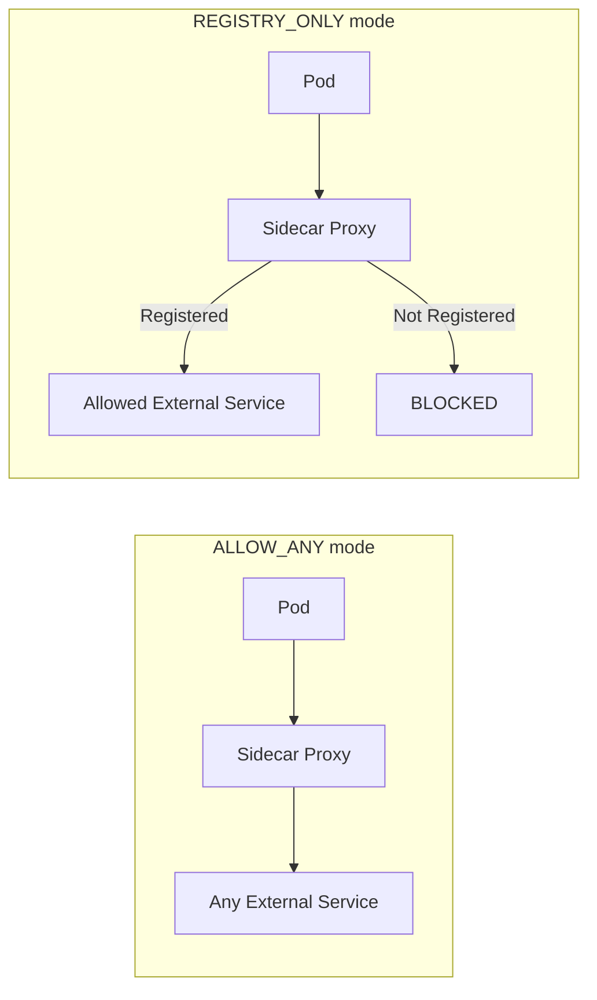

# How to Control Egress Traffic in Istio Service Mesh

Author: [nawazdhandala](https://github.com/nawazdhandala)

Tags: Istio, Egress, Service Mesh, Security, Traffic Management

Description: How to control outbound traffic from your Istio service mesh including blocking, allowing, and monitoring egress connections to external services.

---

By default, Istio allows all outbound traffic from pods in the mesh. Any pod can reach any external IP or domain without restriction. For development, that is convenient. For production, it is a security risk. A compromised pod can exfiltrate data, connect to command-and-control servers, or make unauthorized API calls to external services.

Controlling egress traffic means deciding which external services your mesh can talk to and routing that traffic through monitored channels.

## Understanding Istio's Egress Modes

Istio has a mesh-wide setting called `outboundTrafficPolicy` that controls what happens when a pod tries to reach an external service. It has two modes:

**ALLOW_ANY (default):** Pods can access any external service. Istio passthrough proxies the traffic without applying any policies.

**REGISTRY_ONLY:** Pods can only access services that are registered in Istio's service registry (Kubernetes services and ServiceEntry resources). Anything else is blocked.

Check your current mode:

```bash
kubectl get configmap istio -n istio-system -o yaml | grep outboundTrafficPolicy
```

## Switching to REGISTRY_ONLY Mode

To restrict egress traffic, change the mode to REGISTRY_ONLY:

```yaml
apiVersion: install.istio.io/v1alpha1
kind: IstioOperator
spec:
  meshConfig:
    outboundTrafficPolicy:
      mode: REGISTRY_ONLY
```

Apply the change:

```bash
istioctl install -f istio-config.yaml
```

Or patch the configmap directly:

```bash
kubectl get configmap istio -n istio-system -o yaml | \
  sed 's/mode: ALLOW_ANY/mode: REGISTRY_ONLY/' | \
  kubectl apply -f -
```

After switching, any pod trying to reach an external service not registered via ServiceEntry will get a 502 Bad Gateway response (for HTTP) or a connection refused (for TCP).

## Allowing Specific External Services with ServiceEntry

Once you are in REGISTRY_ONLY mode, you need to create ServiceEntry resources for each external service your pods need to access:

```yaml
apiVersion: networking.istio.io/v1
kind: ServiceEntry
metadata:
  name: google-apis
  namespace: default
spec:
  hosts:
  - "www.googleapis.com"
  - "oauth2.googleapis.com"
  ports:
  - number: 443
    name: https
    protocol: TLS
  resolution: DNS
  location: MESH_EXTERNAL
```

```yaml
apiVersion: networking.istio.io/v1
kind: ServiceEntry
metadata:
  name: github-api
  namespace: default
spec:
  hosts:
  - "api.github.com"
  ports:
  - number: 443
    name: https
    protocol: TLS
  resolution: DNS
  location: MESH_EXTERNAL
```

## ServiceEntry Scope

ServiceEntry resources can be scoped to a namespace or apply mesh-wide. By default, a ServiceEntry in any namespace is visible to the entire mesh. To restrict visibility, use the `exportTo` field:

```yaml
apiVersion: networking.istio.io/v1
kind: ServiceEntry
metadata:
  name: payment-gateway
  namespace: payments
spec:
  hosts:
  - "api.stripe.com"
  ports:
  - number: 443
    name: https
    protocol: TLS
  resolution: DNS
  location: MESH_EXTERNAL
  exportTo:
  - "."        # Only visible in the payments namespace
```

The `.` value means "current namespace only". Use `*` for mesh-wide visibility (the default).

## Traffic Flow with and Without Egress Control



## Handling Different Protocols

External services use different protocols. Here is how to handle the common ones:

### HTTP Services

```yaml
apiVersion: networking.istio.io/v1
kind: ServiceEntry
metadata:
  name: httpbin
spec:
  hosts:
  - "httpbin.org"
  ports:
  - number: 80
    name: http
    protocol: HTTP
  resolution: DNS
  location: MESH_EXTERNAL
```

### HTTPS Services

For HTTPS, use `TLS` protocol so Istio does not try to inspect the encrypted traffic:

```yaml
apiVersion: networking.istio.io/v1
kind: ServiceEntry
metadata:
  name: external-api
spec:
  hosts:
  - "api.external.com"
  ports:
  - number: 443
    name: https
    protocol: TLS
  resolution: DNS
  location: MESH_EXTERNAL
```

### TCP Services (like databases)

```yaml
apiVersion: networking.istio.io/v1
kind: ServiceEntry
metadata:
  name: external-postgres
spec:
  hosts:
  - "db.external.com"
  ports:
  - number: 5432
    name: tcp-postgres
    protocol: TCP
  resolution: DNS
  location: MESH_EXTERNAL
```

### IP-Based Services

For services you access by IP address rather than hostname:

```yaml
apiVersion: networking.istio.io/v1
kind: ServiceEntry
metadata:
  name: external-ip-service
spec:
  hosts:
  - "external-ip-service.local"    # A synthetic hostname
  addresses:
  - "203.0.113.50/32"
  ports:
  - number: 8443
    name: https
    protocol: TLS
  resolution: STATIC
  location: MESH_EXTERNAL
  endpoints:
  - address: 203.0.113.50
```

## Monitoring Egress Traffic

Even in ALLOW_ANY mode, you should monitor what external services your pods are connecting to. Check the sidecar proxy logs:

```bash
kubectl logs my-pod -c istio-proxy | grep "outbound"
```

Use Prometheus to query egress traffic patterns:

```promql
sum(rate(istio_requests_total{destination_service_namespace="unknown"}[5m])) by (destination_service_name)
```

This shows traffic to external services (which appear with `unknown` namespace).

## Gradually Rolling Out Egress Control

Switching from ALLOW_ANY to REGISTRY_ONLY all at once can break things if you don't know all the external services your apps depend on. A safer approach:

1. Stay in ALLOW_ANY mode
2. Enable access logging on all sidecars
3. Monitor egress traffic for a few weeks to catalog external dependencies
4. Create ServiceEntry resources for all discovered external services
5. Switch to REGISTRY_ONLY mode
6. Watch for 502 errors that indicate missed services

Enable access logging to discover external dependencies:

```yaml
apiVersion: telemetry.istio.io/v1
kind: Telemetry
metadata:
  name: mesh-logging
  namespace: istio-system
spec:
  accessLogging:
  - providers:
    - name: envoy
```

Then search the logs for outbound connections:

```bash
kubectl logs my-pod -c istio-proxy | grep "outbound" | awk '{print $5}' | sort -u
```

## Exceptions for Specific Namespaces

If some namespaces need unrestricted egress (like a tooling namespace), you can use Sidecar resources:

```yaml
apiVersion: networking.istio.io/v1
kind: Sidecar
metadata:
  name: unrestricted-egress
  namespace: tooling
spec:
  outboundTrafficPolicy:
    mode: ALLOW_ANY
```

This overrides the mesh-wide REGISTRY_ONLY setting for pods in the `tooling` namespace.

## Common Pitfalls

**DNS resolution failures.** When you switch to REGISTRY_ONLY, DNS resolution still works for registered hosts. But some applications resolve DNS and cache the IP, then connect to the IP directly. If the ServiceEntry uses `resolution: DNS`, the IP might not be in Istio's service registry. Use `resolution: NONE` for such cases.

**Init containers.** Init containers run before the sidecar proxy is ready. If your init container needs to reach an external service, it will fail in REGISTRY_ONLY mode. Use `holdApplicationUntilProxyStarts` in the pod annotation, or exclude init container traffic from the mesh.

**Wildcard hosts.** You can use wildcards in ServiceEntry hosts, but only `*.example.com` format is supported. You cannot use `*` alone to allow all hosts.

## Summary

Controlling egress traffic in Istio starts with understanding the `outboundTrafficPolicy` setting. Switch to REGISTRY_ONLY mode and use ServiceEntry resources to explicitly allow external service access. Roll it out gradually by monitoring traffic first, creating ServiceEntries for known dependencies, and then flipping the switch. This approach gives you visibility into what your mesh is talking to and the ability to block unauthorized outbound connections.
