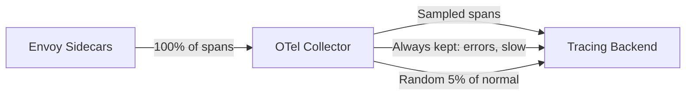

# How to Control Trace Volume Without Losing Important Traces

Author: [nawazdhandala](https://github.com/nawazdhandala)

Tags: Istio, Tracing, Sampling, Tail-Based Sampling, Cost Optimization

Description: Strategies for reducing trace volume in Istio while ensuring error traces and high-latency traces are always captured for debugging.

---

The fundamental problem with trace sampling is this: if you sample at 1% to keep costs down, you have a 99% chance of missing any specific error. That slow request that caused a customer complaint? Probably not sampled. That intermittent 500 error from the payment service? Gone. Random head-based sampling treats all requests equally, but not all requests are equally important.

This post covers strategies for keeping trace volume manageable while making sure the traces you actually need for debugging are always captured.

## The Problem with Head-Based Sampling

Istio's default sampling is head-based, meaning the sampling decision is made when the request first enters the mesh:

```yaml
apiVersion: telemetry.istio.io/v1
kind: Telemetry
metadata:
  name: mesh-tracing
  namespace: istio-system
spec:
  tracing:
    - providers:
        - name: otel
      randomSamplingPercentage: 1.0
```

At 1%, you capture 1 out of every 100 requests. The problem is that the decision happens before anything is known about the request's outcome. A request that will eventually fail with a 500 error has the same 1% chance of being sampled as a healthy 200 response.

## Strategy 1: Tail-Based Sampling with OTel Collector

Tail-based sampling makes the sampling decision after the trace is complete, so it can consider the outcome. The OpenTelemetry Collector supports this through the `tail_sampling` processor.

The architecture:



Set Istio to send all traces to the collector:

```yaml
apiVersion: telemetry.istio.io/v1
kind: Telemetry
metadata:
  name: full-tracing
  namespace: istio-system
spec:
  tracing:
    - providers:
        - name: otel
      randomSamplingPercentage: 100
```

Configure the collector with tail-based sampling:

```yaml
apiVersion: v1
kind: ConfigMap
metadata:
  name: otel-collector-config
  namespace: observability
data:
  config.yaml: |
    receivers:
      otlp:
        protocols:
          grpc:
            endpoint: 0.0.0.0:4317

    processors:
      tail_sampling:
        decision_wait: 10s
        num_traces: 100000
        expected_new_traces_per_sec: 5000
        policies:
          # Always keep error traces
          - name: errors-policy
            type: status_code
            status_code:
              status_codes:
                - ERROR
          # Always keep slow traces
          - name: latency-policy
            type: latency
            latency:
              threshold_ms: 2000
          # Sample 5% of everything else
          - name: probabilistic-policy
            type: probabilistic
            probabilistic:
              sampling_percentage: 5

      batch:
        timeout: 5s
        send_batch_size: 1024

    exporters:
      otlp:
        endpoint: jaeger-collector.observability:4317
        tls:
          insecure: true

    service:
      pipelines:
        traces:
          receivers: [otlp]
          processors: [tail_sampling, batch]
          exporters: [otlp]
```

With this setup:
- All traces with error status codes are kept (100%)
- All traces with latency above 2 seconds are kept (100%)
- 5% of normal, healthy traces are kept for baseline visibility

## Strategy 2: Composite Policies

The tail-sampling processor supports composite policies that combine multiple conditions with AND/OR logic:

```yaml
processors:
  tail_sampling:
    decision_wait: 15s
    num_traces: 200000
    policies:
      # Keep all errors
      - name: errors
        type: status_code
        status_code:
          status_codes:
            - ERROR

      # Keep slow successful traces
      - name: slow-success
        type: and
        and:
          and_sub_policy:
            - name: is-slow
              type: latency
              latency:
                threshold_ms: 1000
            - name: is-success
              type: status_code
              status_code:
                status_codes:
                  - OK

      # Keep traces from specific services at higher rate
      - name: critical-services
        type: and
        and:
          and_sub_policy:
            - name: is-payment
              type: string_attribute
              string_attribute:
                key: service.name
                values:
                  - payment-service
                  - auth-service
            - name: rate
              type: probabilistic
              probabilistic:
                sampling_percentage: 20

      # Keep 2% of everything else
      - name: baseline
        type: probabilistic
        probabilistic:
          sampling_percentage: 2
```

## Strategy 3: Force-Trace Important Requests

For known-important requests (like specific API endpoints or user-triggered actions), force tracing from the application layer:

```python
# Python middleware that forces tracing for specific conditions
@app.before_request
def force_trace_important_requests():
    # Force-trace admin actions
    if request.path.startswith('/admin/'):
        request.headers.environ['HTTP_X_B3_SAMPLED'] = '1'

    # Force-trace requests with a debug header
    if request.headers.get('X-Debug-Trace'):
        request.headers.environ['HTTP_X_B3_SAMPLED'] = '1'
```

From the client side:

```bash
# Force trace a specific request
curl -H "X-B3-Sampled: 1" http://api.example.com/api/checkout

# Or use the debug flag
curl -H "X-B3-Flags: 1" http://api.example.com/api/checkout
```

## Strategy 4: Rate-Limited Sampling

Instead of percentage-based sampling, use rate-limiting to sample a fixed number of traces per second. This gives predictable trace volume regardless of traffic spikes:

```yaml
processors:
  tail_sampling:
    decision_wait: 10s
    policies:
      - name: errors-always
        type: status_code
        status_code:
          status_codes:
            - ERROR

      - name: rate-limited-normal
        type: rate_limiting
        rate_limiting:
          spans_per_second: 100
```

At 100 spans per second, you'll get roughly 8.6 million spans per day, regardless of whether your traffic is 1,000 or 100,000 requests per second.

## Strategy 5: Priority-Based Sampling at the Mesh Level

Use different Istio Telemetry resources for different services:

```yaml
# Critical services: 100% sampling
apiVersion: telemetry.istio.io/v1
kind: Telemetry
metadata:
  name: critical-tracing
  namespace: payments
spec:
  tracing:
    - providers:
        - name: otel
      randomSamplingPercentage: 100
---
# Standard services: 10% sampling
apiVersion: telemetry.istio.io/v1
kind: Telemetry
metadata:
  name: standard-tracing
  namespace: catalog
spec:
  tracing:
    - providers:
        - name: otel
      randomSamplingPercentage: 10
---
# Low-priority services: 1% sampling
apiVersion: telemetry.istio.io/v1
kind: Telemetry
metadata:
  name: low-priority-tracing
  namespace: analytics
spec:
  tracing:
    - providers:
        - name: otel
      randomSamplingPercentage: 1
```

## Scaling the OTel Collector for Tail-Based Sampling

Tail-based sampling is memory-intensive because the collector must buffer complete traces before making decisions. For high-traffic environments:

```yaml
apiVersion: apps/v1
kind: Deployment
metadata:
  name: otel-collector
  namespace: observability
spec:
  replicas: 3
  selector:
    matchLabels:
      app: otel-collector
  template:
    spec:
      containers:
        - name: collector
          image: otel/opentelemetry-collector-contrib:0.96.0
          resources:
            requests:
              cpu: "2"
              memory: 4Gi
            limits:
              cpu: "4"
              memory: 8Gi
```

Important: tail-based sampling requires all spans from the same trace to arrive at the same collector instance. Use the `loadbalancingexporter` to distribute traces consistently:

```yaml
# First tier: Load-balanced routing
receivers:
  otlp:
    protocols:
      grpc:
        endpoint: 0.0.0.0:4317

exporters:
  loadbalancing:
    protocol:
      otlp:
        tls:
          insecure: true
    resolver:
      dns:
        hostname: otel-collector-sampling.observability
        port: 4317

service:
  pipelines:
    traces:
      receivers: [otlp]
      exporters: [loadbalancing]
```

```yaml
# Second tier: Tail sampling
receivers:
  otlp:
    protocols:
      grpc:
        endpoint: 0.0.0.0:4317

processors:
  tail_sampling:
    decision_wait: 10s
    policies:
      - name: errors
        type: status_code
        status_code:
          status_codes: [ERROR]
      - name: baseline
        type: probabilistic
        probabilistic:
          sampling_percentage: 5

exporters:
  otlp:
    endpoint: jaeger-collector:4317
    tls:
      insecure: true

service:
  pipelines:
    traces:
      receivers: [otlp]
      processors: [tail_sampling]
      exporters: [otlp]
```

## Measuring the Impact

Track your sampling effectiveness:

```bash
# Check collector metrics
kubectl port-forward svc/otel-collector -n observability 8888:8888
curl -s http://localhost:8888/metrics | grep "otelcol_processor_tail_sampling"
```

Key metrics:
- `otelcol_processor_tail_sampling_sampling_decision_timer_latency` - Time to make sampling decisions
- `otelcol_processor_tail_sampling_count_traces_sampled` - Traces kept vs dropped
- `otelcol_processor_tail_sampling_global_count_traces_sampled` - Running totals

## Cost Comparison

For a service handling 10,000 RPS:

| Strategy | Traces/day | Errors Captured |
|----------|-----------|-----------------|
| 100% sampling | ~864M | 100% |
| 1% random | ~8.6M | ~1% |
| Tail-based (errors + 5%) | ~43M + all errors | 100% |
| Rate-limited (100/sec) | ~8.6M + all errors | 100% |

Tail-based sampling costs more than simple random sampling but guarantees you capture every error trace.

## Summary

Don't settle for random sampling when you can be smart about it. Tail-based sampling through the OpenTelemetry Collector gives you the best of both worlds - low overall trace volume with guaranteed capture of errors and slow traces. Combine it with priority-based per-service sampling in Istio and force-trace headers for specific requests. The extra complexity of running a two-tier collector setup pays for itself the first time you need to debug a production issue and the trace is actually there.
