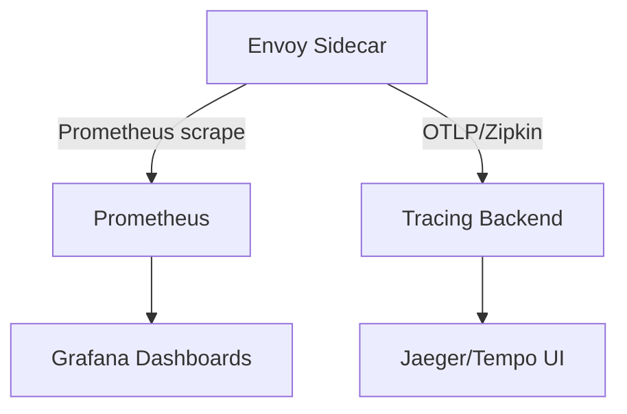

# How to Correlate Traces with Metrics in Istio

Author: [nawazdhandala](https://github.com/nawazdhandala)

Tags: Istio, Traces, Metrics, Correlation, Prometheus, Observability

Description: How to connect distributed traces with Prometheus metrics in Istio for faster root cause analysis and a unified observability experience.

---

Metrics tell you that something is wrong. Traces tell you why. When your dashboard shows a spike in error rate or latency, the natural next step is finding a trace that represents one of those bad requests. But jumping from a Prometheus metric to a specific Jaeger trace has traditionally required manual searching - copying timestamps, guessing at service names, and hoping you find a relevant trace. Proper correlation between metrics and traces eliminates that guesswork.

## The Observability Gap

Istio generates both metrics and traces from the same Envoy sidecars, but they flow through separate pipelines:



Metrics and traces share the same source data but end up in different systems with different query languages. Correlation creates bridges between them.

## What Correlation Means in Practice

There are two directions of correlation:

1. **Metrics to Traces:** You see a metric anomaly (like p99 latency spike for service X) and want to find specific traces showing that latency.
2. **Traces to Metrics:** You're looking at a trace and want to see the overall metrics context - is this an isolated incident or part of a broader pattern?

## Exemplars: The Bridge Between Metrics and Traces

Prometheus exemplars are the most direct way to link metrics with traces. An exemplar is a sample point attached to a metric that includes a trace ID, letting you jump from a metric to the exact trace that produced that data point.

Istio doesn't natively produce exemplars in its standard metrics, but you can achieve the linkage through the OpenTelemetry Collector or through application-level instrumentation.

### Application-Level Exemplars

If your application uses the OpenTelemetry SDK, you can attach trace IDs to Prometheus metrics:

```go
import (
    "go.opentelemetry.io/otel/trace"
    "github.com/prometheus/client_golang/prometheus"
)

var requestDuration = prometheus.NewHistogramVec(
    prometheus.HistogramOpts{
        Name:    "http_request_duration_seconds",
        Buckets: prometheus.DefBuckets,
    },
    []string{"method", "path", "status"},
)

func handler(w http.ResponseWriter, r *http.Request) {
    start := time.Now()

    // ... handle request ...

    duration := time.Since(start).Seconds()
    spanCtx := trace.SpanContextFromContext(r.Context())

    requestDuration.With(prometheus.Labels{
        "method": r.Method,
        "path":   r.URL.Path,
        "status": "200",
    }).(prometheus.ExemplarObserver).ObserveWithExemplar(
        duration,
        prometheus.Labels{"trace_id": spanCtx.TraceID().String()},
    )
}
```

## Shared Labels for Indirect Correlation

Even without exemplars, you can correlate metrics and traces using shared dimensions. Istio's standard metrics include labels like:

- `source_workload`
- `destination_workload`
- `destination_service`
- `response_code`
- `request_protocol`

These same values appear as attributes in trace spans. When you see a metric anomaly for a specific source/destination pair, you can search for traces with matching attributes.

For example, if Prometheus shows elevated errors for:

```text
istio_requests_total{
  source_workload="order-service",
  destination_service="payment-service",
  response_code="500"
}
```

You can search your tracing backend for:

```text
service.name = "order-service"
AND http.status_code = 500
AND peer.service = "payment-service"
```

## Setting Up Correlation in Grafana

Grafana is the natural tool for metrics-to-traces correlation because it supports multiple data sources and derived fields.

### Configure Tempo as a Trace Data Source

```yaml
# Grafana data source for Tempo
apiVersion: 1
datasources:
  - name: Tempo
    type: tempo
    url: http://tempo.observability:3200
    jsonData:
      tracesToMetrics:
        datasourceUid: prometheus
        tags:
          - key: service.name
            value: destination_workload
          - key: http.status_code
            value: response_code
      serviceMap:
        datasourceUid: prometheus
```

### Configure Prometheus with Trace Linking

```yaml
# Grafana data source for Prometheus with exemplar support
apiVersion: 1
datasources:
  - name: Prometheus
    type: prometheus
    url: http://prometheus.observability:9090
    jsonData:
      exemplarTraceIdDestinations:
        - name: trace_id
          datasourceUid: tempo
```

### Dashboard Panel with Exemplars

In Grafana, create a panel using the `istio_request_duration_milliseconds` histogram:

```text
histogram_quantile(0.99, sum(rate(istio_request_duration_milliseconds_bucket{destination_service="payment-service"}[5m])) by (le))
```

Enable "Exemplars" in the panel options. If exemplars are available, they'll show as dots on the graph that link directly to traces.

## Using Grafana Tempo's Service Graph

Grafana Tempo can generate a service graph from trace data that mirrors Istio's own service topology:

```yaml
# Tempo configuration with metrics generator
metrics_generator:
  registry:
    external_labels:
      source: tempo
  storage:
    path: /tmp/tempo/generator/wal
    remote_write:
      - url: http://prometheus.observability:9090/api/v1/write
  traces_storage:
    path: /tmp/tempo/generator/traces
  processor:
    service_graphs:
      dimensions:
        - service.namespace
      enable_client_server_prefix: true
    span_metrics:
      dimensions:
        - service.namespace
        - http.method
        - http.status_code
```

This generates Prometheus metrics from trace data, creating a feedback loop where you can see metrics derived from traces alongside Istio's native metrics.

## Correlating Time Windows

When you can't link by trace ID directly, time-based correlation is the fallback. The approach:

1. Notice a metric anomaly at time T
2. Query traces within a window around T
3. Filter by the relevant service and status code

In Jaeger's UI, you can search by time range and filter:

```text
Service: payment-service
Operation: /api/charge
Tags: http.status_code=500
Min Duration: 2s
Lookback: Last 15 minutes
```

In Grafana, set up a dashboard variable that links panel time ranges to Tempo queries.

## Building Correlation Dashboards

Create a Grafana dashboard that shows metrics and related traces side by side:

**Panel 1: Error Rate (Prometheus)**
```text
sum(rate(istio_requests_total{response_code=~"5.*",destination_service="$service"}[5m]))
/
sum(rate(istio_requests_total{destination_service="$service"}[5m]))
```

**Panel 2: Latency Distribution (Prometheus)**
```text
histogram_quantile(0.99, sum(rate(istio_request_duration_milliseconds_bucket{destination_service="$service"}[5m])) by (le))
```

**Panel 3: Error Traces (Tempo)**
Use TraceQL to find relevant traces:
```text
{span.http.status_code >= 500 && resource.service.name = "$service"} | duration > 1s
```

**Panel 4: Service Dependencies (Prometheus)**
```text
sum(rate(istio_requests_total{source_workload="$service"}[5m])) by (destination_service)
```

## Using the OTel Collector for Cross-Signal Correlation

The OpenTelemetry Collector can process both metrics and traces, adding correlation metadata:

```yaml
receivers:
  otlp:
    protocols:
      grpc:
        endpoint: 0.0.0.0:4317

processors:
  spanmetrics:
    metrics_exporter: prometheus
    dimensions:
      - name: http.method
      - name: http.status_code
      - name: service.name

exporters:
  prometheus:
    endpoint: 0.0.0.0:8889
  otlp:
    endpoint: tempo:4317
    tls:
      insecure: true

service:
  pipelines:
    traces:
      receivers: [otlp]
      processors: [spanmetrics]
      exporters: [otlp]
    metrics:
      receivers: [otlp]
      exporters: [prometheus]
```

The `spanmetrics` processor generates Prometheus metrics directly from trace spans. These metrics automatically have the same labels as the trace attributes, making correlation seamless.

Metrics generated include:
- `traces_spanmetrics_duration_bucket` - Histogram of span durations
- `traces_spanmetrics_calls_total` - Count of spans by status

## Practical Debugging Workflow

Here's a real debugging workflow using correlated metrics and traces:

1. **Alert fires:** "Payment service error rate > 5%"
2. **Check metrics dashboard:** Prometheus shows the error rate spike starting at 14:23
3. **Drill into traces:** Click through from the metrics panel to find traces around 14:23 with 500 status codes
4. **Inspect the trace:** See that the payment service calls a fraud detection service, which is timing out
5. **Check fraud service metrics:** Confirm that the fraud service latency spiked at the same time
6. **Root cause:** The fraud service's database connection pool was exhausted

Without correlation, steps 2-4 would involve manually switching between tools and trying to match timestamps.

## Summary

Metrics and traces complement each other - metrics show the big picture and traces show the details. Connect them through exemplars (when available), shared labels, time-based correlation, and tools like Grafana that can query both data sources. The OpenTelemetry Collector's spanmetrics processor and Grafana Tempo's metrics generator both create natural bridges between trace data and Prometheus metrics. The goal is a debugging workflow where you can move seamlessly from "something is wrong" to "here's exactly what happened."
