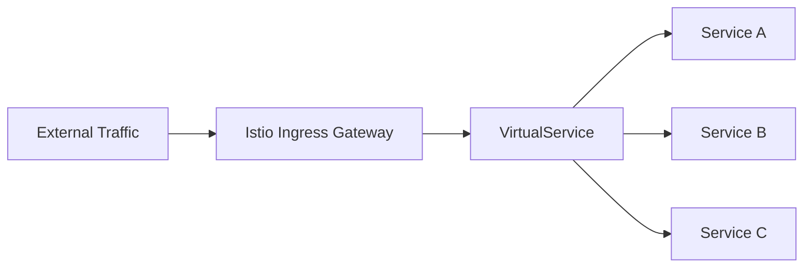

# How to Create Your First Istio Ingress Gateway

Author: [nawazdhandala](https://github.com/nawazdhandala)

Tags: Istio, Kubernetes, Ingress Gateway, Service Mesh, Networking

Description: A step-by-step guide to creating your first Istio Ingress Gateway to route external traffic into your Kubernetes cluster services.

---

If you have been running services on Kubernetes, you have probably used a standard Kubernetes Ingress controller at some point. Istio takes a different approach with its own Gateway resource, and it gives you a lot more flexibility. The Istio Ingress Gateway is an Envoy proxy that sits at the edge of your mesh and handles incoming traffic from outside the cluster.

This guide walks through creating your first Istio Ingress Gateway from scratch.

## Prerequisites

Before you start, make sure you have:

- A running Kubernetes cluster (1.25+)
- Istio installed with the default profile
- kubectl configured to talk to your cluster
- A sample application deployed with Istio sidecar injection enabled

You can verify Istio is installed by checking the istio-system namespace:

```bash
kubectl get pods -n istio-system
```

You should see the `istiod` control plane pod and the `istio-ingressgateway` pod running.

## Understanding the Istio Gateway Architecture

The Istio Ingress Gateway architecture has two main pieces:

1. **Gateway resource** - Defines which ports, protocols, and hosts the gateway should listen on
2. **VirtualService resource** - Defines routing rules that map to backend services



The Gateway resource configures the Envoy proxy that runs as the ingress gateway. The VirtualService then binds to that gateway and tells it where to send traffic.

## Deploying a Sample Application

First, deploy a simple httpbin application to test with:

```bash
kubectl label namespace default istio-injection=enabled
```

```yaml
apiVersion: v1
kind: Service
metadata:
  name: httpbin
  labels:
    app: httpbin
spec:
  ports:
  - name: http
    port: 8000
    targetPort: 80
  selector:
    app: httpbin
---
apiVersion: apps/v1
kind: Deployment
metadata:
  name: httpbin
spec:
  replicas: 1
  selector:
    matchLabels:
      app: httpbin
  template:
    metadata:
      labels:
        app: httpbin
    spec:
      containers:
      - name: httpbin
        image: docker.io/kennethreitz/httpbin
        ports:
        - containerPort: 80
```

Save that to `httpbin.yaml` and apply it:

```bash
kubectl apply -f httpbin.yaml
```

## Creating the Gateway Resource

Now create your Gateway resource. This tells the Istio ingress gateway to listen on port 80 for HTTP traffic on a specific host:

```yaml
apiVersion: networking.istio.io/v1
kind: Gateway
metadata:
  name: httpbin-gateway
spec:
  selector:
    istio: ingressgateway
  servers:
  - port:
      number: 80
      name: http
      protocol: HTTP
    hosts:
    - "httpbin.example.com"
```

The `selector` field tells Istio which gateway deployment to configure. The label `istio: ingressgateway` matches the default Istio ingress gateway that gets deployed with the default installation profile.

The `servers` section defines the port and protocol configuration. You can have multiple server entries for different ports or hosts.

Apply the gateway:

```bash
kubectl apply -f httpbin-gateway.yaml
```

## Creating the VirtualService

The Gateway alone does not route traffic anywhere. You need a VirtualService that binds to the gateway and defines where traffic goes:

```yaml
apiVersion: networking.istio.io/v1
kind: VirtualService
metadata:
  name: httpbin
spec:
  hosts:
  - "httpbin.example.com"
  gateways:
  - httpbin-gateway
  http:
  - match:
    - uri:
        prefix: /status
    - uri:
        prefix: /delay
    route:
    - destination:
        host: httpbin
        port:
          number: 8000
```

The key fields here:

- `hosts` should match what you defined in the Gateway
- `gateways` references the Gateway resource by name
- `http` contains the routing rules

Apply the VirtualService:

```bash
kubectl apply -f httpbin-virtualservice.yaml
```

## Getting the Gateway External IP

To access your service, you need the external IP of the Istio ingress gateway:

```bash
kubectl get svc istio-ingressgateway -n istio-system
```

If you are running on a cloud provider, you will get an external IP or hostname. On minikube, you can use:

```bash
minikube tunnel
```

Or get the NodePort:

```bash
export INGRESS_PORT=$(kubectl -n istio-system get service istio-ingressgateway -o jsonpath='{.spec.ports[?(@.name=="http2")].nodePort}')
export INGRESS_HOST=$(minikube ip)
```

## Testing Your Gateway

Now test the gateway with curl. Set the Host header to match the host you configured:

```bash
export GATEWAY_URL=$(kubectl -n istio-system get service istio-ingressgateway -o jsonpath='{.status.loadBalancer.ingress[0].ip}')

curl -s -I -H "Host: httpbin.example.com" "http://$GATEWAY_URL/status/200"
```

You should get a 200 OK response. If you try a path that is not in your VirtualService match rules, you will get a 404:

```bash
curl -s -I -H "Host: httpbin.example.com" "http://$GATEWAY_URL/headers"
```

## Verifying the Configuration

You can use istioctl to check if your gateway configuration is correct:

```bash
istioctl analyze
```

This will flag any misconfigurations like a VirtualService referencing a Gateway that does not exist, or host mismatches between the Gateway and VirtualService.

To see the actual Envoy configuration generated by your Gateway:

```bash
istioctl proxy-config listener deploy/istio-ingressgateway -n istio-system
```

And to see the routes:

```bash
istioctl proxy-config routes deploy/istio-ingressgateway -n istio-system
```

## Common Mistakes to Avoid

**Mismatched hosts.** The host in the VirtualService must match the host in the Gateway. If your Gateway says `httpbin.example.com` but your VirtualService says `*.example.com`, traffic may not route as expected.

**Wrong selector labels.** The Gateway selector must match the labels on the ingress gateway pod. Use `kubectl get pods -n istio-system --show-labels` to verify.

**Missing sidecar injection.** Your backend service needs the Istio sidecar injected for full mesh functionality. Make sure your namespace has the `istio-injection=enabled` label.

**Port name conventions.** Istio uses port names to determine protocol. Name your ports `http`, `http2`, `grpc`, `tcp`, or `https` so Istio can apply the right protocol handling.

## Cleaning Up

To remove everything you created:

```bash
kubectl delete -f httpbin-virtualservice.yaml
kubectl delete -f httpbin-gateway.yaml
kubectl delete -f httpbin.yaml
```

## What Comes Next

Once you have a basic ingress gateway working, there is a lot more you can do. You can add TLS termination, configure multiple hosts, set up traffic routing rules with weighted destinations, and add request transformations. The Istio Gateway resource is much more powerful than the standard Kubernetes Ingress, and understanding the basics here gives you a solid foundation to build on.

The separation of Gateway and VirtualService might feel like extra work compared to a single Ingress resource, but it pays off quickly. You get clean separation between infrastructure configuration (what ports and protocols to accept) and application routing (where to send traffic). Different teams can own different VirtualServices while sharing a single gateway, which scales much better in larger organizations.
