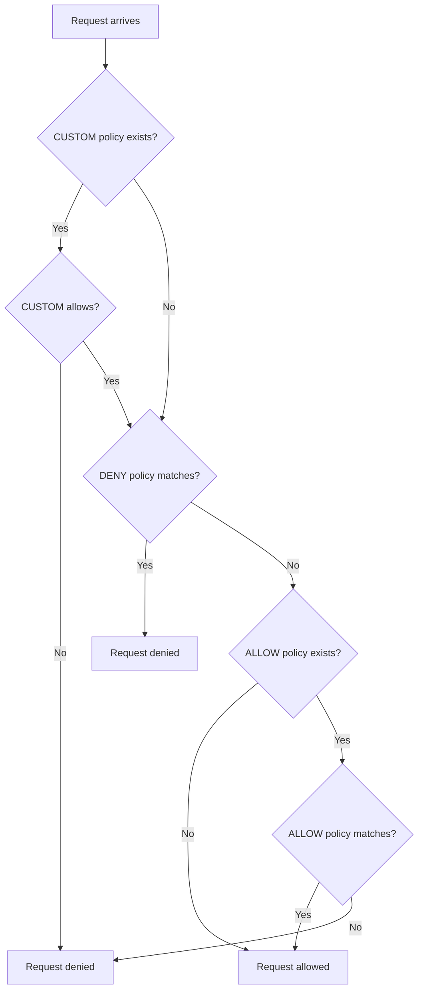

# How to Debug Authorization Policy Denied Requests in Istio

Author: [nawazdhandala](https://github.com/nawazdhandala)

Tags: Istio, Authorization, Debugging, Security, Kubernetes, Troubleshooting

Description: A practical troubleshooting guide for debugging denied requests caused by Istio authorization policies, with real commands and techniques.

---

You just applied an authorization policy and now requests are getting denied. Or maybe you did not change anything and requests started failing mysteriously. Either way, debugging Istio authorization denials can be frustrating if you do not know where to look. This guide gives you a systematic approach to figure out what went wrong.

## Step 1: Confirm It Is an Authorization Denial

Not every 403 comes from Istio authorization. Before going down the authz rabbit hole, confirm that the denial is actually from the RBAC filter.

Check the response body and headers. Istio's authorization engine returns a specific response:

```
HTTP/1.1 403 Forbidden
content-length: 19
content-type: text/plain

RBAC: access denied
```

If you see "RBAC: access denied" in the response body, it is definitely an Istio authorization policy causing the issue. If you see a different 403 message, the denial might be coming from your application or another middleware.

## Step 2: Check the Proxy Logs

Enable RBAC debug logging on the sidecar proxy to get detailed information about why a request was denied:

```bash
istioctl proxy-config log <pod-name> -n <namespace> --level rbac:debug
```

Then make the request again and check the logs:

```bash
kubectl logs <pod-name> -c istio-proxy -n <namespace> | grep rbac
```

You should see log entries like:

```
enforced denied, matched policy ns[default]-policy[deny-all]-rule[0]
```

or

```
enforced denied, no matched policy found
```

The first message tells you which specific policy and rule caused the denial. The second message means no ALLOW policy matched the request.

## Step 3: List All Policies Affecting the Workload

Check what authorization policies are applied to the workload:

```bash
kubectl get authorizationpolicy -n <namespace>
kubectl get authorizationpolicy -n istio-system
kubectl get authorizationpolicy --all-namespaces
```

Remember that authorization policies can exist at three scopes:

- **Workload level** - Applied via `selector` in a specific namespace
- **Namespace level** - Applied without a `selector` in a specific namespace (affects all workloads in that namespace)
- **Mesh level** - Applied in the root namespace (usually `istio-system`) without a `selector`

All three levels are evaluated together.

## Step 4: Use istioctl to Analyze Authorization

The `istioctl x authz check` command shows you the authorization configuration loaded into a specific proxy:

```bash
istioctl x authz check <pod-name> -n <namespace>
```

This outputs a table showing all policies that apply to the workload, their action (ALLOW/DENY/CUSTOM), and the rules. This is extremely useful for understanding the full picture of what policies are in effect.

## Step 5: Understand Policy Evaluation Order

Istio evaluates authorization policies in a specific order:

1. **CUSTOM** policies are evaluated first
2. **DENY** policies are evaluated next
3. **ALLOW** policies are evaluated last



Key insight: if there are no ALLOW policies at all, traffic is allowed by default. But the moment you add any ALLOW policy (even with empty rules), all traffic that does not match an ALLOW rule is denied. This is the most common source of unexpected denials.

## Step 6: Check for Empty ALLOW Policies

An ALLOW policy with empty rules denies everything:

```yaml
apiVersion: security.istio.io/v1
kind: AuthorizationPolicy
metadata:
  name: deny-all
  namespace: default
spec:
  selector:
    matchLabels:
      app: my-service
  action: ALLOW
  rules: []
```

This is sometimes used intentionally as a "deny all" mechanism, but it can also be created accidentally. Check for policies like this:

```bash
kubectl get authorizationpolicy -n <namespace> -o yaml | grep -A 5 "rules: \[\]"
```

## Step 7: Verify Source Identity

If your policy matches on `principals` or `namespaces`, make sure the source workload actually has the expected identity.

Check the source workload's service account:

```bash
kubectl get pod <source-pod> -n <namespace> -o jsonpath='{.spec.serviceAccountName}'
```

The SPIFFE identity will be `cluster.local/ns/<namespace>/sa/<service-account>`. Make sure this matches what your policy expects.

Also verify that mTLS is working between the source and destination:

```bash
istioctl x describe pod <destination-pod> -n <namespace>
```

This will show you whether mTLS is active and what peer authentication mode is in effect.

## Step 8: Check mTLS Configuration

If your policy uses `principals` or `namespaces` but the traffic is arriving over plaintext (no mTLS), the identity fields will be empty and the policy will not match.

Check the PeerAuthentication settings:

```bash
kubectl get peerauthentication --all-namespaces
```

If the mode is `PERMISSIVE`, some traffic might arrive without mTLS. If your authorization policy depends on source identity, you might need `STRICT` mTLS:

```yaml
apiVersion: security.istio.io/v1
kind: PeerAuthentication
metadata:
  name: strict-mtls
  namespace: default
spec:
  mtls:
    mode: STRICT
```

## Step 9: Inspect the Envoy Configuration Directly

For deep debugging, you can look at the actual Envoy configuration:

```bash
istioctl proxy-config listener <pod-name> -n <namespace> -o json
```

Search for `envoy.filters.http.rbac` in the output to find the RBAC filter configuration. This shows you exactly what rules Envoy is evaluating.

For an easier view:

```bash
istioctl proxy-config listener <pod-name> -n <namespace> --port 80 -o json | python3 -m json.tool | grep -A 50 "rbac"
```

## Step 10: Common Denial Scenarios and Fixes

**Scenario: Added an ALLOW policy for one service but all other services broke.**

This happens because adding any ALLOW policy switches the default behavior from "allow all" to "deny all unless explicitly allowed." Fix: add ALLOW rules for all services that need access, or restructure your policies.

**Scenario: Policy works in one namespace but not another.**

Check if the policy selector matches the workload labels correctly. Also check if there are conflicting namespace-level or mesh-level policies.

**Scenario: Request was allowed yesterday but denied today.**

Someone might have added or modified a policy. Check recent changes:

```bash
kubectl get authorizationpolicy -n <namespace> --sort-by=.metadata.creationTimestamp
```

Also check if any PeerAuthentication or RequestAuthentication policies changed, as these affect identity which in turn affects authorization.

**Scenario: JWT-based policy denies requests even with valid tokens.**

Make sure the `RequestAuthentication` policy is correctly configured and the JWT is being forwarded to the destination service. Check that the issuer and JWKS URI are correct.

## Quick Debugging Checklist

1. Confirm "RBAC: access denied" in the response
2. Enable rbac:debug logging on the proxy
3. List all authorization policies in all relevant namespaces
4. Run `istioctl x authz check` on the destination pod
5. Verify source identity (service account, mTLS status)
6. Check for empty ALLOW policies
7. Verify policy evaluation order (CUSTOM > DENY > ALLOW)
8. Check PeerAuthentication and RequestAuthentication settings
9. Inspect raw Envoy configuration if needed

Following this checklist systematically will get you to the root cause in most cases. The most common issues are missing ALLOW rules after adding the first ALLOW policy, and mTLS not being active when identity-based rules expect it to be.
