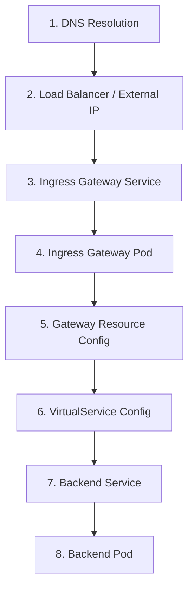

# How to Debug Istio Gateway Routing Issues

Author: [nawazdhandala](https://github.com/nawazdhandala)

Tags: Istio, Debugging, Gateway, Troubleshooting, Kubernetes

Description: A practical debugging guide for common Istio Gateway routing issues with real commands and step-by-step diagnostic approaches.

---

Something is broken. Traffic is not reaching your service through the Istio Gateway, and you need to figure out why. Debugging Istio routing problems can feel overwhelming because there are so many moving parts. But if you follow a systematic approach and know the right commands, you can usually find the problem in minutes.

## The Debugging Mindset

Traffic flows through several layers before reaching your service. When something breaks, you need to figure out which layer is the problem:



Start from the outside and work your way in.

## Step 1: Verify the External IP

First, make sure the ingress gateway has an external IP and it is reachable:

```bash
kubectl get svc istio-ingressgateway -n istio-system
```

If the EXTERNAL-IP shows `<pending>`, the load balancer has not provisioned. Check your cloud provider configuration or switch to NodePort for local testing.

Test basic connectivity:

```bash
export GATEWAY_IP=$(kubectl -n istio-system get service istio-ingressgateway \
  -o jsonpath='{.status.loadBalancer.ingress[0].ip}')

# Basic connectivity test
curl -v http://$GATEWAY_IP/
```

If you get "connection refused", the gateway pod might not be running. If you get a 404, the gateway is running but no routes match.

## Step 2: Check the Ingress Gateway Pod

```bash
# Is the pod running?
kubectl get pods -n istio-system -l istio=ingressgateway

# Check pod logs for errors
kubectl logs -n istio-system deploy/istio-ingressgateway --tail=50

# Check the pod is ready
kubectl describe pod -n istio-system -l istio=ingressgateway
```

Look for OOMKilled, CrashLoopBackOff, or other pod health issues.

## Step 3: Verify the Gateway Resource

```bash
# List all gateways
kubectl get gateway --all-namespaces

# Check your specific gateway
kubectl get gateway my-gateway -o yaml
```

Verify:
- The `selector` matches the ingress gateway pod labels
- The `servers` section has the right port and protocol
- The `hosts` field includes the hostname you are testing with

## Step 4: Verify the VirtualService

```bash
# List all VirtualServices
kubectl get virtualservice --all-namespaces

# Check your specific VirtualService
kubectl get virtualservice my-vs -o yaml
```

Verify:
- The `gateways` field references the correct Gateway name
- The `hosts` field matches a host in the Gateway
- The routing rules match the request you are making
- The `destination.host` is a valid service name

## Step 5: Run istioctl analyze

This is the single most useful debugging command:

```bash
istioctl analyze --all-namespaces
```

It catches a huge number of common issues:

- VirtualService references a Gateway that does not exist
- Host mismatch between Gateway and VirtualService
- Destination service not found
- Port mismatches
- Conflicting configurations

Fix every warning and error it reports before investigating further.

## Step 6: Check Proxy Configuration

The Envoy proxy running in the ingress gateway pod is what actually handles traffic. Check what configuration it has:

```bash
# Check listeners (what ports are open)
istioctl proxy-config listener deploy/istio-ingressgateway -n istio-system

# Check routes (how traffic is routed)
istioctl proxy-config routes deploy/istio-ingressgateway -n istio-system

# Check clusters (backend destinations)
istioctl proxy-config cluster deploy/istio-ingressgateway -n istio-system

# Check endpoints (actual pod IPs for destinations)
istioctl proxy-config endpoint deploy/istio-ingressgateway -n istio-system
```

If a listener is missing for your port, the Gateway configuration is not being applied. If routes are missing, the VirtualService is not being applied. If endpoints are empty, the backend service has no healthy pods.

## Step 7: Check Route Details

For detailed route information:

```bash
istioctl proxy-config routes deploy/istio-ingressgateway -n istio-system -o json
```

Look for your hostname in the `domains` field and your path in the route `match` section. If your route is not there, the VirtualService is not binding to the gateway correctly.

## Step 8: Check Backend Service

```bash
# Verify the service exists
kubectl get svc my-service

# Check it has endpoints
kubectl get endpoints my-service

# Test the service directly (bypass the gateway)
kubectl port-forward svc/my-service 8080:8080
curl http://localhost:8080/
```

If the service has no endpoints, the pods are either not running or the selector does not match.

## Common Issues and Fixes

### 404 Not Found

The gateway received the request but no route matched.

Possible causes:
- VirtualService not bound to the gateway
- Host mismatch between request and VirtualService
- Path does not match any route rule

```bash
# Test with explicit Host header
curl -v -H "Host: app.example.com" http://$GATEWAY_IP/

# Check the routes
istioctl proxy-config routes deploy/istio-ingressgateway -n istio-system --name http.80
```

### 503 Service Unavailable

The route matched but the backend is not reachable.

Possible causes:
- Backend pods are not running
- Backend service has no endpoints
- Sidecar injection missing on backend pods
- DestinationRule TLS mismatch

```bash
# Check endpoints
kubectl get endpoints my-service

# Check if sidecar is injected
kubectl get pods -l app=my-app -o jsonpath='{.items[0].spec.containers[*].name}'
```

### Connection Reset

Could be a protocol mismatch. If your service uses HTTP/2 or gRPC but the port is not named correctly:

```bash
# Check port naming
kubectl get svc my-service -o jsonpath='{.spec.ports[*].name}'
```

Port names should start with `http`, `http2`, `grpc`, etc.

### TLS Errors

```bash
# Check the certificate
openssl s_client -connect $GATEWAY_IP:443 -servername app.example.com </dev/null 2>/dev/null

# Verify the secret exists
kubectl get secret my-tls-credential -n istio-system

# Check gateway logs for TLS errors
kubectl logs deploy/istio-ingressgateway -n istio-system | grep -i "tls\|ssl\|certificate"
```

## Enabling Debug Logging

For deeper investigation, increase the log level on the ingress gateway:

```bash
istioctl proxy-config log deploy/istio-ingressgateway -n istio-system --level debug
```

This produces a lot of output, so filter it:

```bash
kubectl logs -n istio-system deploy/istio-ingressgateway -f | grep "my-route\|my-host"
```

Reset log level when done:

```bash
istioctl proxy-config log deploy/istio-ingressgateway -n istio-system --level warning
```

## Using Kiali for Visual Debugging

If you have Kiali installed, it provides a visual representation of your traffic flow:

```bash
istioctl dashboard kiali
```

Look at the Graph view to see if traffic is flowing through the ingress gateway to your service. Red edges indicate errors.

## Quick Debugging Checklist

When something is not working, run through this in order:

1. `kubectl get pods -n istio-system` - Gateway pod running?
2. `kubectl get gateway` - Gateway resource exists?
3. `kubectl get virtualservice` - VirtualService exists?
4. `istioctl analyze` - Any configuration errors?
5. `istioctl proxy-config listener` - Port open?
6. `istioctl proxy-config routes` - Route configured?
7. `kubectl get endpoints <service>` - Backend has pods?
8. `curl -v -H "Host: ..." http://$GATEWAY_IP/` - What response do you get?

Nine times out of ten, the problem is a mismatch between the Gateway and VirtualService (host, gateway name, or namespace), a missing backend service, or a TLS configuration issue. The systematic approach above will get you to the root cause quickly.
