# How to Debug Latency Issues Using Istio Traces

Author: [nawazdhandala](https://github.com/nawazdhandala)

Tags: Istio, Latency, Debugging, Distributed Tracing, Performance

Description: A practical guide to using Istio distributed traces to identify and resolve latency issues in microservice architectures.

---

A user reports that the checkout page takes 8 seconds to load. Your metrics show that the checkout service's p99 latency has spiked. But the checkout service calls five other services, and each of those might call others. Where is the time being spent? This is exactly the problem distributed tracing was built to solve, and Istio makes it possible to debug latency without adding instrumentation to your application code.

## Reading a Trace Waterfall

When you find a slow trace in Jaeger or Tempo, the waterfall view shows every span in the trace with their timing:

```mermaid
gantt
    title Checkout Request - 8.2s Total
    dateFormat X
    axisFormat %Ls

    section Gateway
    ingress-gateway          :0, 8200

    section Checkout
    checkout-svc (server)    :10, 8190
    checkout-svc (client->cart) :20, 150
    checkout-svc (client->pricing) :180, 6800
    checkout-svc (client->payment) :7000, 1100

    section Cart
    cart-svc (server)        :30, 130

    section Pricing
    pricing-svc (server)     :200, 6780
    pricing-svc (client->catalog) :220, 6750

    section Catalog
    catalog-svc (server)     :240, 6730

    section Payment
    payment-svc (server)     :7010, 1080
```



Reading this waterfall, the bottleneck is clear: the catalog service takes 6.7 seconds, which causes the pricing service to be slow, which causes the checkout service to be slow. Without tracing, you'd be checking each service's metrics individually trying to find the culprit.

## Finding Slow Traces

### By Duration Threshold

Search for traces that exceed your SLO:

```bash
# Jaeger API query for traces over 2 seconds
curl -s "http://jaeger:16686/api/traces?service=checkout-service&minDuration=2s&limit=20"
```

In the Jaeger UI, use the "Min Duration" field to filter. In Grafana with Tempo, use TraceQL:

```
{resource.service.name = "checkout-service"} | duration > 2s
```

### By Percentile Analysis

Find traces that represent the p99 latency:

```bash
# Get the p99 value from Prometheus
curl -s 'http://prometheus:9090/api/v1/query?query=histogram_quantile(0.99,sum(rate(istio_request_duration_milliseconds_bucket{destination_service="checkout-service"}[5m]))by(le))'
```

Then search for traces with durations near that p99 value.

## Interpreting Span Timing

Each span in an Istio trace has several timing properties. Understanding them helps you locate the bottleneck.

### Client vs Server Span Duration

For each service-to-service call, there are two spans:

- **Client span:** Measured at the calling service's sidecar. Includes network time + server processing.
- **Server span:** Measured at the receiving service's sidecar. Just the server processing time.

The difference tells you about network latency:

```
Network latency (round trip) = Client span duration - Server span duration
```

If a client span is 500ms but the server span is only 50ms, you have 450ms of network overhead. This could be:
- Actual network latency (unlikely to be that high within a cluster)
- mTLS handshake time (if it's a new connection)
- Connection pool exhaustion (waiting for a free connection)

### Gap Between Parent and Child Spans

If a parent span is 1000ms but its child spans only add up to 200ms, the remaining 800ms is time the application spent doing work between calls (like database queries, computation, or sleeping).

```
Application processing time = Parent span duration - Sum of child span durations
```

### Concurrent vs Sequential Child Spans

Look at whether child spans overlap (concurrent calls) or are sequential:

```
Sequential: |--call A--||--call B--||--call C--|  Total: A + B + C
Concurrent: |--call A--|
            |--call B--|
            |--call C--|                          Total: max(A, B, C)
```

If a service makes multiple downstream calls sequentially when they could be concurrent, that's an optimization opportunity.

## Common Latency Patterns

### Pattern 1: Single Slow Dependency

One downstream service dominates the trace:

```
checkout (8s)
  -> cart (50ms)
  -> pricing (7.5s)    <-- bottleneck
    -> catalog (7.4s)  <-- root cause
  -> payment (300ms)
```

**Next steps:** Look at the catalog service. Check its own traces for what it's doing. Is it making a slow database query? Is it calling an external API?

### Pattern 2: Connection Setup Overhead

Large gaps between the client span start and the server span start:

```
Client span starts:  T+0ms
Server span starts:  T+200ms  <-- 200ms gap
Server span ends:    T+220ms  (20ms processing)
Client span ends:    T+250ms
```

**Cause:** Usually mTLS handshake or TCP connection setup. This happens when connections aren't being reused.

**Fix:** Check Envoy's connection pool settings:

```yaml
apiVersion: networking.istio.io/v1
kind: DestinationRule
metadata:
  name: catalog-connection-pool
spec:
  host: catalog-service
  trafficPolicy:
    connectionPool:
      tcp:
        maxConnections: 100
      http:
        h2UpgradePolicy: DEFAULT
        maxRequestsPerConnection: 0
```

Setting `maxRequestsPerConnection: 0` allows unlimited request reuse per connection.

### Pattern 3: Retry-Induced Latency

The trace shows the same call repeated:

```
order-service (3.5s)
  -> payment-service attempt 1 (1.0s, FAILED)
  -> payment-service attempt 2 (1.0s, FAILED)
  -> payment-service attempt 3 (1.2s, SUCCESS)
```

**Cause:** Istio retry policy is triggering retries.

**Check:** Look at the response flags in the span attributes. Flags like `URX` indicate upstream retry limit exceeded.

```bash
# Check retry configuration
kubectl get virtualservice -A -o yaml | grep -A5 retries
kubectl get destinationrule -A -o yaml | grep -A5 outlierDetection
```

### Pattern 4: Queuing/Backpressure

Client spans are much longer than server spans for many services:

```
All client spans: ~500ms
All server spans: ~50ms
Gap explanation: Connection pool full, requests queuing
```

**Cause:** The destination service's connection pool or pending request limit is full. New requests wait in a queue.

**Fix:**

```yaml
apiVersion: networking.istio.io/v1
kind: DestinationRule
metadata:
  name: increase-capacity
spec:
  host: slow-service
  trafficPolicy:
    connectionPool:
      tcp:
        maxConnections: 200
      http:
        http2MaxRequests: 200
        maxRequestsPerConnection: 100
```

### Pattern 5: DNS Resolution Delay

A gap at the very beginning of the first span in a trace:

```
Total trace: 2.5s
First span starts after: 500ms delay
Actual processing: 2.0s
```

**Cause:** DNS resolution for the service name. Usually happens with external services or when CoreDNS is under load.

## Using Envoy Stats to Confirm Latency Sources

Once you identify a potential cause from traces, confirm it with Envoy stats:

```bash
# Check connection pool stats
kubectl exec deploy/checkout-service -c istio-proxy -- \
  curl -s localhost:15000/stats | grep "upstream_cx\|pending\|overflow"

# Check retry stats
kubectl exec deploy/checkout-service -c istio-proxy -- \
  curl -s localhost:15000/stats | grep retry

# Check circuit breaker stats
kubectl exec deploy/checkout-service -c istio-proxy -- \
  curl -s localhost:15000/stats | grep "upstream_rq_pending_overflow\|cx_open"
```

## Systematic Debugging Workflow

1. **Find a slow trace** using your tracing backend's search
2. **Open the waterfall view** and identify the longest span
3. **Check if the bottleneck is in your mesh** (internal service) or **external** (database, third-party API)
4. **Compare client and server span durations** to identify network vs. processing latency
5. **Look for patterns** (retries, sequential calls, connection setup)
6. **Confirm with Envoy stats** or pod-level metrics
7. **Fix the root cause** (optimize queries, add caching, parallelize calls, tune connection pools)
8. **Verify the fix** by checking new traces

```bash
# Quick check: get the trace ID from access logs
kubectl logs deploy/checkout-service -c istio-proxy --tail=10 | jq -r '.trace_id'

# Look up that trace
# In Jaeger: http://jaeger:16686/trace/{trace_id}
# In Tempo/Grafana: Use the Explore panel with the trace ID
```

## Proactive Latency Monitoring

Don't wait for user reports. Set up dashboards that show latency trends and link to traces:

```yaml
# PrometheusRule for latency alert
apiVersion: monitoring.coreos.com/v1
kind: PrometheusRule
metadata:
  name: latency-alerts
spec:
  groups:
    - name: latency
      rules:
        - alert: ServiceHighLatency
          expr: |
            histogram_quantile(0.99,
              sum(rate(istio_request_duration_milliseconds_bucket[5m])) by (le, destination_service)
            ) > 2000
          for: 5m
          annotations:
            summary: "{{ $labels.destination_service }} p99 latency > 2s"
            trace_link: "http://jaeger:16686/search?service={{ $labels.destination_service }}&minDuration=2s"
```

## Summary

Distributed traces are the most effective tool for debugging latency in microservice architectures. Start by finding a slow trace, read the waterfall to identify the bottleneck, then examine the gap patterns between client and server spans. Most latency issues fall into a handful of patterns: slow dependencies, connection setup overhead, retries, backpressure, and sequential calls that could be parallel. Use Envoy stats to confirm your hypothesis before making changes, and set up proactive alerting so you catch latency regressions before users do.
