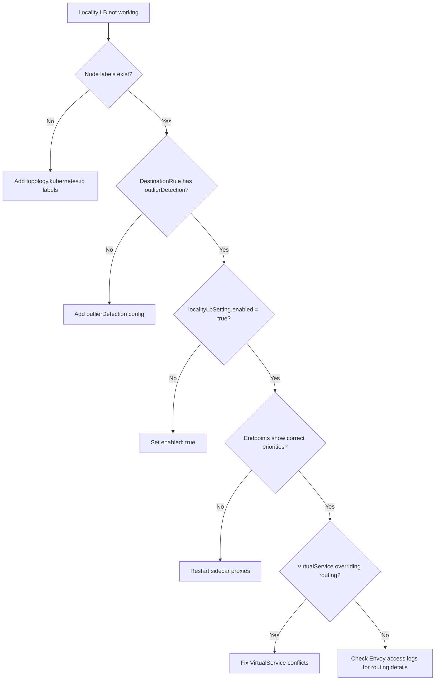

# How to Debug Locality Load Balancing Issues in Istio

Author: [nawazdhandala](https://github.com/nawazdhandala)

Tags: Istio, Debugging, Locality Load Balancing, Troubleshooting, Service Mesh

Description: Debug common locality load balancing issues in Istio including traffic not staying local, failover not working, and configuration problems.

---

You configured locality load balancing in Istio, but traffic is not behaving the way you expected. Maybe requests are going cross-zone when they should stay local. Maybe failover is not kicking in when endpoints are down. Maybe the whole thing seems to be ignored entirely.

Debugging locality issues requires looking at multiple layers: Kubernetes node labels, Istio configuration, Envoy proxy state, and actual traffic metrics. Here is a systematic approach to finding and fixing the problem.

## Step 1: Verify Node Topology Labels

Everything starts with node labels. If your nodes do not have the right topology labels, Istio cannot determine locality for any pod.

```bash
kubectl get nodes -o custom-columns=\
NAME:.metadata.name,\
REGION:.metadata.labels.topology\\.kubernetes\\.io/region,\
ZONE:.metadata.labels.topology\\.kubernetes\\.io/zone
```

Expected output:

```
NAME       REGION       ZONE
node-1     us-east-1    us-east-1a
node-2     us-east-1    us-east-1b
node-3     us-east-1    us-east-1c
```

If the REGION or ZONE columns show `<none>`, your nodes are missing topology labels. On managed Kubernetes services (EKS, GKE, AKS), these are added automatically. On bare-metal or custom clusters, you need to add them manually:

```bash
kubectl label node node-1 topology.kubernetes.io/region=us-east-1
kubectl label node node-1 topology.kubernetes.io/zone=us-east-1a
```

## Step 2: Check Pod Locality in Istio

Verify that Istio's control plane knows the locality of your pods:

```bash
istioctl proxy-config endpoint <source-pod-name> \
  --cluster "outbound|80||my-service.default.svc.cluster.local"
```

The output should show a LOCALITY column:

```
ENDPOINT          STATUS    OUTLIER   CLUSTER     PRIORITY   LOCALITY
10.0.1.5:8080     HEALTHY   OK        outbound..  0          us-east-1/us-east-1a
10.0.2.5:8080     HEALTHY   OK        outbound..  1          us-east-1/us-east-1b
```

If LOCALITY is empty, the pods are not being assigned a locality. This usually means the node labels are missing or the sidecar needs to be restarted to pick up updated labels:

```bash
kubectl rollout restart deployment my-service
```

## Step 3: Verify the DestinationRule is Applied

Check that your DestinationRule with locality settings actually exists and is being used:

```bash
kubectl get destinationrule my-service -o yaml
```

Look for the `localityLbSetting` section:

```yaml
loadBalancer:
  localityLbSetting:
    enabled: true
    failover:
      - from: us-east-1
        to: us-west-2
  simple: ROUND_ROBIN
```

If `enabled` is missing or set to `false`, locality load balancing is not active.

## Step 4: Confirm Outlier Detection is Configured

This is the most common issue. Locality load balancing requires outlier detection to be configured. Without it, Istio does not track endpoint health, and locality preferences are not applied.

```bash
kubectl get destinationrule my-service -o yaml | grep -A 10 outlierDetection
```

If there is no `outlierDetection` section, that is your problem. Add it:

```yaml
trafficPolicy:
  outlierDetection:
    consecutive5xxErrors: 5
    interval: 30s
    baseEjectionTime: 30s
```

This requirement catches almost everyone the first time they set up locality load balancing. It is documented in the Istio docs, but it is easy to miss.

## Step 5: Check Endpoint Priorities

Priorities tell you the order in which Envoy prefers endpoints. Lower numbers are preferred.

```bash
istioctl proxy-config endpoint <pod-name> \
  --cluster "outbound|80||my-service.default.svc.cluster.local" -o json \
  | jq '.[].hostStatuses[] | {
    address: .address.socketAddress.address,
    port: .address.socketAddress.portValue,
    locality: .locality,
    priority: .priority,
    healthStatus: .healthStatus
  }'
```

Expected output for a pod in us-east-1a:

```json
{
  "address": "10.0.1.5",
  "port": 8080,
  "locality": {"region": "us-east-1", "zone": "us-east-1a"},
  "priority": 0,
  "healthStatus": {}
}
{
  "address": "10.0.2.5",
  "port": 8080,
  "locality": {"region": "us-east-1", "zone": "us-east-1b"},
  "priority": 1,
  "healthStatus": {}
}
```

If all endpoints have the same priority (like all 0), locality preferences are not being applied. Go back and check your DestinationRule and outlier detection.

## Step 6: Check for Conflicting VirtualService Rules

A VirtualService can override locality behavior. If you have a VirtualService that explicitly routes to a specific subset or uses header-based routing, the locality settings from your DestinationRule may not apply as expected.

```bash
kubectl get virtualservice -o yaml | grep -B 5 -A 20 "my-service"
```

Look for route rules that might bypass locality:

```yaml
# This VirtualService overrides locality by specifying exact routing
http:
  - route:
      - destination:
          host: my-service
          subset: v1
        weight: 100
```

The VirtualService routing happens first. If it pins traffic to a specific subset, locality settings within that subset still apply. But if the VirtualService does something unexpected, it can be the source of confusion.

## Step 7: Inspect Envoy Cluster Configuration

Look at the Envoy cluster configuration for your service:

```bash
istioctl proxy-config cluster <pod-name> \
  --fqdn "outbound|80||my-service.default.svc.cluster.local" -o json
```

Look for these fields:

```json
{
  "lbPolicy": "ROUND_ROBIN",
  "commonLbConfig": {
    "localityWeightedLbConfig": {}
  }
}
```

If `localityWeightedLbConfig` is present, locality-weighted distribution is active. If you see `healthyPanicThreshold` set to 0, that can affect failover behavior.

## Step 8: Check Envoy Access Logs

Enable access logging if it is not already on:

```bash
istioctl install --set meshConfig.accessLogFile=/dev/stdout
```

Then check the logs of a client pod's sidecar:

```bash
kubectl logs <client-pod> -c istio-proxy --tail=50
```

The access log shows which upstream endpoint was selected for each request. You can see if requests are going to the expected zone.

## Common Issues and Fixes

### Issue: Traffic Not Staying Local

**Symptoms:** Requests go to random endpoints regardless of zone.

**Causes:**
1. Missing outlier detection in DestinationRule
2. Node topology labels not set
3. `localityLbSetting.enabled` not set to `true`

**Fix:** Add outlier detection and verify labels:

```yaml
trafficPolicy:
  outlierDetection:
    consecutive5xxErrors: 5
    interval: 30s
    baseEjectionTime: 30s
  loadBalancer:
    localityLbSetting:
      enabled: true
    simple: ROUND_ROBIN
```

### Issue: Failover Not Triggering

**Symptoms:** When local endpoints return errors, traffic does not shift to other zones.

**Causes:**
1. `maxEjectionPercent` too low (default 10%)
2. Outlier detection interval too long
3. Error threshold too high

**Fix:**

```yaml
outlierDetection:
  consecutive5xxErrors: 3
  interval: 10s
  baseEjectionTime: 30s
  maxEjectionPercent: 100
```

### Issue: All Traffic Goes to One Zone After Failover

**Symptoms:** After a zone failure and recovery, traffic does not return to the recovered zone.

**Causes:** Endpoints in the recovered zone are still in ejection period.

**Fix:** Wait for `baseEjectionTime` to pass, or reduce it:

```yaml
outlierDetection:
  baseEjectionTime: 15s
```

### Issue: Distribute Weights Not Adding Up

**Symptoms:** Configuration rejected or traffic distribution is wrong.

**Fix:** Make sure weights in each `to` block sum to 100:

```yaml
distribute:
  - from: "us-east-1/*"
    to:
      "us-east-1/us-east-1a/*": 50
      "us-east-1/us-east-1b/*": 30
      "us-east-1/us-east-1c/*": 20  # 50+30+20 = 100
```

## Debugging Flowchart



## Useful Debugging Commands Summary

```bash
# Check node topology labels
kubectl get nodes --show-labels | grep topology

# Check endpoint locality and priority
istioctl proxy-config endpoint <pod> --cluster "outbound|80||<service>"

# Validate DestinationRule
istioctl analyze -n default

# Check for config errors
istioctl proxy-status

# View Envoy config dump
istioctl proxy-config all <pod> -o json
```

The `istioctl analyze` command is particularly useful. It catches common configuration mistakes like missing outlier detection and can save you a lot of debugging time.

Locality load balancing debugging comes down to checking each layer methodically: labels, DestinationRule, outlier detection, priorities, and actual traffic flow. Follow the steps in order, and you will find the problem.
