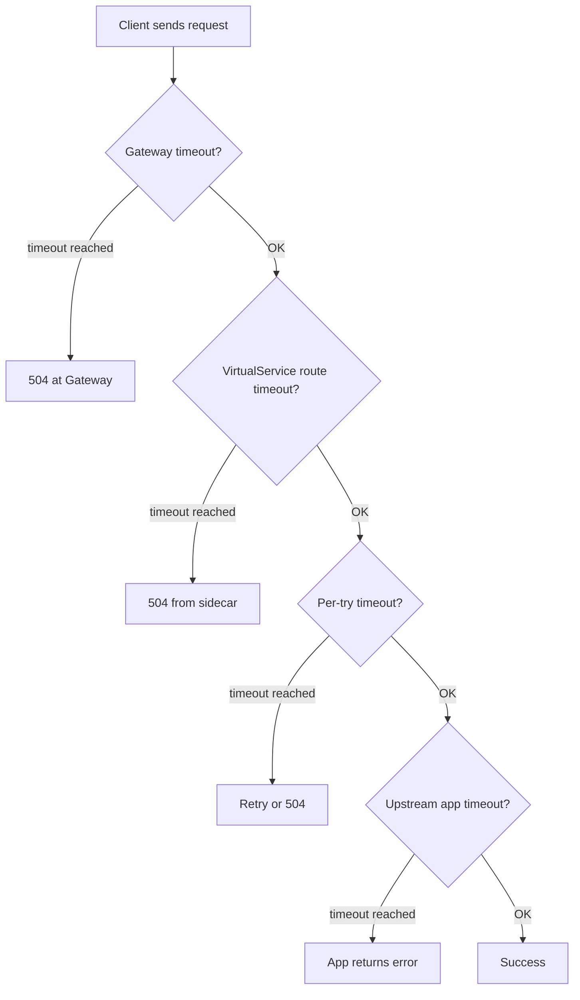

# How to Debug Timeout Issues in Istio Service Mesh

Author: [nawazdhandala](https://github.com/nawazdhandala)

Tags: Istio, Service Mesh, Debugging, Timeout, Kubernetes, Troubleshooting

Description: Step-by-step guide to diagnosing and fixing timeout issues in Istio service mesh, covering Envoy configs, proxy logs, and common pitfalls.

---

Timeout issues in Istio are frustrating because the error message you see rarely tells you which timeout triggered or why. A request times out, you get a 504 Gateway Timeout, and now you have to figure out whether it was the Istio route timeout, the Envoy idle timeout, the upstream service being slow, or something else entirely. Here is a systematic approach to debugging these issues.

## Step 1: Identify Where the Timeout Is Happening

The first thing to figure out is which component is timing out. Istio has multiple timeout layers:

1. **Route timeout** - Configured in VirtualService (`timeout` field)
2. **Per-try timeout** - Part of retry configuration (`perTryTimeout`)
3. **Idle timeout** - Connection-level timeout in DestinationRule
4. **TCP connect timeout** - How long to wait for TCP connection establishment
5. **Upstream service timeout** - The application's own timeout

Check the response headers for clues:

```bash
# Send a request and look at response headers
kubectl exec deploy/sleep -- curl -v http://my-service:8080/slow-endpoint 2>&1

# Look for these headers:
# x-envoy-upstream-service-time: <ms> - time spent in upstream
# server: istio-envoy - confirms Envoy is in the path
# HTTP/1.1 504 Gateway Timeout - timeout happened
```

If you see `x-envoy-upstream-service-time` in the response, the request made it to the upstream service. If you do not, the timeout happened before the request reached the backend.

## Step 2: Check Your VirtualService Timeout Configuration

Look at what timeout is configured:

```bash
# Get the VirtualService configuration
kubectl get virtualservice my-service -o yaml
```

Check the timeout field:

```yaml
apiVersion: networking.istio.io/v1beta1
kind: VirtualService
metadata:
  name: my-service
spec:
  hosts:
    - my-service
  http:
    - route:
        - destination:
            host: my-service
            port:
              number: 8080
      timeout: 10s
```

If there is no `timeout` field, Istio uses a default of 15 seconds. If your service takes longer than that to respond, you have found your problem.

A common gotcha: if you have a `timeout: 0s` somewhere, that actually disables the timeout completely, which is different from not setting it.

## Step 3: Check Envoy Proxy Configuration

The VirtualService YAML is what you configured, but what matters is what Envoy is actually running. These can differ if there were errors during configuration push.

```bash
# Dump the Envoy route configuration
kubectl exec deploy/my-service -c istio-proxy -- \
  curl -s localhost:15000/config_dump?resource=dynamic_route_configs | \
  python3 -m json.tool | grep -A 5 "timeout"
```

Compare what you see in the config dump with what your VirtualService says. If they do not match, there might be a configuration conflict or a bug in Istio's config translation.

## Step 4: Check Envoy Access Logs

Enable access logging if it is not already on, and look at the response flags:

```bash
# Check Envoy access logs
kubectl logs deploy/my-service -c istio-proxy --tail=100
```

Look for response flags in the log entries. The relevant flags for timeout issues:

- **UT** - Upstream request timeout. The route timeout fired.
- **UC** - Upstream connection termination.
- **UF** - Upstream connection failure.
- **LR** - Connection local reset.
- **DC** - Downstream connection termination.

A typical timeout log entry looks like:

```
[2026-02-24T10:30:45.123Z] "GET /api/data HTTP/1.1" 504 UT "-"
  upstream_service_time: "-" "my-service.default.svc.cluster.local:8080"
```

The `UT` flag tells you the upstream timeout fired. The missing `upstream_service_time` tells you the upstream never sent a response.

## Step 5: Check Envoy Stats for Timeout Metrics

```bash
# Check timeout-related stats
kubectl exec deploy/my-service -c istio-proxy -- \
  curl -s localhost:15000/stats | grep -E "timeout|cx_connect_fail"

# Specifically look for these:
# cluster.outbound|8080||my-service.default.svc.cluster.local.upstream_rq_timeout
# cluster.outbound|8080||my-service.default.svc.cluster.local.upstream_cx_connect_timeout
```

If `upstream_rq_timeout` is increasing, the route timeout is firing. If `upstream_cx_connect_timeout` is increasing, the issue is at the TCP connection level - the service might not be accepting connections.

## Step 6: Test Without Istio

Sometimes the simplest debugging step is to bypass Istio entirely and see if the timeout still happens:

```bash
# Get the pod IP directly
POD_IP=$(kubectl get pod -l app=my-service -o jsonpath='{.items[0].status.podIP}')

# Call the service directly, bypassing the sidecar
kubectl exec deploy/sleep -- curl -v --connect-timeout 30 http://$POD_IP:8080/slow-endpoint
```

If the request works fine when bypassing Istio, the problem is in your Istio configuration. If it still times out, the problem is in the service itself.

## Step 7: Check for Timeout Conflicts

Multiple timeout configurations can conflict with each other. Here is the hierarchy:



Check for conflicts between:

```bash
# Check VirtualService timeout
kubectl get vs my-service -o yaml | grep -A 3 timeout

# Check DestinationRule for connection timeouts
kubectl get dr my-service -o yaml | grep -A 10 connectionPool

# Check Gateway configuration
kubectl get gateway my-gateway -o yaml
```

## Step 8: Common Timeout Issues and Fixes

### Issue: Default 15s Timeout

If you never set a timeout and your service sometimes takes longer than 15 seconds:

```yaml
apiVersion: networking.istio.io/v1beta1
kind: VirtualService
metadata:
  name: my-service
spec:
  hosts:
    - my-service
  http:
    - route:
        - destination:
            host: my-service
      timeout: 60s
```

### Issue: Timeout During Rolling Deployments

During deployments, old pods shut down and new pods start up. Requests to terminating pods can time out. Add proper connection draining:

```yaml
apiVersion: networking.istio.io/v1beta1
kind: DestinationRule
metadata:
  name: my-service
spec:
  host: my-service
  trafficPolicy:
    connectionPool:
      tcp:
        connectTimeout: 5s
    outlierDetection:
      consecutive5xxErrors: 2
      interval: 5s
      baseEjectionTime: 15s
```

### Issue: Idle Connection Timeout

Long-lived connections that sit idle can get terminated:

```yaml
apiVersion: networking.istio.io/v1beta1
kind: DestinationRule
metadata:
  name: my-service
spec:
  host: my-service
  trafficPolicy:
    connectionPool:
      tcp:
        maxConnections: 100
        connectTimeout: 10s
```

### Issue: gRPC Stream Timeout

gRPC streams need special timeout handling because they are long-lived by nature:

```yaml
apiVersion: networking.istio.io/v1beta1
kind: VirtualService
metadata:
  name: grpc-service
spec:
  hosts:
    - grpc-service
  http:
    - route:
        - destination:
            host: grpc-service
      timeout: 0s  # Disable timeout for streaming
```

## Quick Debugging Checklist

Run through this checklist when you hit a timeout issue:

```bash
# 1. What timeout is configured?
kubectl get vs -A -o yaml | grep -B 5 -A 5 timeout

# 2. What does Envoy think the timeout is?
kubectl exec deploy/my-service -c istio-proxy -- \
  curl -s localhost:15000/config_dump?resource=dynamic_route_configs | \
  python3 -m json.tool | grep timeout

# 3. Is the service actually slow?
kubectl exec deploy/my-service -c istio-proxy -- \
  curl -s localhost:15000/stats | grep upstream_rq_time

# 4. Are connections failing?
kubectl exec deploy/my-service -c istio-proxy -- \
  curl -s localhost:15000/stats | grep cx_connect_fail

# 5. What do access logs say?
kubectl logs deploy/my-service -c istio-proxy --tail=50 | grep "504\|UT\|UC"
```

Timeout debugging is methodical work. Start from the outside and work your way in - check the Istio configuration first, then the Envoy proxy, then the upstream service. Nine times out of ten, the problem is a misconfigured or missing timeout in the VirtualService.
