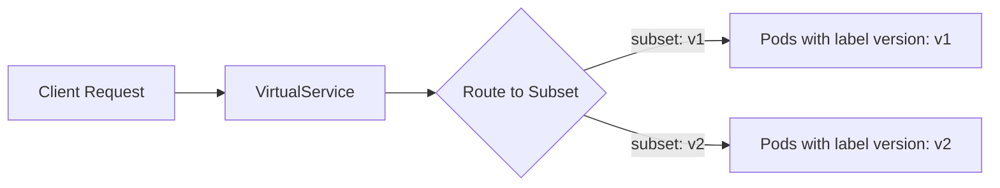

# How to Define Service Subsets with Istio DestinationRule

Author: [nawazdhandala](https://github.com/nawazdhandala)

Tags: Istio, DestinationRule, Service Subsets, Canary Deployments, Kubernetes

Description: Learn how to define service subsets in Istio DestinationRule to route traffic to specific versions of your services.

---

One of the most useful features of Istio's DestinationRule is the ability to define subsets. Subsets let you group pods of the same service based on labels, which is how you do things like canary deployments, blue-green releases, and A/B testing within the mesh.

Without subsets, when you send traffic to a service, it gets load-balanced across all pods backing that service. But with subsets, you can say "send 90% of traffic to pods labeled v1 and 10% to pods labeled v2." The DestinationRule defines those subsets, and a VirtualService uses them for routing.

## How Subsets Work

A subset is just a named group of endpoints (pods) for a service. You define them using label selectors. When Istio sees a subset name referenced in a VirtualService, it filters the list of available pods down to only those matching the subset's labels.

Here is the flow:



## Setting Up a Multi-Version Service

First, deploy two versions of a service. Here is a simple example with an nginx-based app:

```yaml
apiVersion: apps/v1
kind: Deployment
metadata:
  name: my-app-v1
spec:
  replicas: 3
  selector:
    matchLabels:
      app: my-app
      version: v1
  template:
    metadata:
      labels:
        app: my-app
        version: v1
    spec:
      containers:
      - name: my-app
        image: nginx:1.24
        ports:
        - containerPort: 80
---
apiVersion: apps/v1
kind: Deployment
metadata:
  name: my-app-v2
spec:
  replicas: 2
  selector:
    matchLabels:
      app: my-app
      version: v2
  template:
    metadata:
      labels:
        app: my-app
        version: v2
    spec:
      containers:
      - name: my-app
        image: nginx:1.25
        ports:
        - containerPort: 80
---
apiVersion: v1
kind: Service
metadata:
  name: my-app
spec:
  selector:
    app: my-app
  ports:
  - port: 80
    targetPort: 80
    name: http
```

Notice that both deployments have the `app: my-app` label, so the Kubernetes Service selects all 5 pods. But they differ in the `version` label.

Apply it:

```bash
kubectl apply -f my-app.yaml
```

## Defining Subsets in a DestinationRule

Now create a DestinationRule that defines two subsets:

```yaml
apiVersion: networking.istio.io/v1
kind: DestinationRule
metadata:
  name: my-app-destination
spec:
  host: my-app
  subsets:
  - name: v1
    labels:
      version: v1
  - name: v2
    labels:
      version: v2
```

Each subset has a `name` (which you will reference in VirtualService routes) and a `labels` map that filters which pods belong to that subset.

Apply it:

```bash
kubectl apply -f my-app-destinationrule.yaml
```

## Using Subsets in a VirtualService

The subsets alone do not change routing behavior. You need a VirtualService to actually use them:

```yaml
apiVersion: networking.istio.io/v1
kind: VirtualService
metadata:
  name: my-app-routing
spec:
  hosts:
  - my-app
  http:
  - route:
    - destination:
        host: my-app
        subset: v1
      weight: 90
    - destination:
        host: my-app
        subset: v2
      weight: 10
```

This sends 90% of traffic to v1 pods and 10% to v2. The `subset` field in the VirtualService route must match the `name` field in the DestinationRule subset.

## Applying Different Traffic Policies Per Subset

A powerful pattern is applying different traffic policies to different subsets. Maybe your v2 is still experimental and you want to be more aggressive with circuit breaking:

```yaml
apiVersion: networking.istio.io/v1
kind: DestinationRule
metadata:
  name: my-app-destination
spec:
  host: my-app
  trafficPolicy:
    loadBalancer:
      simple: ROUND_ROBIN
  subsets:
  - name: v1
    labels:
      version: v1
  - name: v2
    labels:
      version: v2
    trafficPolicy:
      connectionPool:
        http:
          http1MaxPendingRequests: 10
          http2MaxRequests: 50
      outlierDetection:
        consecutive5xxErrors: 3
        interval: 5s
        baseEjectionTime: 60s
```

The top-level `trafficPolicy` applies to all subsets by default. The v2 subset overrides it with stricter connection limits and outlier detection. The v1 subset just inherits the top-level policy.

## Verifying Subsets Are Working

You can check that Envoy knows about your subsets:

```bash
istioctl proxy-config cluster <pod-name> --fqdn my-app.default.svc.cluster.local -o json
```

Look for cluster entries with subset names in them. You should see something like `outbound|80|v1|my-app.default.svc.cluster.local` and `outbound|80|v2|my-app.default.svc.cluster.local`.

You can also verify endpoints per subset:

```bash
istioctl proxy-config endpoint <pod-name> --cluster "outbound|80|v1|my-app.default.svc.cluster.local"
```

This shows you exactly which pod IPs are in the v1 subset.

## Multiple Labels for Subsets

Subsets can use multiple labels for more precise filtering:

```yaml
subsets:
- name: v2-canary
  labels:
    version: v2
    environment: canary
- name: v2-stable
  labels:
    version: v2
    environment: stable
```

This splits your v2 pods further into canary and stable groups. All specified labels must match for a pod to be included in that subset.

## Common Gotchas

**Subset referenced but not defined**: If your VirtualService references a subset name that does not exist in the DestinationRule, requests will fail with a 503 error. Istio will not route to any pods - it just fails.

**Labels do not match any pods**: If you define a subset with labels that no pod has, the subset will be empty. Requests routed there will get 503 errors.

**Forgetting to create the DestinationRule**: If you use subset names in a VirtualService but never create the DestinationRule, all requests fail. The DestinationRule must exist before traffic can route to subsets.

You can catch these issues early:

```bash
istioctl analyze
```

This will flag missing DestinationRules and undefined subset references.

## Cleaning Up

```bash
kubectl delete destinationrule my-app-destination
kubectl delete virtualservice my-app-routing
kubectl delete deployment my-app-v1 my-app-v2
kubectl delete service my-app
```

## Summary

Subsets are the foundation of version-based routing in Istio. You use labels on your pods to group them, define those groups as subsets in a DestinationRule, and then reference the subset names in your VirtualService routes. This pattern is what makes canary deployments and traffic splitting possible within the service mesh. Get comfortable with subsets and you will have a lot of flexibility in how you roll out new versions of your services.
