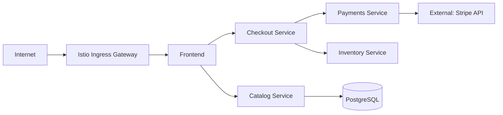

# How to Document Istio Configuration for Your Team

Author: [nawazdhandala](https://github.com/nawazdhandala)

Tags: Istio, Documentation, Platform Engineering, Kubernetes, DevOps

Description: Create effective Istio configuration documentation for your team covering architecture diagrams, resource catalogs, decision records, and living documentation practices.

---

Istio configuration can get complicated fast. You might understand your mesh setup perfectly right now, but six months from now when someone new joins the team or you need to debug a 2 AM outage, that knowledge needs to be written down somewhere. The challenge is creating documentation that is actually useful and does not go stale within weeks.

## What to Document

Not everything needs documentation. Focus on things that are hard to figure out from the configuration alone:

- **Why** a particular configuration exists (the YAML tells you what, not why)
- **Relationships** between resources that are not obvious from the files
- **Decisions** that were made and the alternatives that were rejected
- **Operational procedures** that people need to follow
- **Known issues** and workarounds

Skip documenting things that are obvious from reading the resource itself. Nobody needs a document that says "this VirtualService routes traffic to the checkout service" when the YAML already says that.

## Architecture Documentation

Start with a high-level diagram of your mesh. This should show:

- Which namespaces are in the mesh
- Key services and how they communicate
- Ingress and egress points
- External service dependencies

You do not need fancy tools for this. A simple ASCII diagram or a Mermaid diagram in a markdown file works great:

```markdown
## Mesh Architecture



### Namespaces
- `frontend` - Web UI and BFF
- `checkout` - Checkout and cart services
- `payments` - Payment processing
- `catalog` - Product catalog and search
- `istio-system` - Istio control plane
```text

Keep this diagram updated when services are added or removed. It should live in the same Git repository as your Istio configuration.

## Resource Catalog

Create a catalog of all Istio resources with their purpose. This is the most referenced document during incidents:

```markdown
## Istio Resource Catalog

### Gateways

| Name | Namespace | Purpose | Owner |
|------|-----------|---------|-------|
| main-gateway | istio-system | Primary HTTPS ingress for *.example.com | Platform |
| internal-gateway | istio-system | Internal services on *.internal.example.com | Platform |

### VirtualServices

| Name | Namespace | Hosts | Purpose | Owner |
|------|-----------|-------|---------|-------|
| checkout-routing | checkout | checkout.example.com | Routes to checkout v1/v2 with canary | Checkout Team |
| catalog-routing | catalog | catalog.example.com | Routes catalog traffic | Catalog Team |

### DestinationRules

| Name | Namespace | Host | Key Settings | Owner |
|------|-----------|------|-------------|-------|
| checkout-dr | checkout | checkout.svc | Circuit breaker: 5 errors/30s | Checkout Team |
| payments-dr | payments | payments.svc | Max 50 connections, 10s timeout | Payments Team |

### AuthorizationPolicies

| Name | Namespace | Target | Action | Purpose |
|------|-----------|--------|--------|---------|
| checkout-access | checkout | app=checkout | ALLOW | Only frontend and admin can access |
| payments-strict | payments | app=payments | ALLOW | Only checkout service can access |

### ServiceEntries

| Name | Namespace | Host | Purpose |
|------|-----------|------|---------|
| stripe-api | payments | api.stripe.com | Payment processing |
| sendgrid | notifications | smtp.sendgrid.net | Email delivery |
```

## Decision Records

When you make a non-obvious Istio configuration decision, write it down as an Architecture Decision Record (ADR):

```markdown
## ADR-007: Use PERMISSIVE mTLS Instead of STRICT

**Date**: 2026-01-15
**Status**: Active
**Context**: We have legacy services running outside the mesh that need to communicate with meshed services. Moving them into the mesh is a 6-month project.

**Decision**: Use PERMISSIVE mTLS mode mesh-wide until all services are migrated into the mesh.

**Consequences**:
- Traffic from non-meshed services is accepted without mTLS
- We lose the ability to enforce encryption for all traffic
- Security team has accepted this as a temporary trade-off
- Will revisit when legacy migration is complete (target: Q3 2026)

**Alternatives Considered**:
- STRICT mode with exceptions per service: Too many exceptions to manage
- Running separate meshes: Too much operational overhead
```

```markdown
## ADR-012: Disable Retries on Payment Service Routes

**Date**: 2026-02-10
**Status**: Active
**Context**: The payment service processes credit card charges. Retrying a failed request can result in duplicate charges.

**Decision**: No retries configured on VirtualService routes to the payment service.

**Consequences**:
- Transient failures result in user-facing errors
- The frontend handles retries with idempotency keys
- This is safer than proxy-level retries for financial transactions
```

Store these alongside your Istio configuration in a `docs/decisions/` directory.

## Inline Documentation with Annotations

Use Kubernetes annotations to document resources directly:

```yaml
apiVersion: networking.istio.io/v1beta1
kind: VirtualService
metadata:
  name: checkout-routing
  namespace: checkout
  annotations:
    docs/purpose: "Canary routing for checkout v2 rollout. Traffic split 95/5."
    docs/owner: "checkout-team"
    docs/last-updated: "2026-02-20"
    docs/related-ticket: "PLAT-4567"
    docs/dependencies: "Requires checkout-dr DestinationRule for subset definitions"
spec:
  hosts:
    - checkout.checkout.svc.cluster.local
  http:
    - route:
        - destination:
            host: checkout.checkout.svc.cluster.local
            subset: v1
          weight: 95
        - destination:
            host: checkout.checkout.svc.cluster.local
            subset: v2
          weight: 5
```

The advantage of inline annotations is that they live with the resource and are visible when someone runs `kubectl get -o yaml`. The downside is they are limited in length and formatting.

## Configuration Patterns Guide

Document the common patterns your team uses so that new team members do not reinvent the wheel:

```markdown
## Istio Configuration Patterns

### Pattern: Canary Deployment

When rolling out a new version, use weight-based routing:

1. Create a new subset in the DestinationRule
2. Add the new destination to the VirtualService with 5% weight
3. Monitor error rates and latency for the new version
4. Gradually increase weight: 5% -> 25% -> 50% -> 100%
5. Remove the old subset after full rollout

Template:
```yaml
# destinationrule.yaml
spec:
  host: <service>.svc.cluster.local
  subsets:
    - name: stable
      labels:
        version: v1
    - name: canary
      labels:
        version: v2

# virtualservice.yaml
spec:
  http:
    - route:
        - destination:
            host: <service>.svc.cluster.local
            subset: stable
          weight: 95
        - destination:
            host: <service>.svc.cluster.local
            subset: canary
          weight: 5
```

### Pattern: External Service Access

When an application needs to call an external API:

1. Create a ServiceEntry for the external host
2. Create a DestinationRule with TLS settings if needed
3. Add to the resource catalog documentation

Template:
```yaml
apiVersion: networking.istio.io/v1beta1
kind: ServiceEntry
metadata:
  name: <service-name>-<protocol>
  namespace: <team-namespace>
spec:
  hosts:
    - <external-hostname>
  ports:
    - number: 443
      name: https
      protocol: TLS
  resolution: DNS
  location: MESH_EXTERNAL
```
```text

## Troubleshooting Guide

Document known issues and their solutions:

```markdown
## Known Issues and Fixes

### Issue: New service returns 503 errors
**Symptoms**: Service deployed successfully but all requests return 503.
**Cause**: Usually missing DestinationRule or incorrect port naming.
**Fix**:
1. Check port name starts with correct protocol prefix
2. Verify DestinationRule exists if VirtualService references subsets
3. Run `istioctl analyze -n <namespace>`

### Issue: Intermittent connection resets to database
**Symptoms**: Application logs show "connection reset by peer" to PostgreSQL.
**Cause**: Protocol sniffing timeout for server-first protocol.
**Fix**: Ensure the database Service port is named `tcp-postgres`.

### Issue: Gateway returns 404 for new hostname
**Symptoms**: New hostname added to Gateway but returns 404.
**Cause**: VirtualService not bound to Gateway or host mismatch.
**Fix**: Check VirtualService `gateways` field matches Gateway name and `hosts` includes the hostname.
```

## Generating Documentation Automatically

Automate what you can. Write a script that generates the resource catalog from the live cluster:

```bash
#!/bin/bash
# generate-docs.sh

echo "# Istio Resource Catalog"
echo ""
echo "Generated: $(date)"
echo ""

echo "## VirtualServices"
echo ""
echo "| Name | Namespace | Hosts | Gateways |"
echo "|------|-----------|-------|----------|"
kubectl get virtualservices -A -o json | jq -r '.items[] | "| \(.metadata.name) | \(.metadata.namespace) | \(.spec.hosts | join(", ")) | \(.spec.gateways // ["mesh"] | join(", ")) |"'

echo ""
echo "## DestinationRules"
echo ""
echo "| Name | Namespace | Host | Subsets |"
echo "|------|-----------|------|---------|"
kubectl get destinationrules -A -o json | jq -r '.items[] | "| \(.metadata.name) | \(.metadata.namespace) | \(.spec.host) | \(.spec.subsets // [] | map(.name) | join(", ")) |"'

echo ""
echo "## AuthorizationPolicies"
echo ""
echo "| Name | Namespace | Action |"
echo "|------|-----------|--------|"
kubectl get authorizationpolicies -A -o json | jq -r '.items[] | "| \(.metadata.name) | \(.metadata.namespace) | \(.spec.action // "ALLOW") |"'
```

Run this script periodically and compare the output with your hand-written documentation to catch drift.

## Keeping Documentation Fresh

Documentation rots quickly. Combat this with:

1. **PR requirement**: Every Istio config PR must include documentation updates if the change affects the architecture, resource catalog, or patterns guide.

2. **Quarterly reviews**: Schedule a quarterly meeting to review and update documentation. Delete outdated content.

3. **New hire test**: When a new team member joins, have them use the documentation to understand the mesh. Any questions they ask that the docs cannot answer become documentation tasks.

4. **Incident reviews**: After every Istio incident, check if better documentation would have helped resolve it faster. Update accordingly.

## Summary

Effective Istio documentation focuses on the why rather than the what, since the YAML already tells you what is configured. Maintain an architecture diagram, resource catalog, decision records, configuration patterns guide, and troubleshooting guide. Use annotations for inline documentation on resources. Automate catalog generation where possible and enforce documentation updates as part of the change process. The test of good documentation is whether someone new to the team can understand and operate the mesh without needing to ask the person who set it up.
