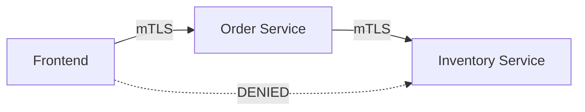

# How to Enable mTLS for Service-to-Service Communication in Istio

Author: [nawazdhandala](https://github.com/nawazdhandala)

Tags: Istio, mTLS, Microservices, Service Communication, Security

Description: A practical guide to enabling encrypted and authenticated service-to-service communication using mutual TLS in an Istio service mesh.

---

Service-to-service communication is the backbone of any microservices architecture. In a typical cluster, you might have dozens or hundreds of services talking to each other over HTTP, gRPC, or TCP. Without encryption, all of that traffic is visible to anyone who can access the network. Without authentication, any pod in the cluster can impersonate any service.

Istio's mutual TLS solves both problems. Every connection between services is encrypted, and both sides prove their identity through certificates. The best part is that you can enable this without changing a single line of application code.

## The Starting Point

If you have Istio installed with the default configuration, you already have some level of mTLS. Here is what happens out of the box:

1. Every pod with an Istio sidecar gets a certificate automatically
2. Auto mTLS is enabled by default
3. PeerAuthentication is set to PERMISSIVE by default

This means sidecar-to-sidecar traffic is already encrypted. The sidecars detect each other and use mTLS automatically. But the mesh also accepts plain text from non-sidecar sources.

Verify this:

```bash
# Check if auto mTLS is on
kubectl get configmap istio -n istio-system -o jsonpath='{.data.mesh}' | grep enableAutoMtls

# Check current PeerAuthentication policies
kubectl get peerauthentication --all-namespaces
```

## Step 1: Ensure Sidecar Injection

mTLS requires sidecars on both the source and destination. Label your namespaces for automatic injection:

```bash
kubectl label namespace production istio-injection=enabled
kubectl label namespace backend istio-injection=enabled
kubectl label namespace frontend istio-injection=enabled
```

Restart existing deployments to inject sidecars:

```bash
kubectl rollout restart deployment -n production
kubectl rollout restart deployment -n backend
kubectl rollout restart deployment -n frontend
```

Verify all pods have sidecars:

```bash
kubectl get pods -n production -o jsonpath='{range .items[*]}{.metadata.name}{"\t"}{.spec.containers[*].name}{"\n"}{end}'
```

Every pod should show `istio-proxy` alongside its application container.

## Step 2: Verify Auto mTLS is Working

With sidecars injected, auto mTLS should already be encrypting traffic. Verify by checking the connection between two services:

```bash
# Check what TLS mode is used for connections to service-b
istioctl proxy-config cluster deploy/service-a -n production \
  --fqdn service-b.production.svc.cluster.local -o json | \
  jq '.[].transportSocket.name'
```

If this returns `envoy.transport_sockets.tls`, mTLS is active.

You can also check the metrics:

```bash
# From service-a's sidecar, check TLS handshake stats
kubectl exec deploy/service-a -n production -c istio-proxy -- \
  pilot-agent request GET /stats | grep "cluster.outbound|8080||service-b.*ssl.handshake"
```

A non-zero handshake count confirms mTLS connections are being established.

## Step 3: Make It Explicit with PeerAuthentication

While auto mTLS works silently, it is good practice to make your mTLS policy explicit:

```yaml
apiVersion: security.istio.io/v1
kind: PeerAuthentication
metadata:
  name: default
  namespace: production
spec:
  mtls:
    mode: STRICT
```

This declares that all services in the production namespace MUST use mTLS. Without this, a compromised sidecar could theoretically be configured to downgrade to plain text.

Apply for each namespace:

```bash
for ns in production backend frontend; do
  kubectl apply -f - <<EOF
apiVersion: security.istio.io/v1
kind: PeerAuthentication
metadata:
  name: default
  namespace: $ns
spec:
  mtls:
    mode: STRICT
EOF
done
```

## Step 4: Add Authorization Policies

mTLS provides encryption and identity. Authorization policies use those identities to control who can talk to whom. This is where you get real zero-trust:

```yaml
apiVersion: security.istio.io/v1
kind: AuthorizationPolicy
metadata:
  name: payment-service-access
  namespace: production
spec:
  selector:
    matchLabels:
      app: payment-service
  rules:
  - from:
    - source:
        principals:
        - "cluster.local/ns/production/sa/order-service"
        - "cluster.local/ns/production/sa/refund-service"
    to:
    - operation:
        methods: ["POST", "GET"]
        paths: ["/api/v1/payments/*"]
```

This allows only the order-service and refund-service (identified by their SPIFFE identities from mTLS certificates) to access the payment service. All other services are denied.

## A Complete Example

Here is a full setup for three services that communicate with each other:

```yaml
# Namespace setup
apiVersion: v1
kind: Namespace
metadata:
  name: ecommerce
  labels:
    istio-injection: enabled
---
# Service accounts for each service
apiVersion: v1
kind: ServiceAccount
metadata:
  name: frontend
  namespace: ecommerce
---
apiVersion: v1
kind: ServiceAccount
metadata:
  name: order-service
  namespace: ecommerce
---
apiVersion: v1
kind: ServiceAccount
metadata:
  name: inventory-service
  namespace: ecommerce
---
# Strict mTLS for the namespace
apiVersion: security.istio.io/v1
kind: PeerAuthentication
metadata:
  name: default
  namespace: ecommerce
spec:
  mtls:
    mode: STRICT
---
# Frontend can call order-service
apiVersion: security.istio.io/v1
kind: AuthorizationPolicy
metadata:
  name: order-service-policy
  namespace: ecommerce
spec:
  selector:
    matchLabels:
      app: order-service
  rules:
  - from:
    - source:
        principals:
        - "cluster.local/ns/ecommerce/sa/frontend"
---
# Order-service can call inventory-service
apiVersion: security.istio.io/v1
kind: AuthorizationPolicy
metadata:
  name: inventory-service-policy
  namespace: ecommerce
spec:
  selector:
    matchLabels:
      app: inventory-service
  rules:
  - from:
    - source:
        principals:
        - "cluster.local/ns/ecommerce/sa/order-service"
```

The communication graph looks like this:



Frontend can talk to Order Service. Order Service can talk to Inventory Service. Frontend cannot talk directly to Inventory Service because the AuthorizationPolicy does not include its identity.

## Handling gRPC Services

gRPC uses HTTP/2, and Istio handles it transparently. The same PeerAuthentication and AuthorizationPolicy resources work for gRPC services. Make sure your Service port names use the `grpc-` prefix:

```yaml
apiVersion: v1
kind: Service
metadata:
  name: grpc-service
  namespace: ecommerce
spec:
  selector:
    app: grpc-service
  ports:
  - name: grpc-api
    port: 50051
    targetPort: 50051
```

## Monitoring Service-to-Service mTLS

Track mTLS adoption with Prometheus:

```text
# All mTLS traffic by service pair
sum(rate(istio_requests_total{connection_security_policy="mutual_tls", reporter="source"}[5m])) by (source_workload, destination_service)
```

Create alerts for any non-mTLS traffic in strict namespaces:

```yaml
groups:
- name: mtls-alerts
  rules:
  - alert: PlainTextTrafficInStrictNamespace
    expr: |
      sum(rate(istio_requests_total{
        connection_security_policy="none",
        destination_workload_namespace=~"production|backend|frontend",
        reporter="destination"
      }[5m])) > 0
    for: 5m
    labels:
      severity: critical
    annotations:
      summary: "Plain text traffic detected in strict mTLS namespace"
```

## Debugging Service-to-Service Connectivity

If a service cannot reach another service after enabling strict mTLS:

```bash
# Step 1: Check both pods have sidecars
kubectl get pod -l app=service-a -n production -o jsonpath='{.items[0].spec.containers[*].name}'
kubectl get pod -l app=service-b -n production -o jsonpath='{.items[0].spec.containers[*].name}'

# Step 2: Check certificates are valid
istioctl proxy-config secret deploy/service-a -n production
istioctl proxy-config secret deploy/service-b -n production

# Step 3: Check for AuthorizationPolicy denials
kubectl logs deploy/service-b -n production -c istio-proxy --tail=50 | grep "RBAC"

# Step 4: Check the full effective policy
istioctl x describe pod <service-b-pod> -n production
```

If you see "RBAC: access denied" in the logs, the mTLS connection succeeded but the AuthorizationPolicy blocked the request. Check the source service account identity matches what the policy expects.

mTLS for service-to-service communication is the foundation of zero-trust networking. Once you have it in place with proper authorization policies, every service interaction is encrypted, authenticated, and authorized. No more trusting the network.
