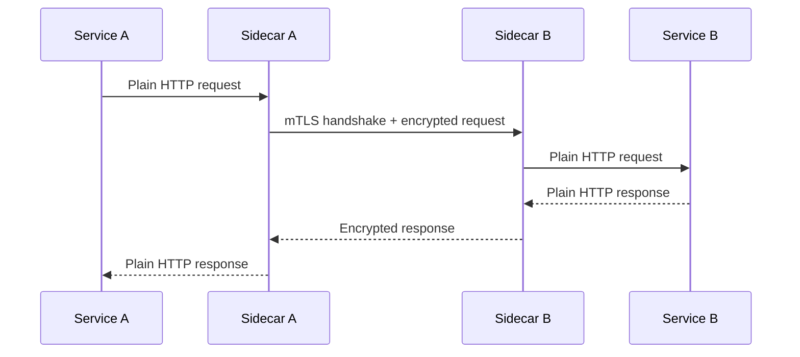

# How to Enable Mutual TLS (mTLS) in Istio

Author: [nawazdhandala](https://github.com/nawazdhandala)

Tags: Istio, mTLS, Security, Kubernetes, Service Mesh

Description: A complete walkthrough for enabling mutual TLS in Istio to encrypt all service-to-service traffic in your Kubernetes cluster.

---

Mutual TLS is one of the biggest reasons teams adopt Istio. Without it, traffic between your services travels in plain text across the cluster network. Anyone who can sniff the network or compromise a node can read every request and response. With mTLS, every connection between services is encrypted and both sides authenticate each other using certificates that Istio manages automatically.

The good news is that Istio makes mTLS surprisingly easy. The slightly bad news is that there are several configuration modes and resources involved, and it is easy to end up in a state where things are half-working.

## How mTLS Works in Istio

Every pod with an Istio sidecar gets a certificate automatically. The sidecar proxy (Envoy) uses this certificate for both client and server authentication. When Service A calls Service B:

1. Service A's sidecar initiates a TLS connection to Service B's sidecar
2. Service B's sidecar presents its certificate
3. Service A's sidecar verifies the certificate against the mesh's root CA
4. Service A's sidecar presents its own certificate
5. Service B's sidecar verifies it
6. The TLS connection is established and both sides know who the other is



The application itself does not need to know about TLS at all. It sends plain HTTP to localhost, and the sidecar handles all the encryption.

## Certificate Management

Istio runs a component called `istiod` that acts as the certificate authority (CA) for the mesh. It:

- Generates a root CA certificate at install time
- Issues short-lived certificates (24 hours by default) to each sidecar
- Automatically rotates certificates before they expire

You do not need to manage certificates manually. This all happens in the background.

Check the current CA certificate:

```bash
kubectl get secret istio-ca-secret -n istio-system -o jsonpath='{.data.ca-cert\.pem}' | base64 -d | openssl x509 -text -noout
```

## Enabling mTLS with PeerAuthentication

The primary resource for configuring mTLS is `PeerAuthentication`. This tells Istio how to handle incoming connections to services.

To enable mTLS mesh-wide in permissive mode (which accepts both mTLS and plain text):

```yaml
apiVersion: security.istio.io/v1
kind: PeerAuthentication
metadata:
  name: default
  namespace: istio-system
spec:
  mtls:
    mode: PERMISSIVE
```

This is actually the default behavior in Istio, so if you have not changed anything, mTLS is already working in permissive mode. Pods with sidecars will use mTLS when talking to other pods with sidecars, and will fall back to plain text when talking to pods without sidecars.

To enable strict mTLS (reject all non-mTLS connections):

```yaml
apiVersion: security.istio.io/v1
kind: PeerAuthentication
metadata:
  name: default
  namespace: istio-system
spec:
  mtls:
    mode: STRICT
```

Apply it:

```bash
kubectl apply -f peer-authentication.yaml
```

## Verifying mTLS is Active

After enabling mTLS, verify that traffic is actually encrypted.

Check the mTLS status of your services:

```bash
istioctl x describe pod <pod-name>
```

This command shows you the mTLS configuration and whether connections to this pod are using mTLS.

You can also check with the proxy-config command:

```bash
istioctl proxy-config cluster <pod-name> --direction inbound -o json | grep transportSocket
```

If mTLS is active, you will see TLS transport socket configuration in the output.

For a quick visual check, use Kiali (Istio's dashboard) if you have it installed. It shows padlock icons on connections that are using mTLS.

## Testing mTLS from a Pod

You can test that mTLS is enforced by trying to make a plain text connection from a pod without a sidecar:

```bash
# Create a pod without sidecar injection
kubectl run test-no-sidecar --image=curlimages/curl --labels="sidecar.istio.io/inject=false" -it --rm -- curl http://my-service.default.svc.cluster.local:8080
```

In PERMISSIVE mode, this will succeed. In STRICT mode, it will fail with a connection error because the service requires mTLS but the pod without a sidecar cannot provide it.

## DestinationRule for Client-Side mTLS

While PeerAuthentication controls the server side (how incoming connections are handled), DestinationRule controls the client side (how outgoing connections are made).

In most cases, Istio handles this automatically with "auto mTLS" - sidecars detect whether the destination has a sidecar and use mTLS accordingly. But you can explicitly configure it:

```yaml
apiVersion: networking.istio.io/v1
kind: DestinationRule
metadata:
  name: default
  namespace: istio-system
spec:
  host: "*.local"
  trafficPolicy:
    tls:
      mode: ISTIO_MUTUAL
```

The `ISTIO_MUTUAL` mode means "use mTLS with Istio-managed certificates." You do not need to specify certificates - Istio handles that.

## Common Issues When Enabling mTLS

**Health checks failing**: If your Kubernetes liveness or readiness probes use HTTP, they come from the kubelet, which does not have an Istio certificate. In STRICT mode, these probes will fail. Istio automatically rewrites probe paths to go through the sidecar, but in some edge cases this does not work. Check if your probes are failing after enabling STRICT mode.

**Non-sidecar services breaking**: If you have services without sidecars (maybe they are in namespaces without injection), they cannot send mTLS traffic. Keep using PERMISSIVE mode for namespaces that contain mixed workloads, or add sidecars to all services before going strict.

**External traffic rejected**: Ingress traffic from an external load balancer typically does not have mTLS certificates. Make sure your ingress gateway handles TLS termination, and the gateway-to-service traffic uses mTLS through the gateway's sidecar.

## Step-by-Step Rollout Plan

Here is a safe way to roll out mTLS across your cluster:

1. Start with the default (PERMISSIVE mode mesh-wide)
2. Verify all services have sidecars injected
3. Check that inter-service traffic is already using mTLS (it should be with auto mTLS)
4. Enable STRICT mode per namespace, starting with non-critical namespaces
5. Monitor for errors after each namespace
6. Once all namespaces are strict, apply STRICT mode mesh-wide

```bash
# Enable strict for a single namespace first
kubectl apply -f - <<EOF
apiVersion: security.istio.io/v1
kind: PeerAuthentication
metadata:
  name: default
  namespace: staging
spec:
  mtls:
    mode: STRICT
EOF
```

Monitor for issues, then repeat for each namespace.

## Checking mTLS Status Across the Mesh

To get a quick overview of mTLS status across all your services:

```bash
istioctl proxy-config all -n default deploy/my-app -o json | grep -c "tlsContext"
```

Or use the Istio dashboard for a graphical view. The key thing is to verify that mTLS is working before you switch to STRICT mode. PERMISSIVE mode with auto mTLS means traffic between sidecar-injected pods is already encrypted - you just have not blocked the fallback to plain text yet.
