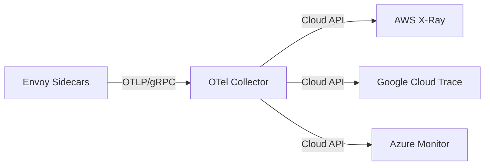

# How to Export Traces from Istio to Cloud Providers

Author: [nawazdhandala](https://github.com/nawazdhandala)

Tags: Istio, Tracing, Cloud Providers, AWS X-Ray, Google Cloud Trace, Azure Monitor

Description: How to export distributed traces from Istio to major cloud provider tracing services including AWS X-Ray, Google Cloud Trace, and Azure Monitor.

---

Running your own tracing infrastructure is great for control, but it's another system to maintain. Cloud providers offer managed tracing services that handle storage, querying, and visualization without the operational burden. AWS X-Ray, Google Cloud Trace, and Azure Monitor all accept trace data from Istio, though the setup for each is a bit different. The OpenTelemetry Collector is the common thread that makes all of these integrations work.

## The Architecture

Rather than configuring Istio to talk directly to cloud provider APIs (which often require authentication and custom protocols), the standard approach is:



The OpenTelemetry Collector handles authentication, protocol translation, and batching. Istio sends traces to the collector using OTLP, and the collector exports them to your cloud provider.

## Common Istio Configuration

Regardless of which cloud provider you're using, the Istio side is the same:

```yaml
apiVersion: install.istio.io/v1alpha1
kind: IstioOperator
spec:
  meshConfig:
    enableTracing: true
    extensionProviders:
      - name: otel
        opentelemetry:
          service: otel-collector.observability.svc.cluster.local
          port: 4317
```

```yaml
apiVersion: telemetry.istio.io/v1
kind: Telemetry
metadata:
  name: cloud-tracing
  namespace: istio-system
spec:
  tracing:
    - providers:
        - name: otel
      randomSamplingPercentage: 5
```

## Exporting to AWS X-Ray

AWS X-Ray expects traces in its own format, but the OTel Collector has a built-in X-Ray exporter that handles the conversion.

### Collector Configuration

```yaml
apiVersion: v1
kind: ConfigMap
metadata:
  name: otel-collector-config
  namespace: observability
data:
  config.yaml: |
    receivers:
      otlp:
        protocols:
          grpc:
            endpoint: 0.0.0.0:4317

    processors:
      batch:
        timeout: 5s
        send_batch_size: 256

    exporters:
      awsxray:
        region: us-east-1
        index_all_attributes: true

    service:
      pipelines:
        traces:
          receivers: [otlp]
          processors: [batch]
          exporters: [awsxray]
```

### IAM Authentication

The collector needs AWS credentials. On EKS, use IAM Roles for Service Accounts (IRSA):

```yaml
apiVersion: v1
kind: ServiceAccount
metadata:
  name: otel-collector
  namespace: observability
  annotations:
    eks.amazonaws.com/role-arn: arn:aws:iam::123456789012:role/otel-collector-xray
```

The IAM role needs these permissions:

```json
{
  "Version": "2012-10-17",
  "Statement": [
    {
      "Effect": "Allow",
      "Action": [
        "xray:PutTraceSegments",
        "xray:PutTelemetryRecords",
        "xray:GetSamplingRules",
        "xray:GetSamplingTargets"
      ],
      "Resource": "*"
    }
  ]
}
```

### Collector Deployment for X-Ray

```yaml
apiVersion: apps/v1
kind: Deployment
metadata:
  name: otel-collector
  namespace: observability
spec:
  replicas: 2
  selector:
    matchLabels:
      app: otel-collector
  template:
    metadata:
      labels:
        app: otel-collector
    spec:
      serviceAccountName: otel-collector
      containers:
        - name: collector
          image: otel/opentelemetry-collector-contrib:0.96.0
          args: ["--config=/conf/config.yaml"]
          ports:
            - containerPort: 4317
          env:
            - name: AWS_REGION
              value: us-east-1
          volumeMounts:
            - name: config
              mountPath: /conf
      volumes:
        - name: config
          configMap:
            name: otel-collector-config
```

## Exporting to Google Cloud Trace

Google Cloud Trace (formerly Stackdriver Trace) works well with GKE clusters.

### Collector Configuration

```yaml
apiVersion: v1
kind: ConfigMap
metadata:
  name: otel-collector-config
  namespace: observability
data:
  config.yaml: |
    receivers:
      otlp:
        protocols:
          grpc:
            endpoint: 0.0.0.0:4317

    processors:
      batch:
        timeout: 5s
        send_batch_size: 256
      resourcedetection:
        detectors: [gcp]
        timeout: 10s

    exporters:
      googlecloud:
        project: my-gcp-project-id
        retry_on_failure:
          enabled: true
          initial_interval: 5s
          max_interval: 30s

    service:
      pipelines:
        traces:
          receivers: [otlp]
          processors: [resourcedetection, batch]
          exporters: [googlecloud]
```

### GKE Workload Identity

On GKE, use Workload Identity for authentication:

```bash
# Create a GCP service account
gcloud iam service-accounts create otel-collector \
  --display-name="OTel Collector for Trace Export"

# Grant Cloud Trace permissions
gcloud projects add-iam-policy-binding my-gcp-project-id \
  --member="serviceAccount:otel-collector@my-gcp-project-id.iam.gserviceaccount.com" \
  --role="roles/cloudtrace.agent"

# Bind to Kubernetes service account
gcloud iam service-accounts add-iam-policy-binding \
  otel-collector@my-gcp-project-id.iam.gserviceaccount.com \
  --role="roles/iam.workloadIdentityUser" \
  --member="serviceAccount:my-gcp-project-id.svc.id.goog[observability/otel-collector]"
```

```yaml
apiVersion: v1
kind: ServiceAccount
metadata:
  name: otel-collector
  namespace: observability
  annotations:
    iam.gke.io/gcp-service-account: otel-collector@my-gcp-project-id.iam.gserviceaccount.com
```

The `resourcedetection` processor automatically adds GCP metadata (project ID, zone, cluster name) to spans.

## Exporting to Azure Monitor

Azure Monitor Application Insights accepts traces through its ingestion endpoint.

### Collector Configuration

```yaml
apiVersion: v1
kind: ConfigMap
metadata:
  name: otel-collector-config
  namespace: observability
data:
  config.yaml: |
    receivers:
      otlp:
        protocols:
          grpc:
            endpoint: 0.0.0.0:4317

    processors:
      batch:
        timeout: 5s
        send_batch_size: 256

    exporters:
      azuremonitor:
        connection_string: ${env:APPLICATIONINSIGHTS_CONNECTION_STRING}

    service:
      pipelines:
        traces:
          receivers: [otlp]
          processors: [batch]
          exporters: [azuremonitor]
```

### Deployment with Connection String

```yaml
apiVersion: apps/v1
kind: Deployment
metadata:
  name: otel-collector
  namespace: observability
spec:
  replicas: 2
  selector:
    matchLabels:
      app: otel-collector
  template:
    metadata:
      labels:
        app: otel-collector
    spec:
      containers:
        - name: collector
          image: otel/opentelemetry-collector-contrib:0.96.0
          args: ["--config=/conf/config.yaml"]
          ports:
            - containerPort: 4317
          env:
            - name: APPLICATIONINSIGHTS_CONNECTION_STRING
              valueFrom:
                secretKeyRef:
                  name: azure-monitor-secret
                  key: connection-string
          volumeMounts:
            - name: config
              mountPath: /conf
      volumes:
        - name: config
          configMap:
            name: otel-collector-config
```

Create the secret:

```bash
kubectl create secret generic azure-monitor-secret \
  -n observability \
  --from-literal=connection-string="InstrumentationKey=your-key;IngestionEndpoint=https://westus2-2.in.applicationinsights.azure.com/"
```

## Multi-Cloud Export

One of the strengths of the OTel Collector is exporting to multiple backends simultaneously:

```yaml
exporters:
  awsxray:
    region: us-east-1
  googlecloud:
    project: my-gcp-project
  otlp/local-jaeger:
    endpoint: jaeger-collector:4317
    tls:
      insecure: true

service:
  pipelines:
    traces:
      receivers: [otlp]
      processors: [batch]
      exporters: [awsxray, googlecloud, otlp/local-jaeger]
```

This sends the same traces to AWS X-Ray, Google Cloud Trace, and a local Jaeger instance. Useful during migrations or in multi-cloud environments.

## Verifying the Export

For each cloud provider, verify traces are arriving:

**AWS X-Ray:**
```bash
aws xray get-trace-summaries \
  --start-time $(date -u -d '5 minutes ago' +%s) \
  --end-time $(date -u +%s)
```

**Google Cloud Trace:**
```bash
gcloud traces list --project=my-gcp-project --limit=5
```

**Azure Monitor:**
Check the Application Insights "Transaction search" blade in the Azure portal.

Also check the collector's own metrics:

```bash
kubectl port-forward svc/otel-collector -n observability 8888:8888
curl http://localhost:8888/metrics | grep otelcol_exporter_sent_spans
```

## Handling Authentication Failures

If traces aren't reaching the cloud provider, check the collector logs:

```bash
kubectl logs deploy/otel-collector -n observability | grep -i "error\|failed\|denied\|unauthorized"
```

Common issues:
- Missing or expired credentials
- Insufficient IAM permissions
- Wrong region or project ID
- Network policies blocking egress to cloud APIs

## Summary

Exporting Istio traces to cloud providers follows a consistent pattern: configure Istio to send OTLP to an OpenTelemetry Collector, then configure the collector with the appropriate exporter for your cloud provider. AWS X-Ray, Google Cloud Trace, and Azure Monitor all have dedicated exporters in the OTel Collector contrib distribution. Use cloud-native authentication methods (IRSA, Workload Identity, managed identity) rather than static credentials, and verify your export pipeline with both collector metrics and cloud provider queries.
