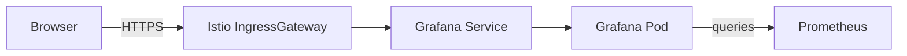

# How to Expose Grafana Through Istio Gateway

Author: [nawazdhandala](https://github.com/nawazdhandala)

Tags: Istio, Grafana, Gateway, Monitoring, Dashboard

Description: How to expose Grafana dashboards through an Istio Gateway with TLS, authentication, and proper configuration for team-wide access.

---

Grafana dashboards are useless if only one person can see them. The default ClusterIP service means you're stuck with port-forwarding, and that doesn't work for wall monitors, shared team dashboards, or on-call engineers who need quick access from their phones.

Exposing Grafana through the Istio IngressGateway gives your whole team access while keeping things secure with TLS and access control. But Grafana has some specific requirements around WebSocket support, URL configuration, and authentication that you need to handle correctly.

## The Setup

Here's what we're building:



Users access Grafana through a domain like `grafana.example.com`. The Istio IngressGateway handles TLS termination and routes traffic to the Grafana service.

## Step 1: Prepare the TLS Certificate

Create a TLS secret. With cert-manager:

```yaml
apiVersion: cert-manager.io/v1
kind: Certificate
metadata:
  name: grafana-tls
  namespace: istio-system
spec:
  secretName: grafana-tls-cert
  issuerRef:
    name: letsencrypt-prod
    kind: ClusterIssuer
  dnsNames:
    - grafana.example.com
```

Or manually:

```bash
kubectl create secret tls grafana-tls-cert \
  --cert=grafana.crt \
  --key=grafana.key \
  -n istio-system
```

## Step 2: Create the Gateway

```yaml
apiVersion: networking.istio.io/v1
kind: Gateway
metadata:
  name: grafana-gateway
  namespace: istio-system
spec:
  selector:
    istio: ingressgateway
  servers:
    - port:
        number: 443
        name: https
        protocol: HTTPS
      tls:
        mode: SIMPLE
        credentialName: grafana-tls-cert
      hosts:
        - "grafana.example.com"
    - port:
        number: 80
        name: http
        protocol: HTTP
      hosts:
        - "grafana.example.com"
```

We include port 80 so we can redirect HTTP to HTTPS.

## Step 3: Create the VirtualService

```yaml
apiVersion: networking.istio.io/v1
kind: VirtualService
metadata:
  name: grafana-vs
  namespace: istio-system
spec:
  hosts:
    - "grafana.example.com"
  gateways:
    - grafana-gateway
  http:
    # Redirect HTTP to HTTPS
    - match:
        - port: 80
      redirect:
        scheme: https
        redirectCode: 301
    # Route HTTPS traffic to Grafana
    - route:
        - destination:
            host: grafana
            port:
              number: 3000
```

Apply both:

```bash
kubectl apply -f grafana-gateway.yaml
kubectl apply -f grafana-vs.yaml
```

## Step 4: Configure Grafana's Root URL

This step is critical. Grafana needs to know its public URL for redirects, WebSocket connections, and OAuth callbacks to work correctly. If you skip this, you'll get broken login flows and CORS errors.

If Grafana was installed as an Istio addon, edit its deployment:

```bash
kubectl edit deployment grafana -n istio-system
```

Add or update these environment variables:

```yaml
env:
  - name: GF_SERVER_ROOT_URL
    value: "https://grafana.example.com"
  - name: GF_SERVER_SERVE_FROM_SUB_PATH
    value: "false"
```

Alternatively, if you installed Grafana with Helm:

```bash
helm upgrade grafana grafana/grafana \
  --namespace istio-system \
  --set "grafana.ini.server.root_url=https://grafana.example.com" \
  --set "grafana.ini.server.serve_from_sub_path=false"
```

## Step 5: Configure Grafana Authentication

### Option A: Grafana's Built-In Auth

Grafana has its own user management. For small teams, this is the simplest approach:

```yaml
env:
  - name: GF_AUTH_ANONYMOUS_ENABLED
    value: "false"
  - name: GF_AUTH_BASIC_ENABLED
    value: "true"
  - name: GF_SECURITY_ADMIN_USER
    value: "admin"
  - name: GF_SECURITY_ADMIN_PASSWORD
    valueFrom:
      secretKeyRef:
        name: grafana-credentials
        key: admin-password
```

Create the credentials secret:

```bash
kubectl create secret generic grafana-credentials \
  --from-literal=admin-password='your-secure-password' \
  -n istio-system
```

### Option B: OIDC Authentication

For larger teams, integrate with your identity provider:

```yaml
env:
  - name: GF_AUTH_GENERIC_OAUTH_ENABLED
    value: "true"
  - name: GF_AUTH_GENERIC_OAUTH_NAME
    value: "SSO"
  - name: GF_AUTH_GENERIC_OAUTH_CLIENT_ID
    value: "grafana"
  - name: GF_AUTH_GENERIC_OAUTH_CLIENT_SECRET
    valueFrom:
      secretKeyRef:
        name: grafana-oauth
        key: client-secret
  - name: GF_AUTH_GENERIC_OAUTH_SCOPES
    value: "openid profile email"
  - name: GF_AUTH_GENERIC_OAUTH_AUTH_URL
    value: "https://auth.example.com/authorize"
  - name: GF_AUTH_GENERIC_OAUTH_TOKEN_URL
    value: "https://auth.example.com/oauth/token"
  - name: GF_AUTH_GENERIC_OAUTH_API_URL
    value: "https://auth.example.com/userinfo"
```

### Option C: Istio-Level Authentication

Use an Istio AuthorizationPolicy to control access at the gateway level:

```yaml
apiVersion: security.istio.io/v1
kind: AuthorizationPolicy
metadata:
  name: grafana-access
  namespace: istio-system
spec:
  selector:
    matchLabels:
      istio: ingressgateway
  action: ALLOW
  rules:
    - from:
        - source:
            remoteIpBlocks:
              - "10.0.0.0/8"
              - "192.168.0.0/16"
      to:
        - operation:
            hosts:
              - "grafana.example.com"
```

You can combine this with Grafana's built-in auth for defense in depth.

## Step 6: Handle WebSocket Connections

Grafana uses WebSockets for live dashboard updates and alerting. The default Istio configuration handles WebSockets correctly through HTTP upgrade, but if you're experiencing issues with live dashboards not updating, verify that the upgrade headers are being passed:

```yaml
apiVersion: networking.istio.io/v1
kind: VirtualService
metadata:
  name: grafana-vs
  namespace: istio-system
spec:
  hosts:
    - "grafana.example.com"
  gateways:
    - grafana-gateway
  http:
    - match:
        - port: 80
      redirect:
        scheme: https
        redirectCode: 301
    - match:
        - headers:
            upgrade:
              exact: websocket
      route:
        - destination:
            host: grafana
            port:
              number: 3000
      timeout: 0s
    - route:
        - destination:
            host: grafana
            port:
              number: 3000
```

The WebSocket route with `timeout: 0s` ensures long-lived WebSocket connections aren't terminated by Istio's default timeout.

## Step 7: Configure DNS

Point your domain to the IngressGateway:

```bash
GATEWAY_IP=$(kubectl get svc istio-ingressgateway -n istio-system \
  -o jsonpath='{.status.loadBalancer.ingress[0].ip}')
echo "Create DNS A record: grafana.example.com -> $GATEWAY_IP"
```

## Step 8: Test the Setup

```bash
# Test HTTPS access
curl -I https://grafana.example.com/api/health

# Expected response:
# HTTP/2 200
# content-type: application/json

# Test HTTP redirect
curl -I http://grafana.example.com
# Expected: 301 redirect to https://
```

Open `https://grafana.example.com` in your browser. You should see the Grafana login page.

## Serving Grafana Under a Sub-Path

If you want to serve Grafana at `https://monitoring.example.com/grafana/` instead of a dedicated subdomain:

```yaml
# Gateway
servers:
  - port:
      number: 443
      name: https
      protocol: HTTPS
    tls:
      mode: SIMPLE
      credentialName: monitoring-tls-cert
    hosts:
      - "monitoring.example.com"

---
# VirtualService
http:
  - match:
      - uri:
          prefix: /grafana
    route:
      - destination:
          host: grafana
          port:
            number: 3000
```

And configure Grafana:

```yaml
env:
  - name: GF_SERVER_ROOT_URL
    value: "https://monitoring.example.com/grafana/"
  - name: GF_SERVER_SERVE_FROM_SUB_PATH
    value: "true"
```

## Persistent Storage for Dashboards

If you're using Grafana seriously (not just the default Istio dashboards), set up persistent storage so your custom dashboards survive pod restarts:

```yaml
apiVersion: v1
kind: PersistentVolumeClaim
metadata:
  name: grafana-storage
  namespace: istio-system
spec:
  accessModes:
    - ReadWriteOnce
  resources:
    requests:
      storage: 5Gi
```

Mount it in the Grafana deployment:

```yaml
volumeMounts:
  - name: grafana-storage
    mountPath: /var/lib/grafana
volumes:
  - name: grafana-storage
    persistentVolumeClaim:
      claimName: grafana-storage
```

## Troubleshooting

**Login page shows but login fails**: Check `GF_SERVER_ROOT_URL`. If it doesn't match the URL in your browser, OAuth callbacks and CSRF protection will break.

**Dashboard loads but data is stale**: WebSocket connections might be dropping. Check the WebSocket route configuration.

**CORS errors in browser console**: Grafana's `GF_SECURITY_ALLOW_EMBEDDING` needs to be `true` if you're embedding dashboards in other pages.

**502 Bad Gateway after login**: Grafana might be running out of memory. Check pod resources:

```bash
kubectl top pods -n istio-system -l app=grafana
```

**Slow dashboard loading**: Prometheus queries might be slow. Check query performance in Prometheus's own UI. Consider adding caching or reducing dashboard time ranges.

Exposing Grafana through Istio Gateway is the standard way to give your team access to dashboards. The key things to get right are the root URL configuration and authentication. Once those are set up, everything else works out of the box.
