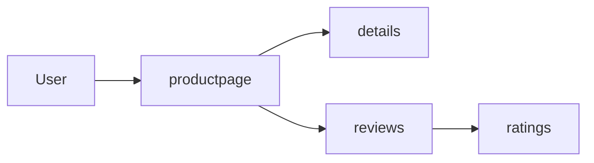

# How to Get Started with Istio's Bookinfo Sample Application

Author: [nawazdhandala](https://github.com/nawazdhandala)

Tags: Istio, Bookinfo, Kubernetes, Tutorial, Service Mesh

Description: A walkthrough of deploying and exploring Istio's Bookinfo sample application to learn traffic routing, observability, and service mesh features.

---

The Bookinfo application is Istio's go-to demo app, and for good reason. It is a realistic microservices application with multiple services, different programming languages, and multiple versions of a service. It is the fastest way to see Istio's features in action without writing any code.

## What is the Bookinfo Application?

Bookinfo is an online bookstore that displays information about a book. It consists of four microservices:

- **productpage** (Python) - The frontend that calls the other services
- **details** (Ruby) - Book details like author and ISBN
- **reviews** (Java) - Book reviews, comes in three versions
- **ratings** (Node.js) - Star ratings for the book

The reviews service has three versions:
- **v1** - No ratings (no stars)
- **v2** - Calls ratings service, shows black stars
- **v3** - Calls ratings service, shows red stars



## Prerequisites

You need a running Istio installation. If you do not have one:

```bash
istioctl install --set profile=demo -y
```

The `demo` profile includes an ingress gateway and enables extra features good for testing.

## Deploying Bookinfo

Create a namespace and enable sidecar injection:

```bash
kubectl create namespace bookinfo
kubectl label namespace bookinfo istio-injection=enabled
```

Deploy the application:

```bash
kubectl apply -n bookinfo -f https://raw.githubusercontent.com/istio/istio/release-1.24/samples/bookinfo/platform/kube/bookinfo.yaml
```

Wait for all pods to be ready:

```bash
kubectl get pods -n bookinfo -w
```

You should see all pods with 2/2 containers (the app container plus the istio-proxy sidecar):

```text
NAME                              READY   STATUS    RESTARTS   AGE
details-v1-5f4d584748-abc12       2/2     Running   0          60s
productpage-v1-6b746f74dc-def34   2/2     Running   0          60s
ratings-v1-b6994bb9-ghi56         2/2     Running   0          60s
reviews-v1-545db77b95-jkl78       2/2     Running   0          60s
reviews-v2-7bf8c9648f-mno90       2/2     Running   0          60s
reviews-v3-84c4fb4b7c-pqr12       2/2     Running   0          60s
```

Verify the services:

```bash
kubectl get svc -n bookinfo
```

## Testing Internal Connectivity

Before setting up ingress, verify the app works internally:

```bash
kubectl exec -n bookinfo deploy/ratings-v1 -c ratings -- \
  curl -s http://productpage.bookinfo:9080/productpage | head -20
```

If you see HTML output, the services are communicating through the mesh.

## Setting Up Ingress

Apply the Bookinfo gateway and virtual service:

```bash
kubectl apply -n bookinfo -f https://raw.githubusercontent.com/istio/istio/release-1.24/samples/bookinfo/networking/bookinfo-gateway.yaml
```

This creates a Gateway and a VirtualService. Check what got created:

```bash
kubectl get gateway -n bookinfo
kubectl get virtualservice -n bookinfo
```

Get the ingress gateway address:

```bash
export INGRESS_HOST=$(kubectl get svc -n istio-system istio-ingressgateway \
  -o jsonpath='{.status.loadBalancer.ingress[0].ip}')
export INGRESS_PORT=$(kubectl get svc -n istio-system istio-ingressgateway \
  -o jsonpath='{.spec.ports[?(@.name=="http2")].port}')
export GATEWAY_URL=${INGRESS_HOST}:${INGRESS_PORT}

echo "http://${GATEWAY_URL}/productpage"
```

Open that URL in your browser. You should see the Bookinfo product page.

Refresh a few times - you will notice the reviews section changes between no stars, black stars, and red stars. That is because Kubernetes is round-robin load balancing across the three versions of the reviews service.

## Applying Destination Rules

Before using advanced routing, apply destination rules that define the subsets (versions):

```bash
kubectl apply -n bookinfo -f https://raw.githubusercontent.com/istio/istio/release-1.24/samples/bookinfo/networking/destination-rule-all.yaml
```

Check what was created:

```bash
kubectl get destinationrules -n bookinfo -o yaml
```

## Routing All Traffic to v1

Pin all traffic to reviews v1 (no ratings):

```yaml
# reviews-v1-only.yaml
apiVersion: networking.istio.io/v1
kind: VirtualService
metadata:
  name: reviews
  namespace: bookinfo
spec:
  hosts:
    - reviews
  http:
    - route:
        - destination:
            host: reviews
            subset: v1
```

```bash
kubectl apply -f reviews-v1-only.yaml
```

Refresh the product page - now you should always see reviews without any stars.

## Header-Based Routing

Route a specific user to reviews v2 while everyone else gets v1:

```yaml
# reviews-user-routing.yaml
apiVersion: networking.istio.io/v1
kind: VirtualService
metadata:
  name: reviews
  namespace: bookinfo
spec:
  hosts:
    - reviews
  http:
    - match:
        - headers:
            end-user:
              exact: jason
      route:
        - destination:
            host: reviews
            subset: v2
    - route:
        - destination:
            host: reviews
            subset: v1
```

```bash
kubectl apply -f reviews-user-routing.yaml
```

On the Bookinfo product page, click "Sign in" and log in as "jason" (any password works). You will see black star ratings. Log out and you are back to no stars.

## Traffic Shifting

Gradually shift traffic from v1 to v3:

```yaml
# reviews-traffic-shift.yaml
apiVersion: networking.istio.io/v1
kind: VirtualService
metadata:
  name: reviews
  namespace: bookinfo
spec:
  hosts:
    - reviews
  http:
    - route:
        - destination:
            host: reviews
            subset: v1
          weight: 75
        - destination:
            host: reviews
            subset: v3
          weight: 25
```

```bash
kubectl apply -f reviews-traffic-shift.yaml
```

Refresh the page multiple times. About 75% of the time you will see no stars (v1), and 25% of the time you will see red stars (v3).

## Fault Injection

Test resilience by injecting a delay to the ratings service for user jason:

```yaml
# ratings-fault-delay.yaml
apiVersion: networking.istio.io/v1
kind: VirtualService
metadata:
  name: ratings
  namespace: bookinfo
spec:
  hosts:
    - ratings
  http:
    - match:
        - headers:
            end-user:
              exact: jason
      fault:
        delay:
          percentage:
            value: 100.0
          fixedDelay: 7s
      route:
        - destination:
            host: ratings
            subset: v1
    - route:
        - destination:
            host: ratings
            subset: v1
```

```bash
kubectl apply -f ratings-fault-delay.yaml
```

When logged in as jason, the reviews section will show an error because the reviews service has a 6-second timeout for calls to ratings. This demonstrates how fault injection helps you test timeout handling.

## Viewing Metrics

If you installed the demo profile, you have access to observability tools. Install the addons:

```bash
kubectl apply -f https://raw.githubusercontent.com/istio/istio/release-1.24/samples/addons/kiali.yaml
kubectl apply -f https://raw.githubusercontent.com/istio/istio/release-1.24/samples/addons/prometheus.yaml
kubectl apply -f https://raw.githubusercontent.com/istio/istio/release-1.24/samples/addons/grafana.yaml
```

Generate some traffic first:

```bash
for i in $(seq 1 100); do
  curl -s -o /dev/null http://${GATEWAY_URL}/productpage
done
```

Open the Kiali dashboard:

```bash
istioctl dashboard kiali
```

You will see a service graph showing how traffic flows between the Bookinfo services, complete with request rates and error percentages.

## Cleaning Up

Remove everything:

```bash
kubectl delete namespace bookinfo
```

Or remove just the Istio configuration while keeping the app:

```bash
kubectl delete virtualservice -n bookinfo --all
kubectl delete destinationrule -n bookinfo --all
kubectl delete gateway -n bookinfo --all
```

## Wrapping Up

The Bookinfo application is the perfect playground for learning Istio. It covers traffic routing, canary deployments, header-based routing, fault injection, and observability - all the features you will use in production. Spend some time experimenting with different VirtualService configurations. The concepts you learn here translate directly to your real applications.
