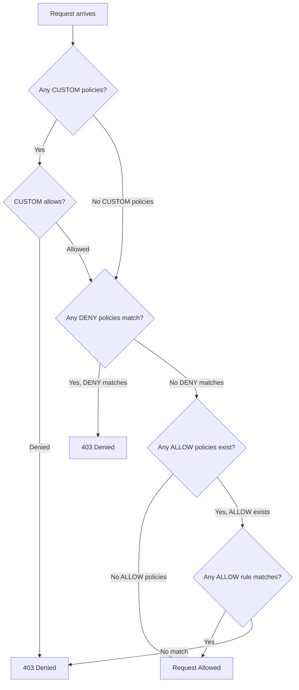

# How to Handle Authorization Policy Ordering and Precedence

Author: [nawazdhandala](https://github.com/nawazdhandala)

Tags: Istio, Authorization, Policy Precedence, Security, Kubernetes

Description: Understanding how Istio evaluates multiple authorization policies, the precedence of DENY, ALLOW, and CUSTOM actions, and avoiding common conflicts.

---

When you have multiple authorization policies in your Istio mesh, things can get confusing fast. Which policy wins? What happens when a DENY and an ALLOW both match the same request? Does the order matter? These questions come up constantly, and getting the answers wrong leads to either security holes or broken services.

## The Evaluation Order

Istio evaluates authorization policies in a strict order based on the action type:

1. **CUSTOM** policies are evaluated first
2. **DENY** policies are evaluated second
3. **ALLOW** policies are evaluated last

This is not configurable. You cannot change the order. It does not matter in which order you applied the policies or what their names are. The action type determines the evaluation order.



## DENY Always Wins Over ALLOW

This is the most important rule. If a DENY policy matches a request, the request is denied. Period. It does not matter if there is an ALLOW policy that also matches. DENY always takes precedence.

Example that demonstrates this:

```yaml
# This ALLOW policy allows everything from the backend namespace
apiVersion: security.istio.io/v1
kind: AuthorizationPolicy
metadata:
  name: allow-backend
  namespace: default
spec:
  selector:
    matchLabels:
      app: my-service
  action: ALLOW
  rules:
  - from:
    - source:
        namespaces:
        - "backend"
---
# This DENY policy blocks DELETE requests
apiVersion: security.istio.io/v1
kind: AuthorizationPolicy
metadata:
  name: deny-delete
  namespace: default
spec:
  selector:
    matchLabels:
      app: my-service
  action: DENY
  rules:
  - to:
    - operation:
        methods:
        - "DELETE"
```

A DELETE request from the `backend` namespace will be denied. Even though the ALLOW policy matches, the DENY policy also matches, and DENY wins.

## The "No ALLOW Policies" Default

Here is something that trips people up regularly. If there are NO ALLOW policies for a workload, all traffic is allowed (assuming no DENY policies block it). But the moment you add a single ALLOW policy, the default flips to deny-all. Only traffic that explicitly matches an ALLOW rule is permitted.

No policies at all:

```text
All traffic -> Allowed (default behavior)
```

One ALLOW policy added:

```text
Traffic matching ALLOW -> Allowed
Everything else -> Denied
```

This is why adding a single authorization policy to one service can suddenly break traffic from other sources. You added an ALLOW for source A, and now source B (which was working before) gets denied.

## Scope Levels: Mesh, Namespace, Workload

Authorization policies exist at three scopes:

**Mesh-level** - Defined in the root namespace (typically `istio-system`) without a `selector`. Applies to all workloads in the mesh.

**Namespace-level** - Defined in a specific namespace without a `selector`. Applies to all workloads in that namespace.

**Workload-level** - Defined with a `selector` that matches specific pods. Applies only to those pods.

All applicable policies at all scope levels are combined and evaluated together. There is no "override" relationship between levels. A namespace-level DENY and a workload-level ALLOW both take effect, and DENY wins.

```yaml
# Namespace-level: deny all by default
apiVersion: security.istio.io/v1
kind: AuthorizationPolicy
metadata:
  name: default-deny
  namespace: production
spec:
  action: ALLOW
  rules: []
---
# Workload-level: allow specific traffic to this service
apiVersion: security.istio.io/v1
kind: AuthorizationPolicy
metadata:
  name: allow-api-traffic
  namespace: production
spec:
  selector:
    matchLabels:
      app: api-server
  action: ALLOW
  rules:
  - from:
    - source:
        namespaces:
        - "gateway"
```

Both policies apply to the `api-server` workload. The namespace-level ALLOW with empty rules denies everything. The workload-level ALLOW permits traffic from the gateway namespace. Since both are ALLOW actions, the rules from both policies are combined. A request matches if it satisfies any rule from any ALLOW policy for that workload.

Wait, that is not quite right. Let me clarify. When multiple ALLOW policies apply to the same workload, Istio combines all their rules. A request is allowed if it matches any rule from any of the ALLOW policies. But the namespace-level policy has an empty rules list (no rules to match), so on its own it denies everything. Combined with the workload-level policy that has a real rule, the request just needs to match that one real rule.

## Multiple ALLOW Policies

When multiple ALLOW policies target the same workload, their rules are effectively ORed:

```yaml
apiVersion: security.istio.io/v1
kind: AuthorizationPolicy
metadata:
  name: allow-policy-1
  namespace: default
spec:
  selector:
    matchLabels:
      app: my-service
  action: ALLOW
  rules:
  - from:
    - source:
        namespaces: ["frontend"]
---
apiVersion: security.istio.io/v1
kind: AuthorizationPolicy
metadata:
  name: allow-policy-2
  namespace: default
spec:
  selector:
    matchLabels:
      app: my-service
  action: ALLOW
  rules:
  - from:
    - source:
        namespaces: ["backend"]
```

Traffic from either `frontend` or `backend` namespaces is allowed. You do not need to combine them into a single policy.

## Multiple DENY Policies

Similarly, multiple DENY policies are evaluated independently. If any DENY policy matches, the request is denied:

```yaml
apiVersion: security.istio.io/v1
kind: AuthorizationPolicy
metadata:
  name: deny-bad-ips
  namespace: default
spec:
  selector:
    matchLabels:
      app: my-service
  action: DENY
  rules:
  - from:
    - source:
        ipBlocks: ["192.0.2.0/24"]
---
apiVersion: security.istio.io/v1
kind: AuthorizationPolicy
metadata:
  name: deny-delete-method
  namespace: default
spec:
  selector:
    matchLabels:
      app: my-service
  action: DENY
  rules:
  - to:
    - operation:
        methods: ["DELETE"]
```

A request is denied if it comes from the bad IP range OR if it uses the DELETE method. Both DENY policies are independently evaluated.

## Common Mistakes

**Mistake 1: Creating an ALLOW policy and breaking existing traffic.**

Before: No policies. Everything works.
After: Added ALLOW for service A. Now service B is broken.
Fix: Add ALLOW rules for service B too, or restructure your policies.

**Mistake 2: Trying to override a DENY with an ALLOW.**

```yaml
# DENY blocks admin from untrusted namespace
# Adding an ALLOW for a specific untrusted service won't help
# DENY always wins
```

Fix: Make the DENY more specific so it does not match the traffic you want to allow. Use `notPrincipals` or `notNamespaces` in the DENY rule.

**Mistake 3: Forgetting about mesh-level policies.**

A mesh-level DENY in `istio-system` affects everything. If someone added a mesh-level policy and you are wondering why your namespace policies are not working, check the root namespace.

```bash
kubectl get authorizationpolicy -n istio-system
```

## Debugging Precedence Issues

Use `istioctl x authz check` to see all policies affecting a workload:

```bash
istioctl x authz check <pod-name> -n <namespace>
```

This shows every policy, its action type, and its rules. You can then mentally walk through the evaluation order: CUSTOM first, DENY second, ALLOW last.

Enable debug logging for detailed evaluation information:

```bash
istioctl proxy-config log <pod-name> --level rbac:debug
```

Then check the logs:

```bash
kubectl logs <pod-name> -c istio-proxy | grep rbac
```

The log will tell you which specific policy and rule matched (or failed to match).

## Best Practice: Keep It Simple

The more policies you have, the harder it is to reason about precedence. Some guidelines:

- Use one ALLOW policy per destination workload when possible
- Use DENY sparingly and make DENY rules very specific
- Avoid mesh-level ALLOW policies (they affect everything and are hard to debug)
- Document why each policy exists with annotations

```yaml
metadata:
  name: payment-service-authz
  namespace: backend
  annotations:
    description: "Allows order-service and refund-service to access payment-service"
```

Understanding policy ordering and precedence is essential for managing Istio authorization at scale. The rules are straightforward once you internalize them: CUSTOM beats DENY beats ALLOW, DENY always wins, and adding the first ALLOW policy flips the default from allow-all to deny-all.
