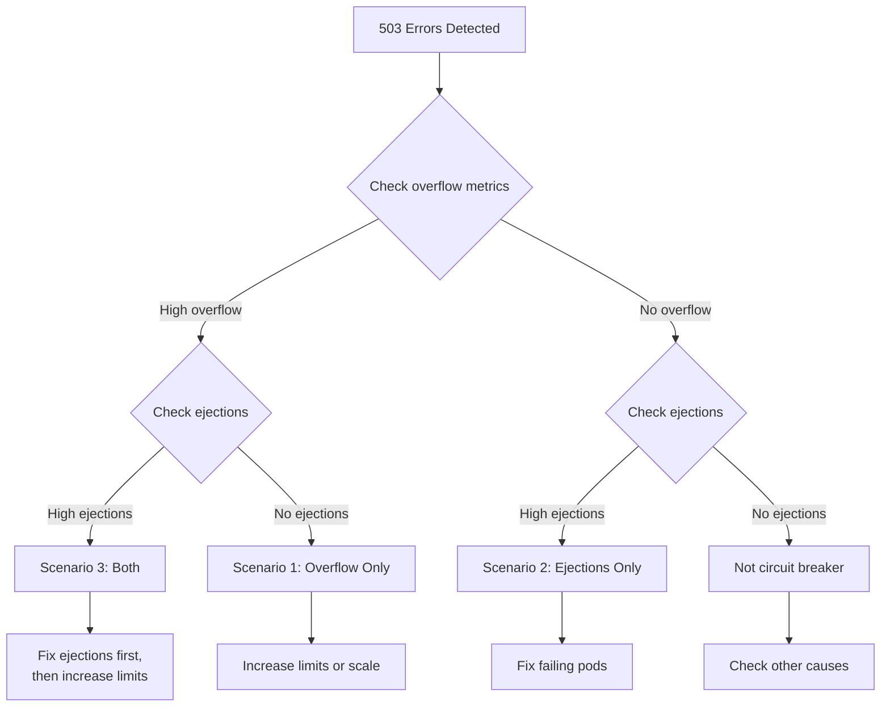

# How to Handle Circuit Breaker Tripping in Production

Author: [nawazdhandala](https://github.com/nawazdhandala)

Tags: Istio, Service Mesh, Circuit Breaking, Production, Incident Response, Kubernetes

Description: Practical runbook for responding when circuit breakers trip in a production Istio service mesh, including diagnosis steps and remediation strategies.

---

Your circuit breaker just tripped in production. Users are seeing 503 errors. The PagerDuty alert is going off. What do you do? This guide is a practical runbook for diagnosing and responding to circuit breaker events in an Istio service mesh.

## First: Confirm the Circuit Breaker Is the Cause

Not all 503 errors come from circuit breaking. Before you start adjusting circuit breaker settings, confirm that is actually what is happening.

```bash
# Check for circuit breaker overflow
kubectl exec deploy/affected-service -c istio-proxy -- \
  curl -s localhost:15000/stats | grep -E "overflow|ejections_active"

# Look at specific metrics
# upstream_rq_pending_overflow > 0 = connection pool circuit breaker tripped
# ejections_active > 0 = outlier detection ejected hosts
```

If `upstream_rq_pending_overflow` is increasing, the connection pool limits are being hit. If `ejections_active` is greater than zero, pods are being ejected by outlier detection. If both are zero, the 503s are coming from somewhere else.

## Scenario 1: Connection Pool Overflow

The connection pool limits (`maxConnections`, `http1MaxPendingRequests`) are being exceeded. This means more traffic is hitting the service than the circuit breaker allows through.

### Diagnosis

```bash
# Check current active connections and requests
kubectl exec deploy/affected-service -c istio-proxy -- \
  curl -s localhost:15000/stats | grep -E "cx_active|rq_active|rq_pending"

# Check the configured limits
kubectl get destinationrule affected-service -o yaml | grep -A 10 connectionPool
```

Compare the active connections/requests against the configured limits. If they are at or near the limit, you have found the problem.

### Immediate Response

**Option A: Increase limits temporarily**

```bash
# Increase limits to stop the bleeding
kubectl patch destinationrule affected-service --type merge -p '
{
  "spec": {
    "trafficPolicy": {
      "connectionPool": {
        "tcp": {"maxConnections": 500},
        "http": {"http1MaxPendingRequests": 200, "http2MaxRequests": 500}
      }
    }
  }
}'
```

**Option B: Scale up the service**

```bash
# Add more pods to handle the load
kubectl scale deployment affected-service --replicas=10
```

**Option C: If it is a traffic spike, wait it out.** Monitor the overflow metric. If it stops increasing, the spike has passed.

### Root Cause Investigation

After the immediate issue is resolved, figure out why the limits were exceeded:

- Was there a legitimate traffic spike? Check your traffic dashboards.
- Did another service start making more calls than usual?
- Did a deployment reduce capacity (fewer pods running)?
- Are retries amplifying the traffic?

## Scenario 2: Outlier Detection Ejections

Pods are being ejected from the load balancing pool because they are returning too many errors.

### Diagnosis

```bash
# How many pods are ejected?
kubectl exec deploy/affected-service -c istio-proxy -- \
  curl -s localhost:15000/stats | grep "ejections_active"

# Which pods are ejected?
kubectl exec deploy/affected-service -c istio-proxy -- \
  curl -s localhost:15000/clusters | grep -B 2 "failed_outlier_check"

# What errors are the pods returning?
kubectl logs deploy/affected-service --tail=50
```

### Immediate Response

**Option A: Fix the underlying issue**

Check the pod logs for the root cause. Common issues:
- Database connection failures
- Out of memory
- Downstream service unavailable
- Configuration errors after a deployment

**Option B: Temporarily increase the error threshold**

If the errors are expected (for example, during a known maintenance window):

```bash
kubectl patch destinationrule affected-service --type merge -p '
{
  "spec": {
    "trafficPolicy": {
      "outlierDetection": {
        "consecutive5xxErrors": 20
      }
    }
  }
}'
```

This raises the threshold so pods are not ejected as easily. Remember to revert this after the maintenance window.

**Option C: Restart the failing pods**

```bash
# Delete the failing pods so Kubernetes recreates them
kubectl delete pod -l app=affected-service
```

This is a blunt instrument but sometimes effective, especially for memory leaks or corrupted state.

## Scenario 3: Both Overflow and Ejections

This is the worst case. Pods are being ejected, which reduces capacity, which causes the remaining pods to hit connection limits, which causes overflow.

### Decision Flow



### Immediate Response

1. First, address the ejections. Either fix the failing pods or temporarily relax the outlier detection settings.
2. Then, address the overflow. Temporarily increase connection limits.
3. Scale up the service to restore capacity.

```bash
# Step 1: Relax outlier detection temporarily
kubectl patch destinationrule affected-service --type merge -p '
{
  "spec": {
    "trafficPolicy": {
      "outlierDetection": {
        "consecutive5xxErrors": 10,
        "maxEjectionPercent": 20
      }
    }
  }
}'

# Step 2: Increase connection limits
kubectl patch destinationrule affected-service --type merge -p '
{
  "spec": {
    "trafficPolicy": {
      "connectionPool": {
        "tcp": {"maxConnections": 500},
        "http": {"http1MaxPendingRequests": 200}
      }
    }
  }
}'

# Step 3: Scale up
kubectl scale deployment affected-service --replicas=10
```

## Scenario 4: Circuit Breaker Tripping During Deployments

This is common and usually not a real problem. During rolling deployments, old pods terminate while new pods start up. The brief capacity reduction can trigger circuit breakers.

### Prevention

Add a preStop hook to drain connections before termination:

```yaml
apiVersion: apps/v1
kind: Deployment
metadata:
  name: my-service
spec:
  template:
    spec:
      containers:
        - name: my-service
          lifecycle:
            preStop:
              exec:
                command: ["/bin/sh", "-c", "sleep 10"]
```

And make sure your outlier detection is not too sensitive:

```yaml
outlierDetection:
  consecutive5xxErrors: 5   # Not too aggressive
  baseEjectionTime: 15s     # Short ejection during deployments
  maxEjectionPercent: 30    # Do not eject too many during reduced capacity
```

## Post-Incident: Adjusting Settings

After handling the immediate issue, review and adjust your circuit breaker settings:

```bash
# Gather data from the incident
# How many requests were rejected?
kubectl exec deploy/affected-service -c istio-proxy -- \
  curl -s localhost:15000/stats | grep "pending_overflow"

# What was the peak traffic during the incident?
# (Check your Prometheus/Grafana dashboards for this timeframe)

# How long were pods ejected?
kubectl exec deploy/affected-service -c istio-proxy -- \
  curl -s localhost:15000/stats | grep "ejections_total"
```

Then update your DestinationRule with settings that would have handled the incident better:

```yaml
apiVersion: networking.istio.io/v1beta1
kind: DestinationRule
metadata:
  name: affected-service
  namespace: production
spec:
  host: affected-service
  trafficPolicy:
    connectionPool:
      tcp:
        maxConnections: 300    # Adjusted based on incident peak
      http:
        http1MaxPendingRequests: 150
        http2MaxRequests: 600
    outlierDetection:
      consecutive5xxErrors: 3
      interval: 10s
      baseEjectionTime: 30s
      maxEjectionPercent: 40
      minHealthPercent: 30
```

## Quick Reference: Emergency Commands

Keep these handy for when things go wrong:

```bash
# Check circuit breaker status
kubectl exec deploy/SERVICE -c istio-proxy -- curl -s localhost:15000/stats | grep -E "overflow|ejections"

# Temporarily disable circuit breaking
kubectl delete destinationrule SERVICE

# Temporarily disable outlier detection only
kubectl patch dr SERVICE --type merge -p '{"spec":{"trafficPolicy":{"outlierDetection":{"consecutive5xxErrors":999}}}}'

# Scale up the service
kubectl scale deploy SERVICE --replicas=N

# Check which pods are ejected
kubectl exec deploy/SERVICE -c istio-proxy -- curl -s localhost:15000/clusters | grep failed_outlier
```

The most important thing when circuit breakers trip in production is to stay calm and be methodical. Confirm the circuit breaker is the cause, identify which type of circuit breaking is happening, apply the appropriate fix, and follow up with better settings after the dust settles.
