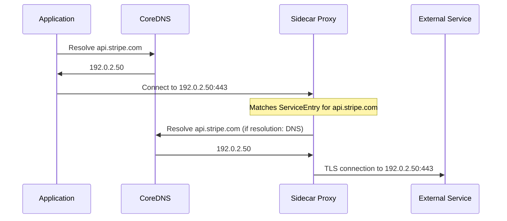

# How to Handle DNS Resolution for External Services in Istio

Author: [nawazdhandala](https://github.com/nawazdhandala)

Tags: Istio, DNS, Egress, ServiceEntry, Service Mesh

Description: How DNS resolution works for external services in Istio and how to configure resolution strategies for reliable egress connectivity.

---

DNS resolution for external services in Istio is one of those things that works transparently until it doesn't. Understanding how the sidecar proxy resolves hostnames for external services helps you troubleshoot connectivity issues and choose the right configuration for your setup.

This guide explains how DNS works in the context of Istio egress traffic, the different resolution strategies available, and common problems you will encounter.

## How DNS Works in an Istio Pod

When a pod in the mesh makes a request to an external hostname like `api.stripe.com`, several things happen:

1. The application does a DNS lookup for `api.stripe.com`
2. The DNS query goes to the kube-dns/CoreDNS service (or whatever DNS is configured in the pod)
3. CoreDNS resolves it (possibly forwarding to an upstream DNS server)
4. The application gets back an IP address and initiates a connection
5. The sidecar proxy intercepts the outbound connection
6. The sidecar checks its routing table to decide how to handle the traffic

Here is the important part: DNS resolution happens in the application, but routing happens in the sidecar. These are independent processes. The sidecar might resolve the hostname again depending on the ServiceEntry's `resolution` setting.



## ServiceEntry Resolution Strategies

The `resolution` field in a ServiceEntry tells Istio how to determine the IP address(es) for the external service:

### resolution: DNS

```yaml
apiVersion: networking.istio.io/v1
kind: ServiceEntry
metadata:
  name: stripe-api
spec:
  hosts:
  - "api.stripe.com"
  ports:
  - number: 443
    name: https
    protocol: TLS
  resolution: DNS
  location: MESH_EXTERNAL
```

With `DNS` resolution, the sidecar proxy resolves the hostname using DNS when it needs to establish a connection. It caches the result based on the DNS TTL. This is the most common setting for external services accessed by hostname.

**When to use:** Single-host external services with stable DNS.

**Tradeoffs:** DNS lookups add a small amount of latency. The sidecar caches results, but cache invalidation depends on TTL.

### resolution: STATIC

```yaml
apiVersion: networking.istio.io/v1
kind: ServiceEntry
metadata:
  name: on-prem-db
spec:
  hosts:
  - "on-prem-database.local"
  addresses:
  - "10.0.5.100/32"
  ports:
  - number: 5432
    name: tcp-postgres
    protocol: TCP
  resolution: STATIC
  location: MESH_EXTERNAL
  endpoints:
  - address: 10.0.5.100
  - address: 10.0.5.101
```

With `STATIC` resolution, you explicitly list the IP addresses. The sidecar does not do any DNS lookup. It uses the addresses you provide.

**When to use:** Services with known, stable IP addresses. On-premises systems. Services you access by IP.

**Tradeoffs:** You need to update the ServiceEntry when IP addresses change. No automatic failover to new IPs.

### resolution: NONE

```yaml
apiVersion: networking.istio.io/v1
kind: ServiceEntry
metadata:
  name: wildcard-aws
spec:
  hosts:
  - "*.amazonaws.com"
  ports:
  - number: 443
    name: https
    protocol: TLS
  resolution: NONE
  location: MESH_EXTERNAL
```

With `NONE` resolution, the sidecar does not resolve the hostname at all. It uses the IP address that the application resolved via DNS. The sidecar just matches the traffic based on the original destination IP and passes it through.

**When to use:** Wildcard hosts (required). Services where DNS resolution must happen at the application level. Cases where you don't want the sidecar to do its own DNS resolution.

**Tradeoffs:** The sidecar cannot do load balancing across multiple IPs because it doesn't know about them. Less control over connection routing.

## DNS Proxy in Istio

Starting with Istio 1.13+, Istio includes a DNS proxy feature in the sidecar that intercepts DNS queries from the application. This enables the sidecar to resolve hostnames for ServiceEntry hosts directly, without relying on the upstream DNS server.

Check if DNS proxy is enabled:

```bash
kubectl get configmap istio -n istio-system -o yaml | grep proxyMetadata -A5
```

Enable it in the mesh config:

```yaml
apiVersion: install.istio.io/v1alpha1
kind: IstioOperator
spec:
  meshConfig:
    defaultConfig:
      proxyMetadata:
        ISTIO_META_DNS_CAPTURE: "true"
        ISTIO_META_DNS_AUTO_ALLOCATE: "true"
```

With DNS proxy enabled:

- The sidecar intercepts DNS queries from the application
- For hosts defined in ServiceEntry resources, the sidecar responds directly
- For other hosts, it forwards the query to the upstream DNS server
- `DNS_AUTO_ALLOCATE` assigns virtual IPs to ServiceEntry hosts, which helps with TCP traffic routing

This is especially useful for ServiceEntry hosts that don't have real IP addresses or when you need the sidecar to route TCP traffic by hostname.

## DNS Auto-Allocation

When `ISTIO_META_DNS_AUTO_ALLOCATE` is enabled, Istio assigns virtual IP addresses (from the 240.240.0.0/16 range) to ServiceEntry hosts. This solves a tricky problem:

Without auto-allocation, if your application resolves `api.stripe.com` to `192.0.2.50`, the sidecar intercepts a connection to `192.0.2.50:443`. For HTTP/TLS traffic, the sidecar can match on the Host header or SNI. But for plain TCP traffic, there is no hostname in the packet. The sidecar can only match on the IP address, and it might not know that `192.0.2.50` corresponds to `api.stripe.com`.

With auto-allocation, the DNS proxy returns a virtual IP (like `240.240.0.1`) for `api.stripe.com`. The application connects to `240.240.0.1:443`. The sidecar knows exactly which ServiceEntry this corresponds to and routes it correctly. The actual DNS resolution happens at the sidecar level when it connects to the real external service.

## Troubleshooting DNS Issues

### External Service Not Reachable

Check if DNS resolution works from the pod:

```bash
kubectl exec deploy/my-app -- nslookup api.stripe.com
```

Check if the sidecar knows about the service:

```bash
istioctl proxy-config clusters deploy/my-app | grep stripe
```

If the cluster shows up but the service is not reachable, check the endpoints:

```bash
istioctl proxy-config endpoints deploy/my-app --cluster "outbound|443||api.stripe.com"
```

### DNS Resolution Returns Wrong IP

If you are using `resolution: DNS` and the sidecar resolves to a different IP than the application, it might be due to DNS caching. The sidecar caches DNS results independently from the application. Force a refresh by restarting the pod or checking the TTL.

### Wildcard ServiceEntry Not Working

If `*.example.com` is not matching requests, verify you are using `resolution: NONE`:

```bash
kubectl get serviceentry wildcard-example -o yaml
```

Also verify that DNS proxy is enabled if you need the sidecar to handle DNS for wildcard entries:

```bash
istioctl proxy-config bootstrap deploy/my-app -o json | grep DNS
```

### DNS Timeouts

If DNS queries are slow or timing out, check CoreDNS:

```bash
kubectl logs -n kube-system deploy/coredns --tail=20
```

If the DNS proxy is causing issues, you can disable it for specific pods:

```yaml
metadata:
  annotations:
    proxy.istio.io/config: |
      proxyMetadata:
        ISTIO_META_DNS_CAPTURE: "false"
```

## DNS and REGISTRY_ONLY Mode

In REGISTRY_ONLY mode, DNS resolution still works for all hostnames. The restriction is at the connection level, not the DNS level. A pod can resolve `blocked-service.com` to an IP address, but when it tries to connect, the sidecar blocks the connection because there is no ServiceEntry for it.

This matters because some applications check connectivity by doing DNS lookups. They might report the service as reachable (DNS succeeds) when it will actually be blocked at the connection level.

## DNS for ServiceEntry with Multiple Ports

When a ServiceEntry has multiple ports, DNS resolution applies to all of them:

```yaml
apiVersion: networking.istio.io/v1
kind: ServiceEntry
metadata:
  name: multi-port-service
spec:
  hosts:
  - "service.external.com"
  ports:
  - number: 80
    name: http
    protocol: HTTP
  - number: 443
    name: https
    protocol: TLS
  - number: 8080
    name: http-alt
    protocol: HTTP
  resolution: DNS
  location: MESH_EXTERNAL
```

The sidecar resolves `service.external.com` once and uses the result for all ports. If the service uses different IP addresses for different ports (unusual but possible), you would need separate ServiceEntry resources.

## Best Practices

1. **Use `resolution: DNS` for most external services.** It is the most flexible and handles IP changes automatically.

2. **Use `resolution: STATIC` for stable IP services.** This avoids DNS dependency and gives you explicit control.

3. **Use `resolution: NONE` for wildcards.** It is the only option that works with wildcard hosts.

4. **Enable DNS proxy for TCP services.** Auto-allocation helps the sidecar route TCP traffic correctly to ServiceEntry hosts.

5. **Monitor DNS latency.** Slow DNS can impact egress connection setup times. Use Envoy's DNS stats:

```bash
kubectl exec deploy/my-app -c istio-proxy -- curl -s localhost:15000/stats | grep dns
```

6. **Set reasonable DNS TTLs.** Envoy respects the DNS TTL for caching. If the external service has a very short TTL (like 5 seconds), the sidecar will be doing frequent DNS lookups. If it has a very long TTL (like 24 hours), IP changes won't be picked up quickly.

## Summary

DNS resolution for external services in Istio depends on the `resolution` setting in your ServiceEntry. Use `DNS` for hostname-based services, `STATIC` for IP-based services, and `NONE` for wildcards. Enable the Istio DNS proxy with auto-allocation for better TCP routing support. When troubleshooting connectivity issues, check both DNS resolution (from the application level) and sidecar routing (using `istioctl proxy-config`) since they are independent processes that both need to be working correctly.
