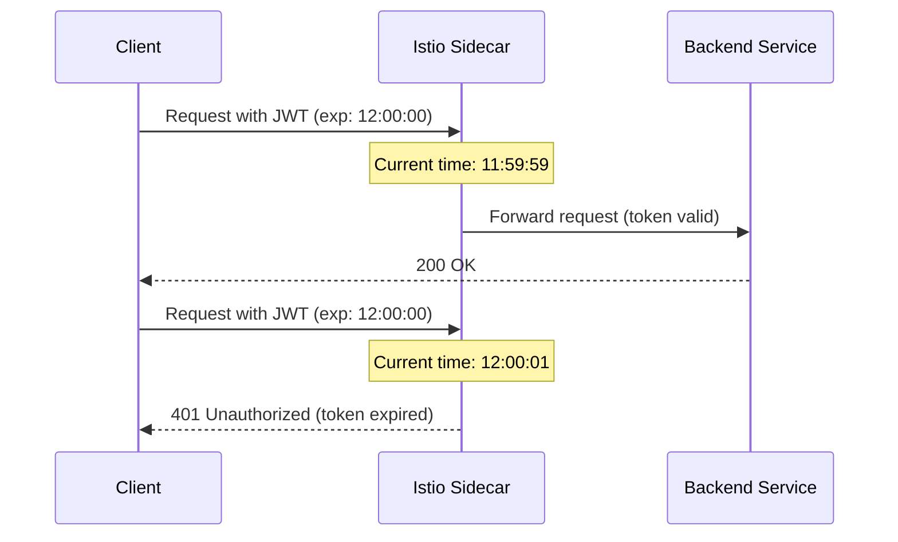

# How to Handle JWT Token Refresh with Istio

Author: [nawazdhandala](https://github.com/nawazdhandala)

Tags: Istio, JWT, Token Refresh, Authentication, OAuth

Description: How to handle JWT token expiration and refresh flows when using Istio for request authentication and what happens during token transitions.

---

JWTs expire. That's by design - short-lived tokens limit the window of exposure if a token gets stolen. But token expiration creates challenges in a service mesh. What happens when a token expires mid-request? How should clients handle refresh? And how does Istio's JWKS caching interact with key rotation? Here's what you need to know.

## How Token Expiration Works in Istio

When a request arrives with a JWT, the Envoy proxy checks the `exp` (expiration) claim. If the current time is past the expiration, the proxy returns 401 Unauthorized. There's no built-in grace period or tolerance for clock skew.

The timeline looks like this:



## Istio Does Not Handle Refresh

An important point: Istio does not perform token refresh. It's a token validator, not an OAuth client. The refresh flow is entirely the responsibility of the client application. Istio's role is:

- Accept valid tokens.
- Reject expired or invalid tokens.
- That's it.

## Client-Side Refresh Strategies

### Strategy 1: Proactive Refresh

The client tracks token expiration and refreshes before the token expires:

```python
import time
import requests

class TokenManager:
    def __init__(self, token_url, client_id, client_secret):
        self.token_url = token_url
        self.client_id = client_id
        self.client_secret = client_secret
        self.token = None
        self.expires_at = 0

    def get_token(self):
        # Refresh if token expires within 30 seconds
        if time.time() > self.expires_at - 30:
            self._refresh()
        return self.token

    def _refresh(self):
        response = requests.post(self.token_url, data={
            'grant_type': 'client_credentials',
            'client_id': self.client_id,
            'client_secret': self.client_secret
        })
        data = response.json()
        self.token = data['access_token']
        self.expires_at = time.time() + data['expires_in']
```

This is the preferred approach. Requests never fail due to expired tokens because the client always has a fresh one.

### Strategy 2: Reactive Refresh (Retry on 401)

The client uses the token until it gets a 401, then refreshes and retries:

```python
def make_request(url, token_manager):
    headers = {'Authorization': f'Bearer {token_manager.get_token()}'}
    response = requests.get(url, headers=headers)

    if response.status_code == 401:
        # Token expired, refresh and retry
        token_manager.force_refresh()
        headers = {'Authorization': f'Bearer {token_manager.get_token()}'}
        response = requests.get(url, headers=headers)

    return response
```

This works but adds latency when the token expires because the first request fails and needs to be retried.

### Strategy 3: Background Refresh

A background thread or goroutine periodically refreshes the token:

```go
type TokenRefresher struct {
    mu        sync.RWMutex
    token     string
    expiresAt time.Time
}

func (tr *TokenRefresher) Start(tokenURL, clientID, clientSecret string) {
    go func() {
        for {
            tr.refresh(tokenURL, clientID, clientSecret)
            tr.mu.RLock()
            sleepDuration := time.Until(tr.expiresAt) - 30*time.Second
            tr.mu.RUnlock()
            if sleepDuration < 10*time.Second {
                sleepDuration = 10 * time.Second
            }
            time.Sleep(sleepDuration)
        }
    }()
}

func (tr *TokenRefresher) GetToken() string {
    tr.mu.RLock()
    defer tr.mu.RUnlock()
    return tr.token
}
```

## Token Lifetime Recommendations

The right token lifetime depends on your use case:

| Use Case | Recommended Lifetime | Why |
|----------|---------------------|-----|
| Browser SPA | 15-60 minutes | Short to limit exposure if XSS steals the token |
| Mobile app | 1-24 hours | Longer because tokens are stored more securely |
| Service-to-service | 5-60 minutes | Short because refresh is automated and cheap |
| CI/CD pipeline | Minutes | Just long enough for the pipeline run |

In Istio, shorter tokens are generally better because the sidecar validates every request. There's no session state to manage.

## Handling Token Transition Windows

When a client refreshes its token, there's a brief window where it might have two valid tokens: the old one (still not expired) and the new one. Both are valid from Istio's perspective because both pass signature and expiration checks.

This is fine and expected. The old token continues to work until it expires. No special handling is needed.

## JWKS Key Rotation and Refresh

Key rotation is different from token refresh but related. When the identity provider rotates signing keys:

1. New tokens are signed with the new key.
2. Old tokens (still in use, not yet expired) were signed with the old key.

Istio's JWKS cache needs to include both keys during the transition. Envoy refreshes the JWKS approximately every 5 minutes. The identity provider should:

1. Add the new key to the JWKS endpoint.
2. Wait for caches to refresh (at least 10 minutes).
3. Start signing tokens with the new key.
4. Keep the old key in JWKS until all old tokens expire.
5. Remove the old key from JWKS.

If the old key is removed too soon, clients with still-valid tokens signed by the old key will get 401 errors even though their tokens haven't expired.

## Configuring Istio for Smooth Refresh

There's not much to configure on the Istio side for token refresh, but a few settings help:

### Forward the Token

If your backend needs to refresh tokens or needs the original token for downstream calls:

```yaml
apiVersion: security.istio.io/v1
kind: RequestAuthentication
metadata:
  name: jwt-auth
  namespace: backend
spec:
  jwtRules:
    - issuer: "https://auth.example.com"
      jwksUri: "https://auth.example.com/.well-known/jwks.json"
      forwardOriginalToken: true
```

### Output Claims for Backend Use

If the backend needs to know when the token expires (to trigger a refresh):

```yaml
jwtRules:
  - issuer: "https://auth.example.com"
    jwksUri: "https://auth.example.com/.well-known/jwks.json"
    outputPayloadToHeader: x-jwt-payload
```

The backend can read the `exp` claim from the forwarded payload.

## Handling Refresh Token Endpoints

If your API includes a token refresh endpoint (`/auth/refresh`), make sure it's accessible without a valid access token:

```yaml
# Allow the refresh endpoint without JWT
apiVersion: security.istio.io/v1
kind: AuthorizationPolicy
metadata:
  name: allow-token-refresh
  namespace: backend
spec:
  selector:
    matchLabels:
      app: api-gateway
  action: ALLOW
  rules:
    - to:
        - operation:
            paths: ["/auth/refresh", "/auth/token"]
            methods: ["POST"]
```

The refresh endpoint typically receives a refresh token (which is NOT a JWT that Istio validates) and returns a new access token.

## Monitoring Token Expiration

Track token-related 401 rates to spot refresh issues:

```bash
# Check JWT-related stats
kubectl exec <pod> -c istio-proxy -- curl -s localhost:15000/stats | grep jwt_authn

# Check for 401 spikes
kubectl exec <pod> -c istio-proxy -- curl -s localhost:15000/stats | grep "downstream_rq_4xx"
```

A sudden increase in 401s might indicate:
- Client refresh logic isn't working.
- Clock skew between the token issuer and Kubernetes nodes.
- JWKS key rotation gone wrong.

## Testing Token Expiration

Generate a short-lived token for testing:

```bash
# Create a token that expires in 30 seconds
# (This depends on your auth provider's configuration)

# Then watch it expire
for i in $(seq 1 10); do
  sleep 5
  STATUS=$(kubectl exec deploy/sleep -c sleep -- curl -s -o /dev/null -w "%{http_code}" \
    -H "Authorization: Bearer $TOKEN" \
    http://api-server.backend:8080/api/data)
  echo "Attempt $i: $STATUS"
done
```

You should see 200 responses that eventually turn into 401s once the token expires.

Token refresh is a client-side concern that Istio doesn't manage. Design your clients to proactively refresh tokens before expiration, handle 401 responses with retry logic, and coordinate with your identity provider on key rotation schedules. Istio's role is simply to validate whatever token it receives at the moment of each request.
