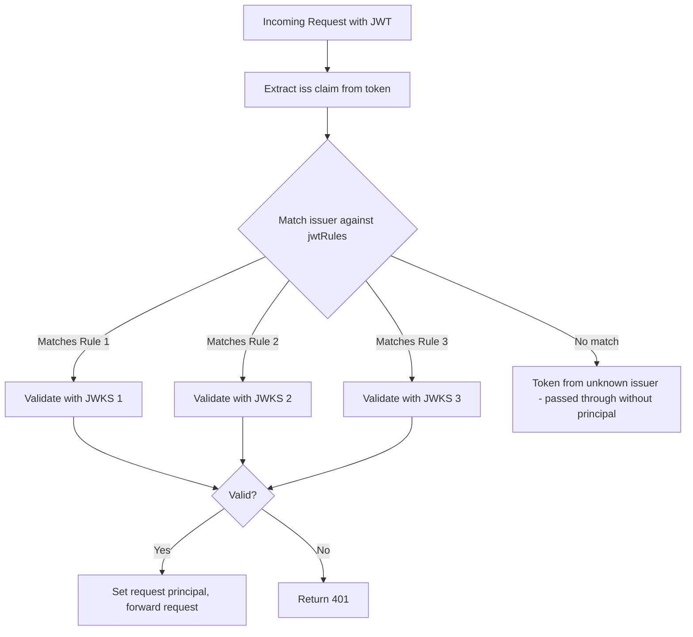

# How to Handle Multiple JWT Providers in Istio

Author: [nawazdhandala](https://github.com/nawazdhandala)

Tags: Istio, JWT, Multiple Providers, RequestAuthentication, Authentication

Description: How to configure Istio to accept and validate JWT tokens from multiple identity providers simultaneously using RequestAuthentication.

---

Most production systems don't rely on a single identity provider. You might have Auth0 for customer-facing APIs, Keycloak for internal services, and Google service accounts for GCP integrations. Istio handles this well - you can configure multiple JWT providers in a single RequestAuthentication resource, and the proxy figures out which one to use based on the token's issuer claim.

## How Multiple Providers Work

When you list multiple entries in `jwtRules`, Istio matches incoming tokens by their `iss` (issuer) claim. The proxy extracts the issuer from the JWT payload, finds the matching rule, and validates the token against that rule's JWKS.



## Configuring Multiple Providers

Here's a RequestAuthentication with three different providers:

```yaml
apiVersion: security.istio.io/v1
kind: RequestAuthentication
metadata:
  name: multi-provider-auth
  namespace: backend
spec:
  selector:
    matchLabels:
      app: api-server
  jwtRules:
    # Auth0 for customer-facing authentication
    - issuer: "https://mycompany.auth0.com/"
      jwksUri: "https://mycompany.auth0.com/.well-known/jwks.json"
      audiences:
        - "https://api.mycompany.com"

    # Keycloak for internal service authentication
    - issuer: "https://keycloak.internal.mycompany.com/realms/services"
      jwksUri: "http://keycloak.auth.svc.cluster.local:8080/realms/services/protocol/openid-connect/certs"
      audiences:
        - "internal-api"

    # Google service accounts for GCP integrations
    - issuer: "https://accounts.google.com"
      jwksUri: "https://www.googleapis.com/oauth2/v3/certs"
      audiences:
        - "mycompany-api"
```

Apply it:

```bash
kubectl apply -f multi-provider-auth.yaml
```

## Each Provider Gets Its Own Settings

Each `jwtRules` entry is independent. You can configure different audiences, token locations, and forwarding behavior for each:

```yaml
apiVersion: security.istio.io/v1
kind: RequestAuthentication
metadata:
  name: multi-provider-custom
  namespace: backend
spec:
  selector:
    matchLabels:
      app: api-server
  jwtRules:
    # Auth0 - standard Authorization header
    - issuer: "https://mycompany.auth0.com/"
      jwksUri: "https://mycompany.auth0.com/.well-known/jwks.json"
      audiences:
        - "https://api.mycompany.com"
      forwardOriginalToken: true

    # Internal service - custom header
    - issuer: "https://keycloak.internal.mycompany.com/realms/services"
      jwksUri: "http://keycloak.auth.svc.cluster.local:8080/realms/services/protocol/openid-connect/certs"
      fromHeaders:
        - name: x-internal-token
      forwardOriginalToken: false

    # Google - query parameter for webhook callbacks
    - issuer: "https://accounts.google.com"
      jwksUri: "https://www.googleapis.com/oauth2/v3/certs"
      fromParams:
        - "google_token"
```

## Authorization Based on Provider

Once tokens are validated, you can write AuthorizationPolicies that differentiate between providers. The `requestPrincipal` is formatted as `<issuer>/<subject>`:

```yaml
# Allow Auth0 users to access the user-facing API
apiVersion: security.istio.io/v1
kind: AuthorizationPolicy
metadata:
  name: allow-auth0-users
  namespace: backend
spec:
  selector:
    matchLabels:
      app: api-server
  action: ALLOW
  rules:
    - from:
        - source:
            requestPrincipals:
              - "https://mycompany.auth0.com//*"
      to:
        - operation:
            paths: ["/api/v1/*"]
---
# Allow Keycloak service accounts to access internal endpoints
apiVersion: security.istio.io/v1
kind: AuthorizationPolicy
metadata:
  name: allow-internal-services
  namespace: backend
spec:
  selector:
    matchLabels:
      app: api-server
  action: ALLOW
  rules:
    - from:
        - source:
            requestPrincipals:
              - "https://keycloak.internal.mycompany.com/realms/services/*"
      to:
        - operation:
            paths: ["/internal/*"]
---
# Allow Google service accounts for webhooks
apiVersion: security.istio.io/v1
kind: AuthorizationPolicy
metadata:
  name: allow-google-webhooks
  namespace: backend
spec:
  selector:
    matchLabels:
      app: api-server
  action: ALLOW
  rules:
    - from:
        - source:
            requestPrincipals:
              - "https://accounts.google.com/*"
      to:
        - operation:
            paths: ["/webhooks/*"]
```

## Request Principal Format

The `requestPrincipal` that Istio sets after successful JWT validation follows this format:

```text
<issuer>/<subject>
```

Where `<subject>` is the `sub` claim from the JWT. For example:

- Auth0: `https://mycompany.auth0.com//auth0|user123` (note the double slash because Auth0 issuer has trailing slash)
- Keycloak: `https://keycloak.internal.mycompany.com/realms/services/service-account-name`
- Google: `https://accounts.google.com/1234567890`

You can use wildcards in AuthorizationPolicy to match all subjects from a given issuer: `https://mycompany.auth0.com//*`

## Multiple RequestAuthentication Resources

Instead of putting all providers in one RequestAuthentication, you can create separate ones:

```yaml
apiVersion: security.istio.io/v1
kind: RequestAuthentication
metadata:
  name: auth0-jwt
  namespace: backend
spec:
  selector:
    matchLabels:
      app: api-server
  jwtRules:
    - issuer: "https://mycompany.auth0.com/"
      jwksUri: "https://mycompany.auth0.com/.well-known/jwks.json"
---
apiVersion: security.istio.io/v1
kind: RequestAuthentication
metadata:
  name: keycloak-jwt
  namespace: backend
spec:
  selector:
    matchLabels:
      app: api-server
  jwtRules:
    - issuer: "https://keycloak.internal.mycompany.com/realms/services"
      jwksUri: "http://keycloak.auth.svc.cluster.local:8080/realms/services/protocol/openid-connect/certs"
```

Both RequestAuthentication resources apply to the same workload. Istio merges the JWT rules. This approach is useful when different teams manage different providers.

## Handling Unknown Issuers

If a token arrives with an issuer that doesn't match any configured rule, Istio treats it as if no token was provided. The request passes through without a request principal. If you have an AuthorizationPolicy requiring a principal, those requests get denied.

To explicitly reject tokens with unknown issuers, you don't need to do anything special - just make sure your AuthorizationPolicy requires a valid principal:

```yaml
apiVersion: security.istio.io/v1
kind: AuthorizationPolicy
metadata:
  name: deny-unknown
  namespace: backend
spec:
  selector:
    matchLabels:
      app: api-server
  action: DENY
  rules:
    - from:
        - source:
            notRequestPrincipals: ["*"]
```

## Testing Multiple Providers

```bash
# Test with Auth0 token
AUTH0_TOKEN="..."
kubectl exec deploy/sleep -c sleep -- \
  curl -s -o /dev/null -w "%{http_code}" \
  -H "Authorization: Bearer $AUTH0_TOKEN" \
  http://api-server.backend:8080/api/v1/users

# Test with Keycloak token
KC_TOKEN="..."
kubectl exec deploy/sleep -c sleep -- \
  curl -s -o /dev/null -w "%{http_code}" \
  -H "x-internal-token: $KC_TOKEN" \
  http://api-server.backend:8080/internal/status

# Test with Google token
GOOGLE_TOKEN="..."
kubectl exec deploy/sleep -c sleep -- \
  curl -s -o /dev/null -w "%{http_code}" \
  "http://api-server.backend:8080/webhooks/gcp?google_token=$GOOGLE_TOKEN"
```

## Debugging Multi-Provider Issues

When a token fails validation in a multi-provider setup:

```bash
# Decode the token to check the issuer
echo "$TOKEN" | cut -d. -f2 | base64 -d 2>/dev/null | python3 -c "import json,sys; d=json.load(sys.stdin); print('iss:', d.get('iss')); print('sub:', d.get('sub')); print('aud:', d.get('aud'))"

# Check which rules are configured
kubectl get requestauthentication -n backend -o jsonpath='{range .items[*].spec.jwtRules[*]}{.issuer}{"\n"}{end}'

# Check proxy logs
kubectl logs <pod> -c istio-proxy --tail=100 | grep -i jwt
```

The most common issue is an issuer string mismatch - trailing slashes, different schemes (http vs https), or different URL paths.

Multiple JWT providers in Istio is straightforward once you understand that each `jwtRules` entry is matched by the token's issuer claim. Keep your issuer strings exact, configure appropriate audiences for each provider, and use AuthorizationPolicy to control which provider can access which endpoints.
