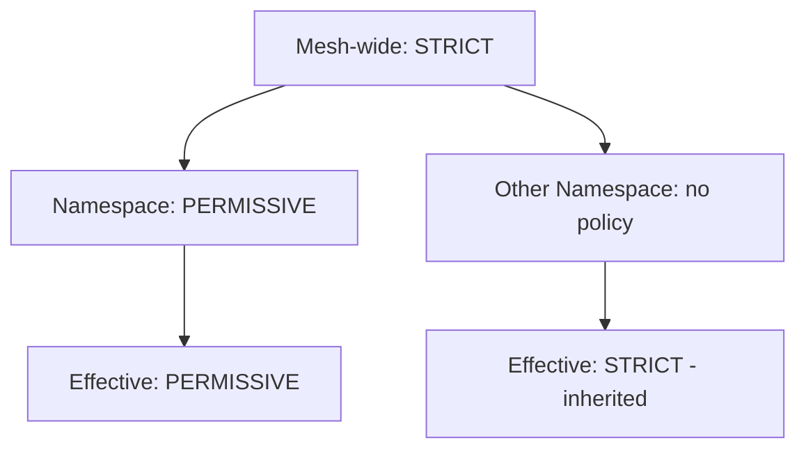

# How to Handle Peer Authentication Policy Conflicts in Istio

Author: [nawazdhandala](https://github.com/nawazdhandala)

Tags: Istio, PeerAuthentication, mTLS, Troubleshooting, Policy Conflicts

Description: How to identify, understand, and resolve PeerAuthentication policy conflicts in Istio when multiple policies affect the same workloads.

---

Policy conflicts are one of the more frustrating issues you'll run into with Istio's PeerAuthentication. You create a policy, apply it, and nothing seems to change - or worse, a different setting takes effect than what you expected. Most of the time, this happens because multiple policies are competing for the same workloads and Istio's conflict resolution rules aren't doing what you assumed.

## Types of Conflicts

There are several ways PeerAuthentication policies can conflict:

1. **Multiple namespace-wide policies** - Two or more policies without selectors in the same namespace.
2. **Overlapping workload-specific policies** - Two policies with selectors that both match the same pod.
3. **Contradictory scope levels** - A namespace policy says STRICT but a workload policy says PERMISSIVE (this isn't actually a conflict - it's the precedence system working as intended, but it confuses people).
4. **PeerAuthentication vs DestinationRule conflicts** - The server expects STRICT but the client sends plain text because of a DestinationRule override.

## Conflict 1: Multiple Namespace-Wide Policies

This is the most common accidental conflict. Someone creates a namespace-wide policy, and later someone else (or a Helm chart) creates another one:

```bash
kubectl get peerauthentication -n backend
```

```
NAME              MODE        AGE
default           STRICT      30d
backend-policy    PERMISSIVE  2d
```

Both have no selector, so both are namespace-wide. Istio will pick one based on its internal ordering, but the result is unpredictable. You might get STRICT or PERMISSIVE depending on which one Istio processes first.

**How to fix it:** Delete the duplicate policy and keep only one namespace-wide policy per namespace.

```bash
kubectl delete peerauthentication backend-policy -n backend
```

**How to prevent it:** Before creating a namespace-wide policy, always check for existing ones:

```bash
kubectl get peerauthentication -n backend -o jsonpath='{range .items[?(!.spec.selector)]}{.metadata.name}{"\n"}{end}'
```

This lists all PeerAuthentication policies in the namespace that don't have a selector.

## Conflict 2: Overlapping Workload Selectors

Two workload-specific policies that match the same pod:

```yaml
# Policy A
apiVersion: security.istio.io/v1
kind: PeerAuthentication
metadata:
  name: app-strict
  namespace: backend
spec:
  selector:
    matchLabels:
      app: order-service
  mtls:
    mode: STRICT
---
# Policy B
apiVersion: security.istio.io/v1
kind: PeerAuthentication
metadata:
  name: version-permissive
  namespace: backend
spec:
  selector:
    matchLabels:
      version: v2
  mtls:
    mode: PERMISSIVE
```

A pod with labels `app: order-service` and `version: v2` matches both policies. Istio doesn't define a clear winner here. The older policy typically takes precedence, but this behavior is not guaranteed across Istio versions.

**How to fix it:** Restructure your policies so selectors don't overlap. Either:

- Combine both into a single policy with a more specific selector.
- Add the `version` label to Policy A so it covers all versions explicitly.

```yaml
# Single combined policy
apiVersion: security.istio.io/v1
kind: PeerAuthentication
metadata:
  name: order-service-auth
  namespace: backend
spec:
  selector:
    matchLabels:
      app: order-service
      version: v2
  mtls:
    mode: STRICT
```

## Conflict 3: Scope Level Confusion

This one isn't technically a conflict, but it trips people up constantly. A mesh-wide policy says STRICT, but a namespace policy says PERMISSIVE. Someone expects STRICT to win because it's "more secure," but that's not how Istio works.

The precedence is always:
1. Workload-specific (highest)
2. Namespace-wide
3. Mesh-wide (lowest)

More specific always wins, regardless of the mTLS mode. So the namespace PERMISSIVE policy overrides the mesh-wide STRICT policy for that namespace.



**How to handle it:** If you want STRICT everywhere with no exceptions, either:
- Don't create namespace-wide policies at all (let everything inherit from the mesh-wide STRICT).
- Create STRICT policies at every level.

## Conflict 4: PeerAuthentication vs DestinationRule

PeerAuthentication controls what the server (receiving side) accepts. DestinationRules can control what the client (sending side) sends. If these don't agree, connections fail.

Example: The server requires STRICT mTLS via PeerAuthentication, but a DestinationRule tells the client to use plain text:

```yaml
# Server side
apiVersion: security.istio.io/v1
kind: PeerAuthentication
metadata:
  name: strict
  namespace: backend
spec:
  mtls:
    mode: STRICT
---
# Client side (in the calling namespace)
apiVersion: networking.istio.io/v1
kind: DestinationRule
metadata:
  name: order-service-dr
  namespace: frontend
spec:
  host: order-service.backend.svc.cluster.local
  trafficPolicy:
    tls:
      mode: DISABLE
```

The DestinationRule tells the client sidecar to not use TLS, but the server requires it. Result: connection failures.

**How to fix it:** Either remove the explicit TLS setting from the DestinationRule (letting auto mTLS handle it), or set it to match the PeerAuthentication:

```yaml
apiVersion: networking.istio.io/v1
kind: DestinationRule
metadata:
  name: order-service-dr
  namespace: frontend
spec:
  host: order-service.backend.svc.cluster.local
  trafficPolicy:
    tls:
      mode: ISTIO_MUTUAL
```

## Finding All Conflicts

Here's a systematic approach to finding policy conflicts.

**Step 1: List all PeerAuthentication policies across all namespaces:**

```bash
kubectl get peerauthentication --all-namespaces
```

**Step 2: Check for multiple namespace-wide policies in any namespace:**

```bash
kubectl get peerauthentication --all-namespaces -o json | \
  jq -r '.items[] | select(.spec.selector == null or .spec.selector == {}) | "\(.metadata.namespace)/\(.metadata.name)"'
```

Group by namespace. Any namespace with more than one entry has a conflict.

**Step 3: Check for overlapping workload selectors:**

For each namespace that has multiple workload-specific policies, check if any pods match more than one policy:

```bash
# Get all policies with selectors in a namespace
kubectl get peerauthentication -n backend -o json | \
  jq -r '.items[] | select(.spec.selector.matchLabels != null) | "\(.metadata.name): \(.spec.selector.matchLabels)"'
```

Then for each set of labels, check which pods match.

**Step 4: Check for DestinationRule conflicts:**

```bash
kubectl get destinationrules --all-namespaces -o json | \
  jq -r '.items[] | select(.spec.trafficPolicy.tls != null) | "\(.metadata.namespace)/\(.metadata.name): \(.spec.trafficPolicy.tls.mode)"'
```

Any DestinationRule with explicit TLS settings could conflict with PeerAuthentication.

## Using istioctl to Diagnose

The `istioctl analyze` command can detect some policy conflicts:

```bash
istioctl analyze --all-namespaces
```

For a specific pod, the describe command shows which policies apply:

```bash
istioctl x describe pod order-service-abc123 -n backend
```

And the proxy-config command shows what the Envoy proxy actually sees:

```bash
istioctl proxy-config listener order-service-abc123 -n backend
```

## Best Practices to Avoid Conflicts

1. **One namespace-wide policy per namespace.** Name it `default` by convention.
2. **Avoid overlapping workload selectors.** Each pod should be targeted by at most one workload-specific policy.
3. **Don't set explicit TLS modes in DestinationRules** unless you have a specific reason. Let auto mTLS handle it.
4. **Document your policies.** Use annotations to explain why a policy exists.
5. **Use `istioctl analyze` regularly** to catch issues early.

Policy conflicts in Istio are mostly avoidable if you follow a clean structure: one mesh-wide policy, one namespace-wide policy per namespace, and non-overlapping workload selectors. When conflicts do happen, `istioctl` and `kubectl` give you the tools to find and fix them quickly.
