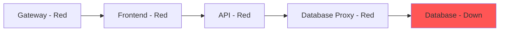

# How to Identify Unhealthy Services with Kiali in Istio

Author: [nawazdhandala](https://github.com/nawazdhandala)

Tags: Istio, Kiali, Health Monitoring, Troubleshooting, Observability

Description: How to use Kiali's health indicators and diagnostic features to quickly find and troubleshoot unhealthy services in your Istio mesh.

---

When something goes wrong in a microservices environment, the hardest part is figuring out which service is actually broken versus which one is just suffering from a bad dependency. Kiali's health monitoring features help you cut through that noise by giving you a clear picture of each service's health based on actual traffic data.

Kiali calculates health from Prometheus metrics that Istio collects automatically. It looks at error rates, request rates, and pod readiness to determine whether a service is healthy, degraded, or in failure. This post covers how to use these features to find problems fast.

## How Kiali Calculates Health

Kiali uses three sources of data to determine service health:

**Traffic health** is based on the ratio of successful responses to total responses. If a service returns 5xx errors for 10% of its requests, that's unhealthy. If it returns 4xx errors for 20% of requests, that might also be unhealthy depending on your thresholds.

**Pod health** is based on Kubernetes pod status. If pods are in CrashLoopBackOff, pending, or not ready, the service is marked as unhealthy regardless of traffic metrics.

**Configuration health** is based on Kiali's validation engine. If the Istio configuration for a service has errors, the service's config health shows a warning or error.

These three dimensions combine into an overall health score for each service.

## The Overview Page

The fastest way to spot unhealthy services is the Overview page. It shows each namespace as a card with color-coded health indicators:

- Green means all services in the namespace are healthy
- Yellow means at least one service is degraded
- Red means at least one service is in failure

Click on a namespace to drill into its services.

## Service List View

Navigate to the Services page and select your namespace. You'll see a table with every service and its health status:

Each row shows:
- Service name
- Health icon (green/yellow/red)
- Configuration validation status
- Labels

Sort by health status to push unhealthy services to the top. This is your first stop when investigating an incident.

## Workload List View

The Workloads page shows similar information but at the pod/deployment level. This is more useful when a service has multiple versions or replicas and you need to find which specific workload is the problem.

For each workload, you see:
- Workload name and type (Deployment, StatefulSet, etc.)
- Pod count and readiness
- Health status
- Istio sidecar injection status

A workload can be unhealthy even if its service looks healthy overall (if only some replicas are failing).

## Graph-Based Health Monitoring

The traffic graph provides the most intuitive view of service health. Nodes in the graph are colored by health:

- Green nodes: healthy services
- Yellow nodes: degraded services (some errors or warnings)
- Red nodes: failing services

Enable the following display options for maximum visibility:

1. Toggle "Healthy Nodes" to dim healthy services and make unhealthy ones stand out
2. Enable "Response Time" edge labels to spot slow services
3. Turn on "Traffic Animation" to see error traffic (red dots) flowing through the mesh

## Drilling Into an Unhealthy Service

When you find an unhealthy service, click on its node in the graph (or click its name in the services list). The detail page gives you:

### Inbound Metrics

Charts showing inbound request rate, error rate, and response time over time. Look for:
- Sudden spikes in error rate (indicates something broke)
- Gradual increase in error rate (indicates capacity issues)
- Spike in latency followed by errors (indicates timeouts)

### Outbound Metrics

Charts showing the service's outbound calls. If the service itself looks healthy but its outbound error rate is high, the problem is in a downstream dependency.

### Pod Status

A list of all pods for the workload with their status:

```
Pod                         Status    Restarts   Ready
reviews-v1-abc123-xyz       Running   0          2/2
reviews-v1-def456-uvw       Running   15         1/2
reviews-v1-ghi789-rst       Pending   0          0/2
```

In this example, the second pod has restarted 15 times (likely CrashLoopBackOff), and the third pod is stuck in Pending. These are contributing to the unhealthy status.

### Traces

If tracing is enabled, you can see distributed traces for the service. Look at traces with errors to understand the failure path.

## Common Unhealthy Patterns and What They Mean

### Pattern 1: High 5xx Error Rate

The service itself is crashing or returning errors. Check:
- Pod logs for application errors
- Pod restarts
- Memory/CPU usage (the service might be OOMKilled)

### Pattern 2: High Latency Leading to 504s

Upstream services are timing out waiting for this service. Check:
- Whether the service is overloaded (CPU throttling)
- Database connection pool exhaustion
- Istio timeout settings:

```yaml
apiVersion: networking.istio.io/v1
kind: VirtualService
metadata:
  name: reviews
spec:
  hosts:
    - reviews
  http:
    - timeout: 5s
      route:
        - destination:
            host: reviews
```

### Pattern 3: Intermittent Errors from Specific Pods

Some pods are healthy while others fail. This usually points to:
- Node-specific issues (one node has disk pressure)
- Configuration differences between pods
- Canary deployment with a buggy version

Use the workload detail view to identify which pods are the problem.

### Pattern 4: Cascading Failures

One service fails, causing its callers to fail, which causes their callers to fail, and so on. In Kiali's graph, you'll see a chain of red nodes starting from the root cause.

The trick is to trace the chain backwards. Start with the most downstream red node - that's usually your root cause. If it's a leaf service (no outbound dependencies) that's failing, that's almost certainly where the bug is.



In this cascade, the database is the root cause. Everything else is just failing because its dependency is down.

### Pattern 5: No Traffic

A service shows as degraded because it's receiving zero traffic. This might mean:
- A routing change accidentally stopped sending traffic to it
- A VirtualService misconfiguration is sending traffic elsewhere
- The service's Kubernetes service selector doesn't match any pods

Check the Istio Config validation for routing issues.

## Customizing Health Thresholds

Default health thresholds might not fit your application. Customize them in the Kiali CR:

```yaml
apiVersion: kiali.io/v1alpha1
kind: Kiali
metadata:
  name: kiali
  namespace: istio-system
spec:
  health_config:
    rate:
      - namespace: "bookinfo"
        kind: "service"
        name: ".*"
        tolerance:
          - code: "^5\\d\\d$"
            direction: "inbound"
            protocol: "http"
            degraded: 0.5
            failure: 5
          - code: "^4\\d\\d$"
            direction: "inbound"
            protocol: "http"
            degraded: 10
            failure: 30
```

This says: for services in the bookinfo namespace, mark as degraded at 0.5% 5xx errors and failed at 5%. For 4xx errors, degraded at 10% and failed at 30%.

Adjust these based on what's normal for your application. Some services naturally have higher 4xx rates (like APIs that get invalid input regularly).

## Quick Triage Workflow

When you get paged for a service issue, here's a fast workflow in Kiali:

1. Open the Overview page - which namespace is red?
2. Click into the namespace - which services are red?
3. Open the graph view for that namespace - trace the red chain to find the root cause
4. Click on the root cause service - check inbound/outbound metrics and pod status
5. If pods are crashing, check logs. If traffic is the issue, check Istio configuration validation.

This whole process takes about 2 minutes and saves you from guessing which of your 50 services is actually broken. Kiali turns a needle-in-a-haystack problem into a point-and-click investigation.
