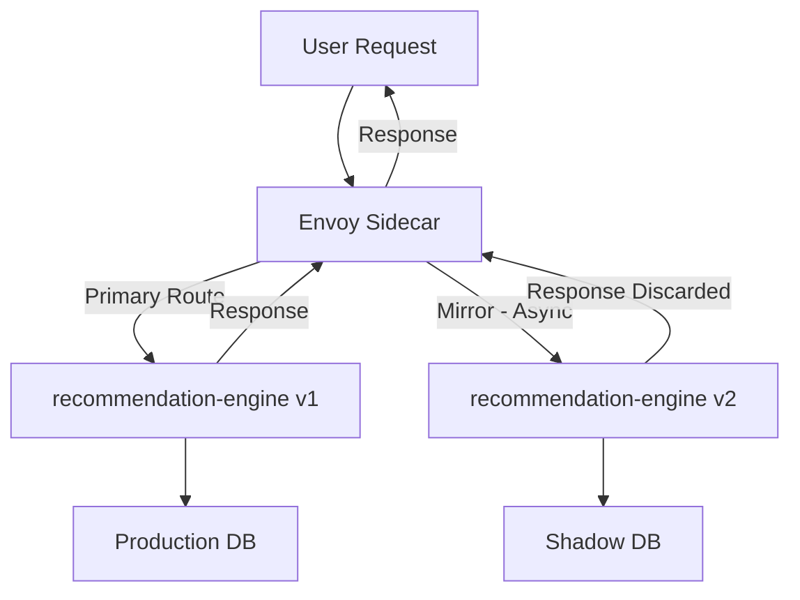

# How to Implement Dark Launches with Istio Traffic Mirroring

Author: [nawazdhandala](https://github.com/nawazdhandala)

Tags: Istio, Dark Launch, Traffic Mirroring, Service Mesh, Kubernetes, Deployment Strategy

Description: Implement dark launches using Istio traffic mirroring to test new features in production without exposing them to real users.

---

A dark launch is when you deploy new code to production and test it with real traffic, but users never see the new version's responses. It is like running a shadow copy of your service. The original service handles all user-facing requests while the new version processes copies of those same requests in parallel. If the new version crashes or returns garbage, nobody notices.

Istio's traffic mirroring feature is built exactly for this use case. You configure it once in a VirtualService, and Envoy handles the rest - duplicating requests, routing copies to your dark service, and throwing away the responses.

## Why Dark Launches Matter

Staging environments never fully replicate production. The data is different, the traffic patterns are different, and the load characteristics are different. You can run all the integration tests you want in staging, but nothing beats seeing how your code handles actual production traffic.

With dark launches, you get:

- Real production traffic hitting your new code
- No risk to users (responses are discarded)
- Accurate performance benchmarks under real load
- A chance to catch bugs that only show up with production data

## Setting Up the Dark Launch

Suppose you are working on a `recommendation-engine` service. You have the stable v1 in production and want to dark launch v2 with a completely rewritten algorithm.

### Deploy v2 Alongside v1

```yaml
apiVersion: apps/v1
kind: Deployment
metadata:
  name: recommendation-engine-v2
  labels:
    app: recommendation-engine
    version: v2
spec:
  replicas: 2
  selector:
    matchLabels:
      app: recommendation-engine
      version: v2
  template:
    metadata:
      labels:
        app: recommendation-engine
        version: v2
    spec:
      containers:
        - name: recommendation-engine
          image: myregistry/recommendation-engine:2.0.0-beta
          ports:
            - containerPort: 8080
          env:
            - name: MODE
              value: "dark-launch"
            - name: DB_HOST
              value: "shadow-db.default.svc.cluster.local"
```

Notice two things here. The `MODE` environment variable tells the application it is running as a dark launch, which your code can use to disable side effects. The `DB_HOST` points to a separate shadow database to avoid polluting production data.

### Create the DestinationRule

```yaml
apiVersion: networking.istio.io/v1
kind: DestinationRule
metadata:
  name: recommendation-engine
spec:
  host: recommendation-engine
  subsets:
    - name: v1
      labels:
        version: v1
    - name: v2
      labels:
        version: v2
```

### Configure the VirtualService with Mirroring

```yaml
apiVersion: networking.istio.io/v1
kind: VirtualService
metadata:
  name: recommendation-engine
spec:
  hosts:
    - recommendation-engine
  http:
    - route:
        - destination:
            host: recommendation-engine
            subset: v1
          weight: 100
      mirror:
        host: recommendation-engine
        subset: v2
      mirrorPercentage:
        value: 100.0
```

```bash
kubectl apply -f recommendation-engine-destinationrule.yaml
kubectl apply -f recommendation-engine-virtualservice.yaml
```

## Handling Side Effects in Dark Launches

This is the part that trips people up. If your service writes to a database, calls external APIs, sends notifications, or processes payments, the mirrored traffic will try to do all of those things too.

Here is a practical approach to handling side effects:

### Option 1: Separate Shadow Infrastructure

Point your dark launch at shadow versions of databases and external services.

```yaml
env:
  - name: DATABASE_URL
    value: "postgresql://shadow-db:5432/recommendations_shadow"
  - name: NOTIFICATION_SERVICE_URL
    value: "http://notification-service-mock:8080"
```

### Option 2: Application-Level Guards

Add a check in your application code that detects mirrored traffic. Istio adds a `-shadow` suffix to the `Host` header for mirrored requests.

```python
from flask import Flask, request

app = Flask(__name__)

def is_mirror_request():
    host = request.headers.get('Host', '')
    return host.endswith('-shadow')

@app.route('/recommend')
def recommend():
    recommendations = generate_recommendations(request.args)

    if not is_mirror_request():
        save_to_database(recommendations)
        send_analytics_event(recommendations)

    return jsonify(recommendations)
```

### Option 3: Read-Only Mode

Configure v2 to operate in read-only mode where it can read from the production database but does not write anything.

```yaml
env:
  - name: DB_READ_ONLY
    value: "true"
```

## Comparing Results Between v1 and v2

The real value of a dark launch comes from comparing outputs. You want to know: does v2 produce better results than v1?

### Log-Based Comparison

Have both v1 and v2 log their outputs in a structured format:

```json
{
  "service_version": "v2",
  "request_id": "abc-123",
  "recommendations": ["item-42", "item-17", "item-88"],
  "latency_ms": 23,
  "timestamp": "2026-02-24T10:30:00Z"
}
```

Then use your logging pipeline (ELK, Loki, or similar) to compare v1 and v2 outputs for the same request IDs.

### Metric-Based Comparison

Use Prometheus queries to compare latency and error rates:

```
histogram_quantile(0.95,
  sum(rate(istio_request_duration_milliseconds_bucket{
    destination_service="recommendation-engine.default.svc.cluster.local"
  }[5m])) by (le, destination_version)
)
```

## Architecture of a Dark Launch



## Gradual Mirror Percentage

You do not have to mirror everything at once. Start small and ramp up:

```yaml
# Week 1: 5% of traffic
mirrorPercentage:
  value: 5.0

# Week 2: 25% of traffic
mirrorPercentage:
  value: 25.0

# Week 3: 50% of traffic
mirrorPercentage:
  value: 50.0

# Week 4: 100% of traffic
mirrorPercentage:
  value: 100.0
```

This is especially important if v2 is resource-intensive. Mirroring 100% of a high-traffic service doubles the load on your cluster, so plan capacity accordingly.

## Resource Planning

Since mirrored traffic creates real load on v2 pods, you need to allocate resources accordingly:

```yaml
containers:
  - name: recommendation-engine
    image: myregistry/recommendation-engine:2.0.0-beta
    resources:
      requests:
        cpu: 500m
        memory: 256Mi
      limits:
        cpu: 1000m
        memory: 512Mi
```

Set up a Horizontal Pod Autoscaler for v2:

```yaml
apiVersion: autoscaling/v2
kind: HorizontalPodAutoscaler
metadata:
  name: recommendation-engine-v2
spec:
  scaleTargetRef:
    apiVersion: apps/v1
    kind: Deployment
    name: recommendation-engine-v2
  minReplicas: 2
  maxReplicas: 10
  metrics:
    - type: Resource
      resource:
        name: cpu
        target:
          type: Utilization
          averageUtilization: 70
```

## When to End the Dark Launch

You should transition from dark launch to actual traffic shifting when:

1. v2 shows equal or better latency than v1
2. v2 error rate is at or below v1 levels
3. v2 output quality meets your requirements (compare logs)
4. v2 has handled mirrored traffic at 100% for a reasonable time
5. Your team is confident in the new version

At that point, remove the mirror configuration and switch to weight-based traffic shifting to gradually move real users to v2.

## Common Pitfalls

- **Not isolating side effects.** This is the number one issue. Always have a plan for writes and external calls.
- **Undersizing v2.** Mirrored traffic is real load. Give v2 enough resources.
- **Not monitoring v2 metrics.** The whole point is to observe v2 behavior. Set up dashboards before you start.
- **Running dark launches forever.** A dark launch is a temporary testing phase. Set a timeline and make a decision.

Dark launches with Istio give you a production-fidelity testing environment without any user-facing risk. When done right, they take most of the uncertainty out of deploying new service versions. Use them for any change where you want to validate behavior under real conditions before committing to a full rollout.
