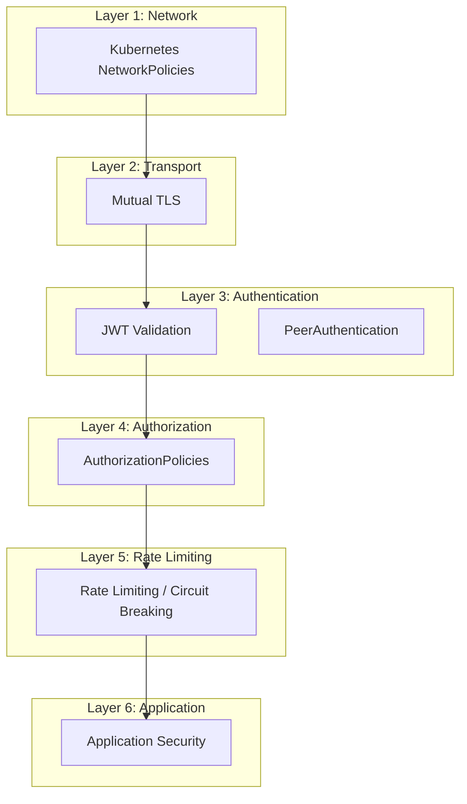

# How to Implement Defense-in-Depth with Istio Security

Author: [nawazdhandala](https://github.com/nawazdhandala)

Tags: Istio, Defense in Depth, Security, Service Mesh, Zero Trust

Description: How to layer multiple security controls using Istio to create a defense-in-depth strategy that protects your microservices at every level.

---

Defense in depth means no single security control is the last line of defense. If one layer fails, another catches the threat. In a Kubernetes environment with Istio, you have multiple layers available: network policies, mTLS, authorization policies, rate limiting, WAF rules, and more. The goal is to stack these so that compromising one layer is not enough to compromise the system.

Think of it like a medieval castle. You do not just have a wall - you have a moat, an outer wall, an inner wall, a keep, and guards at each layer. Each layer slows down and filters attackers. Istio gives you the building blocks for several of these layers.

## The Layers

Here is a practical defense-in-depth stack for Istio, from the outermost layer to the innermost:



## Layer 1: Network Segmentation

The outermost layer uses Kubernetes NetworkPolicies to restrict which pods can communicate at the IP/port level. This is enforced by the CNI plugin, not Istio, so it works even if the sidecar is compromised.

```yaml
apiVersion: networking.k8s.io/v1
kind: NetworkPolicy
metadata:
  name: default-deny
  namespace: production
spec:
  podSelector: {}
  policyTypes:
    - Ingress
    - Egress
---
apiVersion: networking.k8s.io/v1
kind: NetworkPolicy
metadata:
  name: allow-mesh-traffic
  namespace: production
spec:
  podSelector: {}
  policyTypes:
    - Ingress
    - Egress
  ingress:
    - from:
        - namespaceSelector:
            matchLabels:
              mesh-member: "true"
  egress:
    - to:
        - namespaceSelector:
            matchLabels:
              mesh-member: "true"
    - to:
        - namespaceSelector:
            matchLabels:
              kubernetes.io/metadata.name: kube-system
      ports:
        - port: 53
          protocol: UDP
```

This ensures that even without Istio, pods can only communicate with other mesh members.

## Layer 2: Mutual TLS

The transport layer ensures all communication is encrypted and both parties verify each other's identity:

```yaml
apiVersion: security.istio.io/v1
kind: PeerAuthentication
metadata:
  name: strict-mtls
  namespace: istio-system
spec:
  mtls:
    mode: STRICT
```

With strict mTLS:
- All traffic is encrypted in transit
- Both sides present X.509 certificates
- Certificates are automatically rotated (default 24-hour lifetime)
- Services without sidecars cannot communicate with mesh services

## Layer 3: Authentication

Authentication verifies who is making the request. For service-to-service calls, mTLS handles this (the certificate proves identity). For external requests, add JWT validation:

```yaml
apiVersion: security.istio.io/v1
kind: RequestAuthentication
metadata:
  name: jwt-auth
  namespace: production
spec:
  selector:
    matchLabels:
      app: api-gateway
  jwtRules:
    - issuer: "https://auth.example.com"
      jwksUri: "https://auth.example.com/.well-known/jwks.json"
      audiences:
        - "api.example.com"
      forwardOriginalToken: true
      outputPayloadToHeader: x-jwt-payload
```

This validates JWT tokens on incoming requests before they reach authorization checks.

## Layer 4: Fine-Grained Authorization

Authorization policies control what authenticated identities can do. Use the principle of least privilege:

```yaml
# Deny all by default
apiVersion: security.istio.io/v1
kind: AuthorizationPolicy
metadata:
  name: deny-all
  namespace: production
spec:
  {}
---
# Allow specific paths for specific identities
apiVersion: security.istio.io/v1
kind: AuthorizationPolicy
metadata:
  name: frontend-to-api
  namespace: production
spec:
  selector:
    matchLabels:
      app: api-gateway
  rules:
    - from:
        - source:
            principals: ["cluster.local/ns/production/sa/frontend"]
      to:
        - operation:
            methods: ["GET"]
            paths: ["/api/v1/products*", "/api/v1/catalog*"]
    - from:
        - source:
            principals: ["cluster.local/ns/production/sa/frontend"]
      to:
        - operation:
            methods: ["POST"]
            paths: ["/api/v1/orders"]
---
# Allow only authenticated external users for user-facing APIs
apiVersion: security.istio.io/v1
kind: AuthorizationPolicy
metadata:
  name: external-users
  namespace: production
spec:
  selector:
    matchLabels:
      app: api-gateway
  rules:
    - from:
        - source:
            requestPrincipals: ["https://auth.example.com/*"]
      to:
        - operation:
            methods: ["GET", "POST"]
            paths: ["/api/v1/user/*"]
      when:
        - key: request.auth.claims[email_verified]
          values: ["true"]
```

## Layer 5: Rate Limiting and Circuit Breaking

Even authenticated and authorized requests can be abusive. Add rate limiting and circuit breaking:

```yaml
apiVersion: networking.istio.io/v1
kind: DestinationRule
metadata:
  name: api-gateway-resilience
  namespace: production
spec:
  host: api-gateway
  trafficPolicy:
    connectionPool:
      tcp:
        maxConnections: 100
      http:
        h2UpgradePolicy: DEFAULT
        http1MaxPendingRequests: 100
        http2MaxRequests: 1000
        maxRequestsPerConnection: 10
        maxRetries: 3
    outlierDetection:
      consecutive5xxErrors: 5
      interval: 30s
      baseEjectionTime: 30s
      maxEjectionPercent: 50
```

For more sophisticated rate limiting, use Istio's rate limiting with an external rate limit service:

```yaml
apiVersion: networking.istio.io/v1alpha3
kind: EnvoyFilter
metadata:
  name: rate-limit
  namespace: production
spec:
  workloadSelector:
    labels:
      app: api-gateway
  configPatches:
    - applyTo: HTTP_FILTER
      match:
        context: SIDECAR_INBOUND
        listener:
          filterChain:
            filter:
              name: envoy.filters.network.http_connection_manager
      patch:
        operation: INSERT_BEFORE
        value:
          name: envoy.filters.http.local_ratelimit
          typed_config:
            "@type": type.googleapis.com/envoy.extensions.filters.http.local_ratelimit.v3.LocalRateLimit
            stat_prefix: http_local_rate_limiter
            token_bucket:
              max_tokens: 1000
              tokens_per_fill: 100
              fill_interval: 1s
```

## Layer 6: Security Headers and Input Validation

Use Envoy filters at the gateway to add security headers:

```yaml
apiVersion: networking.istio.io/v1alpha3
kind: EnvoyFilter
metadata:
  name: security-headers
  namespace: istio-system
spec:
  workloadSelector:
    labels:
      istio: ingressgateway
  configPatches:
    - applyTo: HTTP_FILTER
      match:
        context: GATEWAY
        listener:
          filterChain:
            filter:
              name: envoy.filters.network.http_connection_manager
              subFilter:
                name: envoy.filters.http.router
      patch:
        operation: INSERT_BEFORE
        value:
          name: envoy.filters.http.lua
          typed_config:
            "@type": type.googleapis.com/envoy.extensions.filters.http.lua.v3.Lua
            inline_code: |
              function envoy_on_response(response_handle)
                response_handle:headers():add("X-Frame-Options", "DENY")
                response_handle:headers():add("X-Content-Type-Options", "nosniff")
                response_handle:headers():add("Strict-Transport-Security", "max-age=31536000; includeSubDomains")
                response_handle:headers():add("X-XSS-Protection", "1; mode=block")
              end
```

## Monitoring All Layers

Each layer should have its own monitoring. Set up alerts for:

```yaml
# NetworkPolicy violations (requires CNI that exports metrics)
# mTLS failures
- alert: MTLSFailure
  expr: rate(istio_requests_total{connection_security_policy="none", namespace="production"}[5m]) > 0
  labels:
    severity: critical

# Authentication failures
- alert: AuthenticationFailure
  expr: rate(istio_requests_total{response_code="401"}[5m]) > 10
  labels:
    severity: warning

# Authorization denials
- alert: AuthorizationDenial
  expr: rate(istio_requests_total{response_code="403"}[5m]) > 10
  labels:
    severity: warning

# Rate limiting activations
- alert: RateLimitActive
  expr: rate(istio_requests_total{response_code="429"}[5m]) > 0
  labels:
    severity: info
```

## Testing Your Defenses

Regularly test each layer to make sure it actually works:

```bash
# Test NetworkPolicy: try connecting from a blocked namespace
kubectl run test --rm -it --image=busybox -n unauthorized-ns -- wget -qO- http://api-gateway.production:8080

# Test mTLS: try connecting without a sidecar
kubectl run test --rm -it --image=busybox --overrides='{"metadata":{"annotations":{"sidecar.istio.io/inject":"false"}}}' -- wget -qO- http://api-gateway.production:8080

# Test authorization: try accessing a restricted path
kubectl exec <frontend-pod> -- curl http://payment-service:8080/admin/users

# Test rate limiting: send a burst of requests
kubectl exec <test-pod> -- sh -c 'for i in $(seq 1 200); do curl -s -o /dev/null -w "%{http_code}\n" http://api-gateway:8080/api/v1/products; done'
```

Defense in depth is not about any single Istio feature. It is about combining multiple features so that each one compensates for the weaknesses of others. NetworkPolicies protect against sidecar bypass. mTLS protects against network-level attacks. Authorization policies protect against identity-based abuse. Rate limiting protects against volume-based attacks. Together, they create a security posture that is much harder to penetrate than any single control alone.
