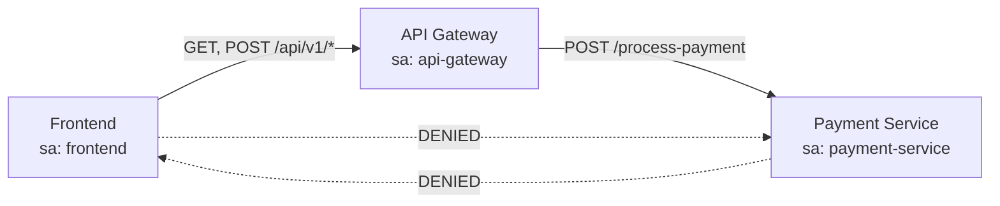

# How to Implement Zero-Trust Networking with Istio

Author: [nawazdhandala](https://github.com/nawazdhandala)

Tags: Istio, Zero Trust, Security, mTLS, Authorization, Service Mesh

Description: A practical guide to implementing zero-trust networking principles with Istio including identity verification, encryption, and fine-grained access control.

---

Zero trust networking boils down to one idea: never trust, always verify. It does not matter if a request comes from inside your network perimeter or outside - every request must be authenticated, authorized, and encrypted. Istio is one of the best tools for implementing zero trust in Kubernetes because it handles all three of those requirements at the infrastructure level, without changing your application code.

The traditional perimeter security model says "everything inside the network is trusted." That model breaks down when a single compromised pod can freely communicate with every other service in the cluster. Zero trust eliminates that lateral movement risk.

## The Four Pillars of Zero Trust in Istio

1. **Strong identity**: Every workload gets a cryptographic identity (X.509 certificate with SPIFFE ID)
2. **Encrypted communication**: All traffic is encrypted with mutual TLS
3. **Fine-grained authorization**: Every request is checked against access policies
4. **Continuous verification**: Identity and authorization are enforced on every request, not just the first one

Here is how to implement each pillar.

## Pillar 1: Strong Workload Identity

Istio automatically provisions X.509 certificates for every workload with a sidecar. The identity is derived from the Kubernetes service account:

```
spiffe://cluster.local/ns/<namespace>/sa/<service-account>
```

To strengthen identity, create dedicated service accounts for each workload instead of using the default:

```yaml
apiVersion: v1
kind: ServiceAccount
metadata:
  name: payment-service
  namespace: production
---
apiVersion: apps/v1
kind: Deployment
metadata:
  name: payment-service
  namespace: production
spec:
  template:
    spec:
      serviceAccountName: payment-service
      containers:
        - name: payment
          image: payment-service:latest
```

If every service uses the default service account, they all share the same identity, defeating the purpose of identity-based access control. One service account per workload is a fundamental requirement for zero trust.

Verify workload identity:

```bash
istioctl proxy-config secret <pod-name> -n production -o json | \
  jq -r '.dynamicActiveSecrets[0].secret.tlsCertificate.certificateChain.inlineBytes' | \
  base64 -d | openssl x509 -text -noout | grep "URI:"
```

## Pillar 2: Encrypt Everything with mTLS

Enable strict mTLS mesh-wide:

```yaml
apiVersion: security.istio.io/v1
kind: PeerAuthentication
metadata:
  name: default
  namespace: istio-system
spec:
  mtls:
    mode: STRICT
```

This ensures:
- All service-to-service communication is encrypted
- Both sides of every connection verify each other's identity
- No plaintext communication is allowed within the mesh

Verify mTLS is enforced everywhere:

```bash
# Check for any services still accepting plaintext
istioctl analyze --all-namespaces 2>&1 | grep -i "mtls\|plaintext"
```

Monitor for non-mTLS connections:

```bash
# In Prometheus
istio_tcp_connections_opened_total{connection_security_policy="none"}
```

This metric should be zero if strict mTLS is properly enforced.

## Pillar 3: Fine-Grained Authorization

With identity established and communication encrypted, add authorization policies to control which services can talk to which. Start with a deny-all policy and then open up specific paths.

### Default Deny

Apply a default deny policy to each namespace:

```yaml
apiVersion: security.istio.io/v1
kind: AuthorizationPolicy
metadata:
  name: deny-all
  namespace: production
spec:
  {}
```

An empty spec with no rules means deny everything. After applying this, all traffic to services in the `production` namespace will be rejected.

### Allow Specific Communication

Now open up only the communication paths that are needed:

```yaml
apiVersion: security.istio.io/v1
kind: AuthorizationPolicy
metadata:
  name: allow-frontend-to-api
  namespace: production
spec:
  selector:
    matchLabels:
      app: api-gateway
  rules:
    - from:
        - source:
            principals:
              - "cluster.local/ns/production/sa/frontend"
      to:
        - operation:
            methods: ["GET", "POST"]
            paths: ["/api/v1/*"]
---
apiVersion: security.istio.io/v1
kind: AuthorizationPolicy
metadata:
  name: allow-api-to-payment
  namespace: production
spec:
  selector:
    matchLabels:
      app: payment-service
  rules:
    - from:
        - source:
            principals:
              - "cluster.local/ns/production/sa/api-gateway"
      to:
        - operation:
            methods: ["POST"]
            paths: ["/process-payment"]
```

This creates an explicit allow-list:



Any communication path not explicitly allowed is denied.

### Namespace-Level Isolation

Prevent cross-namespace communication except where explicitly allowed:

```yaml
apiVersion: security.istio.io/v1
kind: AuthorizationPolicy
metadata:
  name: deny-cross-namespace
  namespace: production
spec:
  rules:
    - from:
        - source:
            namespaces: ["production"]
```

This allows traffic only from the same namespace. To allow specific cross-namespace communication:

```yaml
apiVersion: security.istio.io/v1
kind: AuthorizationPolicy
metadata:
  name: allow-monitoring
  namespace: production
spec:
  selector:
    matchLabels:
      app: api-gateway
  rules:
    - from:
        - source:
            namespaces: ["monitoring"]
            principals: ["cluster.local/ns/monitoring/sa/prometheus"]
      to:
        - operation:
            ports: ["15090"]
```

## Pillar 4: Continuous Verification

Zero trust means every request is verified, not just the initial connection. Istio enforces authorization policies on every request, not just during connection establishment.

Add JWT validation for requests coming from external sources:

```yaml
apiVersion: security.istio.io/v1
kind: RequestAuthentication
metadata:
  name: jwt-auth
  namespace: production
spec:
  selector:
    matchLabels:
      app: api-gateway
  jwtRules:
    - issuer: "https://auth.example.com"
      jwksUri: "https://auth.example.com/.well-known/jwks.json"
      forwardOriginalToken: true
---
apiVersion: security.istio.io/v1
kind: AuthorizationPolicy
metadata:
  name: require-jwt
  namespace: production
spec:
  selector:
    matchLabels:
      app: api-gateway
  rules:
    - from:
        - source:
            requestPrincipals: ["https://auth.example.com/*"]
      when:
        - key: request.auth.claims[groups]
          values: ["admin", "user"]
```

## Implementation Roadmap

Do not try to implement everything at once. Follow this phased approach:

**Phase 1 - Visibility (Week 1-2)**:
- Install Istio with permissive mTLS
- Deploy sidecars to all workloads
- Monitor existing communication patterns using Kiali or Istio telemetry

**Phase 2 - Encryption (Week 3-4)**:
- Switch to strict mTLS namespace by namespace
- Fix any services that break (usually those without sidecars)
- Verify all traffic is encrypted

**Phase 3 - Identity (Week 5-6)**:
- Create dedicated service accounts for each workload
- Verify identity is unique per service
- Update deployments to use specific service accounts

**Phase 4 - Authorization (Week 7-10)**:
- Start with audit mode (CUSTOM action with logging, or use ALLOW policies first)
- Build authorization policies based on observed traffic patterns
- Apply deny-all policies namespace by namespace
- Add explicit allow policies for legitimate traffic

**Phase 5 - Monitoring and Maintenance (Ongoing)**:
- Set up alerts for denied requests
- Review authorization policies regularly
- Add new policies as services are added

## Monitoring Zero Trust Compliance

Track your zero trust posture with these metrics and checks:

```bash
# Check for workloads without sidecars
kubectl get pods --all-namespaces -o json | \
  jq -r '.items[] | select(.metadata.annotations["sidecar.istio.io/status"] == null) | "\(.metadata.namespace)/\(.metadata.name)"'

# Check for namespaces without strict mTLS
kubectl get peerauthentication --all-namespaces -o json | \
  jq '.items[] | {namespace: .metadata.namespace, mode: .spec.mtls.mode}'

# Check for namespaces without deny-all policies
kubectl get authorizationpolicy --all-namespaces -o json | \
  jq '.items[] | select(.spec == {} or .spec == null) | .metadata.namespace'
```

Zero trust with Istio is not a one-time setup - it is an ongoing practice. The mesh gives you the tools to enforce it, but you need to maintain the policies, monitor compliance, and update authorization rules as your services evolve. Start with the fundamentals (mTLS and unique identities), then layer on authorization policies based on real traffic patterns.
