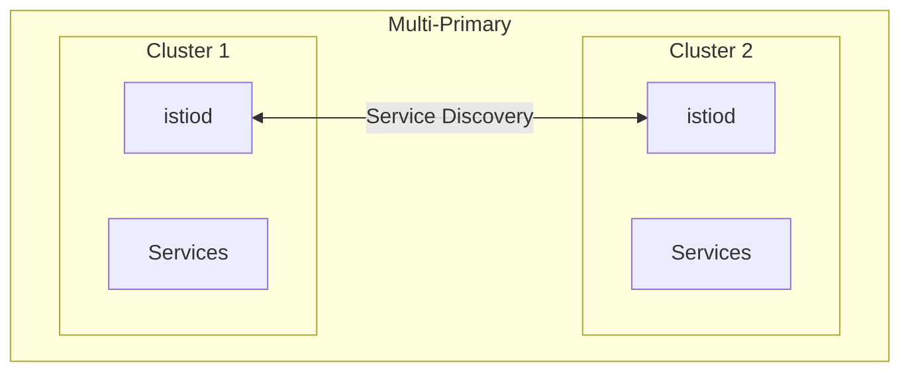

# How to Install Istio for Multicluster Deployments

Author: [nawazdhandala](https://github.com/nawazdhandala)

Tags: Istio, Multi-Cluster, Kubernetes, Service Mesh, Federation

Description: A hands-on guide to setting up Istio multicluster mesh with both primary-remote and multi-primary topologies for cross-cluster service communication.

---

Running Kubernetes across multiple clusters is a common pattern for high availability, geographic distribution, and organizational boundaries. Istio can span multiple clusters, allowing services in one cluster to transparently call services in another as if they were local. The setup is not trivial, but once it is working, cross-cluster service communication becomes seamless.

## Multicluster Deployment Models

Istio supports two main multicluster topologies:

**Multi-Primary**: Each cluster runs its own istiod and they share service discovery. This is best for clusters that need to operate independently.

**Primary-Remote**: One cluster runs istiod and the other cluster's sidecars connect to it remotely. Simpler but creates a dependency on the primary cluster.



## Prerequisites

For multicluster Istio, you need:

- Two or more Kubernetes clusters
- Network connectivity between clusters (pods in one cluster can reach pods in another)
- A shared root CA for mTLS across clusters
- kubeconfig access to all clusters

Set up your context variables:

```bash
export CTX_CLUSTER1=cluster1
export CTX_CLUSTER2=cluster2
```

Verify connectivity:

```bash
kubectl --context="${CTX_CLUSTER1}" get nodes
kubectl --context="${CTX_CLUSTER2}" get nodes
```

## Setting Up a Shared Root CA

Both clusters must trust each other's certificates. Create a shared root CA:

```bash
# Create root CA directory
mkdir -p certs
cd certs

# Generate root CA key and cert
openssl req -new -x509 -nodes -days 3650 \
  -keyout root-key.pem \
  -out root-cert.pem \
  -subj "/O=Istio/CN=Root CA"

# Generate intermediate CA for cluster1
openssl req -new -nodes \
  -keyout cluster1-ca-key.pem \
  -out cluster1-ca-csr.pem \
  -subj "/O=Istio/CN=Intermediate CA Cluster1"

openssl x509 -req -days 730 \
  -CA root-cert.pem \
  -CAkey root-key.pem \
  -CAcreateserial \
  -in cluster1-ca-csr.pem \
  -out cluster1-ca-cert.pem

# Generate intermediate CA for cluster2
openssl req -new -nodes \
  -keyout cluster2-ca-key.pem \
  -out cluster2-ca-csr.pem \
  -subj "/O=Istio/CN=Intermediate CA Cluster2"

openssl x509 -req -days 730 \
  -CA root-cert.pem \
  -CAkey root-key.pem \
  -CAcreateserial \
  -in cluster2-ca-csr.pem \
  -out cluster2-ca-cert.pem
```

Create the CA secrets on each cluster:

```bash
# Cluster 1
kubectl --context="${CTX_CLUSTER1}" create namespace istio-system

kubectl --context="${CTX_CLUSTER1}" create secret generic cacerts \
  -n istio-system \
  --from-file=ca-cert.pem=cluster1-ca-cert.pem \
  --from-file=ca-key.pem=cluster1-ca-key.pem \
  --from-file=root-cert.pem=root-cert.pem \
  --from-file=cert-chain.pem=cluster1-ca-cert.pem

# Cluster 2
kubectl --context="${CTX_CLUSTER2}" create namespace istio-system

kubectl --context="${CTX_CLUSTER2}" create secret generic cacerts \
  -n istio-system \
  --from-file=ca-cert.pem=cluster2-ca-cert.pem \
  --from-file=ca-key.pem=cluster2-ca-key.pem \
  --from-file=root-cert.pem=root-cert.pem \
  --from-file=cert-chain.pem=cluster2-ca-cert.pem
```

## Multi-Primary Setup on Different Networks

This is the most common production setup. Each cluster has its own istiod and east-west gateway for cross-cluster traffic.

### Install Istio on Cluster 1

```yaml
# cluster1.yaml
apiVersion: install.istio.io/v1alpha1
kind: IstioOperator
spec:
  values:
    global:
      meshID: mesh1
      multiCluster:
        clusterName: cluster1
      network: network1
  meshConfig:
    accessLogFile: /dev/stdout
```

```bash
istioctl install --context="${CTX_CLUSTER1}" -f cluster1.yaml -y
```

### Install East-West Gateway on Cluster 1

```bash
# Generate the east-west gateway configuration
cat <<EOF > eastwest-gateway-cluster1.yaml
apiVersion: install.istio.io/v1alpha1
kind: IstioOperator
metadata:
  name: eastwest
spec:
  revision: ""
  profile: empty
  components:
    ingressGateways:
      - name: istio-eastwestgateway
        label:
          istio: eastwestgateway
          app: istio-eastwestgateway
          topology.istio.io/network: network1
        enabled: true
        k8s:
          env:
            - name: ISTIO_META_REQUESTED_NETWORK_VIEW
              value: network1
          service:
            ports:
              - name: status-port
                port: 15021
                targetPort: 15021
              - name: tls
                port: 15443
                targetPort: 15443
              - name: tls-istiod
                port: 15012
                targetPort: 15012
              - name: tls-webhook
                port: 15017
                targetPort: 15017
  values:
    global:
      meshID: mesh1
      multiCluster:
        clusterName: cluster1
      network: network1
EOF

istioctl install --context="${CTX_CLUSTER1}" -f eastwest-gateway-cluster1.yaml -y
```

Expose services through the east-west gateway:

```yaml
# expose-services-cluster1.yaml
apiVersion: networking.istio.io/v1
kind: Gateway
metadata:
  name: cross-network-gateway
  namespace: istio-system
spec:
  selector:
    istio: eastwestgateway
  servers:
    - port:
        number: 15443
        name: tls
        protocol: TLS
      tls:
        mode: AUTO_PASSTHROUGH
      hosts:
        - "*.local"
```

```bash
kubectl --context="${CTX_CLUSTER1}" apply -f expose-services-cluster1.yaml
```

### Install Istio on Cluster 2

Repeat the same process for cluster 2, changing the cluster name and network:

```yaml
# cluster2.yaml
apiVersion: install.istio.io/v1alpha1
kind: IstioOperator
spec:
  values:
    global:
      meshID: mesh1
      multiCluster:
        clusterName: cluster2
      network: network2
  meshConfig:
    accessLogFile: /dev/stdout
```

```bash
istioctl install --context="${CTX_CLUSTER2}" -f cluster2.yaml -y
```

Install the east-west gateway on cluster 2 with `network2` values, and apply the same cross-network gateway resource.

### Exchange Remote Secrets

Each cluster needs credentials to access the other's API server:

```bash
# Give cluster1 access to cluster2
istioctl create-remote-secret \
  --context="${CTX_CLUSTER2}" \
  --name=cluster2 | \
  kubectl apply -f - --context="${CTX_CLUSTER1}"

# Give cluster2 access to cluster1
istioctl create-remote-secret \
  --context="${CTX_CLUSTER1}" \
  --name=cluster1 | \
  kubectl apply -f - --context="${CTX_CLUSTER2}"
```

## Verifying Cross-Cluster Communication

Deploy httpbin on cluster 1 and a sleep client on cluster 2:

```bash
# On cluster 1
kubectl --context="${CTX_CLUSTER1}" create namespace sample
kubectl --context="${CTX_CLUSTER1}" label namespace sample istio-injection=enabled
kubectl --context="${CTX_CLUSTER1}" apply -n sample -f https://raw.githubusercontent.com/istio/istio/release-1.24/samples/httpbin/httpbin.yaml

# On cluster 2
kubectl --context="${CTX_CLUSTER2}" create namespace sample
kubectl --context="${CTX_CLUSTER2}" label namespace sample istio-injection=enabled
kubectl --context="${CTX_CLUSTER2}" apply -n sample -f https://raw.githubusercontent.com/istio/istio/release-1.24/samples/sleep/sleep.yaml
```

Test cross-cluster connectivity:

```bash
kubectl --context="${CTX_CLUSTER2}" exec -n sample deploy/sleep -c sleep -- \
  curl -s httpbin.sample:8000/ip
```

If you get a response, cross-cluster communication is working.

## Troubleshooting

**Remote secrets not syncing**: Check istiod logs for remote cluster connection errors:

```bash
kubectl --context="${CTX_CLUSTER1}" logs -n istio-system deploy/istiod | grep "cluster2"
```

**East-west gateway not reachable**: Verify the LoadBalancer has an external IP and check firewall rules between clusters.

**Certificate errors**: Make sure both clusters use certificates signed by the same root CA. Check cert chains:

```bash
istioctl proxy-config secret -n sample deploy/httpbin | head -5
```

Multicluster Istio requires careful initial setup, but once the trust domain, networking, and remote secrets are configured, it provides transparent service-to-service communication across clusters. The multi-primary model is the most resilient since each cluster can operate independently if the connection to the other cluster is lost.
