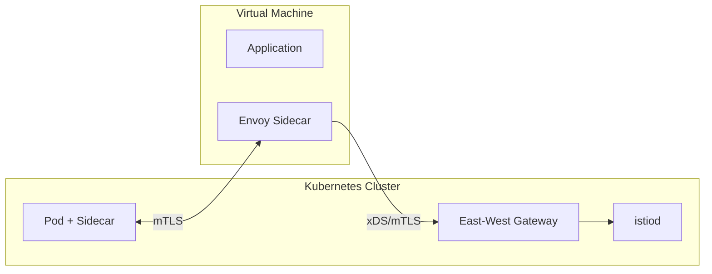

# How to Install Istio on Virtual Machines

Author: [nawazdhandala](https://github.com/nawazdhandala)

Tags: Istio, Virtual Machines, Kubernetes, Service Mesh, Hybrid Cloud

Description: Complete guide to extending your Istio service mesh to include virtual machine workloads running outside of Kubernetes for hybrid deployments.

---

Not everything runs in Kubernetes. Legacy applications, databases, third-party software, and some specialized workloads still live on virtual machines. Istio can extend its mesh to include these VM-based services, giving you the same mTLS, observability, and traffic management features that your Kubernetes workloads enjoy.

Setting up VM integration takes some work, but the result is a unified mesh that spans both Kubernetes and VM workloads.

## How VM Integration Works

When you add a VM to the Istio mesh:

1. A sidecar proxy runs on the VM (just like in a pod)
2. The VM gets a mesh identity through a WorkloadEntry resource
3. The sidecar connects to istiod for configuration
4. Kubernetes services can call the VM service and vice versa
5. mTLS is enforced between all mesh members



## Prerequisites

- A running Istio installation (version 1.14+)
- An east-west gateway exposed outside the cluster
- Network connectivity from the VM to the east-west gateway
- DNS resolution from the VM to the gateway (or use IP directly)

## Step 1: Prepare the Kubernetes Side

Create a namespace for VM workloads:

```bash
kubectl create namespace vm-workloads
kubectl label namespace vm-workloads istio-injection=enabled
```

Install the east-west gateway if you do not have one:

```yaml
# eastwest-gateway.yaml
apiVersion: install.istio.io/v1alpha1
kind: IstioOperator
metadata:
  name: eastwest
spec:
  profile: empty
  components:
    ingressGateways:
      - name: istio-eastwestgateway
        label:
          istio: eastwestgateway
          app: istio-eastwestgateway
        enabled: true
        k8s:
          service:
            ports:
              - name: status-port
                port: 15021
                targetPort: 15021
              - name: tls
                port: 15443
                targetPort: 15443
              - name: tls-istiod
                port: 15012
                targetPort: 15012
              - name: tls-webhook
                port: 15017
                targetPort: 15017
```

```bash
istioctl install -f eastwest-gateway.yaml -y
```

Expose istiod through the east-west gateway:

```yaml
# expose-istiod.yaml
apiVersion: networking.istio.io/v1
kind: Gateway
metadata:
  name: istiod-gateway
  namespace: istio-system
spec:
  selector:
    istio: eastwestgateway
  servers:
    - port:
        number: 15012
        name: tls-istiod
        protocol: TLS
      tls:
        mode: AUTO_PASSTHROUGH
      hosts:
        - "*.local"
---
apiVersion: networking.istio.io/v1
kind: VirtualService
metadata:
  name: istiod-vs
  namespace: istio-system
spec:
  hosts:
    - istiod.istio-system.svc.cluster.local
  gateways:
    - istiod-gateway
  tls:
    - match:
        - port: 15012
          sniHosts:
            - istiod.istio-system.svc.cluster.local
      route:
        - destination:
            host: istiod.istio-system.svc.cluster.local
            port:
              number: 15012
```

```bash
kubectl apply -f expose-istiod.yaml
```

## Step 2: Create a WorkloadGroup

A WorkloadGroup is like a Deployment template for VMs. It defines the mesh identity and metadata for VM workloads:

```yaml
# workload-group.yaml
apiVersion: networking.istio.io/v1
kind: WorkloadGroup
metadata:
  name: my-vm-app
  namespace: vm-workloads
spec:
  metadata:
    labels:
      app: my-vm-app
      version: v1
    annotations: {}
  template:
    serviceAccount: my-vm-app
    network: vm-network
  probe:
    httpGet:
      port: 8080
    initialDelaySeconds: 5
    periodSeconds: 10
```

Create the service account:

```bash
kubectl create serviceaccount my-vm-app -n vm-workloads
```

Apply the WorkloadGroup:

```bash
kubectl apply -f workload-group.yaml
```

## Step 3: Generate VM Bootstrap Files

Use istioctl to generate the files the VM needs:

```bash
istioctl x workload entry configure \
  -f workload-group.yaml \
  -o vm-files \
  --clusterID Kubernetes \
  --autoregister
```

This creates several files in the `vm-files` directory:

- `cluster.env` - Environment variables for the sidecar
- `istio-token` - JWT token for authentication
- `mesh.yaml` - Mesh configuration
- `root-cert.pem` - Root CA certificate
- `hosts` - DNS entries to add

## Step 4: Set Up the Virtual Machine

Copy the generated files to the VM:

```bash
scp -r vm-files/* user@vm-ip:/tmp/istio-vm/
```

SSH into the VM and install the Istio sidecar. On a Debian/Ubuntu VM:

```bash
# Download the Istio sidecar package
curl -LO https://storage.googleapis.com/istio-release/releases/1.24.0/deb/istio-sidecar.deb

# Install it
sudo dpkg -i istio-sidecar.deb
```

For RPM-based systems:

```bash
curl -LO https://storage.googleapis.com/istio-release/releases/1.24.0/rpm/istio-sidecar.rpm
sudo rpm -i istio-sidecar.rpm
```

## Step 5: Configure the VM Sidecar

Move the bootstrap files into the right locations:

```bash
sudo mkdir -p /etc/certs /var/run/secrets/tokens /var/lib/istio/envoy

# Copy certificates
sudo cp /tmp/istio-vm/root-cert.pem /etc/certs/root-cert.pem

# Copy token
sudo cp /tmp/istio-vm/istio-token /var/run/secrets/tokens/istio-token

# Copy cluster environment
sudo cp /tmp/istio-vm/cluster.env /var/lib/istio/envoy/cluster.env

# Copy mesh config
sudo cp /tmp/istio-vm/mesh.yaml /etc/istio/config/mesh

# Add DNS entries
sudo sh -c 'cat /tmp/istio-vm/hosts >> /etc/hosts'

# Set ownership
sudo chown -R istio-proxy:istio-proxy /etc/certs /var/run/secrets /var/lib/istio /etc/istio
```

## Step 6: Start the Sidecar

```bash
sudo systemctl start istio
sudo systemctl enable istio
```

Check the status:

```bash
sudo systemctl status istio
```

Check the proxy logs:

```bash
sudo journalctl -u istio -f
```

## Step 7: Create a Service for the VM

Back on the Kubernetes side, create a Service that includes the VM workload:

```yaml
# vm-service.yaml
apiVersion: v1
kind: Service
metadata:
  name: my-vm-app
  namespace: vm-workloads
  labels:
    app: my-vm-app
spec:
  ports:
    - port: 8080
      name: http
      targetPort: 8080
  selector:
    app: my-vm-app
```

```bash
kubectl apply -f vm-service.yaml
```

If autoregister is enabled, a WorkloadEntry will be created automatically when the VM connects:

```bash
kubectl get workloadentries -n vm-workloads
```

You should see an entry for your VM.

## Step 8: Verify Connectivity

From a Kubernetes pod, call the VM service:

```bash
kubectl exec -n sample deploy/sleep -c sleep -- curl -s http://my-vm-app.vm-workloads:8080/
```

From the VM, call a Kubernetes service:

```bash
curl -s http://httpbin.sample:8000/ip
```

Both directions should work with mTLS encryption.

## Checking mTLS Between Kubernetes and VM

Verify that traffic is encrypted:

```bash
istioctl proxy-config secret -n vm-workloads my-vm-app-workloadentry
```

You should see valid certificates issued by the Istio CA.

## Health Checking

The WorkloadGroup probe configuration tells Istio how to health check the VM:

```yaml
probe:
  httpGet:
    port: 8080
    path: /healthz
  initialDelaySeconds: 10
  periodSeconds: 30
  failureThreshold: 3
```

Unhealthy VMs are automatically removed from the load balancing pool.

## Scaling to Multiple VMs

For multiple VMs running the same service, generate separate bootstrap files for each (with different tokens), but use the same WorkloadGroup. Each VM gets its own WorkloadEntry, and Kubernetes load balances across all of them.

## Troubleshooting

**VM sidecar not connecting**: Check that the east-west gateway IP is reachable from the VM on port 15012:

```bash
nc -zv <eastwest-gateway-ip> 15012
```

**Certificate errors**: Verify the root cert on the VM matches the cluster's CA:

```bash
openssl x509 -in /etc/certs/root-cert.pem -text -noout | head -20
```

**Token expired**: The istio-token has a limited lifetime. Regenerate it:

```bash
istioctl x workload entry configure -f workload-group.yaml -o vm-files --autoregister
```

VM integration with Istio brings your non-Kubernetes workloads into the mesh, giving you consistent security and observability across your entire infrastructure. The setup is more involved than purely Kubernetes-based mesh, but it eliminates the need for separate solutions for VM-to-pod communication.
