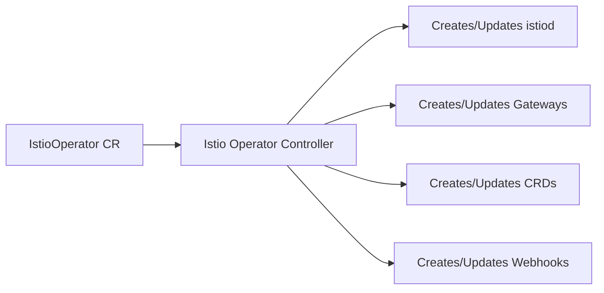

# How to Install Istio Operator for Declarative Management

Author: [nawazdhandala](https://github.com/nawazdhandala)

Tags: Istio, Operator, Kubernetes, Declarative Management, Service Mesh

Description: How to install and use the Istio Operator for declarative, GitOps-friendly management of your Istio service mesh installation and configuration.

---

The Istio Operator lets you manage your Istio installation declaratively using a Kubernetes custom resource. Instead of running `istioctl install` every time you want to change something, you apply an IstioOperator resource and the operator controller reconciles the desired state. This fits naturally into GitOps workflows where everything is managed through version-controlled YAML.

That said, the Istio project has been moving toward recommending Helm-based installation over the operator for new deployments. The operator is still supported and works well, but it is worth knowing both approaches. Here is how to set up and use the Istio Operator.

## How the Operator Works

The Istio Operator runs as a deployment in your cluster. It watches for IstioOperator custom resources and installs or updates Istio based on the spec. When you change the CR, the operator detects the change and reconciles the cluster state.



## Installing the Operator

### Method 1: Using istioctl

```bash
istioctl operator init
```

This deploys the operator controller in the `istio-operator` namespace:

```bash
kubectl get pods -n istio-operator
```

You should see:

```
NAME                              READY   STATUS    RESTARTS   AGE
istio-operator-7c8b6d9f4-abc12   1/1     Running   0          30s
```

### Method 2: Using Helm

```bash
helm install istio-operator istio/operator \
  -n istio-operator --create-namespace \
  --set operatorNamespace=istio-operator \
  --set watchedNamespaces=istio-system
```

### Method 3: Using kubectl

Download the operator manifests and apply them:

```bash
kubectl apply -f https://raw.githubusercontent.com/istio/istio/release-1.24/manifests/charts/istio-operator/templates/
```

## Installing Istio Through the Operator

Now instead of running `istioctl install`, you create an IstioOperator custom resource:

```yaml
# istio-control-plane.yaml
apiVersion: install.istio.io/v1alpha1
kind: IstioOperator
metadata:
  name: istio-control-plane
  namespace: istio-system
spec:
  profile: default
  meshConfig:
    accessLogFile: /dev/stdout
    defaultConfig:
      holdApplicationUntilProxyStarts: true
      proxyMetadata:
        ISTIO_META_DNS_CAPTURE: "true"
  components:
    pilot:
      k8s:
        resources:
          requests:
            cpu: 500m
            memory: 1Gi
        hpaSpec:
          minReplicas: 2
          maxReplicas: 5
    ingressGateways:
      - name: istio-ingressgateway
        enabled: true
        k8s:
          resources:
            requests:
              cpu: 200m
              memory: 128Mi
          service:
            type: LoadBalancer
  values:
    global:
      proxy:
        resources:
          requests:
            cpu: 100m
            memory: 128Mi
          limits:
            cpu: 500m
            memory: 256Mi
```

Apply it:

```bash
kubectl create namespace istio-system
kubectl apply -f istio-control-plane.yaml
```

Watch the operator install Istio:

```bash
kubectl logs -n istio-operator -l name=istio-operator -f
```

Check the installation status:

```bash
kubectl get istiooperator -n istio-system
```

```
NAME                  REVISION   STATUS    AGE
istio-control-plane              HEALTHY   2m
```

## Updating Istio Through the Operator

To change the Istio configuration, just update the CR and apply it:

```yaml
# Change proxy resources
spec:
  values:
    global:
      proxy:
        resources:
          requests:
            cpu: 200m
            memory: 256Mi
```

```bash
kubectl apply -f istio-control-plane.yaml
```

The operator detects the change and updates the installation accordingly. No need to run any `istioctl` commands.

## Using Multiple IstioOperator Resources

You can split your configuration across multiple CRs. This is useful when different teams manage different components:

```yaml
# control-plane.yaml - managed by platform team
apiVersion: install.istio.io/v1alpha1
kind: IstioOperator
metadata:
  name: control-plane
  namespace: istio-system
spec:
  profile: empty
  components:
    base:
      enabled: true
    pilot:
      enabled: true
  meshConfig:
    accessLogFile: /dev/stdout
---
# gateway.yaml - managed by networking team
apiVersion: install.istio.io/v1alpha1
kind: IstioOperator
metadata:
  name: ingress-gateway
  namespace: istio-system
spec:
  profile: empty
  components:
    ingressGateways:
      - name: istio-ingressgateway
        enabled: true
        k8s:
          service:
            type: LoadBalancer
```

```bash
kubectl apply -f control-plane.yaml
kubectl apply -f gateway.yaml
```

## GitOps with the Operator

The operator is a natural fit for GitOps. Store your IstioOperator CRs in a Git repo and let ArgoCD or Flux manage them.

ArgoCD Application example:

```yaml
apiVersion: argoproj.io/v1alpha1
kind: Application
metadata:
  name: istio
  namespace: argocd
spec:
  project: infrastructure
  source:
    repoURL: https://git.company.com/platform/istio-config
    path: overlays/production
    targetRevision: main
  destination:
    server: https://kubernetes.default.svc
    namespace: istio-system
  syncPolicy:
    automated:
      prune: true
      selfHeal: true
```

Your repo structure might look like:

```
istio-config/
  base/
    istio-operator.yaml
  overlays/
    staging/
      kustomization.yaml
      patch-resources.yaml
    production/
      kustomization.yaml
      patch-resources.yaml
```

## Operator Resource Configuration

Configure the operator controller itself:

```yaml
# operator-values.yaml
operatorNamespace: istio-operator

# Which namespaces to watch for IstioOperator CRs
watchedNamespaces: istio-system

# Operator resource limits
resources:
  requests:
    cpu: 50m
    memory: 128Mi
  limits:
    cpu: 200m
    memory: 256Mi
```

## Checking Operator Status

View the operator logs:

```bash
kubectl logs -n istio-operator deploy/istio-operator --tail=50
```

Check reconciliation status:

```bash
kubectl get istiooperator -n istio-system -o jsonpath='{.items[*].status}'
```

The status field shows whether the installation is `HEALTHY`, `RECONCILING`, or `ERROR`.

## Upgrading Istio with the Operator

To upgrade Istio versions:

1. First upgrade the operator to the new version:

```bash
istioctl operator init --revision 1-24
```

2. Update the IstioOperator CR to reference the new version:

```yaml
spec:
  revision: 1-24
  tag: 1.24.0
```

3. Apply the updated CR:

```bash
kubectl apply -f istio-control-plane.yaml
```

For canary upgrades, create a second IstioOperator CR with a different revision:

```yaml
apiVersion: install.istio.io/v1alpha1
kind: IstioOperator
metadata:
  name: istio-canary
  namespace: istio-system
spec:
  revision: canary
  profile: default
```

## Uninstalling Through the Operator

Delete the IstioOperator CR to uninstall Istio:

```bash
kubectl delete istiooperator istio-control-plane -n istio-system
```

The operator will remove all managed resources. Then remove the operator itself:

```bash
istioctl operator remove
```

Or with Helm:

```bash
helm uninstall istio-operator -n istio-operator
```

## Operator vs Helm vs istioctl

Here is when to use each approach:

| Approach | Best For |
|---|---|
| **Operator** | GitOps workflows, automatic reconciliation, declarative management |
| **Helm** | CI/CD pipelines, integration with existing Helm infrastructure |
| **istioctl** | Quick setup, development, ad-hoc changes |

The operator automatically reconciles drift - if someone manually deletes a resource, the operator recreates it. Helm does not do this (though ArgoCD's self-heal does).

## Troubleshooting

**Operator not reconciling**: Check operator logs and the CR status:

```bash
kubectl logs -n istio-operator deploy/istio-operator | grep -i error
kubectl get istiooperator -n istio-system -o yaml | grep -A 10 status
```

**CR stuck in RECONCILING**: There might be a resource that cannot be created. Check events:

```bash
kubectl get events -n istio-system --sort-by=.lastTimestamp | tail -20
```

**Operator not detecting CR changes**: Verify the operator is watching the right namespace:

```bash
kubectl get deploy -n istio-operator istio-operator -o jsonpath='{.spec.template.spec.containers[0].args}'
```

## Wrapping Up

The Istio Operator provides a Kubernetes-native way to manage your Istio installation. Define your desired state in an IstioOperator CR, and the operator handles the rest. It works especially well with GitOps because changes flow through pull requests and are automatically reconciled. While Helm is gaining favor as the primary installation method, the operator remains a solid choice for teams that want fully declarative mesh management with automatic drift detection.
