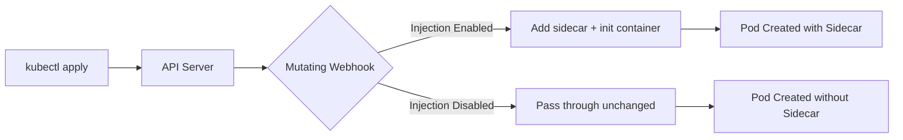

# How to Install Istio Sidecar Injection (Automatic and Manual)

Author: [nawazdhandala](https://github.com/nawazdhandala)

Tags: Istio, Sidecar Injection, Kubernetes, Envoy, Service Mesh

Description: A complete walkthrough of Istio sidecar injection covering both automatic namespace-level injection and manual per-pod injection methods.

---

The Envoy sidecar proxy is the workhorse of Istio. Every pod that participates in the mesh needs one, and there are two ways to get it there: automatic injection (via a mutating webhook) and manual injection (via `istioctl kube-inject`). Each approach has its place, and understanding both gives you the flexibility to handle any scenario.

## How Sidecar Injection Works

When a pod is created in Kubernetes, the API server can call mutating admission webhooks before the pod is actually persisted. Istio registers a webhook that intercepts pod creation requests and adds the Envoy sidecar container plus an init container to the pod spec.



The webhook checks two things:
1. Is the namespace labeled for injection?
2. Does the pod have annotations that override the namespace setting?

## Automatic Sidecar Injection

### Enabling at the Namespace Level

The most common approach is to label your namespace so every pod in it gets a sidecar:

```bash
kubectl label namespace my-app istio-injection=enabled
```

From now on, any pod created in the `my-app` namespace will automatically get an Envoy sidecar.

Verify the label:

```bash
kubectl get namespace my-app --show-labels
```

### Using Revision Labels

If you are running multiple Istio versions (canary upgrades), use revision labels instead:

```bash
kubectl label namespace my-app istio.io/rev=1-24
```

This tells the webhook to use the specific Istio revision `1-24` for injection. Note that `istio-injection` and `istio.io/rev` are mutually exclusive - do not set both on the same namespace.

### Testing Automatic Injection

Deploy a simple pod:

```bash
kubectl run test-pod --image=busybox --restart=Never -n my-app -- sleep 3600
```

Check the pod for sidecar containers:

```bash
kubectl get pod test-pod -n my-app -o jsonpath='{.spec.containers[*].name}'
```

You should see both `test-pod` and `istio-proxy`.

### Excluding Specific Pods

Sometimes you want injection on the namespace but need to skip specific pods. Use the `sidecar.istio.io/inject` annotation:

```yaml
apiVersion: v1
kind: Pod
metadata:
  name: no-sidecar-pod
  namespace: my-app
  annotations:
    sidecar.istio.io/inject: "false"
spec:
  containers:
    - name: app
      image: busybox
      command: ["sleep", "3600"]
```

This pod will not get a sidecar even though the namespace has injection enabled.

### Excluding Specific Containers

You can also prevent the sidecar from intercepting traffic for specific ports if a pod has multiple containers:

```yaml
annotations:
  traffic.sidecar.istio.io/excludeInboundPorts: "8081,8082"
  traffic.sidecar.istio.io/excludeOutboundPorts: "5432"
```

## Manual Sidecar Injection

Manual injection is useful when:
- You do not want namespace-wide injection
- You are debugging injection issues
- You need to see exactly what the webhook would add
- You are working in a CI/CD pipeline that needs explicit control

### Using istioctl kube-inject

Take an existing deployment YAML and pipe it through `istioctl`:

```bash
istioctl kube-inject -f my-deployment.yaml | kubectl apply -f -
```

Or inject into an existing file and save it:

```bash
istioctl kube-inject -f my-deployment.yaml -o my-deployment-injected.yaml
```

### Injecting Into Running Deployments

You can re-inject by getting the current deployment, injecting, and applying:

```bash
kubectl get deployment my-app -n default -o yaml | istioctl kube-inject -f - | kubectl apply -f -
```

### Using a Specific Revision

For manual injection with a specific Istio revision:

```bash
istioctl kube-inject -f my-deployment.yaml --revision 1-24 | kubectl apply -f -
```

### Examining What Gets Injected

To see what the injector adds without actually applying:

```bash
istioctl kube-inject -f my-deployment.yaml --meshConfigMapName=istio -o yaml
```

This is really useful for debugging. You can see the exact sidecar container spec, init container, volumes, and environment variables.

## Customizing Injection

### Proxy Resources

Set resource limits for the sidecar through annotations:

```yaml
annotations:
  sidecar.istio.io/proxyCPU: "200m"
  sidecar.istio.io/proxyCPULimit: "500m"
  sidecar.istio.io/proxyMemory: "128Mi"
  sidecar.istio.io/proxyMemoryLimit: "256Mi"
```

### Custom Proxy Image

Use a different proxy image (useful for debugging):

```yaml
annotations:
  sidecar.istio.io/proxyImage: "docker.io/istio/proxyv2:1.24.0-debug"
```

### Controlling Startup Order

Make sure the sidecar is ready before your application starts:

```yaml
# In the IstioOperator or mesh config
meshConfig:
  defaultConfig:
    holdApplicationUntilProxyStarts: true
```

Or per-pod:

```yaml
annotations:
  proxy.istio.io/config: '{"holdApplicationUntilProxyStarts": true}'
```

### Log Level

Change the sidecar log level for troubleshooting:

```yaml
annotations:
  "sidecar.istio.io/logLevel": debug
  "sidecar.istio.io/componentLogLevel": "misc:error,upstream:debug"
```

## Verifying Injection is Working

### Check the Webhook Configuration

```bash
kubectl get mutatingwebhookconfiguration istio-sidecar-injector -o yaml
```

Look at the `namespaceSelector` to understand what triggers injection.

### Check Injection Status

```bash
istioctl analyze -n my-app
```

This will flag any issues with injection configuration.

### Debug a Specific Pod

```bash
istioctl experimental check-inject -n my-app my-pod
```

This command tells you whether injection would happen for a given pod and why.

## Common Issues

**Pod stuck in Init state**: The init container might be failing. Check init container logs:

```bash
kubectl logs my-pod -n my-app -c istio-init
```

**Webhook not firing**: Make sure the namespace label is correct and the webhook configuration matches:

```bash
kubectl get mutatingwebhookconfiguration -l app=sidecar-injector
```

**Old sidecar version after upgrade**: Pods need to be restarted to get the new sidecar. Rolling restart:

```bash
kubectl rollout restart deployment -n my-app
```

**Injection happening in wrong namespaces**: Check if there is a global default injection setting or stale namespace labels.

## Restarting Pods After Enabling Injection

Labeling a namespace does not retroactively inject sidecars into running pods. You need to restart them:

```bash
# Restart all deployments in the namespace
kubectl rollout restart deployment -n my-app

# Or restart specific deployments
kubectl rollout restart deployment/my-api deployment/my-worker -n my-app
```

## Summary

Automatic injection through namespace labels is the standard approach for most teams. It is simple, consistent, and works well with GitOps workflows. Manual injection has its place for debugging and special cases. Whichever method you use, remember that pods need to be restarted to pick up injection changes, and annotations on individual pods can always override namespace-level settings.
