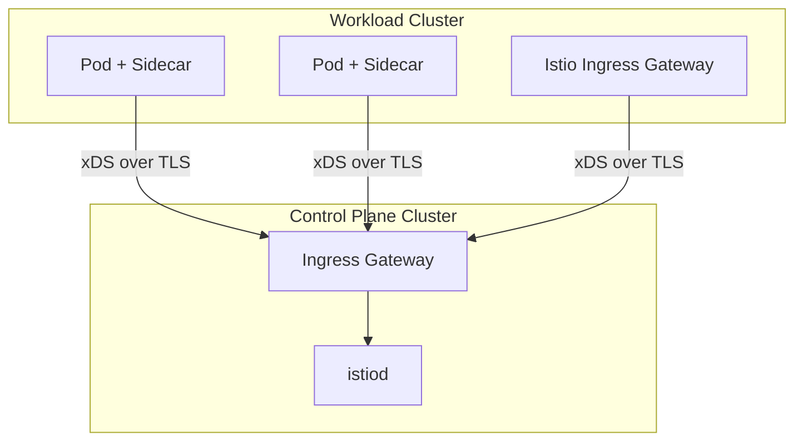

# How to Install Istio with an External Control Plane

Author: [nawazdhandala](https://github.com/nawazdhandala)

Tags: Istio, External Control Plane, Kubernetes, Multi-Cluster, Service Mesh

Description: Step-by-step instructions for deploying Istio with an external control plane that manages remote data plane clusters for centralized mesh management.

---

An external control plane is an Istio deployment model where the control plane (istiod) runs in one cluster and manages the data plane (sidecars) in a completely different cluster. This pattern is common when a central platform team wants to manage the mesh infrastructure without giving workload clusters direct access to the control plane components.

Think of it as a managed Istio service that you run yourself.

## Why Use an External Control Plane?

- **Centralized management**: One control plane for multiple workload clusters
- **Separation of concerns**: Platform team owns the control plane cluster, application teams own workload clusters
- **Resource isolation**: Control plane resources do not compete with application workloads
- **Simplified workload clusters**: Workload clusters only run sidecars and gateways, nothing else
- **Easier upgrades**: Upgrade the control plane independently of workload clusters

## Architecture Overview



## Prerequisites

You need two clusters:
- **Control plane cluster**: Where istiod will run
- **Workload cluster**: Where your applications and sidecars will run

Set up kubeconfig contexts for both:

```bash
# Set context names
export CTX_EXTERNAL_CLUSTER=external-cluster
export CTX_REMOTE_CLUSTER=remote-cluster

# Verify both contexts work
kubectl --context="${CTX_EXTERNAL_CLUSTER}" get nodes
kubectl --context="${CTX_REMOTE_CLUSTER}" get nodes
```

## Step 1: Set Up the External Control Plane Cluster

Create the istio-system namespace:

```bash
kubectl --context="${CTX_EXTERNAL_CLUSTER}" create namespace istio-system
kubectl --context="${CTX_EXTERNAL_CLUSTER}" create namespace istio-config
```

Install Istio on the external cluster with the external control plane profile:

```yaml
# external-istiod.yaml
apiVersion: install.istio.io/v1alpha1
kind: IstioOperator
metadata:
  namespace: istio-system
spec:
  profile: empty
  meshConfig:
    rootNamespace: istio-system
    defaultConfig:
      discoveryAddress: istiod.istio-system.svc:15012
  components:
    base:
      enabled: true
    pilot:
      enabled: true
      k8s:
        env:
          - name: INJECTION_WEBHOOK_CONFIG_NAME
            value: ""
          - name: VALIDATION_WEBHOOK_CONFIG_NAME
            value: ""
          - name: EXTERNAL_ISTIOD
            value: "true"
          - name: CLUSTER_ID
            value: remote-cluster
          - name: SHARED_MESH_CONFIG
            value: istio
  values:
    global:
      istioNamespace: istio-system
```

```bash
istioctl install --context="${CTX_EXTERNAL_CLUSTER}" -f external-istiod.yaml -y
```

## Step 2: Expose istiod to Remote Clusters

The workload cluster needs to reach istiod. Expose it through a gateway or LoadBalancer service:

```yaml
# istiod-gateway.yaml
apiVersion: v1
kind: Service
metadata:
  name: istiod-external
  namespace: istio-system
spec:
  type: LoadBalancer
  selector:
    app: istiod
    istio: pilot
  ports:
    - name: grpc-xds
      port: 15012
      targetPort: 15012
    - name: https-webhook
      port: 443
      targetPort: 15017
```

```bash
kubectl --context="${CTX_EXTERNAL_CLUSTER}" apply -f istiod-gateway.yaml
```

Get the external IP:

```bash
export EXTERNAL_ISTIOD_ADDR=$(kubectl --context="${CTX_EXTERNAL_CLUSTER}" \
  get svc istiod-external -n istio-system \
  -o jsonpath='{.status.loadBalancer.ingress[0].ip}')
echo "External istiod address: ${EXTERNAL_ISTIOD_ADDR}"
```

## Step 3: Create Remote Cluster Secrets

The external control plane needs credentials to access the remote cluster's API server. Create a service account and kubeconfig:

```bash
# Create the istio-reader service account on the remote cluster
istioctl create-remote-secret \
  --context="${CTX_REMOTE_CLUSTER}" \
  --name=remote-cluster \
  --type=remote \
  --namespace=istio-system | \
  kubectl apply -f - --context="${CTX_EXTERNAL_CLUSTER}"
```

This creates a secret in the external cluster that contains credentials to access the remote cluster.

## Step 4: Set Up the Remote Cluster

On the remote (workload) cluster, install a minimal Istio configuration that points sidecars to the external control plane:

```yaml
# remote-config.yaml
apiVersion: install.istio.io/v1alpha1
kind: IstioOperator
metadata:
  namespace: istio-system
spec:
  profile: remote
  values:
    istiodRemote:
      injectionPath: /inject/cluster/remote-cluster/net/network1
    global:
      remotePilotAddress: ${EXTERNAL_ISTIOD_ADDR}
```

Replace `${EXTERNAL_ISTIOD_ADDR}` with the actual IP before applying:

```bash
sed "s/\${EXTERNAL_ISTIOD_ADDR}/${EXTERNAL_ISTIOD_ADDR}/" remote-config.yaml > remote-config-resolved.yaml

istioctl install --context="${CTX_REMOTE_CLUSTER}" -f remote-config-resolved.yaml -y
```

## Step 5: Configure Sidecar Injection on the Remote Cluster

The injection webhook on the remote cluster needs to point to the external istiod:

```yaml
apiVersion: admissionregistration.k8s.io/v1
kind: MutatingWebhookConfiguration
metadata:
  name: istio-sidecar-injector-external
webhooks:
  - name: rev.namespace.sidecar-injector.istio.io
    clientConfig:
      url: https://${EXTERNAL_ISTIOD_ADDR}/inject/cluster/remote-cluster/net/network1
      caBundle: <base64-encoded-CA>
    rules:
      - operations: ["CREATE"]
        apiGroups: [""]
        apiVersions: ["v1"]
        resources: ["pods"]
    namespaceSelector:
      matchLabels:
        istio-injection: enabled
```

## Step 6: Deploy a Test Application

On the remote cluster, create a namespace and enable injection:

```bash
kubectl --context="${CTX_REMOTE_CLUSTER}" create namespace sample
kubectl --context="${CTX_REMOTE_CLUSTER}" label namespace sample istio-injection=enabled
```

Deploy an application:

```yaml
# httpbin.yaml
apiVersion: apps/v1
kind: Deployment
metadata:
  name: httpbin
  namespace: sample
spec:
  replicas: 1
  selector:
    matchLabels:
      app: httpbin
  template:
    metadata:
      labels:
        app: httpbin
    spec:
      containers:
        - name: httpbin
          image: docker.io/kennethreitz/httpbin
          ports:
            - containerPort: 80
---
apiVersion: v1
kind: Service
metadata:
  name: httpbin
  namespace: sample
spec:
  selector:
    app: httpbin
  ports:
    - port: 80
      targetPort: 80
```

```bash
kubectl --context="${CTX_REMOTE_CLUSTER}" apply -f httpbin.yaml
```

## Step 7: Verify the Setup

Check that sidecars are injected and connected to the external control plane:

```bash
# Check pods have sidecars
kubectl --context="${CTX_REMOTE_CLUSTER}" get pods -n sample

# Check proxy status from the external control plane
istioctl --context="${CTX_EXTERNAL_CLUSTER}" proxy-status
```

You should see the remote cluster's pods listed in the proxy-status output.

Check the sidecar is connected to the right control plane:

```bash
kubectl --context="${CTX_REMOTE_CLUSTER}" exec -n sample deploy/httpbin -c istio-proxy -- \
  curl -s localhost:15000/config_dump | grep -o '"cluster_id":"[^"]*"'
```

## Troubleshooting

**Sidecars not connecting**: Check that the external istiod address is reachable from the workload cluster:

```bash
kubectl --context="${CTX_REMOTE_CLUSTER}" run test --rm -it --image=busybox -- \
  nc -zv ${EXTERNAL_ISTIOD_ADDR} 15012
```

**Injection not working**: Verify the webhook configuration points to the right URL and the CA bundle is correct.

**Configuration not syncing**: Check istiod logs on the external cluster for errors related to the remote cluster:

```bash
kubectl --context="${CTX_EXTERNAL_CLUSTER}" logs -n istio-system deploy/istiod | grep "remote-cluster"
```

## Security Considerations

The connection between workload clusters and the external control plane carries sensitive configuration data. Make sure to:

- Use TLS for all xDS connections (enabled by default)
- Restrict network access to the istiod service to only known cluster IPs
- Rotate the remote cluster credentials regularly
- Monitor the external istiod for unauthorized connection attempts

## Wrapping Up

An external control plane is a powerful deployment model for organizations that want centralized mesh management. The setup is more involved than a standard installation, but the operational benefits of having a single point of control for multiple clusters make it worthwhile. Start with one remote cluster to get familiar with the model before adding more.
