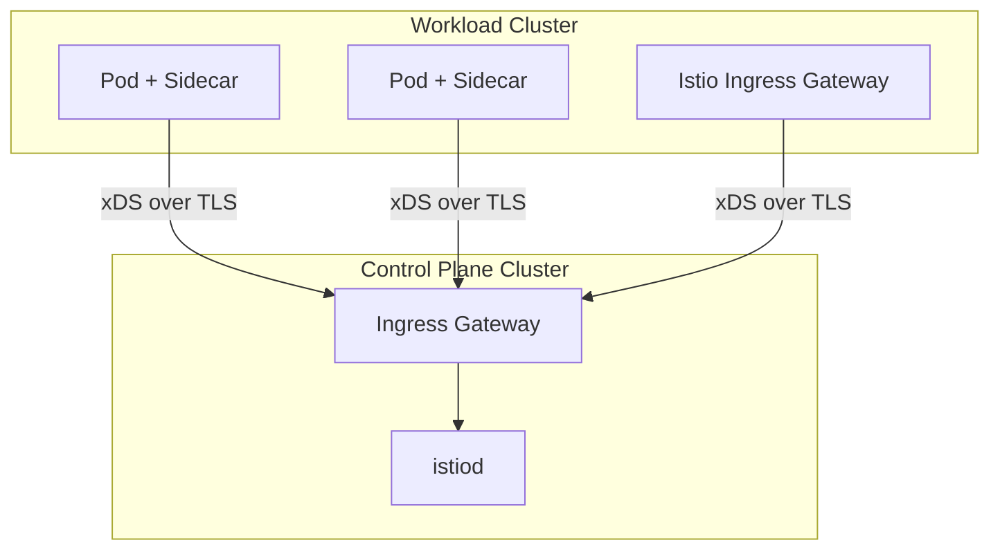

# How to Install Istio with an External Control Plane

Author: [nawazdhandala](https://github.com/nawazdhandala)

Tags: Istio, External Control Plane, Kubernetes, Multi-Cluster, Service Mesh

Description: Step-by-step instructions for deploying Istio with an external control plane that manages remote data plane clusters for centralized mesh management.

---

An external control plane is an Istio deployment model where the control plane (istiod) runs in one cluster and manages the data plane (sidecars) in a completely different cluster. This pattern is common when a central platform team wants to manage the mesh infrastructure without running control plane components inside workload clusters.

Think of it as a managed Istio service that you run yourself.

## Why Use an External Control Plane?

- **Centralized management**: One control plane for multiple workload clusters
- **Separation of concerns**: Platform team owns the control plane cluster, application teams own workload clusters
- **Resource isolation**: Control plane resources do not compete with application workloads
- **Simplified workload clusters**: Workload clusters run sidecars, gateways, webhooks, and configuration resources, but not their own istiod
- **Easier upgrades**: Upgrade the control plane independently of workload clusters

## Architecture Overview


```mermaid
flowchart TB
    subgraph Control Plane Cluster
        istiod[istiod]
        gw[Ingress Gateway]
    end

    subgraph Workload Cluster
        sidecar1[Pod + Sidecar]
        sidecar2[Pod + Sidecar]
        igw[Istio Ingress Gateway]
    end

    sidecar1 -->|xDS over TLS| gw
    sidecar2 -->|xDS over TLS| gw
    igw -->|xDS over TLS| gw
    gw --> istiod
```

## Prerequisites

You need two clusters:
- **Control plane cluster**: Where istiod will run
- **Workload cluster**: Where your applications and sidecars will run

Set up kubeconfig contexts for both:

```bash
# Set context names

export CTX_EXTERNAL_CLUSTER=external-cluster
export CTX_REMOTE_CLUSTER=remote-cluster
export REMOTE_CLUSTER_NAME=remote-cluster

# Verify both contexts work
kubectl --context="${CTX_EXTERNAL_CLUSTER}" get nodes
kubectl --context="${CTX_REMOTE_CLUSTER}" get nodes
```

## Step 1: Set Up the External Cluster Gateway

Create the namespaces used by the external cluster:

```bash
kubectl --context="${CTX_EXTERNAL_CLUSTER}" create namespace istio-system
kubectl --context="${CTX_EXTERNAL_CLUSTER}" create namespace external-istiod
```

Install an ingress gateway on the external cluster. Remote proxies will reach the external istiod through this gateway:

```yaml
# controlplane-gateway.yaml
apiVersion: install.istio.io/v1alpha1
kind: IstioOperator
metadata:
  namespace: istio-system
spec:
  components:
    ingressGateways:
    - name: istio-ingressgateway
      enabled: true
      k8s:
        service:
          ports:
          - port: 15021
            targetPort: 15021
            name: status-port
          - port: 15012
            targetPort: 15012
            name: tls-xds
          - port: 15017
            targetPort: 15017
            name: tls-webhook
```

```bash
istioctl install --context="${CTX_EXTERNAL_CLUSTER}" -f controlplane-gateway.yaml -y
```

## Step 2: Expose istiod to Remote Clusters

The workload cluster needs to reach istiod. For a test environment, use the external IP of the gateway service:

```bash
export EXTERNAL_ISTIOD_ADDR=$(kubectl --context="${CTX_EXTERNAL_CLUSTER}" \
  get svc istio-ingressgateway -n istio-system \
  -o jsonpath='{.status.loadBalancer.ingress[0].ip}')
echo "External istiod address: ${EXTERNAL_ISTIOD_ADDR}"
```

If you have a DNS hostname and a signed TLS certificate for the gateway, use that hostname instead. Using a raw IP address is useful for testing but is not recommended for production.

## Step 3: Set Up the Remote Cluster

On the remote (workload) cluster, install a minimal Istio configuration that points sidecars to the external control plane. Because this first remote cluster also serves as the mesh config cluster, enable `global.configCluster` and `pilot.configMap`:

```yaml
# remote-config-cluster.yaml
apiVersion: install.istio.io/v1alpha1
kind: IstioOperator
metadata:
  namespace: external-istiod
spec:
  profile: remote
  values:
    global:
      istioNamespace: external-istiod
      configCluster: true
      remotePilotAddress: ${EXTERNAL_ISTIOD_ADDR}
    pilot:
      configMap: true
    istiodRemote:
      injectionPath: /inject/cluster/${REMOTE_CLUSTER_NAME}/net/network1
```

Replace `${EXTERNAL_ISTIOD_ADDR}` and `${REMOTE_CLUSTER_NAME}` before applying:

```bash
kubectl --context="${CTX_REMOTE_CLUSTER}" create namespace external-istiod

sed \
  -e "s/\${EXTERNAL_ISTIOD_ADDR}/${EXTERNAL_ISTIOD_ADDR}/" \
  -e "s/\${REMOTE_CLUSTER_NAME}/${REMOTE_CLUSTER_NAME}/" \
  remote-config-cluster.yaml > remote-config-cluster-resolved.yaml

istioctl install --context="${CTX_REMOTE_CLUSTER}" \
  -f remote-config-cluster-resolved.yaml \
  --set values.defaultRevision=default \
  -y
```

## Step 4: Create Remote Cluster Secrets

The external control plane needs credentials to access the remote cluster's API server. Create a secret for the config cluster and apply it to the external cluster:

```bash
istioctl create-remote-secret \
  --context="${CTX_REMOTE_CLUSTER}" \
  --type=config \
  --namespace=external-istiod \
  --service-account=istiod \
  --create-service-account=false | \
  kubectl apply -f - --context="${CTX_EXTERNAL_CLUSTER}"
```

This creates a secret in the external cluster that contains credentials to access the remote cluster.

## Step 5: Install the External Control Plane

Install istiod in the `external-istiod` namespace on the external cluster:

```yaml
# external-istiod.yaml
apiVersion: install.istio.io/v1alpha1
kind: IstioOperator
metadata:
  namespace: external-istiod
spec:
  profile: empty
  meshConfig:
    rootNamespace: external-istiod
    defaultConfig:
      discoveryAddress: ${EXTERNAL_ISTIOD_ADDR}:15012
  components:
    pilot:
      enabled: true
      k8s:
        overlays:
        - kind: Deployment
          name: istiod
          patches:
          - path: spec.template.spec.volumes[100]
            value: |-
              name: config-volume
              configMap:
                name: istio
          - path: spec.template.spec.volumes[100]
            value: |-
              name: inject-volume
              configMap:
                name: istio-sidecar-injector
          - path: spec.template.spec.containers[0].volumeMounts[100]
            value: |-
              name: config-volume
              mountPath: /etc/istio/config
          - path: spec.template.spec.containers[0].volumeMounts[100]
            value: |-
              name: inject-volume
              mountPath: /var/lib/istio/inject
        env:
        - name: INJECTION_WEBHOOK_CONFIG_NAME
          value: istio-sidecar-injector-external-istiod
        - name: VALIDATION_WEBHOOK_CONFIG_NAME
          value: istio-validator-external-istiod
        - name: EXTERNAL_ISTIOD
          value: "true"
        - name: LOCAL_CLUSTER_SECRET_WATCHER
          value: "true"
        - name: CLUSTER_ID
          value: ${REMOTE_CLUSTER_NAME}
        - name: SHARED_MESH_CONFIG
          value: istio
  values:
    global:
      externalIstiod: true
      caAddress: ${EXTERNAL_ISTIOD_ADDR}:15012
      istioNamespace: external-istiod
      operatorManageWebhooks: true
      configValidation: false
      meshID: mesh1
      multiCluster:
        clusterName: ${REMOTE_CLUSTER_NAME}
      network: network1
```

Replace the environment variables before applying:

```bash
sed \
  -e "s/\${EXTERNAL_ISTIOD_ADDR}/${EXTERNAL_ISTIOD_ADDR}/" \
  -e "s/\${REMOTE_CLUSTER_NAME}/${REMOTE_CLUSTER_NAME}/" \
  external-istiod.yaml > external-istiod-resolved.yaml

istioctl install --context="${CTX_EXTERNAL_CLUSTER}" -f external-istiod-resolved.yaml -y
```

Route xDS and webhook traffic from the gateway to the external istiod:

```yaml
# external-istiod-gw.yaml
apiVersion: networking.istio.io/v1
kind: Gateway
metadata:
  name: external-istiod-gw
  namespace: external-istiod
spec:
  selector:
    istio: ingressgateway
  servers:
  - port:
      number: 15012
      protocol: tls
      name: tls-xds
    tls:
      mode: PASSTHROUGH
    hosts:
    - "*"
  - port:
      number: 15017
      protocol: tls
      name: tls-webhook
    tls:
      mode: PASSTHROUGH
    hosts:
    - "*"
---
apiVersion: networking.istio.io/v1
kind: VirtualService
metadata:
  name: external-istiod-vs
  namespace: external-istiod
spec:
  hosts:
  - "*"
  gateways:
  - external-istiod-gw
  tls:
  - match:
    - port: 15012
      sniHosts:
      - "*"
    route:
    - destination:
        host: istiod.external-istiod.svc.cluster.local
        port:
          number: 15012
  - match:
    - port: 15017
      sniHosts:
      - "*"
    route:
    - destination:
        host: istiod.external-istiod.svc.cluster.local
        port:
          number: 443
```

```bash
kubectl --context="${CTX_EXTERNAL_CLUSTER}" apply -f external-istiod-gw.yaml
```

## Step 6: Configure Sidecar Injection on the Remote Cluster

The remote profile installs the injection webhook for you. Verify that the webhook exists and points to the external istiod:

```bash
kubectl --context="${CTX_REMOTE_CLUSTER}" get mutatingwebhookconfiguration
kubectl --context="${CTX_REMOTE_CLUSTER}" get validatingwebhookconfiguration
```

## Step 7: Deploy a Test Application

On the remote cluster, create a namespace and enable injection:

```bash
kubectl --context="${CTX_REMOTE_CLUSTER}" create namespace sample
kubectl --context="${CTX_REMOTE_CLUSTER}" label namespace sample istio-injection=enabled
```

Deploy an application:

```yaml
# httpbin.yaml
apiVersion: apps/v1
kind: Deployment
metadata:
  name: httpbin
  namespace: sample
spec:
  replicas: 1
  selector:
    matchLabels:
      app: httpbin
  template:
    metadata:
      labels:
        app: httpbin
    spec:
      containers:
        - name: httpbin
          image: docker.io/kennethreitz/httpbin
          ports:
            - containerPort: 80
---
apiVersion: v1
kind: Service
metadata:
  name: httpbin
  namespace: sample
spec:
  selector:
    app: httpbin
  ports:
    - port: 80
      targetPort: 80
```

```bash
kubectl --context="${CTX_REMOTE_CLUSTER}" apply -f httpbin.yaml
```

## Step 8: Verify the Setup

Check that sidecars are injected and connected to the external control plane:

```bash
# Check pods have sidecars
kubectl --context="${CTX_REMOTE_CLUSTER}" get pods -n sample

# Check proxy status from the external control plane
istioctl --context="${CTX_EXTERNAL_CLUSTER}" --istioNamespace external-istiod proxy-status
```

You should see the remote cluster's pods listed in the proxy-status output.

Check the sidecar is connected to the right control plane:

```bash
kubectl --context="${CTX_REMOTE_CLUSTER}" exec -n sample deploy/httpbin -c istio-proxy -- \
  pilot-agent request GET config_dump | grep -o '"cluster_id":"[^"]*"'
```

## Troubleshooting

**Sidecars not connecting**: Check that the external istiod address is reachable from the workload cluster:

```bash
kubectl --context="${CTX_REMOTE_CLUSTER}" run test --rm -it --image=busybox -- \
  nc -zv ${EXTERNAL_ISTIOD_ADDR} 15012
```

**Injection not working**: Verify the webhook configuration points to the right URL and the CA bundle is correct.

**Configuration not syncing**: Check istiod logs on the external cluster for errors related to the remote cluster:

```bash
kubectl --context="${CTX_EXTERNAL_CLUSTER}" logs -n external-istiod deploy/istiod | grep "${REMOTE_CLUSTER_NAME}"
```

## Security Considerations

The connection between workload clusters and the external control plane carries sensitive configuration data. Make sure to:

- Use TLS for all xDS connections (enabled by default)
- Restrict network access to the istiod service to only known cluster IPs
- Rotate the remote cluster credentials regularly
- Monitor the external istiod for unauthorized connection attempts

## Wrapping Up

An external control plane is a powerful deployment model for organizations that want centralized mesh management. The setup is more involved than a standard installation, but the operational benefits of having a single point of control for multiple clusters make it worthwhile. Start with one remote cluster to get familiar with the model before adding more.
