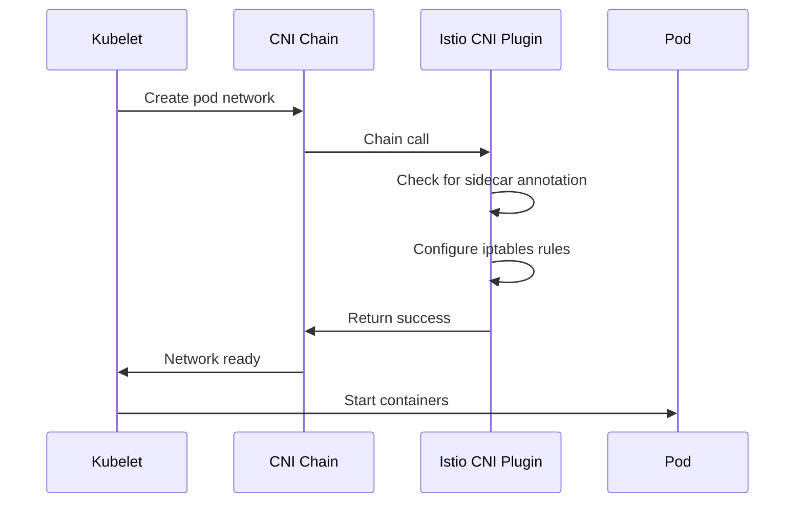

# How to Install the Istio CNI Node Agent

Author: [nawazdhandala](https://github.com/nawazdhandala)

Tags: Istio, CNI, Kubernetes, Networking, Security, Service Mesh

Description: Complete guide to installing and configuring the Istio CNI node agent to eliminate the need for privileged init containers in your service mesh.

---

By default, Istio uses an init container called `istio-init` in every pod to set up iptables rules that redirect traffic through the Envoy sidecar. This init container needs `NET_ADMIN` and `NET_RAW` capabilities, which is a problem if your cluster enforces strict security policies.

The Istio CNI node agent solves this by moving the traffic redirection logic to a node-level DaemonSet. Instead of each pod configuring its own iptables rules, the CNI plugin handles it during pod creation as part of the container networking setup.

## How the Istio CNI Plugin Works

When a pod is scheduled on a node, the container runtime calls the CNI plugins in a chain. The Istio CNI plugin sits in this chain and:

1. Detects if the pod has sidecar injection enabled
2. Sets up the iptables rules for traffic interception at the node level
3. Does this before the pod containers even start

This means your application pods never need elevated privileges. The CNI plugin DaemonSet runs with the necessary permissions, but individual pods stay unprivileged.



## Installing with istioctl

The simplest installation method:

```yaml
# istio-cni.yaml
apiVersion: install.istio.io/v1alpha1
kind: IstioOperator
spec:
  components:
    cni:
      enabled: true
      namespace: istio-system
  values:
    cni:
      cniBinDir: /opt/cni/bin
      cniConfDir: /etc/cni/net.d
      chained: true
      excludeNamespaces:
        - istio-system
        - kube-system
        - kube-node-lease
```

```bash
istioctl install -f istio-cni.yaml -y
```

## Installing with Helm

With Helm, you install the CNI as a separate chart:

```bash
# Add the Istio repo
helm repo add istio https://istio-release.storage.googleapis.com/charts
helm repo update

# Install base CRDs first
helm install istio-base istio/base -n istio-system --create-namespace

# Install the CNI plugin
helm install istio-cni istio/cni -n istio-system \
  --set cni.cniBinDir=/opt/cni/bin \
  --set cni.cniConfDir=/etc/cni/net.d

# Install istiod with CNI awareness
helm install istiod istio/istiod -n istio-system \
  --set istio_cni.enabled=true \
  --set istio_cni.chained=true
```

## CNI Binary and Config Directory Paths

Different Kubernetes distributions place CNI files in different locations. Here are the common ones:

| Distribution | Binary Dir | Config Dir |
|---|---|---|
| Standard kubeadm | /opt/cni/bin | /etc/cni/net.d |
| GKE | /home/kubernetes/bin | /etc/cni/net.d |
| OpenShift | /var/lib/cni/bin | /etc/cni/multus/net.d |
| k3s | /opt/cni/bin | /var/lib/rancher/k3s/agent/etc/cni/net.d |
| MicroK8s | /opt/cni/bin | /var/snap/microk8s/current/args/cni-network |

If you are running on GKE:

```bash
helm install istio-cni istio/cni -n istio-system \
  --set cni.cniBinDir=/home/kubernetes/bin \
  --set cni.cniConfDir=/etc/cni/net.d
```

## Verifying the CNI Installation

Check that the CNI DaemonSet is running on all nodes:

```bash
kubectl get daemonset -n istio-system istio-cni-node
```

You should see one pod per node in the `READY` column:

```
NAME             DESIRED   CURRENT   READY   UP-TO-DATE   AVAILABLE
istio-cni-node   3         3         3       3            3
```

Check the logs for any errors:

```bash
kubectl logs -n istio-system -l k8s-app=istio-cni-node --tail=50
```

Verify the CNI binary was installed:

```bash
kubectl debug node/<node-name> -it --image=busybox -- ls /host/opt/cni/bin/ | grep istio
```

You should see `istio-cni` in the list.

Check the CNI config was chained properly:

```bash
kubectl debug node/<node-name> -it --image=busybox -- cat /host/etc/cni/net.d/10-calico.conflist
```

Look for the `istio-cni` entry in the plugins array.

## Testing Without Init Containers

Deploy a test application:

```bash
kubectl create namespace cni-test
kubectl label namespace cni-test istio-injection=enabled

kubectl run httpbin --image=kennethreitz/httpbin --port=80 -n cni-test
```

Check the pod - there should be no `istio-init` init container:

```bash
kubectl get pod -n cni-test -o jsonpath='{range .items[*]}{.metadata.name}{"\t"}{.spec.initContainers[*].name}{"\n"}{end}'
```

With CNI properly configured, you should see no init containers (or possibly just `istio-validation` but not `istio-init`).

Verify traffic interception is working:

```bash
kubectl exec -n cni-test deploy/httpbin -c istio-proxy -- curl -s localhost:15000/config_dump | head -20
```

## CNI Plugin Configuration Options

Here is a more detailed Helm values file for the CNI chart:

```yaml
# values-cni.yaml
cni:
  # Install CNI as a chained plugin (recommended)
  chained: true

  # CNI binary and config directories
  cniBinDir: /opt/cni/bin
  cniConfDir: /etc/cni/net.d

  # Namespaces to exclude from CNI interception
  excludeNamespaces:
    - istio-system
    - kube-system
    - kube-node-lease
    - kube-public

  # Log level for the CNI plugin
  logLevel: info

  # Repair mode - automatically fix pods that failed due to race conditions
  repair:
    enabled: true
    deletePods: false
    labelPods: true
    brokenPodLabelKey: cni.istio.io/uninitialized
    brokenPodLabelValue: "true"
    initContainerName: istio-validation

  # Resource requests and limits for the CNI DaemonSet
  resources:
    requests:
      cpu: 100m
      memory: 100Mi
    limits:
      cpu: 200m
      memory: 256Mi

  # Ambient mode settings (if using ambient mesh)
  ambient:
    enabled: false

  # Run as a privileged container (required for iptables)
  privileged: true
```

```bash
helm install istio-cni istio/cni -n istio-system -f values-cni.yaml
```

## Handling CNI Race Conditions

There is a known race condition where a pod might start before the CNI plugin finishes its setup. Istio includes a repair controller to handle this:

```yaml
cni:
  repair:
    enabled: true
    deletePods: true
```

When `deletePods` is true, the repair controller will delete and let Kubernetes recreate pods that hit the race condition. If you prefer a gentler approach, use `labelPods: true` instead, which just labels the affected pods for manual intervention.

## Upgrading the CNI Plugin

When upgrading Istio, upgrade the CNI plugin first since it is a node-level component:

```bash
# Upgrade CNI first
helm upgrade istio-cni istio/cni -n istio-system \
  -f values-cni.yaml \
  --version 1.24.0

# Wait for rollout
kubectl rollout status daemonset/istio-cni-node -n istio-system

# Then upgrade istiod
helm upgrade istiod istio/istiod -n istio-system \
  --set istio_cni.enabled=true \
  --version 1.24.0
```

## Uninstalling the CNI Plugin

If you need to remove the CNI plugin:

```bash
helm uninstall istio-cni -n istio-system
```

After removal, you will need to restart pods so they get `istio-init` containers again, or reinstall Istio without the CNI flag.

## Troubleshooting

**Pods stuck in Init state**: The CNI plugin might not be installed on the node yet. Check the DaemonSet status and node logs.

**Traffic not being intercepted**: Verify the CNI config file has the istio-cni plugin listed. The CNI plugin must be in the chain after the primary network plugin.

**CNI plugin not found errors**: Check that `cniBinDir` matches your cluster's actual CNI binary location.

The Istio CNI node agent is the recommended approach for any cluster that takes security seriously. It removes the need for elevated pod privileges and integrates naturally with Kubernetes networking. The small overhead of running a DaemonSet is well worth the security benefits.
