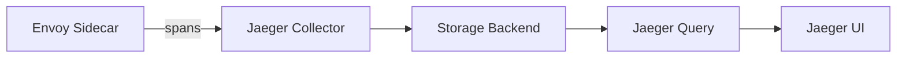

# How to Integrate Jaeger with Istio for Distributed Tracing

Author: [nawazdhandala](https://github.com/nawazdhandala)

Tags: Istio, Jaeger, Distributed Tracing, Observability, Kubernetes

Description: Step-by-step guide to integrating Jaeger with Istio for distributed tracing, including installation, configuration, and production best practices.

---

Jaeger is probably the most popular open-source distributed tracing backend, and it pairs naturally with Istio. The Envoy sidecars in your mesh generate trace spans for every request, and Jaeger collects, stores, and visualizes them. Getting the integration working is straightforward, but there are decisions to make around deployment architecture, storage backends, and sampling that affect how well it works in production.

## Jaeger Architecture Overview

Jaeger has several components:



- **Collector** - Receives spans from Envoy sidecars
- **Storage Backend** - Stores trace data (in-memory, Cassandra, Elasticsearch, or Kafka)
- **Query** - Serves the API for retrieving traces
- **UI** - Web interface for viewing and searching traces

For development, the `all-in-one` image bundles everything with in-memory storage. For production, you'll want separate components with persistent storage.

## Development Setup: Jaeger All-in-One

The fastest way to get started:

```yaml
apiVersion: apps/v1
kind: Deployment
metadata:
  name: jaeger
  namespace: observability
spec:
  replicas: 1
  selector:
    matchLabels:
      app: jaeger
  template:
    metadata:
      labels:
        app: jaeger
    spec:
      containers:
        - name: jaeger
          image: jaegertracing/all-in-one:1.54
          env:
            - name: COLLECTOR_ZIPKIN_HOST_PORT
              value: ":9411"
          ports:
            - containerPort: 5775
              protocol: UDP
            - containerPort: 6831
              protocol: UDP
            - containerPort: 6832
              protocol: UDP
            - containerPort: 5778
            - containerPort: 16686
            - containerPort: 14268
            - containerPort: 14250
            - containerPort: 9411
            - containerPort: 4317
            - containerPort: 4318
          resources:
            limits:
              memory: 1Gi
            requests:
              memory: 256Mi
---
apiVersion: v1
kind: Service
metadata:
  name: jaeger-collector
  namespace: observability
spec:
  selector:
    app: jaeger
  ports:
    - name: zipkin
      port: 9411
    - name: grpc-otlp
      port: 4317
    - name: http-otlp
      port: 4318
    - name: jaeger-thrift
      port: 14268
    - name: model-proto
      port: 14250
---
apiVersion: v1
kind: Service
metadata:
  name: jaeger-query
  namespace: observability
spec:
  selector:
    app: jaeger
  ports:
    - name: query-http
      port: 16686
```

```bash
kubectl create namespace observability
kubectl apply -f jaeger-dev.yaml
```

## Configuring Istio to Send Traces to Jaeger

Istio can send traces to Jaeger using the Zipkin protocol (which Jaeger supports) or OpenTelemetry. The Zipkin approach is simpler and well-tested:

```yaml
apiVersion: install.istio.io/v1alpha1
kind: IstioOperator
spec:
  meshConfig:
    enableTracing: true
    defaultConfig:
      tracing:
        sampling: 100
    extensionProviders:
      - name: jaeger
        zipkin:
          service: jaeger-collector.observability.svc.cluster.local
          port: 9411
```

Activate the provider with a Telemetry resource:

```yaml
apiVersion: telemetry.istio.io/v1
kind: Telemetry
metadata:
  name: jaeger-tracing
  namespace: istio-system
spec:
  tracing:
    - providers:
        - name: jaeger
      randomSamplingPercentage: 100
```

If Istio is already installed, update the mesh config:

```bash
kubectl edit configmap istio -n istio-system
```

Add the extension provider configuration under the `mesh` key, then restart istiod:

```bash
kubectl rollout restart deployment/istiod -n istio-system
```

## Using OpenTelemetry Protocol Instead

For newer setups, you might prefer OTLP (OpenTelemetry Protocol), which Jaeger supports natively since version 1.35:

```yaml
apiVersion: install.istio.io/v1alpha1
kind: IstioOperator
spec:
  meshConfig:
    enableTracing: true
    extensionProviders:
      - name: jaeger-otel
        opentelemetry:
          service: jaeger-collector.observability.svc.cluster.local
          port: 4317
```

```yaml
apiVersion: telemetry.istio.io/v1
kind: Telemetry
metadata:
  name: jaeger-otel-tracing
  namespace: istio-system
spec:
  tracing:
    - providers:
        - name: jaeger-otel
      randomSamplingPercentage: 10
```

## Production Setup: Jaeger with Elasticsearch

For production, in-memory storage won't cut it. Elasticsearch is a popular backend for Jaeger because it handles the query patterns well:

```yaml
apiVersion: apps/v1
kind: Deployment
metadata:
  name: jaeger-collector
  namespace: observability
spec:
  replicas: 3
  selector:
    matchLabels:
      app: jaeger-collector
  template:
    metadata:
      labels:
        app: jaeger-collector
    spec:
      containers:
        - name: jaeger-collector
          image: jaegertracing/jaeger-collector:1.54
          env:
            - name: SPAN_STORAGE_TYPE
              value: elasticsearch
            - name: ES_SERVER_URLS
              value: http://elasticsearch.observability:9200
            - name: ES_INDEX_PREFIX
              value: jaeger
            - name: COLLECTOR_ZIPKIN_HOST_PORT
              value: ":9411"
            - name: COLLECTOR_OTLP_ENABLED
              value: "true"
          ports:
            - containerPort: 9411
            - containerPort: 14268
            - containerPort: 14250
            - containerPort: 4317
            - containerPort: 4318
          resources:
            requests:
              cpu: 500m
              memory: 512Mi
            limits:
              cpu: "1"
              memory: 1Gi
---
apiVersion: apps/v1
kind: Deployment
metadata:
  name: jaeger-query
  namespace: observability
spec:
  replicas: 2
  selector:
    matchLabels:
      app: jaeger-query
  template:
    metadata:
      labels:
        app: jaeger-query
    spec:
      containers:
        - name: jaeger-query
          image: jaegertracing/jaeger-query:1.54
          env:
            - name: SPAN_STORAGE_TYPE
              value: elasticsearch
            - name: ES_SERVER_URLS
              value: http://elasticsearch.observability:9200
            - name: ES_INDEX_PREFIX
              value: jaeger
          ports:
            - containerPort: 16686
          resources:
            requests:
              cpu: 250m
              memory: 256Mi
```

## Index Management

Jaeger creates daily indices in Elasticsearch. Without cleanup, they'll grow indefinitely. Use Jaeger's built-in index cleaner:

```yaml
apiVersion: batch/v1
kind: CronJob
metadata:
  name: jaeger-es-index-cleaner
  namespace: observability
spec:
  schedule: "0 2 * * *"
  jobTemplate:
    spec:
      template:
        spec:
          containers:
            - name: index-cleaner
              image: jaegertracing/jaeger-es-index-cleaner:1.54
              args:
                - "14"
                - http://elasticsearch.observability:9200
              env:
                - name: INDEX_PREFIX
                  value: jaeger
          restartPolicy: OnFailure
```

This keeps 14 days of trace data. Adjust based on your retention requirements.

## Accessing the Jaeger UI

Set up access to the Jaeger UI:

```bash
# Port forward for quick access
kubectl port-forward svc/jaeger-query -n observability 16686:16686
```

For permanent access, create an Ingress or use Istio's Gateway:

```yaml
apiVersion: networking.istio.io/v1
kind: Gateway
metadata:
  name: jaeger-gateway
  namespace: observability
spec:
  selector:
    istio: ingressgateway
  servers:
    - port:
        number: 80
        name: http
        protocol: HTTP
      hosts:
        - jaeger.example.com
---
apiVersion: networking.istio.io/v1
kind: VirtualService
metadata:
  name: jaeger-vs
  namespace: observability
spec:
  hosts:
    - jaeger.example.com
  gateways:
    - jaeger-gateway
  http:
    - route:
        - destination:
            host: jaeger-query
            port:
              number: 16686
```

## Verifying the Integration

Generate traffic and check for traces:

```bash
# Deploy sample app if not already deployed
kubectl apply -f https://raw.githubusercontent.com/istio/istio/release-1.24/samples/bookinfo/platform/kube/bookinfo.yaml

# Generate traffic
for i in $(seq 1 50); do
  kubectl exec deploy/sleep -- curl -s http://productpage:9080/productpage > /dev/null
done

# Check Jaeger API directly
kubectl exec -n observability deploy/jaeger -- \
  wget -qO- "http://localhost:16686/api/services" | python3 -m json.tool
```

You should see services like `productpage.default`, `details.default`, `reviews.default`, and `ratings.default` in the Jaeger UI.

## Troubleshooting

If traces don't appear in Jaeger:

```bash
# Check if the collector is receiving spans
kubectl logs deploy/jaeger-collector -n observability | grep "spans received"

# Verify Envoy is configured to send traces
istioctl proxy-config bootstrap deploy/productpage -o json | grep -A10 tracing

# Check for connectivity issues
kubectl exec deploy/productpage -c istio-proxy -- \
  curl -s http://jaeger-collector.observability:9411/api/v2/spans
```

If traces appear but are disconnected (single-span traces), your application isn't propagating trace headers. This is an application-level fix, not an Istio configuration issue.

## Performance Tuning

For high-traffic clusters, tune the Jaeger collector:

```yaml
env:
  - name: COLLECTOR_QUEUE_SIZE
    value: "5000"
  - name: COLLECTOR_NUM_WORKERS
    value: "100"
```

And consider using Kafka as a buffer between collectors and storage:

```yaml
env:
  - name: SPAN_STORAGE_TYPE
    value: kafka
  - name: KAFKA_PRODUCER_BROKERS
    value: kafka.observability:9092
  - name: KAFKA_PRODUCER_TOPIC
    value: jaeger-spans
```

This decouples span ingestion from storage writes, preventing backpressure from affecting your mesh's trace reporting.

## Summary

Jaeger integrates smoothly with Istio through either the Zipkin protocol or OpenTelemetry. Start with the all-in-one deployment for development, then move to a production setup with Elasticsearch storage, multiple collector replicas, and automated index cleanup. The most important thing beyond the infrastructure is making sure your applications propagate trace headers - without that, you'll get spans but not connected traces.
