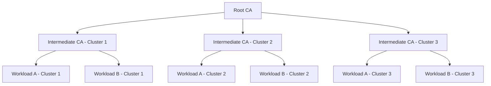

# How to Manage CA Certificates Across Multiple Clusters in Istio

Author: [nawazdhandala](https://github.com/nawazdhandala)

Tags: Istio, Certificate, Multi-Cluster, CA, Security, Service Mesh

Description: A hands-on guide to managing CA certificate hierarchies across multiple Kubernetes clusters running Istio for secure cross-cluster communication.

---

Running Istio across multiple Kubernetes clusters introduces a significant challenge around certificate management. Workloads in different clusters need to trust each other for mTLS to work, and that means their CA certificates need to be coordinated. Get this wrong, and cross-cluster communication silently fails with TLS handshake errors.

There are two main approaches: shared root CA with per-cluster intermediate CAs, or separate root CAs with cross-trust. The first approach is more common and what we will focus on here.

## The Shared Root CA Model

The recommended approach for multi-cluster Istio is to use a single root CA and issue intermediate CA certificates for each cluster. Each cluster's istiod acts as an intermediate CA, signing workload certificates locally, but all certificates chain back to the same root.



This model means that workload A in Cluster 1 can verify workload B in Cluster 2 because both certificates chain back to the same root.

## Step 1: Generate the Root CA

Start by generating a root CA that will be shared across all clusters. Keep this root CA offline and extremely secure - it is the trust anchor for your entire mesh.

```bash
# Create a directory structure
mkdir -p certs
cd certs

# Generate root CA private key
openssl genrsa -out root-key.pem 4096

# Generate root CA certificate
openssl req -new -x509 -key root-key.pem -out root-cert.pem -days 3650 \
  -subj "/O=MyOrganization/CN=Root CA" \
  -addext "basicConstraints=critical,CA:TRUE" \
  -addext "keyUsage=critical,keyCertSign,cRLSign"
```

Verify the root certificate:

```bash
openssl x509 -in root-cert.pem -text -noout
```

## Step 2: Generate Intermediate CAs for Each Cluster

For each cluster, generate a unique intermediate CA certificate signed by the root:

```bash
# Cluster 1 intermediate CA
openssl genrsa -out cluster1-ca-key.pem 4096

openssl req -new -key cluster1-ca-key.pem -out cluster1-ca-csr.pem \
  -subj "/O=MyOrganization/CN=Cluster 1 Intermediate CA"

openssl x509 -req -in cluster1-ca-csr.pem \
  -CA root-cert.pem -CAkey root-key.pem -CAcreateserial \
  -out cluster1-ca-cert.pem -days 730 \
  -extfile <(printf "basicConstraints=critical,CA:TRUE,pathlen:0\nkeyUsage=critical,keyCertSign,cRLSign\nsubjectAltName=URI:spiffe://cluster.local")

# Create the certificate chain
cat cluster1-ca-cert.pem root-cert.pem > cluster1-cert-chain.pem
```

Repeat for Cluster 2:

```bash
openssl genrsa -out cluster2-ca-key.pem 4096

openssl req -new -key cluster2-ca-key.pem -out cluster2-ca-csr.pem \
  -subj "/O=MyOrganization/CN=Cluster 2 Intermediate CA"

openssl x509 -req -in cluster2-ca-csr.pem \
  -CA root-cert.pem -CAkey root-key.pem -CAcreateserial \
  -out cluster2-ca-cert.pem -days 730 \
  -extfile <(printf "basicConstraints=critical,CA:TRUE,pathlen:0\nkeyUsage=critical,keyCertSign,cRLSign\nsubjectAltName=URI:spiffe://cluster.local")

cat cluster2-ca-cert.pem root-cert.pem > cluster2-cert-chain.pem
```

## Step 3: Install CA Certificates in Each Cluster

Istio reads its CA certificates from a Kubernetes secret named `cacerts` in the `istio-system` namespace. Create this secret in each cluster with the appropriate intermediate CA.

For Cluster 1:

```bash
kubectl create namespace istio-system --context=cluster1

kubectl create secret generic cacerts -n istio-system --context=cluster1 \
  --from-file=ca-cert.pem=cluster1-ca-cert.pem \
  --from-file=ca-key.pem=cluster1-ca-key.pem \
  --from-file=root-cert.pem=root-cert.pem \
  --from-file=cert-chain.pem=cluster1-cert-chain.pem
```

For Cluster 2:

```bash
kubectl create namespace istio-system --context=cluster2

kubectl create secret generic cacerts -n istio-system --context=cluster2 \
  --from-file=ca-cert.pem=cluster2-ca-cert.pem \
  --from-file=ca-key.pem=cluster2-ca-key.pem \
  --from-file=root-cert.pem=root-cert.pem \
  --from-file=cert-chain.pem=cluster2-cert-chain.pem
```

Notice that both clusters get the same `root-cert.pem`. This is what enables cross-cluster trust.

## Step 4: Install Istio with the Plug-in CA

Install Istio in each cluster. It will automatically detect the `cacerts` secret and use it instead of generating a self-signed CA:

```bash
# Cluster 1
istioctl install --context=cluster1 --set profile=default \
  --set meshConfig.trustDomain=cluster.local

# Cluster 2
istioctl install --context=cluster2 --set profile=default \
  --set meshConfig.trustDomain=cluster.local
```

## Step 5: Verify Cross-Cluster Trust

Deploy a workload in each cluster and verify the certificate chain:

```bash
# Cluster 1
istioctl proxy-config secret <pod-in-cluster1> --context=cluster1 -o json | \
  jq -r '.dynamicActiveSecrets[0].secret.tlsCertificate.certificateChain.inlineBytes' | \
  base64 -d | openssl crl2pkcs7 -nocrl -certfile /dev/stdin | \
  openssl pkcs7 -print_certs -text -noout | grep "Issuer\|Subject"
```

You should see a chain where the workload cert is issued by Cluster 1's intermediate CA, which is issued by the root CA.

## CA Certificate Rotation

Rotating intermediate CA certificates across multiple clusters requires careful coordination. The general process:

1. Generate new intermediate CA certificates signed by the same root
2. Update the `cacerts` secret in each cluster to include both old and new certificates
3. Restart istiod to pick up the new certificates
4. Wait for all workload certificates to rotate (default 24-hour TTL)
5. Remove the old intermediate CA from the secrets

```bash
# Update the secret with new certs (Cluster 1 example)
kubectl create secret generic cacerts -n istio-system --context=cluster1 \
  --from-file=ca-cert.pem=cluster1-ca-cert-new.pem \
  --from-file=ca-key.pem=cluster1-ca-key-new.pem \
  --from-file=root-cert.pem=root-cert.pem \
  --from-file=cert-chain.pem=cluster1-cert-chain-new.pem \
  --dry-run=client -o yaml | kubectl apply --context=cluster1 -f -

# Restart istiod to pick up new certs
kubectl rollout restart deployment/istiod -n istio-system --context=cluster1
```

## Root CA Rotation

Root CA rotation is harder because it affects all clusters simultaneously. The process requires an overlap period where both old and new roots are trusted.

```bash
# Combine old and new root certs
cat root-cert-old.pem root-cert-new.pem > combined-roots.pem

# Update each cluster's cacerts secret with combined roots
kubectl create secret generic cacerts -n istio-system --context=cluster1 \
  --from-file=ca-cert.pem=cluster1-ca-cert-new.pem \
  --from-file=ca-key.pem=cluster1-ca-key-new.pem \
  --from-file=root-cert.pem=combined-roots.pem \
  --from-file=cert-chain.pem=cluster1-cert-chain-new.pem \
  --dry-run=client -o yaml | kubectl apply --context=cluster1 -f -
```

## Monitoring Certificate Health

Set up monitoring for certificate expiration across all clusters. A simple script that checks all clusters:

```bash
#!/bin/bash
CLUSTERS=("cluster1" "cluster2" "cluster3")

for cluster in "${CLUSTERS[@]}"; do
  echo "=== $cluster ==="

  # Check intermediate CA expiry
  kubectl get secret cacerts -n istio-system --context=$cluster \
    -o jsonpath='{.data.ca-cert\.pem}' | base64 -d | \
    openssl x509 -text -noout | grep "Not After"

  # Check root CA expiry
  kubectl get secret cacerts -n istio-system --context=$cluster \
    -o jsonpath='{.data.root-cert\.pem}' | base64 -d | \
    openssl x509 -text -noout | grep "Not After"
done
```

## Different Trust Domains

If your clusters use different trust domains (for organizational or regulatory reasons), cross-cluster trust requires trust domain aliases:

```yaml
apiVersion: install.istio.io/v1alpha1
kind: IstioOperator
spec:
  meshConfig:
    trustDomain: cluster1.example.com
    trustDomainAliases:
      - cluster2.example.com
      - cluster3.example.com
```

This tells Istio to accept certificates from workloads that present identities from the aliased trust domains.

## Troubleshooting Cross-Cluster Certificate Issues

**TLS handshake failure between clusters**: Check that both clusters have the same root certificate. Extract and compare:

```bash
kubectl get secret cacerts -n istio-system --context=cluster1 \
  -o jsonpath='{.data.root-cert\.pem}' | base64 -d | openssl x509 -fingerprint -noout

kubectl get secret cacerts -n istio-system --context=cluster2 \
  -o jsonpath='{.data.root-cert\.pem}' | base64 -d | openssl x509 -fingerprint -noout
```

The fingerprints must match.

**Certificate chain validation errors**: Make sure the cert-chain.pem includes both the intermediate CA cert and the root cert, in that order.

Managing CA certificates across multiple clusters is one of the more operationally demanding parts of running a multi-cluster Istio mesh. Automate as much as possible, monitor certificate expiration aggressively, and practice rotations in staging before doing them in production. A certificate expiration in production that takes down cross-cluster communication is not a fun way to spend a weekend.
