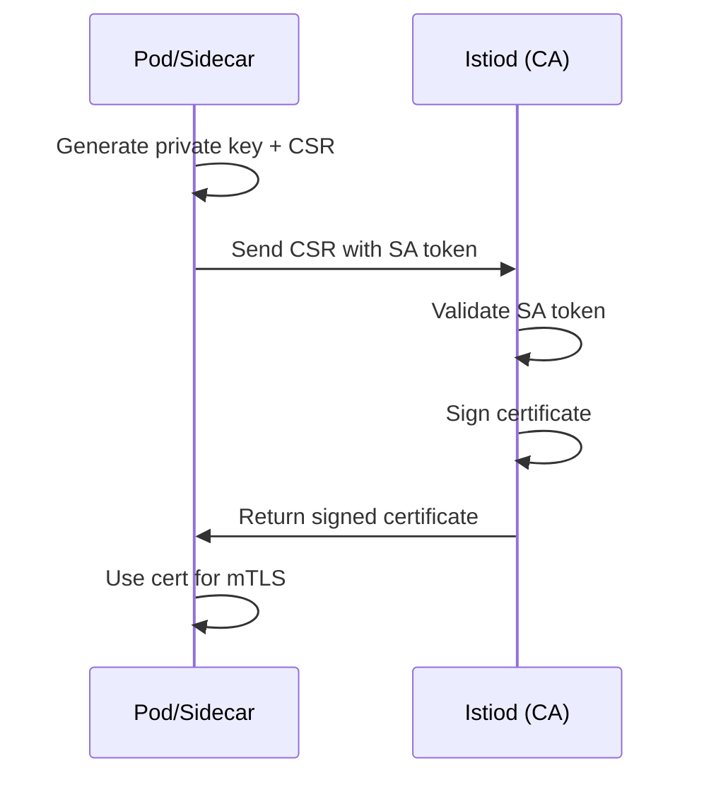

# How to Manage Certificates in Istio

Author: [nawazdhandala](https://github.com/nawazdhandala)

Tags: Istio, Certificates, mTLS, Security, Kubernetes

Description: A comprehensive guide to understanding and managing certificates in Istio, covering the CA, workload certificates, and certificate lifecycle.

---

Certificates are the backbone of Istio's security. Every time two services communicate in the mesh, they exchange certificates to verify each other's identity and encrypt the traffic. If you are running Istio in production, understanding how certificates work and how to manage them is not optional. Things break when certificates expire, when CAs are misconfigured, or when rotation fails silently.

## How Istio's Certificate System Works

Istio uses a built-in Certificate Authority (CA) called "istiod" (or more specifically, the Citadel component within istiod) to issue certificates to workloads. Here is the flow:

1. A workload pod starts up with the Istio sidecar proxy (Envoy)
2. The sidecar generates a private key and a Certificate Signing Request (CSR)
3. The sidecar sends the CSR to istiod over a secure gRPC channel
4. Istiod validates the request (checking the pod's service account token)
5. Istiod signs the certificate and sends it back to the sidecar
6. The sidecar uses the certificate for mTLS with other services



## Viewing Current Certificates

You can inspect the certificates loaded in any sidecar proxy:

```bash
istioctl proxy-config secret <pod-name> -n <namespace>
```

This shows:

- The root CA certificate (used to validate peer certificates)
- The workload certificate (the pod's own identity certificate)
- The certificate chain
- Certificate expiry times

For more detail:

```bash
istioctl proxy-config secret <pod-name> -n <namespace> -o json
```

You can also extract and decode the actual certificate:

```bash
istioctl proxy-config secret <pod-name> -n <namespace> -o json | \
  jq -r '.dynamicActiveSecrets[0].secret.tlsCertificate.certificateChain.inlineBytes' | \
  base64 -d | openssl x509 -text -noout
```

This shows the full certificate details including the SPIFFE URI, validity period, issuer, and more.

## The Default Self-Signed CA

Out of the box, Istio generates a self-signed root CA certificate. This certificate is stored as a Kubernetes secret:

```bash
kubectl get secret istio-ca-secret -n istio-system -o yaml
```

The default self-signed CA works fine for development and testing, but for production you should bring your own CA certificate. The self-signed CA has some limitations:

- It is generated fresh on each Istio installation, so cluster migrations break trust
- Other systems outside the mesh cannot verify the certificates
- There is no integration with your organization's PKI

## Certificate Lifetimes

Istio manages three types of certificates with different lifetimes:

**Root CA certificate** - By default, the self-signed root CA has a 10-year validity period. You can change this with the `CITADEL_SELF_SIGNED_CA_CERT_TTL` environment variable on istiod.

**Workload certificates** - By default, workload certificates are valid for 24 hours. This short lifetime limits the damage from a compromised certificate. You can adjust this in the mesh config.

**Intermediate CA certificates** - If you use an intermediate CA, its lifetime depends on your external CA setup.

Check the default settings:

```bash
kubectl get cm istio -n istio-system -o jsonpath='{.data.mesh}' | grep -i cert
```

## Changing Certificate Lifetimes

To change the workload certificate TTL, update the mesh configuration:

```yaml
apiVersion: install.istio.io/v1alpha1
kind: IstioOperator
spec:
  meshConfig:
    defaultConfig:
      proxyMetadata:
        SECRET_TTL: "12h"
```

Or modify the istiod deployment directly:

```bash
kubectl set env deployment/istiod -n istio-system MAX_WORKLOAD_CERT_TTL=48h
kubectl set env deployment/istiod -n istio-system DEFAULT_WORKLOAD_CERT_TTL=12h
```

`MAX_WORKLOAD_CERT_TTL` is the maximum allowed TTL that a workload can request. `DEFAULT_WORKLOAD_CERT_TTL` is what workloads get if they do not request a specific TTL.

## Certificate Rotation

Istio automatically rotates workload certificates before they expire. The sidecar proxy requests a new certificate when the current one reaches about 80% of its lifetime. For a 24-hour certificate, rotation happens roughly every 19 hours.

You can verify rotation is working by watching the secret changes:

```bash
istioctl proxy-config secret <pod-name> -n <namespace>
```

Run this command periodically and you will see the certificate serial number change after rotation.

If rotation fails, the sidecar falls back to using the expired certificate, which will cause mTLS failures. Monitor for this with:

```bash
kubectl logs <pod-name> -c istio-proxy | grep -i "certificate" | grep -i "error\|expired\|fail"
```

## Monitoring Certificate Health

Set up Prometheus metrics to track certificate status:

```text
# Certificate expiry (seconds until expiration)
citadel_server_root_cert_expiry_timestamp

# Number of CSRs processed
citadel_server_csr_count

# CSR processing errors
citadel_server_csr_parsing_err_count

# Successful certificate issuance
citadel_server_success_cert_issuance_count
```

Create an alert for certificates approaching expiry:

```yaml
groups:
- name: istio-certs
  rules:
  - alert: IstioCACertExpiringSoon
    expr: |
      (citadel_server_root_cert_expiry_timestamp - time()) < 2592000
    for: 1h
    labels:
      severity: warning
    annotations:
      summary: "Istio root CA certificate expires in less than 30 days"
```

## Backing Up Certificates

For disaster recovery, back up your CA certificates:

```bash
kubectl get secret istio-ca-secret -n istio-system -o yaml > istio-ca-backup.yaml
```

Store this backup securely. If you lose the CA secret and istiod restarts, it will generate a new CA, and all existing workload certificates will become invalid. Every sidecar will need to get a new certificate, causing a brief disruption.

For production, also back up any custom CA certificates you have configured:

```bash
kubectl get secret cacerts -n istio-system -o yaml > cacerts-backup.yaml
```

## Common Certificate Operations

**Force certificate refresh for a specific pod:**

```bash
kubectl delete pod <pod-name> -n <namespace>
```

Restarting the pod forces it to get a fresh certificate from istiod.

**Check if mTLS is working between two services:**

```bash
istioctl x describe pod <pod-name> -n <namespace>
```

This shows whether mTLS is active and what certificates are in use.

**Verify the certificate chain:**

```bash
istioctl proxy-config secret <pod-name> -n <namespace> -o json | \
  jq -r '.dynamicActiveSecrets[] | select(.name=="default") | .secret.tlsCertificate.certificateChain.inlineBytes' | \
  base64 -d | openssl x509 -text -noout | grep -E "Issuer|Subject|Not Before|Not After"
```

## Best Practices

- **Use short-lived workload certificates.** The default 24-hour TTL is a good starting point. Shorter is better from a security perspective.
- **Monitor certificate expiry proactively.** Set up alerts for both the root CA and workload certificates.
- **Back up your CA secret.** Losing the CA means losing trust across the entire mesh.
- **Use a custom CA for production.** The self-signed CA is fine for development, but plug in your organization's CA for production workloads.
- **Test certificate rotation.** Do not assume it works. Verify by watching certificate serial numbers change over time.

Certificate management in Istio is mostly automated, but understanding the system helps you troubleshoot issues, plan for production, and avoid the painful scenario of discovering certificate problems during an outage.
