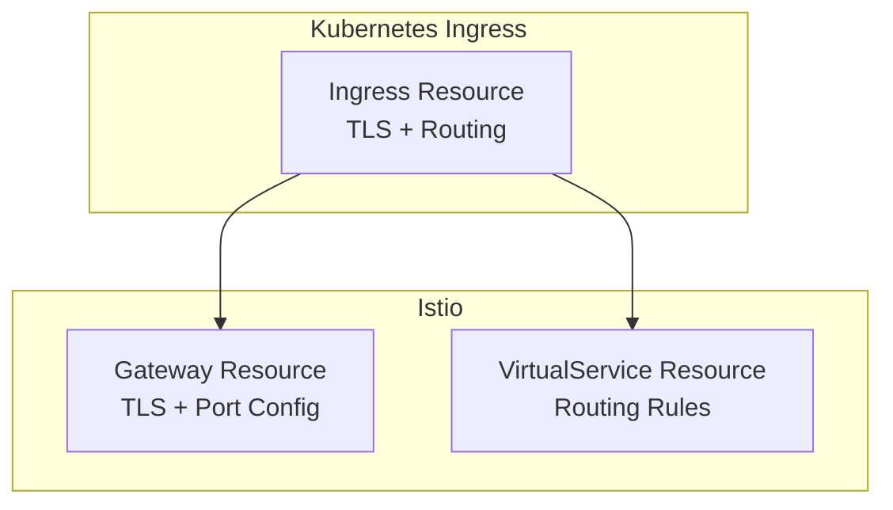

# How to Migrate from Kubernetes Ingress to Istio Gateway

Author: [nawazdhandala](https://github.com/nawazdhandala)

Tags: Istio, Migration, Kubernetes Ingress, Gateway, Networking

Description: A practical migration guide for moving from standard Kubernetes Ingress resources to Istio Gateway and VirtualService resources.

---

If you have been running a Kubernetes Ingress controller (like nginx-ingress or traefik) and want to switch to Istio Gateway, the migration is manageable but needs some planning. The two systems use different resource types and have different features, so it is not a one-to-one translation. This guide walks through the migration process with real before-and-after examples.

## Key Differences

Before migrating, understand what changes:

| Feature | Kubernetes Ingress | Istio Gateway |
|---|---|---|
| Resource types | 1 (Ingress) | 2 (Gateway + VirtualService) |
| Protocol support | HTTP/HTTPS | HTTP, HTTPS, TCP, gRPC, WebSocket |
| TLS config | In the Ingress resource | In the Gateway resource |
| Routing rules | In the Ingress resource | In the VirtualService resource |
| Traffic management | Limited | Full (retries, timeouts, traffic splitting) |
| Provider | Various controllers | Envoy proxy (Istio) |

The biggest mental shift is that Istio splits the configuration into two resources: the Gateway handles infrastructure concerns (ports, TLS), and the VirtualService handles routing logic.



## Migration Strategy

The safest approach is to run both systems in parallel during migration:

1. Install Istio alongside your existing ingress controller
2. Migrate services one at a time
3. Test each service after migration
4. Remove the old Ingress resources after verification
5. Decommission the old ingress controller when everything is migrated

## Example 1: Simple HTTP Ingress

**Before (Kubernetes Ingress):**

```yaml
apiVersion: networking.k8s.io/v1
kind: Ingress
metadata:
  name: my-app-ingress
spec:
  rules:
  - host: app.example.com
    http:
      paths:
      - path: /
        pathType: Prefix
        backend:
          service:
            name: my-app
            port:
              number: 8080
```

**After (Istio Gateway + VirtualService):**

```yaml
apiVersion: networking.istio.io/v1
kind: Gateway
metadata:
  name: my-app-gateway
spec:
  selector:
    istio: ingressgateway
  servers:
  - port:
      number: 80
      name: http
      protocol: HTTP
    hosts:
    - "app.example.com"
---
apiVersion: networking.istio.io/v1
kind: VirtualService
metadata:
  name: my-app-vs
spec:
  hosts:
  - "app.example.com"
  gateways:
  - my-app-gateway
  http:
  - route:
    - destination:
        host: my-app
        port:
          number: 8080
```

## Example 2: HTTPS with TLS Termination

**Before:**

```yaml
apiVersion: networking.k8s.io/v1
kind: Ingress
metadata:
  name: secure-app-ingress
spec:
  tls:
  - hosts:
    - secure.example.com
    secretName: secure-tls
  rules:
  - host: secure.example.com
    http:
      paths:
      - path: /
        pathType: Prefix
        backend:
          service:
            name: secure-app
            port:
              number: 8080
```

**After:**

First, copy the TLS secret to the `istio-system` namespace:

```bash
kubectl get secret secure-tls -o yaml | \
  sed 's/namespace: default/namespace: istio-system/' | \
  kubectl apply -f -
```

Then create the Istio resources:

```yaml
apiVersion: networking.istio.io/v1
kind: Gateway
metadata:
  name: secure-gateway
spec:
  selector:
    istio: ingressgateway
  servers:
  - port:
      number: 443
      name: https
      protocol: HTTPS
    hosts:
    - "secure.example.com"
    tls:
      mode: SIMPLE
      credentialName: secure-tls
  - port:
      number: 80
      name: http
      protocol: HTTP
    hosts:
    - "secure.example.com"
    tls:
      httpsRedirect: true
---
apiVersion: networking.istio.io/v1
kind: VirtualService
metadata:
  name: secure-app-vs
spec:
  hosts:
  - "secure.example.com"
  gateways:
  - secure-gateway
  http:
  - route:
    - destination:
        host: secure-app
        port:
          number: 8080
```

Note: TLS secrets for Istio must be in the `istio-system` namespace, while Kubernetes Ingress typically uses secrets in the application namespace.

## Example 3: Path-Based Routing

**Before:**

```yaml
apiVersion: networking.k8s.io/v1
kind: Ingress
metadata:
  name: multi-path-ingress
  annotations:
    nginx.ingress.kubernetes.io/rewrite-target: /$2
spec:
  rules:
  - host: app.example.com
    http:
      paths:
      - path: /api(/|$)(.*)
        pathType: ImplementationSpecific
        backend:
          service:
            name: api-service
            port:
              number: 8080
      - path: /web(/|$)(.*)
        pathType: ImplementationSpecific
        backend:
          service:
            name: web-service
            port:
              number: 3000
```

**After:**

```yaml
apiVersion: networking.istio.io/v1
kind: Gateway
metadata:
  name: app-gateway
spec:
  selector:
    istio: ingressgateway
  servers:
  - port:
      number: 80
      name: http
      protocol: HTTP
    hosts:
    - "app.example.com"
---
apiVersion: networking.istio.io/v1
kind: VirtualService
metadata:
  name: app-routes
spec:
  hosts:
  - "app.example.com"
  gateways:
  - app-gateway
  http:
  - match:
    - uri:
        prefix: /api
    rewrite:
      uri: /
    route:
    - destination:
        host: api-service
        port:
          number: 8080
  - match:
    - uri:
        prefix: /web
    rewrite:
      uri: /
    route:
    - destination:
        host: web-service
        port:
          number: 3000
```

## Example 4: Migrating nginx-ingress Annotations

Many nginx-ingress features map to Istio VirtualService features:

**Rate limiting:**

```yaml
# nginx-ingress annotation
annotations:
  nginx.ingress.kubernetes.io/limit-rps: "10"

# Istio equivalent (using EnvoyFilter or external rate limiting)
# Rate limiting in Istio is done through EnvoyFilter or external service
```

**Timeouts:**

```yaml
# nginx-ingress annotations
annotations:
  nginx.ingress.kubernetes.io/proxy-connect-timeout: "30"
  nginx.ingress.kubernetes.io/proxy-read-timeout: "60"

# Istio VirtualService
http:
- route:
  - destination:
      host: my-service
  timeout: 60s
```

**CORS:**

```yaml
# nginx-ingress annotations
annotations:
  nginx.ingress.kubernetes.io/enable-cors: "true"
  nginx.ingress.kubernetes.io/cors-allow-origin: "https://myapp.com"

# Istio VirtualService
http:
- route:
  - destination:
      host: my-service
  corsPolicy:
    allowOrigins:
    - exact: "https://myapp.com"
    allowMethods:
    - GET
    - POST
    allowHeaders:
    - content-type
```

## DNS Cutover

The trickiest part of migration is switching DNS. You have two approaches:

### Gradual Cutover (Recommended)

1. Deploy Istio resources alongside existing Ingress
2. Test using the Istio gateway IP directly with Host headers
3. Create a new DNS record pointing to the Istio gateway
4. Slowly shift traffic using weighted DNS
5. Remove the old DNS record and Ingress

### Direct Cutover

1. Deploy Istio resources
2. Test thoroughly with Host headers
3. Update DNS to point to Istio gateway
4. Monitor closely
5. Remove old Ingress

```bash
# Test with Host header before DNS cutover
export ISTIO_IP=$(kubectl -n istio-system get service istio-ingressgateway \
  -o jsonpath='{.status.loadBalancer.ingress[0].ip}')

curl -H "Host: app.example.com" http://$ISTIO_IP/
```

## Sidecar Injection

Your backend services need Istio sidecar injection for full mesh functionality:

```bash
# Enable sidecar injection for a namespace
kubectl label namespace default istio-injection=enabled

# Restart deployments to inject sidecars
kubectl rollout restart deployment -n default
```

Services work without sidecars too (Istio still routes to them), but you miss out on mTLS, telemetry, and other mesh features.

## Cleanup

After confirming everything works through Istio:

```bash
# Remove old Ingress resources
kubectl delete ingress my-app-ingress
kubectl delete ingress secure-app-ingress

# If no other Ingress resources remain, remove the ingress controller
helm uninstall nginx-ingress -n ingress-nginx
kubectl delete namespace ingress-nginx
```

## Rollback Plan

Always have a rollback plan. Keep the old Ingress resources available (maybe in a git branch) so you can reapply them and switch DNS back if something goes wrong.

Migrating from Kubernetes Ingress to Istio Gateway is a one-way trip for most teams. The extra expressiveness of the Gateway/VirtualService model, combined with all the service mesh features, makes the migration effort worthwhile. Take it one service at a time, test thoroughly, and you will be running entirely on Istio within a few days.
