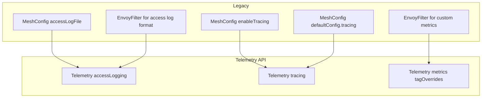

# How to Migrate from Legacy Telemetry to Telemetry API in Istio

Author: [nawazdhandala](https://github.com/nawazdhandala)

Tags: Istio, Telemetry API, Migration, Observability, Upgrade

Description: A practical migration guide for moving from Istio's legacy MeshConfig and EnvoyFilter telemetry to the modern Telemetry API.

---

If you've been running Istio for a while, your telemetry configuration probably lives in a mix of MeshConfig settings, EnvoyFilter resources, and maybe even old Mixer configurations if you go back far enough. The Telemetry API consolidates all of this into a single, cleaner interface. Migrating to it is worth the effort because you get better maintainability, namespace-level overrides, and workload-level granularity.

This guide walks through migrating each type of legacy telemetry configuration to the Telemetry API.

## Understanding What Changed

Here's how the old and new approaches map to each other:



## Step 1: Audit Your Current Configuration

Before migrating, document what you have. Check each of these locations:

### MeshConfig Settings

```bash
kubectl get configmap istio -n istio-system -o yaml
```

Look for these fields:

```yaml
mesh: |
  accessLogFile: "/dev/stdout"
  accessLogFormat: "..."
  accessLogEncoding: JSON
  enableTracing: true
  defaultConfig:
    tracing:
      sampling: 1.0
      zipkin:
        address: zipkin.istio-system:9411
```

### EnvoyFilter Resources

```bash
kubectl get envoyfilter -A
```

List all EnvoyFilters and check which ones are related to telemetry (metrics, logging, or tracing).

### Old Mixer Resources (if applicable)

If you're migrating from a very old Istio version:

```bash
kubectl get handler,instance,rule -A 2>/dev/null
```

These Mixer resources should have been removed when you upgraded past Istio 1.8, but check just in case.

## Step 2: Migrate Access Logging

### Legacy: MeshConfig Access Log

Old configuration in MeshConfig:

```yaml
mesh: |
  accessLogFile: "/dev/stdout"
  accessLogEncoding: JSON
  accessLogFormat: |
    {
      "start_time": "%START_TIME%",
      "method": "%REQ(:METHOD)%",
      "path": "%REQ(X-ENVOY-ORIGINAL-PATH?:PATH)%",
      "response_code": "%RESPONSE_CODE%",
      "duration": "%DURATION%"
    }
```

### New: Telemetry API Access Log

First, define the provider in MeshConfig's `extensionProviders` (this stays in MeshConfig):

```yaml
mesh: |
  extensionProviders:
    - name: json-access-log
      envoyFileAccessLog:
        path: "/dev/stdout"
        logFormat:
          labels:
            start_time: "%START_TIME%"
            method: "%REQ(:METHOD)%"
            path: "%REQ(X-ENVOY-ORIGINAL-PATH?:PATH)%"
            response_code: "%RESPONSE_CODE%"
            duration: "%DURATION%"
```

Then create the Telemetry resource:

```yaml
apiVersion: telemetry.istio.io/v1
kind: Telemetry
metadata:
  name: default
  namespace: istio-system
spec:
  accessLogging:
    - providers:
        - name: json-access-log
```

Remove the old `accessLogFile`, `accessLogEncoding`, and `accessLogFormat` fields from MeshConfig.

### Legacy: EnvoyFilter Access Log

If you were using an EnvoyFilter for custom access logging:

```yaml
apiVersion: networking.istio.io/v1alpha3
kind: EnvoyFilter
metadata:
  name: custom-access-log
  namespace: istio-system
spec:
  configPatches:
    - applyTo: NETWORK_FILTER
      match:
        listener:
          filterChain:
            filter:
              name: "envoy.filters.network.http_connection_manager"
      patch:
        operation: MERGE
        value:
          typed_config:
            "@type": "type.googleapis.com/envoy.extensions.filters.network.http_connection_manager.v3.HttpConnectionManager"
            access_log:
              - name: envoy.access_loggers.file
                typed_config:
                  "@type": "type.googleapis.com/envoy.extensions.access_loggers.file.v3.FileAccessLog"
                  path: "/dev/stdout"
```

Replace this EnvoyFilter entirely with the provider + Telemetry resource approach shown above. Delete the EnvoyFilter after the Telemetry resource is working.

## Step 3: Migrate Tracing Configuration

### Legacy: MeshConfig Tracing

Old configuration:

```yaml
mesh: |
  enableTracing: true
  defaultConfig:
    tracing:
      sampling: 1.0
      zipkin:
        address: zipkin.istio-system:9411
```

### New: Telemetry API Tracing

Define the provider in MeshConfig:

```yaml
mesh: |
  extensionProviders:
    - name: zipkin
      zipkin:
        service: zipkin.istio-system.svc.cluster.local
        port: 9411
```

Create the Telemetry resource:

```yaml
apiVersion: telemetry.istio.io/v1
kind: Telemetry
metadata:
  name: default
  namespace: istio-system
spec:
  tracing:
    - providers:
        - name: zipkin
      randomSamplingPercentage: 1.0
```

Remove the old `enableTracing` and `defaultConfig.tracing` fields from MeshConfig.

## Step 4: Migrate Custom Metrics

### Legacy: EnvoyFilter for Custom Metrics

If you were using EnvoyFilters to add custom metric labels:

```yaml
apiVersion: networking.istio.io/v1alpha3
kind: EnvoyFilter
metadata:
  name: custom-metric-labels
  namespace: istio-system
spec:
  configPatches:
    - applyTo: HTTP_FILTER
      match:
        context: SIDECAR_INBOUND
        listener:
          filterChain:
            filter:
              name: "envoy.filters.network.http_connection_manager"
              subFilter:
                name: "istio.stats"
      patch:
        operation: MERGE
        value:
          typed_config:
            "@type": "type.googleapis.com/udpa.type.v1.TypedStruct"
            type_url: "type.googleapis.com/stats.PluginConfig"
            value:
              metrics:
                - name: requests_total
                  dimensions:
                    custom_header: "request.headers['x-custom']"
```

### New: Telemetry API Metric Overrides

```yaml
apiVersion: telemetry.istio.io/v1
kind: Telemetry
metadata:
  name: default
  namespace: istio-system
spec:
  metrics:
    - providers:
        - name: prometheus
      overrides:
        - match:
            metric: REQUEST_COUNT
            mode: SERVER
          tagOverrides:
            custom_header:
              operation: UPSERT
              value: "request.headers['x-custom'] || 'none'"
```

Delete the EnvoyFilter after confirming the Telemetry resource works.

## Step 5: Migration Checklist

Here's a step-by-step checklist for the migration:

1. **Document current state**: Record all MeshConfig telemetry settings, EnvoyFilters, and their purposes.

2. **Set up extension providers in MeshConfig**: Add all needed providers to `extensionProviders`.

3. **Create Telemetry resources**: Start with the mesh-wide default, then add namespace and workload overrides.

4. **Test in a non-production namespace first**:

```yaml
apiVersion: telemetry.istio.io/v1
kind: Telemetry
metadata:
  name: default
  namespace: staging
spec:
  accessLogging:
    - providers:
        - name: json-access-log
  tracing:
    - providers:
        - name: zipkin
      randomSamplingPercentage: 5.0
```

Generate traffic and verify logs, metrics, and traces appear correctly.

5. **Apply mesh-wide**: Once validated, apply the mesh-wide Telemetry resource.

6. **Remove legacy settings**: Clean up old MeshConfig fields and EnvoyFilters.

7. **Restart workloads**: Roll all namespaces to pick up the new configuration:

```bash
for ns in $(kubectl get ns -l istio-injection=enabled -o jsonpath='{.items[*].metadata.name}'); do
  kubectl rollout restart deployment -n "$ns"
done
```

## Running Old and New Side by Side

During migration, both legacy and Telemetry API configurations can coexist. Istio handles this by merging them, with the Telemetry API taking precedence where there's overlap.

This means you can migrate incrementally:

1. Add extension providers to MeshConfig
2. Create Telemetry resources for one namespace at a time
3. Verify each namespace
4. Remove legacy settings last

The order matters. Don't remove legacy settings until the Telemetry resources are fully in place and tested.

## Handling Edge Cases

### EnvoyFilters You Can't Replace

Some EnvoyFilters do things the Telemetry API doesn't support yet, like custom Envoy filter chains or protocol-specific configurations. These can stay as EnvoyFilters. The Telemetry API doesn't replace every use of EnvoyFilter - just the common telemetry ones.

### Annotation-Based Tracing Configuration

If you were using pod annotations to control tracing:

```yaml
annotations:
  proxy.istio.io/config: |
    tracing:
      sampling: 100
```

Replace these with workload-level Telemetry resources:

```yaml
apiVersion: telemetry.istio.io/v1
kind: Telemetry
metadata:
  name: high-sampling
  namespace: my-namespace
spec:
  selector:
    matchLabels:
      app: my-service
  tracing:
    - providers:
        - name: zipkin
      randomSamplingPercentage: 100.0
```

Remove the annotations after the Telemetry resource is in place.

## Validating the Migration

After migration, run these checks:

```bash
# 1. Verify no legacy MeshConfig telemetry settings remain
kubectl get cm istio -n istio-system -o yaml | grep -E "accessLogFile|enableTracing|defaultConfig"

# 2. Verify no telemetry-related EnvoyFilters remain
kubectl get envoyfilter -A -o json | python3 -c "
import json, sys
data = json.load(sys.stdin)
for item in data['items']:
    name = item['metadata']['name']
    ns = item['metadata']['namespace']
    print(f'{ns}/{name}')
"

# 3. Verify Telemetry resources exist
kubectl get telemetry -A

# 4. Run Istio's analyzer
istioctl analyze -A
```

The migration to the Telemetry API is one of those maintenance tasks that pays dividends for years. Once you're on the new API, managing telemetry becomes significantly easier, especially for multi-team setups where different namespaces need different configurations.
