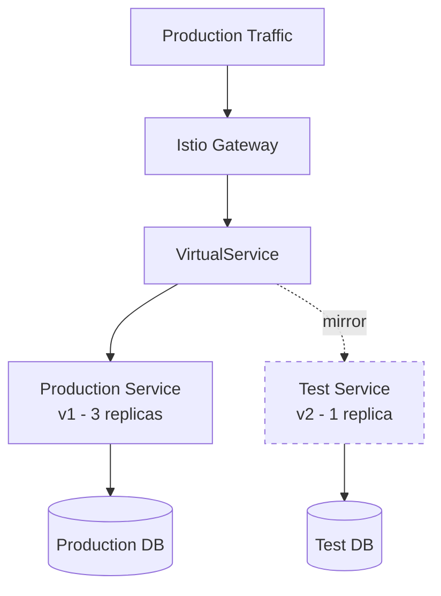

# How to Mirror Production Traffic to a Test Environment in Istio

Author: [nawazdhandala](https://github.com/nawazdhandala)

Tags: Istio, Service Mesh, Traffic Mirroring, Testing, Kubernetes

Description: How to set up Istio traffic mirroring to send copies of production requests to a separate test environment for safe testing with real traffic patterns.

---

Testing with synthetic data is useful, but nothing beats testing with real production traffic. Traffic mirroring lets you send copies of actual user requests to a test environment without any impact on production. The test environment processes the requests independently, and its responses are thrown away. If the test service is buggy, slow, or completely broken, users never know.

## Architecture Overview

The setup involves your production service receiving traffic normally while Istio copies requests to a test version. The test version can live in the same namespace, a different namespace, or even a different cluster (with some additional configuration).



The dashed line represents mirrored traffic - it is asynchronous and its response is discarded.

## Setting Up Cross-Namespace Mirroring

A common pattern is to mirror production traffic to a test namespace:

### Production Namespace Setup

```yaml
# Production deployment
apiVersion: apps/v1
kind: Deployment
metadata:
  name: order-service
  namespace: production
spec:
  replicas: 3
  selector:
    matchLabels:
      app: order-service
  template:
    metadata:
      labels:
        app: order-service
    spec:
      containers:
        - name: order-service
          image: order-service:1.5.0
          ports:
            - containerPort: 8080
---
apiVersion: v1
kind: Service
metadata:
  name: order-service
  namespace: production
spec:
  selector:
    app: order-service
  ports:
    - port: 8080
      name: http
```

### Test Namespace Setup

```yaml
# Test deployment
apiVersion: apps/v1
kind: Deployment
metadata:
  name: order-service
  namespace: testing
spec:
  replicas: 1
  selector:
    matchLabels:
      app: order-service
  template:
    metadata:
      labels:
        app: order-service
    spec:
      containers:
        - name: order-service
          image: order-service:2.0.0-beta
          ports:
            - containerPort: 8080
          env:
            - name: DATABASE_URL
              value: "postgres://testdb:5432/orders_test"
---
apiVersion: v1
kind: Service
metadata:
  name: order-service
  namespace: testing
spec:
  selector:
    app: order-service
  ports:
    - port: 8080
      name: http
```

Notice the test deployment uses a different database URL. This is critical - you do not want mirrored write operations hitting the production database.

### Mirroring VirtualService

```yaml
apiVersion: networking.istio.io/v1beta1
kind: VirtualService
metadata:
  name: order-service
  namespace: production
spec:
  hosts:
    - order-service
  http:
    - route:
        - destination:
            host: order-service
            port:
              number: 8080
      mirror:
        host: order-service.testing.svc.cluster.local
        port:
          number: 8080
      mirrorPercentage:
        value: 100.0
```

The mirror host uses the fully qualified domain name `order-service.testing.svc.cluster.local` to reach the service in the testing namespace.

## Handling Write Operations Safely

Mirroring write requests (POST, PUT, DELETE) to a test environment requires careful handling to avoid unintended side effects.

### Option 1: Mirror Only Read Requests

The simplest approach - only mirror GET requests:

```yaml
apiVersion: networking.istio.io/v1beta1
kind: VirtualService
metadata:
  name: order-service
  namespace: production
spec:
  hosts:
    - order-service
  http:
    # GET requests - mirrored to test
    - match:
        - method:
            exact: GET
      route:
        - destination:
            host: order-service
            port:
              number: 8080
      mirror:
        host: order-service.testing.svc.cluster.local
        port:
          number: 8080
      mirrorPercentage:
        value: 100.0
    # All other methods - no mirroring
    - route:
        - destination:
            host: order-service
            port:
              number: 8080
```

### Option 2: Use a Separate Test Database

Mirror all traffic, but have the test service use its own database that gets periodically refreshed from a production snapshot:

```yaml
# Test environment config
apiVersion: v1
kind: ConfigMap
metadata:
  name: order-service-config
  namespace: testing
data:
  DATABASE_URL: "postgres://testdb.testing:5432/orders_mirror"
  EXTERNAL_SERVICES_DISABLED: "true"
  DRY_RUN_MODE: "true"
```

The test service reads from this config, using a separate database and disabling external service calls.

### Option 3: Application-Level Shadow Mode

Configure the test service to detect mirrored requests and handle them in a read-only mode:

```yaml
apiVersion: apps/v1
kind: Deployment
metadata:
  name: order-service
  namespace: testing
spec:
  template:
    spec:
      containers:
        - name: order-service
          image: order-service:2.0.0-beta
          env:
            - name: SHADOW_MODE
              value: "true"
```

The application checks for the `-shadow` suffix in the Host header (which Envoy adds automatically) or the `SHADOW_MODE` environment variable, and skips writes.

## Scaling the Test Environment

Production might handle 1000 RPS. Your test environment does not necessarily need to handle the same load.

### Option 1: Mirror a Percentage

```yaml
mirrorPercentage:
  value: 10.0
```

Mirror only 10% of traffic. Enough to test with real patterns without needing full production capacity in the test environment.

### Option 2: Use Fewer Replicas

If you mirror 100% of traffic but only have 1 test replica vs 3 production replicas, the test service gets 3x the per-pod load. This is fine if you are testing correctness rather than performance. If the test service gets overwhelmed, it just queues up and processes slowly - since responses are discarded, nobody cares.

### Option 3: Use Resource Limits

```yaml
apiVersion: apps/v1
kind: Deployment
metadata:
  name: order-service
  namespace: testing
spec:
  template:
    spec:
      containers:
        - name: order-service
          resources:
            requests:
              cpu: 500m
              memory: 512Mi
            limits:
              cpu: 1000m
              memory: 1Gi
```

Limit resources on the test environment so it does not compete with production for cluster resources.

## Monitoring the Test Environment

Even though responses are discarded, monitoring the test service is the whole point. You want to compare its behavior against production.

### Error Rate Comparison

```bash
# Production error rate
# PromQL: sum(rate(istio_requests_total{destination_service="order-service.production.svc.cluster.local",response_code=~"5.."}[5m]))

# Test error rate
# PromQL: sum(rate(istio_requests_total{destination_service="order-service.testing.svc.cluster.local",response_code=~"5.."}[5m]))
```

### Latency Comparison

```bash
# Production P99 latency
# PromQL: histogram_quantile(0.99, sum(rate(istio_request_duration_milliseconds_bucket{destination_service="order-service.production.svc.cluster.local"}[5m])) by (le))

# Test P99 latency
# PromQL: histogram_quantile(0.99, sum(rate(istio_request_duration_milliseconds_bucket{destination_service="order-service.testing.svc.cluster.local"}[5m])) by (le))
```

### Log Comparison

Set up structured logging on both services and compare:

```bash
# Production logs
kubectl logs -n production -l app=order-service --tail=100

# Test logs
kubectl logs -n testing -l app=order-service --tail=100
```

Look for new error types, unexpected behavior, or log patterns that differ from production.

## Complete Production-to-Test Mirroring Setup

Here is the full configuration:

```yaml
# Production VirtualService with mirroring
apiVersion: networking.istio.io/v1beta1
kind: VirtualService
metadata:
  name: order-service
  namespace: production
spec:
  hosts:
    - order-service
  http:
    - route:
        - destination:
            host: order-service
            port:
              number: 8080
      mirror:
        host: order-service.testing.svc.cluster.local
        port:
          number: 8080
      mirrorPercentage:
        value: 50.0
---
# DestinationRule for the test service
apiVersion: networking.istio.io/v1beta1
kind: DestinationRule
metadata:
  name: order-service-mirror
  namespace: testing
spec:
  host: order-service.testing.svc.cluster.local
  trafficPolicy:
    connectionPool:
      tcp:
        maxConnections: 50
      http:
        http1MaxPendingRequests: 25
    outlierDetection:
      consecutive5xxErrors: 10
      interval: 30s
      baseEjectionTime: 60s
```

The DestinationRule on the test service has relaxed circuit breaking since we do not care about the test service's availability. We just want it to process what it can.

## When to Use Traffic Mirroring

Traffic mirroring is ideal for:
- Testing new service versions before canary deployment
- Performance benchmarking with real traffic patterns
- Validating database migration correctness
- Testing new infrastructure (new database, new cache, new message broker)
- Comparing response bodies between versions (with custom logging)

It is not suitable for:
- Testing features that require client-side changes
- Validating latency improvements (mirrored traffic has different resource contention)
- Services that make irreversible external calls (payment processing, email sending)

Traffic mirroring to a test environment is one of the most underused features of Istio. It gives you confidence that a new version handles real traffic correctly before you expose any users to it. Set it up, monitor the results, and use it as the first step in your deployment pipeline.
