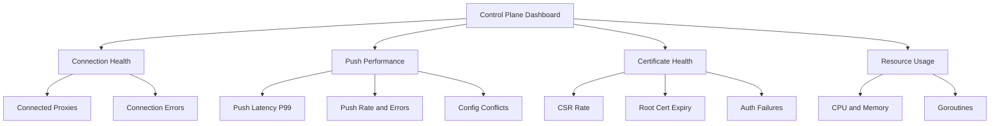

# How to Monitor Control Plane Metrics in Istio

Author: [nawazdhandala](https://github.com/nawazdhandala)

Tags: Istio, Control Plane, Monitoring, istiod, Prometheus

Description: Monitor Istio control plane health by tracking istiod metrics for configuration pushes, proxy connections, certificate management, and resource usage.

---

The Istio control plane (istiod) is the brain of your service mesh. It handles service discovery, certificate issuance, configuration distribution, and more. If istiod goes down or gets overloaded, your entire mesh can start behaving unpredictably. New pods might not get their sidecar configuration, certificates might not rotate, and routing rules won't propagate. Monitoring the control plane is just as important as monitoring your application services.

## Where Control Plane Metrics Live

istiod exposes Prometheus metrics on port 15014 at the `/metrics` endpoint:

```bash
kubectl port-forward svc/istiod 15014:15014 -n istio-system

curl localhost:15014/metrics | head -50
```

These metrics cover configuration distribution (xDS), certificate management (Citadel), webhook operations, and internal Go runtime stats.

## Key Metric Categories

### xDS Configuration Distribution

xDS is the protocol Envoy uses to receive configuration from istiod. The "x" stands for various discovery services - CDS (clusters), EDS (endpoints), LDS (listeners), RDS (routes), and SDS (secrets).

```promql
# Total xDS pushes
rate(pilot_xds_pushes[5m])

# xDS push errors
rate(pilot_xds_push_errors[5m])

# Number of connected proxies
pilot_xds

# Push latency (time to push config to all proxies)
histogram_quantile(0.99,
  sum(rate(pilot_proxy_convergence_time_bucket[5m])) by (le)
)
```

The convergence time metric is critical. It measures how long it takes for a configuration change to reach all connected proxies. If this is high (several seconds or more), your routing changes and security policies are slow to take effect.

### Configuration Push Metrics

```promql
# Push context count (how many times pilot rebuilt its push context)
rate(pilot_push_triggers[5m])

# What triggered the push?
rate(pilot_push_triggers[5m]) by (type)
```

Push triggers include:
- `config` - a configuration resource changed (VirtualService, DestinationRule, etc.)
- `endpoint` - a service endpoint changed (pod added/removed)
- `service` - a Kubernetes service changed

### Proxy Connection Metrics

```promql
# Total number of xDS connections
pilot_xds

# Connections by proxy version
pilot_xds{version="1.24.0"}

# xDS connection terminations
rate(pilot_xds_expired_nonce[5m])
```

If the number of connected proxies is lower than expected, some sidecars might be failing to connect to istiod. Compare it against the actual number of pods with sidecars:

```bash
kubectl get pods --all-namespaces -l security.istio.io/tlsMode=istio -o json | \
  jq '[.items[]] | length'
```

### Certificate Management (Citadel)

```promql
# Certificate signing requests processed
rate(citadel_server_csr_count[5m])

# CSR parsing errors
rate(citadel_server_csr_parsing_err_count[5m])

# Certificate signing errors
rate(citadel_server_authentication_failure_count[5m])

# Root certificate expiry (seconds remaining)
citadel_server_root_cert_expiry_timestamp - time()
```

Track the root certificate expiry and alert well before it expires:

```yaml
apiVersion: monitoring.coreos.com/v1
kind: PrometheusRule
metadata:
  name: istio-control-plane-alerts
  namespace: monitoring
spec:
  groups:
    - name: istio-control-plane
      rules:
        - alert: IstioRootCertExpiry
          expr: (citadel_server_root_cert_expiry_timestamp - time()) / 86400 < 30
          for: 1h
          labels:
            severity: critical
          annotations:
            summary: "Istio root certificate expires in {{ $value | humanize }} days"
```

### Webhook Metrics

istiod runs a mutating webhook for sidecar injection:

```promql
# Sidecar injection count
rate(sidecar_injection_success_total[5m])

# Sidecar injection failures
rate(sidecar_injection_failure_total[5m])
```

If injection failures increase, new pods won't get their sidecars and will be outside the mesh.

### Configuration Validation

```promql
# Configuration validation errors
rate(galley_validation_failed[5m])

# Configuration conflicts
pilot_conflict_inbound_listener
pilot_conflict_outbound_listener_http_over_current_tcp
pilot_conflict_outbound_listener_tcp_over_current_http
pilot_conflict_outbound_listener_tcp_over_current_tcp
```

Configuration conflicts happen when multiple resources try to control the same listener or route. A non-zero value here usually means you have conflicting VirtualService or Gateway definitions.

## Resource Usage Monitoring

istiod is a Go application, so standard Go runtime metrics are available:

```promql
# CPU usage
rate(process_cpu_seconds_total{job="istiod"}[5m])

# Memory usage (resident set size)
process_resident_memory_bytes{job="istiod"}

# Go goroutines
go_goroutines{job="istiod"}

# Go GC pause duration
rate(go_gc_duration_seconds_sum{job="istiod"}[5m])
```

High goroutine counts can indicate resource leaks. Memory that keeps growing without stabilizing suggests a memory leak.

## Building a Control Plane Dashboard

Here's what your istiod monitoring dashboard should include:



## Alerting Rules for Control Plane

Set up alerts for the most critical control plane health indicators:

```yaml
apiVersion: monitoring.coreos.com/v1
kind: PrometheusRule
metadata:
  name: istio-control-plane
  namespace: monitoring
spec:
  groups:
    - name: istiod-health
      rules:
        - alert: IstiodHighPushLatency
          expr: |
            histogram_quantile(0.99,
              sum(rate(pilot_proxy_convergence_time_bucket[5m])) by (le)
            ) > 5
          for: 5m
          labels:
            severity: warning
          annotations:
            summary: "istiod P99 push latency is above 5 seconds"

        - alert: IstiodPushErrors
          expr: rate(pilot_xds_push_errors[5m]) > 0
          for: 5m
          labels:
            severity: warning
          annotations:
            summary: "istiod is experiencing xDS push errors"

        - alert: IstiodProxyDisconnects
          expr: |
            pilot_xds < (pilot_xds offset 10m) * 0.9
          for: 5m
          labels:
            severity: critical
          annotations:
            summary: "Connected proxy count dropped by more than 10%"

        - alert: IstiodHighMemory
          expr: |
            process_resident_memory_bytes{job="istiod"} > 2e9
          for: 10m
          labels:
            severity: warning
          annotations:
            summary: "istiod memory usage is above 2GB"

        - alert: SidecarInjectionFailures
          expr: rate(sidecar_injection_failure_total[5m]) > 0
          for: 5m
          labels:
            severity: critical
          annotations:
            summary: "Sidecar injection is failing"

        - alert: ConfigConflicts
          expr: |
            pilot_conflict_inbound_listener > 0
            or pilot_conflict_outbound_listener_http_over_current_tcp > 0
          for: 15m
          labels:
            severity: warning
          annotations:
            summary: "Istio configuration conflicts detected"
```

## Scaling Considerations

As your mesh grows, istiod's resource requirements increase. Key scaling indicators:

```promql
# Config push time increasing = istiod is getting overloaded
histogram_quantile(0.99, sum(rate(pilot_proxy_convergence_time_bucket[5m])) by (le))

# Number of proxies per istiod instance
pilot_xds / count(up{job="istiod"})
```

A single istiod instance typically handles 1000-2000 proxies comfortably. Beyond that, consider horizontal scaling:

```yaml
apiVersion: install.istio.io/v1alpha1
kind: IstioOperator
spec:
  components:
    pilot:
      k8s:
        replicaCount: 3
        resources:
          requests:
            cpu: "2"
            memory: 4Gi
          limits:
            cpu: "4"
            memory: 8Gi
        hpaSpec:
          minReplicas: 2
          maxReplicas: 5
          metrics:
            - type: Resource
              resource:
                name: cpu
                target:
                  type: Utilization
                  averageUtilization: 70
```

## Diagnosing Common Issues

When istiod metrics show problems, use these commands to investigate:

```bash
# Check istiod logs for errors
kubectl logs deploy/istiod -n istio-system | grep -i error

# Validate configuration
istioctl analyze --all-namespaces

# Check proxy sync status
istioctl proxy-status
```

The `proxy-status` command shows which proxies are in sync with istiod and which are behind. If many proxies show as STALE, istiod might be overloaded or experiencing network issues.

A healthy control plane is the foundation of a healthy mesh. Monitor it proactively, alert on anomalies early, and scale istiod before it becomes a bottleneck.
