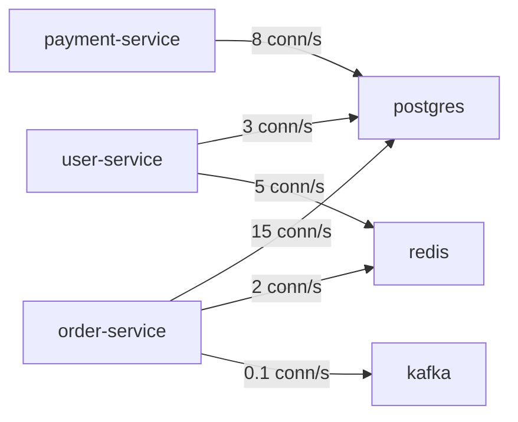

# How to Monitor istio_tcp_connections_opened_total Metric

Author: [nawazdhandala](https://github.com/nawazdhandala)

Tags: Istio, TCP, Metrics, Prometheus, Connection Monitoring

Description: Monitor TCP connection patterns in Istio using the istio_tcp_connections_opened_total metric to track database connections, message queues, and TCP-based services.

---

While HTTP metrics get all the glory, a huge chunk of real-world service mesh traffic is TCP. Every database query, cache lookup, and message queue interaction goes over TCP. The `istio_tcp_connections_opened_total` metric tracks when new TCP connections are established in your mesh, giving you visibility into connection patterns for non-HTTP services like PostgreSQL, Redis, Kafka, and any custom TCP protocol.

## What This Metric Tracks

`istio_tcp_connections_opened_total` is a Prometheus counter that increments by 1 every time a new TCP connection is established through an Envoy sidecar. It only counts the initial connection setup, not individual messages or queries sent over that connection.

This is important to understand: a database connection pool that opens 10 connections and reuses them will only increment this counter 10 times. But if your application creates a new connection for every query, you'll see this counter climbing fast.

## Labels

The metric carries familiar Istio labels:

```text
istio_tcp_connections_opened_total{
  reporter="destination",
  source_workload="order-service",
  source_workload_namespace="production",
  destination_workload="postgres",
  destination_workload_namespace="databases",
  destination_service="postgres.databases.svc.cluster.local",
  destination_service_name="postgres",
  destination_service_namespace="databases",
  connection_security_policy="mutual_tls"
} 4521
```

Since this is TCP traffic, you won't see HTTP-specific labels like `response_code` or `request_protocol`.

## The Related Metric: istio_tcp_connections_closed_total

This metric tracks when TCP connections are closed. Together with `opened`, you can derive connection patterns:

```text
istio_tcp_connections_closed_total{
  reporter="destination",
  source_workload="order-service",
  destination_workload="postgres",
  ...
} 4519
```

A small difference between opened and closed indicates long-lived connections (like connection pools). A close match between the rates of opened and closed suggests short-lived connections.

## Basic Connection Rate Queries

### New Connections Per Second

```promql
sum(rate(istio_tcp_connections_opened_total{
  reporter="destination",
  destination_workload="postgres",
  destination_workload_namespace="databases"
}[5m]))
```

### Connection Rate by Source Service

See which services are creating the most connections:

```promql
sum(rate(istio_tcp_connections_opened_total{
  reporter="destination",
  destination_workload="postgres"
}[5m])) by (source_workload)
```

### Total Connections Over Time

```promql
# Total new connections in the last hour
sum(increase(istio_tcp_connections_opened_total{
  reporter="destination",
  destination_workload="postgres"
}[1h]))
```

## Connection Pool Health Analysis

### Detecting Connection Pool Behavior

A healthy connection pool opens connections rarely (during startup or when scaling). An unhealthy application that creates a new connection per request will show a high rate:

```promql
# Connection open rate should be low with good pooling
sum(rate(istio_tcp_connections_opened_total{
  reporter="destination",
  destination_workload="postgres"
}[5m])) by (source_workload)
```

Compare this to the request rate of the source service:

```promql
# If connection_rate / request_rate is close to 1, there's no pooling
sum(rate(istio_tcp_connections_opened_total{
  reporter="source",
  source_workload="order-service",
  destination_workload="postgres"
}[5m]))
/
sum(rate(istio_requests_total{
  reporter="source",
  source_workload="order-service"
}[5m]))
```

A ratio close to 0 means good connection reuse. A ratio close to 1 means one connection per request, which is bad.

### Estimating Active Connections

```promql
# Approximate active connections (cumulative, resets on pod restart)
sum(istio_tcp_connections_opened_total{
  reporter="destination",
  destination_workload="postgres"
}) by (source_workload)
-
sum(istio_tcp_connections_closed_total{
  reporter="destination",
  destination_workload="postgres"
}) by (source_workload)
```

For a more accurate active connection count, use Envoy's gauge metric:

```promql
envoy_cluster_upstream_cx_active{
  cluster_name=~"outbound.*postgres.*"
}
```

### Connection Churn Rate

High churn (rapid open/close cycles) is usually a sign of connection pooling problems:

```promql
# Connection churn - high values suggest poor pooling
sum(rate(istio_tcp_connections_opened_total{
  reporter="destination",
  destination_workload="postgres"
}[5m]))
+
sum(rate(istio_tcp_connections_closed_total{
  reporter="destination",
  destination_workload="postgres"
}[5m]))
```

## Monitoring Specific Service Types

### Database Connections (PostgreSQL/MySQL)

```promql
# Total connection rate to all database pods
sum(rate(istio_tcp_connections_opened_total{
  reporter="destination",
  destination_workload=~"postgres|mysql"
}[5m]))

# Connection rate per database instance
sum(rate(istio_tcp_connections_opened_total{
  reporter="destination",
  destination_workload="postgres"
}[5m])) by (destination_workload, source_workload)
```

### Redis/Memcached Connections

Cache services typically see more connection activity:

```promql
sum(rate(istio_tcp_connections_opened_total{
  reporter="destination",
  destination_workload="redis"
}[5m])) by (source_workload)
```

### Kafka/Message Queue Connections

Kafka consumers and producers maintain long-lived connections:

```promql
# You should see very low rates here - Kafka connections are persistent
sum(rate(istio_tcp_connections_opened_total{
  reporter="destination",
  destination_workload=~"kafka.*"
}[5m])) by (source_workload)
```

If you see high connection rates to Kafka, your clients might be experiencing connection issues or misconfigured reconnection policies.

## Mesh-Wide Connection Analysis

### Top 10 Most Connected Services

```promql
topk(10,
  sum(rate(istio_tcp_connections_opened_total{reporter="destination"}[5m]))
  by (destination_workload)
)
```

### Connection Map

Build a service connection map:

```promql
# All TCP communication paths
sum(rate(istio_tcp_connections_opened_total{reporter="destination"}[5m]))
by (source_workload, destination_workload) > 0
```

## Alerting Rules

### Too Many New Connections

```yaml
apiVersion: monitoring.coreos.com/v1
kind: PrometheusRule
metadata:
  name: tcp-connection-alerts
  namespace: monitoring
spec:
  groups:
    - name: tcp-connections
      rules:
        - alert: HighDatabaseConnectionRate
          expr: |
            sum(rate(istio_tcp_connections_opened_total{
              reporter="destination",
              destination_workload="postgres"
            }[5m])) > 100
          for: 5m
          labels:
            severity: warning
          annotations:
            summary: "High database connection rate"
            description: "{{ $value | humanize }} new connections/s to PostgreSQL. Check for connection pooling issues."

        - alert: NoNewConnections
          expr: |
            sum(rate(istio_tcp_connections_opened_total{
              reporter="destination",
              destination_workload="postgres"
            }[10m])) == 0
            and
            sum(rate(istio_tcp_connections_opened_total{
              reporter="destination",
              destination_workload="postgres"
            }[10m] offset 1h)) > 0
          for: 10m
          labels:
            severity: critical
          annotations:
            summary: "No new connections to PostgreSQL"
            description: "No new TCP connections in 10 minutes. Database might be unreachable."

        - alert: ConnectionPoolExhaustion
          expr: |
            sum(rate(istio_tcp_connections_opened_total{
              reporter="source",
              destination_workload="postgres"
            }[5m])) by (source_workload)
            /
            sum(rate(istio_requests_total{
              reporter="source"
            }[5m])) by (source_workload)
            > 0.5
          for: 10m
          labels:
            severity: warning
          annotations:
            summary: "Possible connection pool exhaustion in {{ $labels.source_workload }}"
            description: "{{ $labels.source_workload }} is creating new DB connections at more than 50% of its request rate"
```

### Connection Spike Alert

```yaml
- alert: TCPConnectionSpike
  expr: |
    sum(rate(istio_tcp_connections_opened_total{
      reporter="destination"
    }[5m])) by (destination_workload, destination_workload_namespace)
    > 10 *
    sum(rate(istio_tcp_connections_opened_total{
      reporter="destination"
    }[5m] offset 1h)) by (destination_workload, destination_workload_namespace)
  for: 5m
  labels:
    severity: warning
  annotations:
    summary: "TCP connection spike to {{ $labels.destination_workload }}"
```

## Grafana Dashboard Panels

Build a TCP connections dashboard with these panels:

**Connection Rate by Destination** - time series showing new connections per second grouped by destination service.

**Connection Rate by Source** - bar gauge showing which source workloads create the most connections to a selected destination.

**Active Connections Estimate** - stat panel showing approximate active connections.

**Connection Churn** - time series comparing open and close rates.



## Practical Debugging

When you see unexpected connection patterns, use these steps:

1. Check which source is creating the most connections
2. Compare connection rate to request rate to assess pooling
3. Look at connection close rate to check for connection leaks
4. Check Envoy's active connection gauge for the current state

```bash
# Dump connection stats for a specific pod
kubectl exec <pod-name> -c istio-proxy -- \
  curl -s localhost:15000/stats | grep cx
```

The `istio_tcp_connections_opened_total` metric might seem simple, but it's your window into the health of database connections, cache interactions, and message queue connectivity across your mesh. Watch for connection pools that aren't working, connection storms during deployments, and services that can't reach their backing services.
