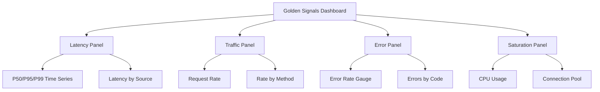

# How to Monitor Service-Level Metrics (Latency, Traffic, Errors, Saturation) in Istio

Author: [nawazdhandala](https://github.com/nawazdhandala)

Tags: Istio, Monitoring, SRE, Golden Signals, Prometheus

Description: Monitor the four golden signals of service health in Istio - latency, traffic, errors, and saturation - using built-in metrics and PromQL queries.

---

Google's SRE book introduced the concept of four golden signals for monitoring: latency, traffic, errors, and saturation. These four metrics tell you almost everything you need to know about whether a service is healthy. Istio generates all four automatically through its Envoy sidecars, which means you get service-level monitoring without adding a single line of instrumentation code to your applications.

## The Four Golden Signals

Before getting into the queries, a quick summary of what each signal means:

- **Latency** - How long requests take to process. Both successful and failed request latency matter.
- **Traffic** - How much demand is hitting the service. Usually measured in requests per second.
- **Errors** - The rate of failed requests. Could be HTTP 5xx, gRPC errors, or timeouts.
- **Saturation** - How "full" the service is. Think CPU, memory, connection pool usage.

Istio's default metrics cover the first three directly. Saturation requires combining Istio metrics with Kubernetes resource metrics.

## Monitoring Latency

Istio tracks request duration through the `istio_request_duration_milliseconds` histogram. This gives you percentile latency breakdowns.

### P50 Latency (Median)

```promql
histogram_quantile(0.50,
  sum(rate(istio_request_duration_milliseconds_bucket{
    reporter="destination",
    destination_workload="my-service",
    destination_workload_namespace="production"
  }[5m])) by (le)
)
```

### P95 Latency

```promql
histogram_quantile(0.95,
  sum(rate(istio_request_duration_milliseconds_bucket{
    reporter="destination",
    destination_workload="my-service",
    destination_workload_namespace="production"
  }[5m])) by (le)
)
```

### P99 Latency

```promql
histogram_quantile(0.99,
  sum(rate(istio_request_duration_milliseconds_bucket{
    reporter="destination",
    destination_workload="my-service",
    destination_workload_namespace="production"
  }[5m])) by (le)
)
```

### Latency by Source

See which callers experience the most latency:

```promql
histogram_quantile(0.95,
  sum(rate(istio_request_duration_milliseconds_bucket{
    reporter="destination",
    destination_workload="my-service"
  }[5m])) by (source_workload, le)
)
```

### Latency for Failed Requests

Failed requests often have very different latency profiles. Timeouts are slow; validation errors are fast. Track them separately:

```promql
histogram_quantile(0.95,
  sum(rate(istio_request_duration_milliseconds_bucket{
    reporter="destination",
    destination_workload="my-service",
    response_code=~"5.."
  }[5m])) by (le)
)
```

## Monitoring Traffic

Traffic is measured using `istio_requests_total`, which counts every request.

### Total Request Rate

```promql
sum(rate(istio_requests_total{
  reporter="destination",
  destination_workload="my-service",
  destination_workload_namespace="production"
}[5m]))
```

### Request Rate by HTTP Method

```promql
sum(rate(istio_requests_total{
  reporter="destination",
  destination_workload="my-service"
}[5m])) by (request_protocol)
```

### Request Rate by Source Service

See who's calling your service and how much:

```promql
sum(rate(istio_requests_total{
  reporter="destination",
  destination_workload="my-service"
}[5m])) by (source_workload)
```

### Traffic Trends

Compare current traffic to the previous week to detect anomalies:

```promql
sum(rate(istio_requests_total{
  reporter="destination",
  destination_workload="my-service"
}[5m]))
/
sum(rate(istio_requests_total{
  reporter="destination",
  destination_workload="my-service"
}[5m] offset 7d))
```

A value significantly above 1.0 means traffic has increased; below 1.0 means it dropped.

## Monitoring Errors

Error monitoring is critical. You need to know both the absolute error count and the error rate (errors as a percentage of total traffic).

### Error Rate (5xx Responses)

```promql
sum(rate(istio_requests_total{
  reporter="destination",
  destination_workload="my-service",
  response_code=~"5.."
}[5m]))
/
sum(rate(istio_requests_total{
  reporter="destination",
  destination_workload="my-service"
}[5m]))
```

### Error Rate by Response Code

Break down errors by specific status code:

```promql
sum(rate(istio_requests_total{
  reporter="destination",
  destination_workload="my-service",
  response_code=~"[45].."
}[5m])) by (response_code)
```

### gRPC Error Rate

For gRPC services, use the `grpc_response_status` label:

```promql
sum(rate(istio_requests_total{
  reporter="destination",
  destination_workload="my-grpc-service",
  grpc_response_status!="0"
}[5m]))
/
sum(rate(istio_requests_total{
  reporter="destination",
  destination_workload="my-grpc-service"
}[5m]))
```

gRPC status `0` is OK; anything else is an error.

### Error Rate Including Envoy Response Flags

Sometimes errors aren't just HTTP status codes. Envoy adds response flags that indicate issues like upstream connection failures (UF), upstream connection termination (UC), or no healthy upstream (UH):

```promql
sum(rate(istio_requests_total{
  reporter="destination",
  destination_workload="my-service",
  response_flags!~"-|0"
}[5m])) by (response_flags)
```

Common response flags to watch:
- `UO` - Upstream overflow (circuit breaker triggered)
- `UF` - Upstream connection failure
- `UC` - Upstream connection termination
- `NR` - No route configured
- `DI` - Request delayed by fault injection
- `RL` - Rate limited

## Monitoring Saturation

Saturation is the trickiest signal because Istio doesn't directly measure it. You need to combine Istio metrics with Kubernetes metrics.

### Connection Pool Saturation

If you've configured connection pool limits in DestinationRules, track how close you are to hitting them:

```promql
# Active connections vs limit
envoy_cluster_upstream_cx_active{cluster_name="outbound|8080||my-service.production.svc.cluster.local"}
```

### Request Queue Depth

Envoy tracks pending requests, which indicates saturation:

```promql
envoy_cluster_upstream_rq_pending_active{
  cluster_name=~"outbound.*my-service.*"
}
```

### CPU Saturation of Service Pods

Combine with Kubernetes metrics:

```promql
sum(rate(container_cpu_usage_seconds_total{
  namespace="production",
  pod=~"my-service.*",
  container!="istio-proxy"
}[5m]))
/
sum(kube_pod_container_resource_requests{
  namespace="production",
  pod=~"my-service.*",
  container!="istio-proxy",
  resource="cpu"
})
```

Values approaching 1.0 mean the service is running at its CPU request limit.

### Memory Saturation

```promql
sum(container_memory_working_set_bytes{
  namespace="production",
  pod=~"my-service.*",
  container!="istio-proxy"
})
/
sum(kube_pod_container_resource_limits{
  namespace="production",
  pod=~"my-service.*",
  container!="istio-proxy",
  resource="memory"
})
```

## Building a Golden Signals Dashboard

Combine all four signals into a single Grafana dashboard. Use template variables for namespace and workload selection:



## Setting Up Alerts

Define alerting rules for each signal:

```yaml
apiVersion: monitoring.coreos.com/v1
kind: PrometheusRule
metadata:
  name: golden-signals-alerts
  namespace: monitoring
spec:
  groups:
    - name: golden-signals
      rules:
        - alert: HighErrorRate
          expr: |
            sum(rate(istio_requests_total{reporter="destination",response_code=~"5.."}[5m])) by (destination_workload, destination_workload_namespace)
            /
            sum(rate(istio_requests_total{reporter="destination"}[5m])) by (destination_workload, destination_workload_namespace)
            > 0.05
          for: 5m
          labels:
            severity: critical
          annotations:
            summary: "High error rate on {{ $labels.destination_workload }}"

        - alert: HighLatency
          expr: |
            histogram_quantile(0.99,
              sum(rate(istio_request_duration_milliseconds_bucket{reporter="destination"}[5m]))
              by (destination_workload, destination_workload_namespace, le)
            ) > 1000
          for: 5m
          labels:
            severity: warning
          annotations:
            summary: "P99 latency above 1s on {{ $labels.destination_workload }}"

        - alert: TrafficDrop
          expr: |
            sum(rate(istio_requests_total{reporter="destination"}[5m])) by (destination_workload)
            < 0.1 * sum(rate(istio_requests_total{reporter="destination"}[5m] offset 1h)) by (destination_workload)
          for: 10m
          labels:
            severity: warning
          annotations:
            summary: "Traffic dropped 90%+ on {{ $labels.destination_workload }}"
```

The four golden signals give you a complete picture of service health. Istio makes three of them available automatically, and combining with Kubernetes metrics fills in the saturation piece. Start with these queries, tune thresholds based on your service's normal behavior, and build up from there.
